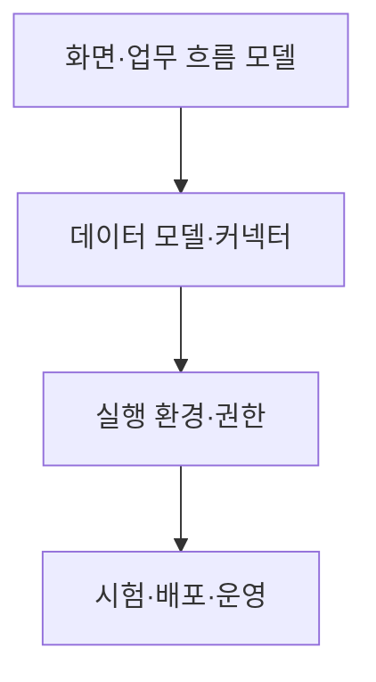
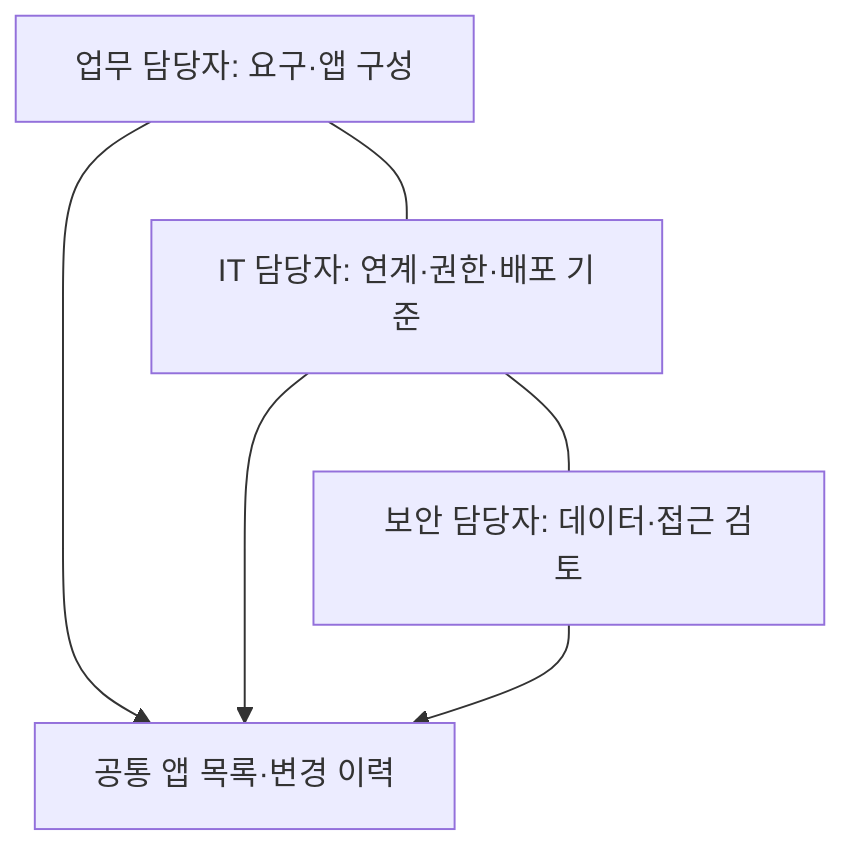

## 학습 위치

소프트웨어공학 → 개발 방식·도구 → **로우코드·노코드**

## 30초 인출

- **본질**: 로우코드·노코드는 화면·데이터·업무 흐름을 시각적으로 구성해 직접 작성하는 코드를 줄이는 개발 방식
- **메커니즘**: 업무 적합성 판단 → 시각적 모델 구성 → 데이터·API 연결 → 시험·승인 → 배포·운영

핵심 용어

- **로우코드(Low-code)**: 시각적 개발을 중심으로 하되 필요한 부분은 코드로 확장하는 방식
- **노코드(No-code)**: 제공된 구성 요소와 설정을 중심으로 직접 코딩을 최소화하는 방식
- **LCNC(Low-code/No-code)**: 로우코드와 노코드를 함께 부르는 말
- **시민 개발자(Citizen Developer)**: 전문 개발 조직 밖에서 승인된 도구를 사용해 업무용 앱을 만드는 현업 담당자
- **커넥터(Connector)**: 앱과 데이터베이스·외부 서비스의 연결을 돕는 구성 요소
- **섀도우 IT(Shadow IT)**: 조직의 관리·승인 범위 밖에서 도입·운영되는 IT 자산
- **CoE(Center of Excellence)**: 공통 기준·교육·재사용 자산 등 전문 역량을 지원하는 조직 형태
- **ALM(Application Lifecycle Management)**: 앱의 요구·개발·시험·배포·운영·변경을 관리하는 체계

---

## 1교시 예상문제 (10점)

> 로우코드·노코드의 개념과 차이, 적용 시 고려사항을 설명하시오.

---

## 1교시 10점 답안

### I. 개요

| 구분 | 핵심 |
|---|---|
| 정의 | **로우코드·노코드**: 시각적 모델·구성 요소로 앱을 만들고 직접 작성하는 코드를 줄이는 개발 방식 |
| 목적 | 반복적인 앱 개발 부담을 낮추고 업무 변화에 빠르게 대응 |

### II. 로우코드와 노코드

| 구분 | 로우코드 | 노코드 |
|---|---|---|
| 확장 방식 | 제공 기능에 코드 확장 가능 | 제공 기능·설정 중심 |
| 적합한 요구 | 복잡한 연계·맞춤 로직이 일부 필요 | 정형화된 화면·흐름을 구성 |
| 공통 검토 | 데이터·권한·운영·이식성 | 데이터·권한·운영·이식성 |

**제언**: 업무 복잡도와 데이터 민감도를 먼저 평가하고 운영·보안 책임을 정한 뒤 도구를 선택.

---

## 2~4교시 예상문제 (25점)

> 로우코드·노코드의 개념과 구성 요소를 설명하고, 도입 적합성 및 운영·보안 거버넌스 방안을 제시하시오.

---

## 2~4교시 25점 답안

### I. 개요

| 구분 | 핵심 |
|---|---|
| 정의 | **로우코드·노코드**: 시각적 모델·구성 요소로 앱을 만들고 직접 작성하는 코드를 줄이는 개발 방식 |
| 목적 | 반복적인 앱 개발 부담을 낮추고 업무 변화에 빠르게 대응 |

| 도입 질문 | 판단 대상 |
|---|---|
| 무엇을 빠르게 만들 것인가? | 화면·양식·승인 흐름 등 반복 업무 |
| 무엇을 직접 개발할 것인가? | 복잡한 알고리즘·고성능 처리·특수 연계 |

### II. 로우코드와 노코드

| 구분 | 로우코드 | 노코드 |
|---|---|---|
| 확장 방식 | 제공 기능에 코드 확장 가능 | 제공 기능·설정 중심 |
| 적합한 요구 | 복잡한 연계·맞춤 로직이 일부 필요 | 정형화된 화면·흐름을 구성 |
| 공통 검토 | 데이터·권한·운영·이식성 | 데이터·권한·운영·이식성 |

코딩량과 개발 기간은 제품·요구사항에 따라 달라지므로 노코드를 모든 작업의 무코딩·초고속 개발로 단정하지 않음.

### III. 플랫폼 구성과 앱 개발 흐름

| 구성 | 핵심 역할 |
|---|---|
| 시각적 모델러 | 화면·폼·업무 규칙 구성 |
| **커넥터** | 내부 데이터·외부 API 연결 |
| 실행 환경 | 모델 실행, 사용자·권한 관리 |
| **ALM** | 버전·시험·배포·변경 이력 관리 |

### IV. 도입 적합성 판단

| 판단 축 | 적합 가능 사례 | 검토가 필요한 사례 |
|---|---|---|
| 업무 복잡도 | 정형화된 신청·승인·조회 | 복잡한 알고리즘·실시간 대량 처리 |
| 데이터·연계 | 승인된 API·권한 범위의 연계 | 민감 정보·핵심 시스템 직접 접근 |
| 확장·이식성 | 플랫폼 표준 기능으로 요구 충족 | 고유 기능 의존·데이터 이전 어려움 |

적합성 판단은 **노코드 → 로우코드 → 직접 개발**의 무조건적 단계가 아니라 요구별 선택.

### V. 운영·보안 거버넌스

| 관리 대상 | 실행 방안 |
|---|---|
| **섀도우 IT** | 승인된 플랫폼·앱 목록 및 소유자 명시 |
| 데이터·권한 | 최소 권한, 민감 데이터 분류, API 접근 통제 |
| 운영 지속성 | 변경·시험·배포 절차, 장애 대응 책임 지정 |
| 벤더 종속 | 데이터·모델 추출 가능성, 교체 비용 확인 |

**CoE**는 이러한 기준·교육·재사용 자산을 지원할 수 있지만 모든 조직의 필수 독립 조직으로 전제하지 않음.

### VI. 문제와 해결 방안

| 문제 | 해결 방안 |
|---|---|
| 현업 앱이 승인·권한 관리 밖에서 운영 | 앱 소유자와 플랫폼 기준을 정하고 등록·점검 |
| 플랫폼 기능에 과도하게 종속 | 데이터·모델 반출 가능성과 연계 경계를 도입 전에 검토 |
| 빠른 제작에 집중해 시험·운영 누락 | **ALM**에 따른 변경·시험·배포·폐기 책임 정의 |
