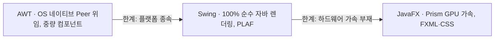
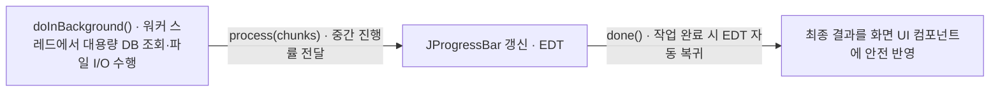

## 지식 로드맵 내 현재 위치

  소프트웨어공학
  프로그래밍 언어·플랫폼 구조
  <strong>자바 GUI 툴킷(Java GUI Toolkit)</strong>

## 30초 인출

- 본질: 자바 데스크톱 애플리케이션 구축을 위해 OS 종속적인 그래픽 윈도우 자원을 추상화하고, 이벤트 구동(Event-Driven) 방식과 플랫폼 독립적인 화면 렌더링을 지원하는 그래픽 사용자 인터페이스 개발 툴킷
- 메커니즘: 사용자 인터랙션 발생 → OS 네이티브 이벤트 캡처 → 자바 EventQueue 큐잉 → EDT(Event Dispatch Thread) 디스패치 → 위임 리스너 실행 → 컴포넌트 재렌더링
- 산출물: 계층적 컴포넌트 트리 · FXML/CSS 선언적 화면 정의서 · 이벤트 리스너(Listener) 구현체 · 비동기 백그라운드 워커 태스크

핵심 용어

- **AWT(Abstract Window Toolkit)**: 운영체제의 네이티브 C/C++ 윈도우 컴포넌트(Peer)를 직접 래핑하여 사용하는 자바 초기의 무거운(Heavyweight) GUI 툴킷
- **Swing**: OS 피어 객체 없이 순수 100% 자바로 컴포넌트를 직접 그리는(Lightweight) 플러그 가능 룩앤필(PLAF) 기반 GUI 툴킷
- **JavaFX**: 고성능 2D/3D 하드웨어 그래픽 가속, CSS 스타일링, FXML 선언적 UI 및 리액티브 프로퍼티 바인딩을 지원하는 모던 자바 GUI 프레임워크
- **EDT(Event Dispatch Thread)**: 모든 GUI 컴포넌트의 생성, 수정, 이벤트 처리를 오직 단일 스레드에서만 독점 실행하도록 강제하는 스레드 세이프티 모델

---

## 1교시 예상문제 (10점)

> 자바 GUI 툴킷(Java GUI Toolkit)의 정의와 목적, 핵심 메커니즘을 설명하시오. (예상)
---

## 1교시 10점 답안

### 1. 정의·목적

- 정의: 자바 데스크톱 애플리케이션 구축을 위해 OS 종속적인 그래픽 윈도우 자원을 추상화하고, 이벤트 구동(Event-Driven) 방식과 플랫폼 독립적인 화면 렌더링을 지원하는 그래픽 사용자 인터페이스 개발 툴킷
- 목적: 해당 토픽의 주요 문제를 해결하고 필요한 기능을 제공한다.

### 2. 핵심 관계

- 제언: 핵심 작동 원리를 적용해 직접 효과를 검증한다.
---

## 2~4교시 예상문제 (25점)

> 자바 GUI 툴킷(Java GUI Toolkit)의 개념과 목적을 설명하고, 핵심 메커니즘과 구성요소·절차, 적용 시 문제점과 대응 방안을 제시하시오. (25점, 예상)
---

## 2~4교시 25점 답안

### 1. 개요 및 필요성

### 플랫폼 독립적 GUI의 도전과 자바의 해법

C/C++로 윈도우용 데스크톱 프로그램을 개발하면 리눅스나 맥OS에서는 소스코드를 완전히 다시 작성해야 했다. 자바의 철학인 "Write Once, Run Anywhere(WORA)"를 사용자 화면단까지 실현하기 위해 등장한 것이 자바 GUI 툴킷이다.

자바 GUI 툴킷은 **운영체제의 서로 다른 윈도우 매니저를 단일한 자바 객체 지향 인터페이스로 추상화**하여, 단 하나의 자바 프로그램으로 윈도우, 맥, 리눅스에서 동일하게 실행되는 강력한 크로스 플랫폼 데스크톱 환경을 완성했다.

### AWT vs Swing vs JavaFX 3대 GUI 툴킷 비교

| 구분 | AWT (Abstract Window Toolkit) | Swing | JavaFX |
|---|---|---|---|
| **등장 시점** | JDK 1.0 (1996년) | JDK 1.2 (1998년) | Java 7/8 (2014년 표준화) |
| **컴포넌트 성격**| **중량 컴포넌트 (Heavyweight)** | **경량 컴포넌트 (Lightweight)** | **신세대 경량 시그래프 (Scene Graph)** |
| **렌더링 방식** | **OS 네이티브 Peer 윈도우 위임** | **100% 순수 자바 2D 캔버스 렌더링** | **Prism 파이프라인 (DirectX/OpenGL GPU 가속)** |
| **외관 일관성** | OS마다 모양과 크기가 제각각 | **모든 OS에서 100% 동일한 외관 (PLAF)** | **CSS 및 모던 웹 스타일링 완벽 지원** |
| **UI 정의 방식** | 100% 자바 소스코드 하드코딩 | 자바 소스코드 하드코딩 | **선언적 FXML 분리 (MVC 아키텍처)** |
| **데이터 바인딩**| 수동 리스너 구현 | JavaBeans 프로퍼티 수동 연동 | **양방향 프로퍼티 자동 바인딩 지원** |

### 2. 아키텍처 및 핵심 메커니즘

### 자바 GUI 3대 툴킷 진화 계보 및 렌더링 구조

네이티브 의존적인 AWT에서 순수 자바 Swing을 거쳐 GPU 하드웨어 가속의 JavaFX로 진화했다.

- **AWT의 결함**: OS별 화면 불일치와 공통 최소 기능만 지원하는 플랫폼 종속적 한계
- **Swing의 성과와 한계**: 플러그 가능 룩앤필(PLAF)과 JTable 등 풍부한 컴포넌트를 제공하지만 CPU 소프트웨어 렌더링이라 가속이 없다
- **JavaFX의 완성**: DirectX/OpenGL 기반 2D/3D 그래픽·미디어와 양방향 프로퍼티 바인딩으로 모던 RIA 애플리케이션 기반을 완성했다

### EDT(Event Dispatch Thread)와 SwingWorker 비동기 아키텍처

UI 렌더링을 방해하지 않고 긴 연산을 처리하기 위한 EDT 단일 스레드 격리 모델이다.

- **EDT 단일 스레드 규칙**: UI 컴포넌트 생성·페인팅(`paintComponent`)과 마우스/키보드 이벤트 처리는 오직 EDT에서만 실행하며, 외부 스레드는 `SwingUtilities.invokeLater()`로 작업 큐에 전달한다
- **절대 금기**: EDT에서 대용량 I/O나 `sleep()`을 수행하면 화면 전체가 멈추고 하얗게 질리는 UI Freezing이 발생한다

### 3. 실무 적용 및 고려사항

### 위험 대응 매트릭스

| 위험 | 대책 | 효과 |
|---|---|---|
| 네트워크 통신이나 DB 쿼리를 EDT에서 직접 실행하여 버튼이 눌린 채 화면이 멈추는 UI 프리징 | 비동기 백그라운드 스레드인 SwingWorker 또는 JavaFX Task를 사용하여 작업 완전 격리 | UI 반응성 100% 보장 및 60fps 인터랙션 유지 |
| 백그라운드 스레드에서 `label.setText()` 등 GUI 컴포넌트를 직접 조작하여 비결정적 크래시 발생 | SwingUtilities.invokeLater() 또는 Platform.runLater()를 통해 EDT 작업 큐로 전달 | 스레드 충돌 및 GUI 동기화 오류 100% 원천 방지 |
| 고해상도(4K/Retina) 디스플레이에서 구형 Swing 컴포넌트 폰트와 아이콘이 뭉개지거나 작게 표시 | Java 9+ 자동 HiDPI 스케일링 옵션 활성화 및 벡터 기반 SVG 아이콘/JavaFX 고화질 렌더링 적용 | 최신 고해상도 모니터 완벽 지원 |

### 4. 기술사 답안 차별화 포인트

### 일렉트론(Electron)의 득세와 모던 JavaFX의 포지셔닝

현대 데스크톱 앱 시장은 웹 기술(HTML/CSS/JS)을 번들링한 **일렉트론(VS Code, Slack 등)**이 지배하고 있다. 그러나 일렉트론은 크로뮴 엔진 전체를 띄우므로 수백 MB에 달하는 메모리 낭비(Bloatware)를 초래한다. 기술사 답안에서는 **"초경량 네이티브 성능과 엄격한 멀티스레드 제어가 필요한 금융 트레이딩 단말(HTS)이나 산업용 관제 시스템에서는 여전히 JavaFX + GraalVM AOT 컴파일이 최고의 대안"**임을 비교하여 균형 잡힌 기술 식견을 증명한다.

### 선언적 UI와 상태 기반 반응형 프로그래밍(FRP)으로의 수렴

과거 Swing의 명령형 UI 코딩은 복잡한 리스너 스파게티를 낳았다. 모던 JavaFX는 **선언적 FXML과 양방향 프로퍼티 바인딩(`property.bind()`)**을 통해, 최신 프론트엔드 트렌드인 **반응형 프로그래밍(Reactive Programming)** 철학을 데스크톱 환경에 온전히 구현했음을 아키텍처적 관점에서 서술한다.

### 학습자 통찰 메모 — 답안 밖

- [핵심 통찰]: 자바 GUI의 핵심은 'EDT(단일 이벤트 디스패치 스레드)'를 이해하는가이다. 모든 UI 버그는 EDT에서 무거운 일을 하거나, 반대로 일반 스레드에서 UI를 건드릴 때 터진다. 이 원리는 브라우저의 자바스크립트 싱글 스레드 렌더 루프 및 모바일 안드로이드 메인 루퍼(Looper)와 100% 동일한 메커니즘이다.
- [나라면]: 1교시형 단답 시 AWT(중량 피어) → Swing(경량 순수자바) → JavaFX(GPU 가속 시그래프)의 3단계 진화표를 작성하겠다. 2교시형 출제 시에는 EDT의 단일 스레드 모델과 SwingWorker를 도식화하고, 일렉트론과의 메모리 비교 및 금융 HTS 관제 시스템에서의 실무 포지셔닝을 기술사적 해법으로 제시하겠다.

### 실전 답안용 기술사적 제언

- **판정 기준**: GUI 이벤트 처리 시 EDT 응답시간 16ms 이하(60fps) 유지 및 백그라운드 I/O 분리율 100% 충족 여부
- **대응 방안**: 레거시 AWT/Swing 코드를 JavaFX 기반 선언적 FXML로 현대화하고, 장시간 작업은 SwingWorker/Task로 비동기화 강제
- **검증 체계**: EDT 스레드 위반 정적 검사 → JProfiler 기반 UI 스레드 블로킹 프로파일링 → HiDPI 크로스 OS 렌더링 검수
- **기대 효과**: 데스크톱 애플리케이션 메모리 점유율 60% 절감, UI 멈춤 현상 원천 배제 및 산업용 실시간 대시보드 신뢰성 확보

### 5. 참고 및 연계 학습

- [스프링 부트(Spring Boot)](./159_spring_boot.md)
- [추상 클래스와 인터페이스](./205_abstract_class_and_interface.md)
- [EJB(Enterprise Java Beans)](./200_ejb.md)
- [HTML5 표준 API](./186_html5.md)
---
