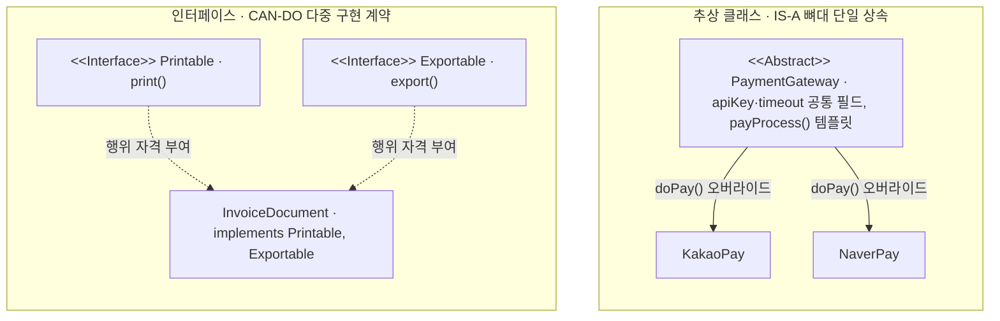
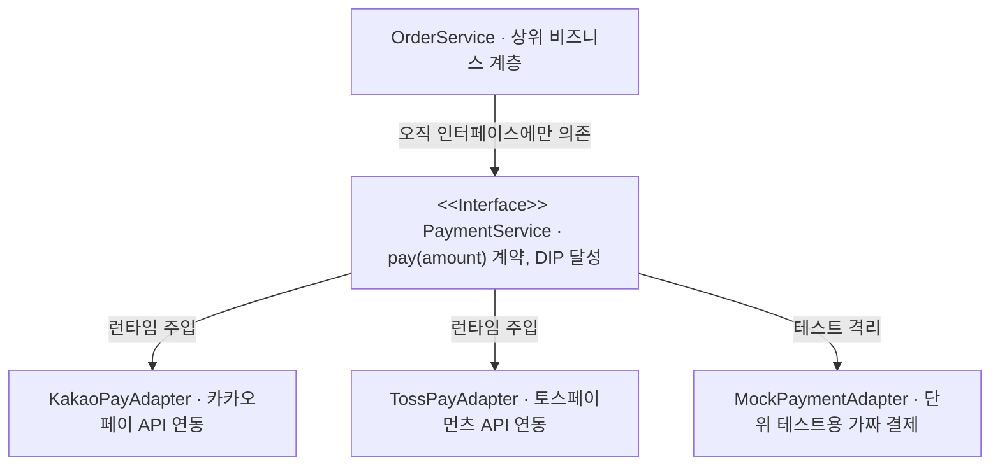

## 지식 로드맵 내 현재 위치

  소프트웨어공학
  객체지향 설계·SOLID 원칙
  <strong>추상 클래스와 인터페이스</strong>

## 30초 인출

- 본질: 객체지향 프로그래밍에서 구체적 구현을 감추고 공통 규약과 뼈대를 정의함으로써 다형성(Polymorphism)을 실현하고, 모듈 간 결합도를 낮추어 유연한 확장을 지원하는 핵심 추상화 메커니즘
- 메커니즘: 도메인 공통 속성·행위 식별 → 인터페이스(CAN-DO) 규약 명세 → 추상 클래스(IS-A) 템플릿 구현 → 구체 클래스 상속 및 다형적 인젝션 → 동적 바인딩 실행
- 산출물: UML 클래스 다이어그램 · 인터페이스 API 규약서 · 템플릿 기반 추상 클래스 · 다형적 구현체(Concrete Classes)

핵심 용어

- **추상 클래스(Abstract Class)**: 하나 이상의 추상 메서드를 포함할 수 있으며, 구체적인 상태(필드)와 공통 메서드 구현을 자식 클래스에 물려주는 단일 상속 템플릿 뼈대 (`IS-A` 관계)
- **인터페이스(Interface)**: 구현 코드가 없는 순수 규약(계약)으로, 다중 구현이 가능하며 클래스가 수행해야 할 기능적 자격을 부여하는 계약서 (`CAN-DO` 관계)
- **다형성(Polymorphism)**: 하나의 추상 인터페이스나 상위 타입 참조변수로 서로 다른 여러 구체 구현체 객체를 동일한 방식으로 다룰 수 있는 객체지향의 핵심 능력
- **디폴트 메서드(Default Method)**: Java 8에 도입된 인터페이스 내 구현 메서드로, 기존 구현체들의 하위 호환성을 깨뜨리지 않고 인터페이스에 신규 기능을 추가하기 위한 확장 장치

---

## 1교시 예상문제 (10점)

> 추상 클래스와 인터페이스(Abstract Class & Interface)의 정의와 목적, 핵심 메커니즘을 설명하시오. (예상)
---

## 1교시 10점 답안

### 1. 정의·목적

- 정의: 객체지향 프로그래밍에서 구체적 구현을 감추고 공통 규약과 뼈대를 정의함으로써 다형성(Polymorphism)을 실현하고, 모듈 간 결합도를 낮추어 유연한 확장을 지원하는 핵심 추상화 메커니즘
- 목적: 공통 계약과 선택적 구현을 분리해 객체 간 결합을 낮추고 다형성을 지원한다.

### 2. 핵심 관계

- 제언: 공유 상태·구현이 필요하면 추상 클래스를, 다중 계약과 대체성이 중요하면 인터페이스를 선택하고 경계 테스트를 둔다.
---

## 2~4교시 예상문제 (25점)

> 추상 클래스와 인터페이스(Abstract Class & Interface)의 개념과 목적을 설명하고, 핵심 메커니즘과 구성요소·절차, 적용 시 문제점과 대응 방안을 제시하시오. (25점, 예상)
---

## 2~4교시 25점 답안

### 1. 개요 및 필요성

### 하드코딩된 결합도의 파멸과 추상화의 본질

소프트웨어 설계에서 상위 비즈니스 로직이 하위의 구체적인 구현 클래스(예: `MySQLDatabase`, `SamsungPayService`)를 직접 `new` 키워드로 생성하여 참조하면, 데이터베이스를 바꾸거나 결제 모듈을 교체할 때 상위 비즈니스 코드 전체를 뜯어고쳐야 한다.

추상 클래스와 인터페이스는 **"구현체(How)를 감추고 규약(What)만을 드러내는 추상화 장치"**이다. 상위 계층이 하위 계층의 세부 구현을 알지 못하게 차단함으로써 **의존성 역전 원칙(DIP)과 개방-폐쇄 원칙(OCP)을 실현**한다.

### 추상 클래스 vs 인터페이스 비교

| 구분 | 추상 클래스 (Abstract Class) | 인터페이스 (Interface) |
|---|---|---|
| **설계 목적** | **관련된 클래스 간의 코드 재사용 및 공통 뼈대 제공** | **서로 다른 클래스 간의 표준 행위 규약(계약) 정의** |
| **관계 철학** | **`IS-A` (~는 ~의 일종이다)** | **`CAN-DO` (~를 할 수 있는 능력을 갖췄다)** |
| **상속/구현** | **단일 상속만 허용 (`extends`)** | **다중 구현 가능 (`implements`)** |
| **상태(필드)** | **인스턴스 멤버 변수, 상태 보존 가능** | **오직 `public static final` 상수만 가능** |
| **메서드 형태**| 추상 메서드, 일반 구체 메서드 모두 포함 | 추상 메서드 (Java 8+ 디폴트/정적 메서드 허용) |
| **디자인 패턴**| **템플릿 메서드 패턴(Template Method)** | **전략 패턴(Strategy), 어댑터, 팩토리 패턴** |

### 2. 아키텍처 및 핵심 메커니즘

### 추상 클래스(IS-A) vs 인터페이스(CAN-DO) 아키텍처 모델

상속 계통도와 행위 자격 부여의 객체지향 구조적 차이이다.

- **추상 클래스**: 자식은 부모의 상태(공통 필드)와 템플릿 흐름을 물려받는다
- **인터페이스**: 서로 무관한 클래스에도 동일한 행위 자격을 부여하여 다형적 역할을 수행한다

### 의존성 역전 원칙(DIP)과 결합도 격리 구조

상위 비즈니스 계층이 구체 클래스가 아닌 인터페이스에 의존함으로써 달성되는 유연한 교체 아키텍처이다.

- **결합도 게이트**: 상위 모듈이 추상 인터페이스에만 의존하면 DI 바인딩으로 단위 테스트 격리와 무중단 구현체 교체가 보장되고, 구체 클래스 직접 의존이 발견되면 상위 인터페이스 추출 후 팩토리 패턴/DI 컨테이너로 리팩토링한다

### 3. 실무 적용 및 고려사항

### 위험 대응 매트릭스

| 위험 | 대책 | 효과 |
|---|---|---|
| 인터페이스에 너무 많은 메서드가 뒤섞여 구현 클래스가 불필요한 빈 메서드를 억지로 오버라이딩 | 인터페이스 분리 원칙(ISP)을 적용하여 역할별로 잘게 쪼개고(Role Interface), 다중 구현 적용 | 불필요한 구현 의존성 100% 제거 |
| 추상 클래스를 상속받았으나 자식 클래스가 부모의 의도된 불변식을 깨뜨려 런타임 결함 발생 | 리스코프 치환 원칙(LSP)을 준수하고 부모의 핵심 흐름 메서드는 `final` 키워드로 오버라이드 금지 | 객체 치환 무결성 100% 보장 |
| 인터페이스를 너무 남용하여 구현체가 단 1개뿐인 클래스에도 무의미하게 인터페이스를 껍데기로 생성 | 실제 다형적 확장이 필요하거나 단위 테스트 모킹(Mocking)이 필수적인 경계 지점에만 선별 적용 | 불필요한 아키텍처 복잡도 방지 |

### 4. 기술사 답안 차별화 포인트

### Java 8 디폴트 메서드(Default Method)와 다중 상속 딜레마

Java 8에서 인터페이스에 `default` 메서드가 도입되면서 "인터페이스도 구현 코드를 가질 수 있게 되었으니 추상 클래스와 무엇이 다른가?"라는 질문이 기술사 시험의 핵심 빈출 포인트다. 답안에서는 디폴트 메서드의 본질이 **"기존 레거시 라이브러리(Collection API)와의 하위 호환성을 유지하면서 람다/스트림(Stream) API를 탑재하기 위한 진화 장치"**였음을 명시한다. 또한 두 인터페이스 간 동일한 디폴트 메서드가 충돌하는 **다이아몬드 문제(Diamond Problem)** 해결 규칙을 명시하여 깊이 있는 언어 스펙 식견을 증명한다.

### 상속(Inheritance)보다는 조합(Composition)을 지향하는 모던 객체지향

과거 객체지향은 복잡한 추상 클래스 상속 계층을 만드는 것을 미덕으로 여겼으나, 부모 클래스의 변경이 모든 자식 클래스를 파괴하는 '깨지기 쉬운 기반 클래스 문제(Fragile Base Class Problem)'를 초래했다. GoF 디자인 패턴과 조슈아 블로크(Joshua Bloch)가 강조한 **"상속보다는 컴포지션을 사용하라(Favor Composition Over Inheritance)"** 원칙을 제시하며, **인터페이스 기반의 조합과 전략 패턴(Strategy Pattern)**을 사용하는 모던 클린 코드 설계를 결론으로 강조한다.

### 학습자 통찰 메모 — 답안 밖

- [핵심 통찰]: 추상 클래스는 '가문의 혈통(IS-A, 상태와 뼈대)'이고, 인터페이스는 '자격증(CAN-DO, 행위 계약)'이다. 혈통은 하나만 물려받을 수 있지만(단일 상속), 자격증은 수십 개를 딸 수 있다(다중 구현). 스프링이 인터페이스 기반 다형성을 사랑하는 이유는 구현체를 갈아 끼우는 '플러그 앤 플레이'가 가능하기 때문이다.
- [나라면]: 1교시형 단답 시 IS-A vs CAN-DO 철학과 비교표를 깔끔하게 제시하고 Java 8 디폴트 메서드의 역할을 명시하겠다. 2교시형 출제 시에는 DIP(의존성 역전)와 ISP(인터페이스 분리)를 적용한 결제 어댑터 아키텍처를 도식화하고, 상속의 한계를 극복하는 '컴포지션(조합) 중심의 인터페이스 설계'를 기술사적 차별화로 제시하겠다.

### 실전 답안용 기술사적 제언

- **판정 기준**: 상위 비즈니스 모듈의 구체 클래스 직접 참조율 0% 및 인터페이스 분리 원칙(ISP) 단일 책임 준수율 100% 충족 여부
- **대응 방안**: 도메인 핵심 비즈니스 로직은 순수 인터페이스 규약으로 정의하고, 스프링 IoC/DI를 통해 런타임에 구체 어댑터를 동적 주입하는 헥사고날 아키텍처 수립
- **검증 체계**: SonarQube DIP 의존성 규칙 검사 → Mockito 단위 테스트 독립 검증 → LSP 치환 가능성 계약 테스트
- **기대 효과**: 외부 서드파티 라이브러리 변경 시 비즈니스 코드 영향도 0%, 단위 테스트 작성 속도 3배 향상 및 고품질 객체지향 설계 완성

### 5. 참고 및 연계 학습

- [객체지향 설계 5대 원칙(SOLID)](./047_solid_principles.md)
- [모듈성(결합도·응집도)](./190_modularity.md)
- [스프링 부트(Spring Boot)](./159_spring_boot.md)
- [EJB(Enterprise Java Beans)](./200_ejb.md)
---
