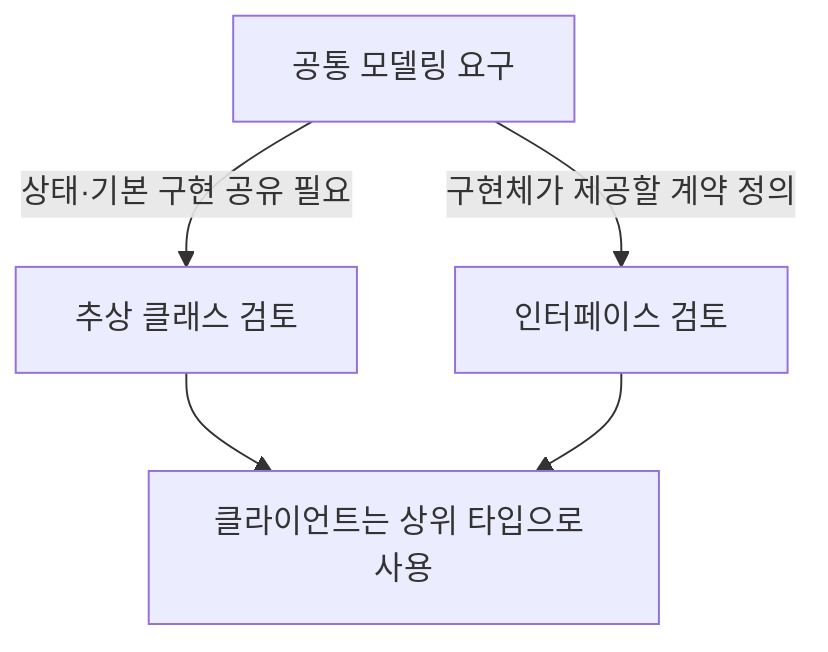
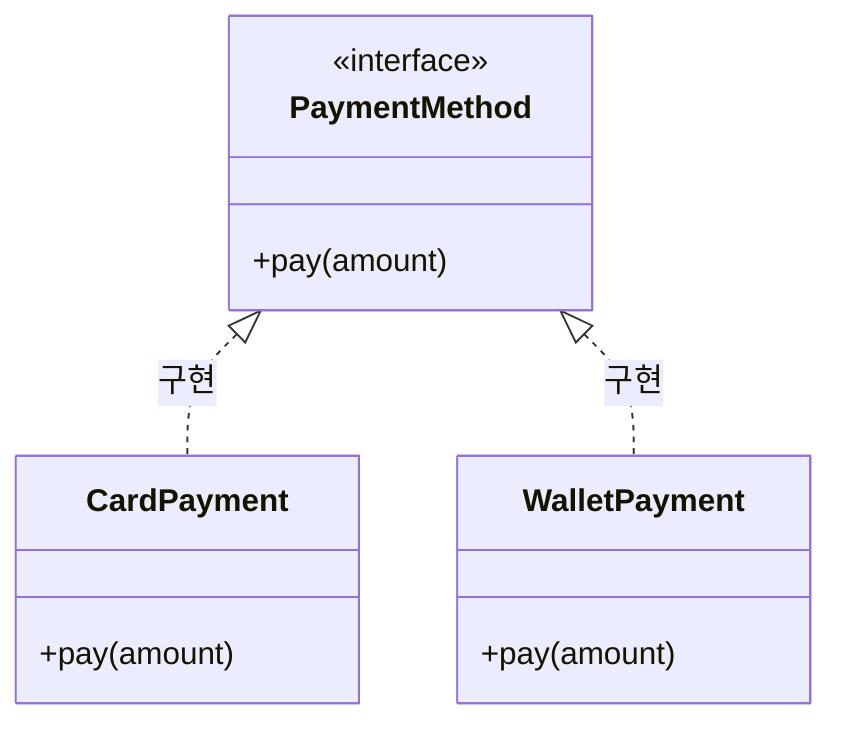
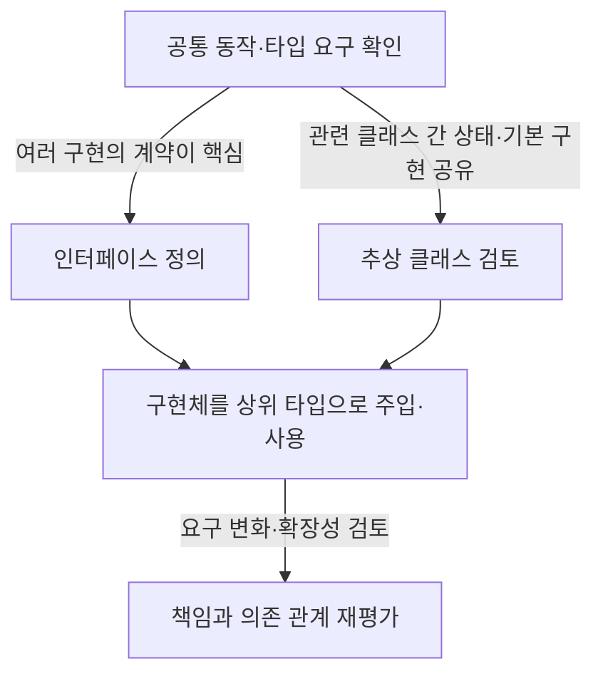

## 학습 위치

소프트웨어공학 → 객체지향 프로그래밍 → 추상화·타입 설계 → **추상 클래스와 인터페이스**

## 30초 인출

- **본질**: 추상 클래스와 인터페이스는 공통 타입과 계약을 정의해 구현체를 추상화하는 Java 언어 구성 요소
- **메커니즘**: 공통 책임 정의 → 하위 클래스 상속 또는 인터페이스 구현 → 다형적 사용

핵심 용어

- **추상 클래스(Abstract Class)**: 인스턴스화할 수 없으며 추상·구현 메서드와 상태를 함께 정의할 수 있는 클래스
- **인터페이스(Interface)**: 구현 클래스가 제공할 계약을 선언하는 참조 타입
- **다형성(Polymorphism)**: 공통 상위 타입을 통해 서로 다른 구현을 같은 사용 방식으로 다루는 성질
- **기본 메서드(Default Method)**: 인터페이스에서 기본 구현을 제공하는 인스턴스 메서드
- **구현(Implementation)**: 클래스가 인터페이스가 정의한 계약을 제공하는 관계

---

## 1교시 예상문제 (10점)

> (예상) 추상 클래스와 인터페이스의 개념과 차이 및 선택 기준을 설명하시오.

---

## 1교시 10점 답안

### Ⅰ. 개요

| 구분 | 핵심 |
|---|---|
| 정의 | **추상 클래스와 인터페이스**: 공통 타입·계약으로 구현체를 추상화하는 Java 언어 구성 요소 |
| 목적 | 공통 사용 방식과 구현 교체 가능성 제공 |

### Ⅱ. 비교

| 관점 | 추상 클래스 | 인터페이스 |
|---|---|---|
| 관계 | 클래스가 상속 | 클래스가 구현 |
| 상태·구현 | 인스턴스 상태와 구현 메서드 가능 | 상수·추상 메서드 및 언어 버전별 기본·정적 메서드 등 |
| 다중 관계 | 클래스의 직접 상속은 하나 | 클래스가 여러 인터페이스 구현 가능 |

### Ⅲ. 선택 기준

**제언**: 구현 재사용을 위한 상속과 구현 계약을 위한 인터페이스를 목적에 따라 구분.

---

## 2~4교시 예상문제 (25점)

> (예상) 추상 클래스와 인터페이스의 구조·차이·선택 기준을 설명하고 다형성 설계에서의 활용 방안을 제시하시오.

---

## 2~4교시 25점 답안

## Ⅰ. 개요

| 구분 | 핵심 |
|---|---|
| 정의 | **추상 클래스와 인터페이스**: 공통 타입·계약으로 구현체를 추상화하는 Java 언어 구성 요소 |
| 목적 | 공통 사용 방식과 구현 교체 가능성 제공 |

## Ⅱ. 언어 구성과 차이

| 특성 | 추상 클래스 | 인터페이스 |
|---|---|---|
| 인스턴스화 | 직접 생성 불가 | 직접 생성 불가 |
| 구성 | 필드, 생성자, 추상·구현 메서드 등 | 상수 필드와 메서드 선언, 버전에 따른 기본·정적·비공개 메서드 |
| 상속 관계 | 클래스는 직접 상속 하나 | 클래스는 여러 인터페이스 구현 가능 |
| 주 용도 | 계층 내 상태·공통 구현 공유 | 서로 다른 유형 간 공통 계약 정의 |

Java 인터페이스의 필드는 암묵적으로 `public static final`. 기본·정적 메서드는 Java 8부터, private 메서드는 Java 9부터 지원하므로 적용 버전에 유의.

## Ⅲ. 타입 관계와 다형성

클라이언트가 구체 클래스보다 공통 타입에 의존하면 구현체 선택을 분리할 수 있음. 다형성 자체가 자동으로 개방-폐쇄 원칙이나 의존 역전 원칙을 충족시키지는 않으며, 의존 방향과 변경 경계 설계가 함께 필요.

## Ⅳ. 선택 절차

선택은 IS-A·CAN-DO 문구만으로 결정하지 않고 상태 공유, 계약 안정성, 클래스 계층 제약, 테스트 가능성을 검토.

## Ⅴ. 설계 활용

| 설계 상황 | 적용 방향 |
|---|---|
| 서로 다른 객체가 같은 기능 계약 제공 | 인터페이스로 사용자가 의존할 계약 표현 |
| 밀접한 계층의 공통 상태·기본 동작 공유 | 추상 클래스로 공통 기반을 제한적으로 구성 |
| 구현 선택을 실행 시점에 변경 | 상위 타입과 조합·주입으로 구체 구현 분리 |

## Ⅵ. 문제와 해결 방안

| 한계 | 해결 방안 |
|---|---|
| 상속 계층이 깊고 변경 영향이 큼 | 공유 구현이 필요한 범위만 추상화하고 조합 우선 검토 |
| 인터페이스가 구현 세부에 종속 | 안정된 업무 계약만 노출하고 구현별 세부는 감춤 |
| 인터페이스 변경이 다수 구현에 파급 | 호환성 영향 검토와 구현체 계약 테스트 수행 |

## Ⅶ. 기술적 제언

| 구분 | 내용 |
|---|---|
| 한계 | 추상화 선택이 단순 코드 재사용을 위한 계층 추가로 흐르면 교체 가능성과 응집도를 해칠 수 있음 |
| 해결 방안 | 변경 이유가 다른 구현체 사이의 안정된 계약에 인터페이스를 우선 두고, 실제 공통 상태·동작이 확인된 계층에만 추상 클래스를 적용 |

## 참고 및 연계 학습

- [Java Language Specification](https://docs.oracle.com/javase/specs/jls/se24/html/index.html)
- [객체지향 설계 원칙](./047_solid_principles.md)
- [모듈성](./190_modularity.md)
- [스프링 부트](./159_spring_boot.md)
- [Enterprise Beans](./200_ejb.md)
