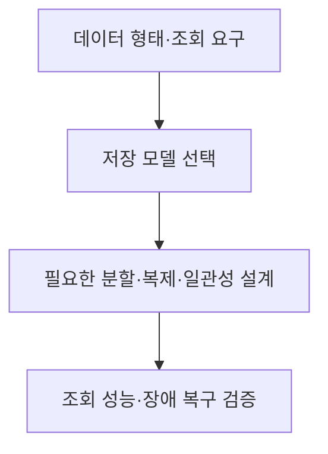
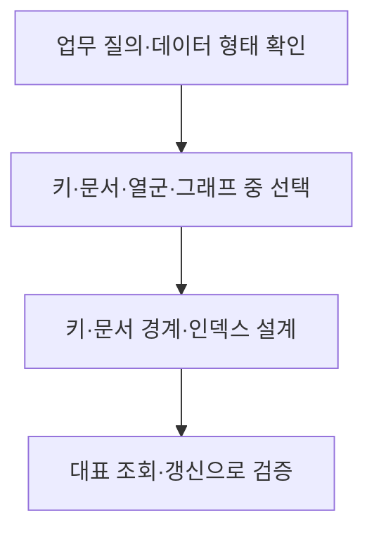
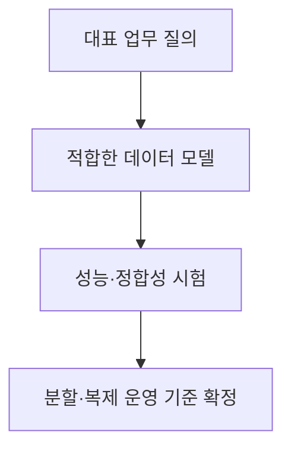

## 지식 로드맵 내 현재 위치

지식 위치: 자료처리·데이터 → 데이터베이스 모델 → **NoSQL**

## 30초 인출

- 본질: **NoSQL**은 키·문서·열군·그래프 등 관계형 테이블 이외의 모델로 데이터를 저장·조회하는 데이터베이스 계열
- 메커니즘: 데이터와 조회 형태에 맞는 모델 선택 → 필요한 분할·복제·일관성 수준 설계 → 실제 조회와 장애 복구 검증

핵심 용어

- **NoSQL(Not Only SQL)** : 관계형 테이블 외의 다양한 데이터 모델을 사용하는 데이터베이스 계열
- **Key-Value** : 키로 값을 찾는 저장 모델로, 세션·캐시처럼 키 조회가 중심인 데이터에 적합
- **Document** : JSON과 유사한 문서 단위로 속성을 묶어 저장·조회하는 모델
- **Wide-Column(열군)** : 행 키와 열군을 중심으로 대량의 희소 데이터나 분산 쓰기를 처리하는 모델
- **Graph** : 노드와 간선으로 개체 간 관계를 저장하고 연결을 탐색하는 모델
- **Sharding(샤딩)** : 데이터를 키나 범위에 따라 여러 노드로 나누어 저장하는 방식
- **Replication(복제)** : 같은 데이터를 여러 노드에 두어 가용성·읽기 성능을 높이는 방식
- **일관성(Consistency)** : 쓰기 후 읽기에서 어떤 값을 관찰할 수 있는지에 관한 보장 수준
- **BASE(Basically Available, Soft state, Eventual consistency)** : 일부 분산 시스템에서 가용성과 최종 수렴을 중시하는 설계 특성으로, 모든 NoSQL의 필수 속성은 아님

---

## 1교시 예상문제 (10점)

> NoSQL에 관하여 설명하시오. (예상·10점)

---

## 1교시 10점 답안

### Ⅰ. NoSQL의 개요

| 구분 | 핵심 |
|---|---|
| 정의 | **NoSQL**은 키·문서·열군·그래프 등 관계형 테이블 이외의 모델로 데이터를 저장·조회하는 데이터베이스 계열 |
| 목적 | 데이터 형태와 접근 방식에 맞는 저장·조회, 필요한 규모의 확장 |

### Ⅱ. 주요 데이터 모델

| 모델 | 저장·조회 중심 | 적합한 예 |
|---|---|---|
| **Key-Value** | 키로 값 조회 | 세션·캐시 |
| **Document** | 문서의 속성 조회 | 상품·콘텐츠 |
| **Wide-Column** | 행 키·열군 조회 | 대량 이벤트 |
| **Graph** | 노드 간 관계 탐색 | 연결·추천 |

### Ⅲ. 선택과 운영

- 제언: 모델 이름보다 실제 조회 패턴과 트랜잭션 요구를 먼저 확인.

---

## 2~4교시 예상문제 (25점)

> NoSQL의 개념과 주요 데이터 모델을 설명하고, 관계형 데이터베이스와 비교하여 선택·운영 시 고려사항을 제시하시오. (예상·25점)

---

## 2~4교시 25점 답안

## Ⅰ. NoSQL의 개요

| 구분 | 핵심 |
|---|---|
| 정의 | **NoSQL**은 키·문서·열군·그래프 등 관계형 테이블 이외의 모델로 데이터를 저장·조회하는 데이터베이스 계열 |
| 목적 | 데이터 형태와 접근 방식에 맞는 저장·조회, 필요한 규모의 확장 |

## Ⅱ. 네 가지 데이터 모델

| 모델 | 기본 구조 | 강점 | 설계 시 확인 |
|---|---|---|---|
| **Key-Value** | 키 → 값 | 단순한 키 조회 | 값 내부 검색의 필요성 |
| **Document** | 문서 → 속성 | 가변 속성과 문서 단위 조회 | 문서 경계·인덱스 |
| **Wide-Column** | 행 키 → 열군 | 대량 분산 쓰기 | 파티션 키·조회 범위 |
| **Graph** | 노드 ↔ 간선 | 다단계 관계 탐색 | 관계 수·순회 깊이 |

네 모델은 저장 구조와 조회 방식이 다름. **샤딩**, 복제, 최종 일관성, 쿼럼은 제품과 구성에 따라 선택할 운영 방식이지 네 모델 모두의 필수 단계가 아님.

## Ⅲ. 모델 선택과 데이터 설계

| 판단 축 | 확인 질문 |
|---|---|
| 조회 | 단건 키 조회, 문서 속성 검색, 범위 조회, 관계 탐색 중 무엇이 중심인가? |
| 갱신 | 여러 항목을 함께 원자적으로 바꿔야 하는가? |
| 규모 | 데이터·트래픽 증가를 어떤 단위로 나눌 수 있는가? |

## Ⅳ. 분산 운영과 일관성

| 선택 | 얻는 효과 | 함께 검증할 한계 |
|---|---|---|
| **샤딩** | 저장·처리 부하 분산 | 키 쏠림과 노드 간 조회 |
| **복제** | 장애 대응·읽기 확장 | 복제 지연과 장애 전환 |
| 일관성 수준 | 지연·가용성 요구에 따른 읽기 보장 선택 | 오래된 값 읽기와 충돌 처리 |

분할·복제 방식과 일관성 보장은 제품별로 다르므로 장애·동시 갱신 시험으로 확인.

## Ⅴ. 관계형 데이터베이스와의 선택 기준

| 구분 | 관계형 DBMS | NoSQL |
|---|---|---|
| 데이터 구조 | 테이블·관계·SQL 중심 | 모델별 키·문서·열군·그래프 중심 |
| 주된 강점 | 관계 질의와 트랜잭션 관리 | 특정 데이터 형태·접근 방식에 맞춘 저장 |
| 판단 기준 | 조인·복합 질의·트랜잭션 요구 | 조회 패턴·데이터 형태·확장 요구 |

관계형과 NoSQL은 상호 배타적 선택이 아님. 업무별 적합한 저장소를 함께 쓰는 경우 데이터 소유권·동기화 책임을 명시.

## Ⅵ. 한계와 대응

| 한계 | 대응 방안 |
|---|---|
| 모델의 조회 방식과 실제 질의 불일치 | 대표 질의·갱신·데이터량으로 사전 시험 |
| 분할 키 쏠림 | 키 분포와 파티션별 부하를 측정해 분할 기준 조정 |
| 복제 지연·동시 갱신 충돌 | 업무별 읽기 보장과 충돌 해결 정책을 정의·검증 |
| 저장소 혼용 시 데이터 불일치 | 원본 데이터의 소유 시스템과 동기화·재처리 책임 지정 |

## Ⅶ. 기술사적 제언

우선 조회·갱신 요구와 트랜잭션 경계를 정하고 네 모델을 비교. 선택한 제품의 분할·복제·일관성 설정은 대표 부하와 장애 시험 결과로 확정.

## 연결 토픽

- 연관 토픽: [데이터 거버넌스](./006_data_governance.md), [DB 파티셔닝·샤딩](./021_db_partitioning_sharding.md)
