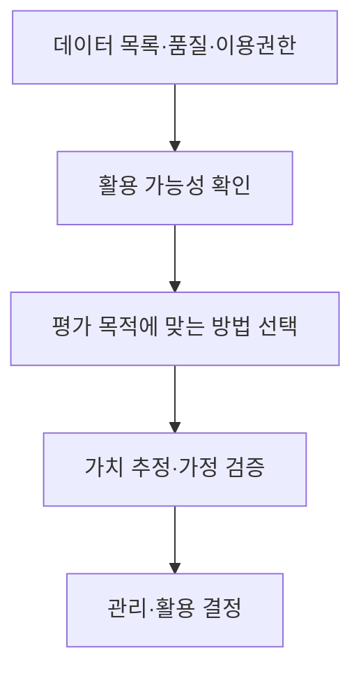
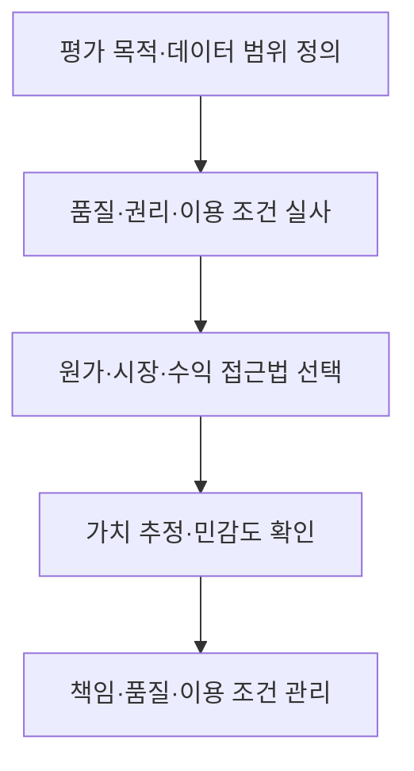

## 지식 로드맵 내 현재 위치

지식 위치: 자료처리·데이터 → 데이터 활용·관리 → **데이터 가치평가·데이터 자산화**

## 30초 인출

- 본질: **데이터 가치평가**는 데이터가 만들어 낼 경제적 효익을 평가 목적과 가정에 따라 추정하는 활동, **데이터 자산화**는 데이터의 소유·품질·이용 조건을 관리하여 반복 활용할 수 있게 하는 활동
- 메커니즘: 평가 목적·대상 정의 → 품질·권리·활용 가능성 확인 → 원가·시장·수익 접근법 선택 → 가치 산정·가정 검증 → 데이터 관리·활용

핵심 용어

- **데이터 가치평가** : 데이터 활용에서 기대되는 경제적 효익을 목적·가정에 따라 추정하는 활동
- **데이터 자산화** : 데이터의 목록·책임·품질·이용 조건을 정해 지속적으로 관리·활용하는 활동
- **원가접근법** : 같은 기능의 데이터를 수집·정제·구축하는 데 드는 비용을 바탕으로 평가하는 방식
- **시장접근법** : 비교 가능한 데이터 거래·이용 사례를 바탕으로 평가하는 방식
- **수익접근법** : 데이터 활용으로 기대되는 수익이나 비용 절감의 현재가치를 바탕으로 평가하는 방식
- **DCF(Discounted Cash Flow)** : 미래 현금흐름을 할인율로 현재가치로 환산하는 수익접근법의 기법
- **데이터 품질** : 정확성·완전성·최신성 등 데이터가 목적에 맞게 쓰일 수 있는 정도
- **Data Owner(데이터 책임자)** : 데이터의 관리·이용 조건에 관한 업무 책임을 맡는 주체

---

## 1교시 예상문제 (10점)

> 데이터 가치평가와 데이터 자산화에 관하여 설명하시오. (예상·10점)

---

## 1교시 10점 답안

### Ⅰ. 데이터 가치평가·자산화의 개요

| 구분 | 핵심 |
|---|---|
| 정의 | **데이터 가치평가·자산화**는 데이터의 경제적 효익을 추정하고, 품질·책임·이용 조건을 관리하여 반복 활용할 수 있게 하는 활동 |
| 목적 | 데이터 활용·투자·거래 판단의 근거 마련과 지속 가능한 이용 |

### Ⅱ. 가치평가의 세 접근법

| 접근법 | 판단 기준 |
|---|---|
| **원가** | 유사 데이터의 수집·구축 비용 |
| **시장** | 비교 가능한 거래·이용 사례 |
| **수익** | 데이터 활용의 예상 수익·비용 절감 |

### Ⅲ. 자산화와 평가의 연결

- 제언: 평가 금액과 함께 데이터 품질·이용 가능 범위·산정 가정을 기록.

---

## 2~4교시 예상문제 (25점)

> 데이터 가치평가와 데이터 자산화의 개념, 주요 평가 방법 및 관리 방안을 설명하시오. (예상·25점)

---

## 2~4교시 25점 답안

## Ⅰ. 데이터 가치평가·자산화의 개요

| 구분 | 핵심 |
|---|---|
| 정의 | **데이터 가치평가·자산화**는 데이터의 경제적 효익을 추정하고, 품질·책임·이용 조건을 관리하여 반복 활용할 수 있게 하는 활동 |
| 목적 | 데이터 활용·투자·거래 판단의 근거 마련과 지속 가능한 이용 |

평가 결과는 목적과 가정에 따라 달라지는 **추정치**. 데이터 자산화는 평가액을 곧바로 재무제표의 무형자산으로 인식한다는 뜻이 아님.

## Ⅱ. 평가 전 확인할 가치 요인

| 요인 | 확인할 내용 | 가치와의 관계 |
|---|---|---|
| 데이터 특성 | 품질·범위·갱신 주기 | 활용 가능한 정보의 수준 |
| 이용 조건 | 권리·계약·개인정보 제한 | 실제 이용·제공 가능 범위 |
| 활용 수요 | 내부 업무·외부 고객의 사용 목적 | 수익·비용 절감의 근거 |
| 대체 가능성 | 유사 데이터·재구축 가능성 | 희소성·대체 비용 |

## Ⅲ. 가치평가 방법과 선택

| 접근법 | 산정 근거 | 주요 한계 |
|---|---|---|
| **원가** | 수집·정제·구축의 대체 비용 | 투입 비용과 미래 효익이 다를 수 있음 |
| **시장** | 비교 가능한 거래·이용 가격 | 유사 사례와 계약 조건의 차이 |
| **수익** | 예상 효익을 현재가치로 환산 | 수요·기여율·할인율 가정의 민감성 |

비교 사례가 부족한 데이터에 시장가격을 억지로 적용하거나, 매출 전체를 데이터 기여로 간주하지 않도록 평가 목적과 근거를 명시.

## Ⅳ. 평가·자산화 흐름

| 단계 | 주요 결과 |
|---|---|
| 범위·실사 | 데이터 목록, 이용 가능 범위, 품질 현황 |
| 가치 산정 | 계산 근거와 핵심 가정 |
| 자산화 관리 | 책임자, 갱신 주기, 접근·제공 기준 |

## Ⅴ. 정보관리 관점의 운영

| 관리 대상 | 정보시스템의 지원 |
|---|---|
| 원천·가공 이력 | 데이터 계보와 변경 이력 기록 |
| 품질 | 지표·규칙·오류 조치 관리 |
| 이용 | 권한·계약 조건·사용 이력 관리 |
| 가치 재평가 | 이용 실적과 수익·비용 절감 가정 비교 |

## Ⅵ. 한계와 대응

| 한계 | 대응 방안 |
|---|---|
| 활용 수요가 불분명한 상태에서 금액부터 산정 | 이용 사례·평가 목적을 먼저 정의 |
| 권리·품질 제약으로 평가액만큼 활용 불가 | 이용 가능 범위·품질을 실사 결과에 반영 |
| 수익 추정의 과대평가 | 기여율·할인율·수요를 달리한 민감도 분석 |

## Ⅶ. 기술사적 제언

| 적용 단계 | 실행 내용 | 확인 근거 |
|---|---|---|
| 평가 기준 설정 | 데이터별 책임자·품질·이용 범위와 가치 산정 가정 기록 | 평가 대상과 가정의 추적 가능성 |
| 활용 결과 반영 | 실제 이용·업무 성과를 산정 가정과 대조 | 예상 편익과 실제 활용 실적의 차이 |
| 재평가 | 활용 변화에 따라 가정과 데이터 관리 수준 갱신 | 갱신 사유와 가치 추정 근거 |

## 연결 토픽

- 연관 토픽: [데이터 품질관리](./003_data_quality_management.md), [데이터 거버넌스](./006_data_governance.md)
