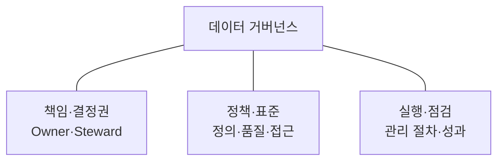
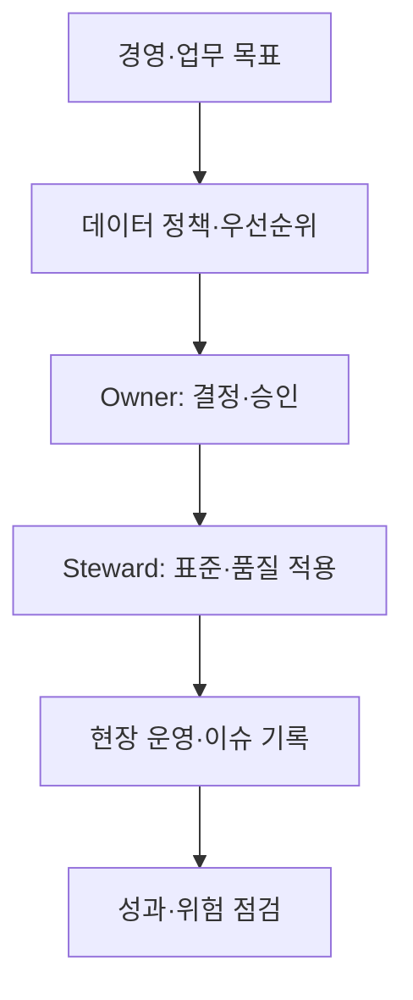

## 지식 로드맵 내 현재 위치

지식 위치: 자료처리·데이터 → 데이터 관리 → **데이터 거버넌스**

## 30초 인출

- 본질: **데이터 거버넌스**는 데이터를 누가 어떤 기준으로 관리·이용할지 정하는 의사결정권·책임·정책 체계
- 메커니즘: 데이터 관리 원칙 수립 → 책임·권한 배분 → 표준·품질·접근 규칙 적용 → 준수·활용 성과 점검

핵심 용어

- **데이터 거버넌스(Data Governance)** : 데이터 관리·이용에 관한 의사결정권, 책임, 정책을 정하고 실행하는 체계
- **Data Owner(데이터 책임자)** : 업무 관점에서 데이터 정의·품질·이용에 관한 책임과 결정권을 맡는 주체
- **Data Steward(데이터 관리 담당자)** : 데이터 표준·품질 규칙의 일상적인 적용과 이슈 조정을 수행하는 주체
- **데이터 표준** : 데이터 명칭·정의·형식·코드 등을 공통으로 쓰기 위한 규칙
- **데이터 품질** : 데이터가 사용 목적에 맞는 정확성·완전성·적시성 등을 갖춘 정도
- **메타데이터** : 데이터의 뜻·구조·출처·책임·이용 조건을 설명하는 정보
- **데이터 계보(Lineage)** : 데이터가 원천에서 변환·제공되기까지의 흐름과 이력
- **DAMA-DMBOK(Data Management Body of Knowledge)** : 데이터 관리의 지식 영역을 정리한 참고 체계

---

## 1교시 예상문제 (10점)

> 데이터 거버넌스에 관하여 설명하시오. (예상·10점)

---

## 1교시 10점 답안

### Ⅰ. 데이터 거버넌스의 개요

| 구분 | 핵심 |
|---|---|
| 정의 | **데이터 거버넌스**는 데이터를 누가 어떤 기준으로 관리·이용할지 정하는 의사결정권·책임·정책 체계 |
| 목적 | 데이터의 일관된 관리, 신뢰할 수 있는 활용과 위험 통제 |

### Ⅱ. 핵심 구성

### Ⅲ. 운영

| 단계 | 확인할 내용 |
|---|---|
| 기준 | 데이터 정의·품질·이용 규칙 |
| 적용 | 책임 조직의 관리·승인·조치 |
| 점검 | 규칙 준수와 활용상 문제 개선 |

- 제언: 데이터별 결정권과 조치 책임을 먼저 분명히 지정.

---

## 2~4교시 예상문제 (25점)

> 데이터 거버넌스의 개념과 구성체계, 역할 및 운영 방안을 설명하시오. (예상·25점)

---

## 2~4교시 25점 답안

## Ⅰ. 데이터 거버넌스의 개요

| 구분 | 핵심 |
|---|---|
| 정의 | **데이터 거버넌스**는 데이터를 누가 어떤 기준으로 관리·이용할지 정하는 의사결정권·책임·정책 체계 |
| 목적 | 데이터의 일관된 관리, 신뢰할 수 있는 활용과 위험 통제 |

## Ⅱ. 의사결정·실행 구조

의사결정권과 실제 운영 책임을 연결하되, 조직 이름·직위는 조직 규모에 따라 달라질 수 있음.

## Ⅲ. 구성요소

| 요소 | 주요 내용 | 예 |
|---|---|---|
| 조직·역할 | 데이터 소유·관리·이용 책임 | Owner, Steward |
| 정책·표준 | 정의·명명·코드·접근 기준 | 표준 사전, 접근 규칙 |
| 관리 절차 | 생성·변경·품질·제공 승인 | 변경 영향 검토 |
| 기술 지원 | 메타데이터·계보·품질 측정 | 카탈로그, 품질 지표 |

도구는 책임과 기준을 실행·확인하는 수단이며 도구 설치만으로 거버넌스가 완성되는 것은 아님.

## Ⅳ. 운영 절차

| 단계 | 주요 활동 | 산출·확인 |
|---|---|---|
| 대상 선정 | 중요 데이터와 사용처 식별 | 관리 범위 |
| 기준 수립 | 정의·품질·이용 규칙 설정 | 승인된 정책·표준 |
| 적용 | 생산·연계·이용 단계에 규칙 반영 | 책임·처리 이력 |
| 점검·개선 | 오류·충돌·접근 이슈 검토 | 조치 결과 |

## Ⅴ. 데이터 관리 영역과 관계

| 영역 | 거버넌스가 정하는 것 |
|---|---|
| 표준·메타데이터 | 공통 정의·관리 주체 |
| 품질 | 우선 관리 항목·허용 기준·오류 책임 |
| 보안·이용 | 접근 권한·이용 조건·승인 책임 |
| 데이터 공유 | 제공 기준과 원본·사본의 책임 |

## Ⅵ. 한계와 대응

| 한계 | 대응 방안 |
|---|---|
| 정책은 있으나 현장 책임이 불명확 | 데이터별 Owner·Steward와 결정 범위 지정 |
| 부서별 정의·품질 기준 충돌 | 공통 용어·코드와 변경 승인 절차 운영 |
| 모든 데이터에 동일한 관리 강도 적용 | 업무 영향·이용 규모에 따라 우선순위 설정 |

## Ⅶ. 기술사적 제언

| 적용 지점 | 운영 방식 | 점검 근거 |
|---|---|---|
| 책임 지정 | 중요 데이터의 정의·소유자·품질 책임을 카탈로그에 연결 | 책임 공백과 중복 지정 |
| 이견 조정 | 부서 간 정의·접근 충돌을 합의·승인 절차로 처리 | 결정권자와 변경 이력 |
| 이행 확인 | 품질 지표와 이슈 처리 흐름을 정기 점검 | 미처리 이슈와 정책 적용 기록 |

## 연결 토픽

- 연관 토픽: [데이터 품질관리](./003_data_quality_management.md), [데이터 표준화](./008_data_standardization.md)
