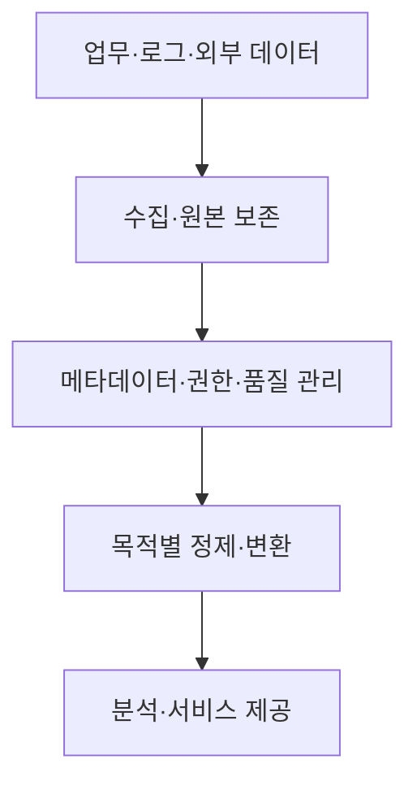
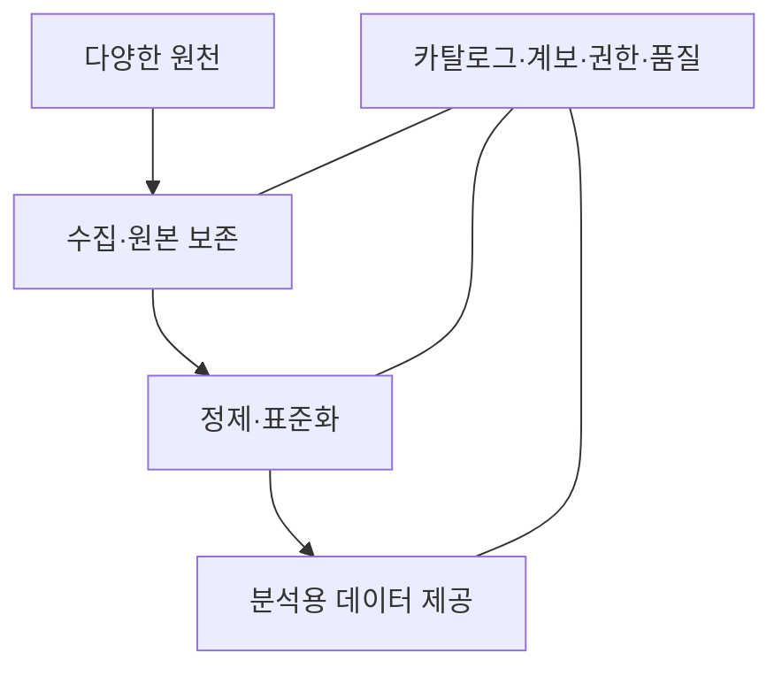

## 지식 로드맵 내 현재 위치

지식 위치: 자료처리·데이터 → 데이터 플랫폼 → **데이터 레이크**

## 30초 인출

- 본질: **데이터 레이크**는 여러 원천의 정형·반정형·비정형 데이터를 원본에 가까운 형태로 모아 다양한 분석에 쓰는 저장·처리 환경
- 메커니즘: 원천 수집·보존 → 메타데이터·권한 관리 → 목적에 맞는 정제·변환 → 분석·제공

핵심 용어

- **데이터 레이크(Data Lake)** : 다양한 형태의 데이터를 원본에 가까운 상태로 모아 여러 분석 목적에 활용하는 저장·처리 환경
- **Schema-on-Read** : 저장 시 구조를 일률적으로 강제하기보다 읽고 처리할 때 용도에 맞는 구조를 적용하는 방식
- **원본 영역(Raw Zone)** : 추적·재처리를 위해 수집 데이터를 원본에 가깝게 보존하는 영역
- **메타데이터 카탈로그** : 데이터의 뜻·위치·소유자·형식·이용 조건을 찾게 하는 목록
- **데이터 계보(Lineage)** : 원천 데이터가 가공·제공되기까지의 흐름과 이력
- **데이터 늪(Data Swamp)** : 메타데이터·품질·권한 관리가 부족해 데이터를 찾거나 믿고 쓰기 어려운 상태
- **데이터 레이크하우스(Lakehouse)** : 레이크의 다양한 저장 형태와 데이터 웨어하우스의 관리·분석 기능을 결합하려는 구조

---

## 1교시 예상문제 (10점)

> 데이터 레이크에 관하여 설명하시오. (예상·10점)

---

## 1교시 10점 답안

### Ⅰ. 데이터 레이크의 개요

| 구분 | 핵심 |
|---|---|
| 정의 | **데이터 레이크**는 여러 원천의 정형·반정형·비정형 데이터를 원본에 가까운 형태로 모아 다양한 분석에 쓰는 저장·처리 환경 |
| 목적 | 다양한 데이터의 보존·탐색·재사용과 분석 요구에 따른 가공 |

### Ⅱ. 기본 구조

### Ⅲ. 핵심 통제

| 통제 | 이유 |
|---|---|
| 카탈로그·계보 | 데이터를 찾고 원천·가공 이력을 확인 |
| 품질·접근 권한 | 잘못된 분석과 부적절한 이용 방지 |

- 제언: 데이터를 먼저 쌓는 규모보다 찾고 이해하며 안전하게 쓸 수 있는 관리 기준을 우선 설정.

---

## 2~4교시 예상문제 (25점)

> 데이터 레이크의 개념과 구성, 데이터 활용 방식 및 운영상 한계를 설명하시오. (예상·25점)

---

## 2~4교시 25점 답안

## Ⅰ. 데이터 레이크의 개요

| 구분 | 핵심 |
|---|---|
| 정의 | **데이터 레이크**는 여러 원천의 정형·반정형·비정형 데이터를 원본에 가까운 형태로 모아 다양한 분석에 쓰는 저장·처리 환경 |
| 목적 | 다양한 데이터의 보존·탐색·재사용과 분석 요구에 따른 가공 |

## Ⅱ. 구성과 데이터 흐름

| 구간 | 역할 |
|---|---|
| 원본 | 원천 값·수집 시점 보존, 재처리 근거 |
| 가공 | 오류 정리·형식 통일·업무 규칙 적용 |
| 제공 | 분석·기계학습·서비스 용도에 맞는 데이터셋 |

원본·정제·제공의 구분은 관리 방법의 예이며 모든 레이크가 같은 계층 이름이나 순서를 의무적으로 쓰는 것은 아님.

## Ⅲ. 활용과 저장 특성

| 특성 | 의미 | 확인할 것 |
|---|---|---|
| 다양한 형식 | 표·문서·로그 등 함께 수집 | 형식·원천 메타데이터 |
| 원본 보존 | 새 분석 목적에 맞게 재처리 가능 | 보존 기간·비용 |
| 읽기 시 구조 적용 | 분석 목적에 맞는 해석 가능 | 데이터 정의·품질 |
| 확장 가능한 저장 | 데이터량 증가에 대응 | 검색·처리 성능 |

## Ⅳ. 데이터 웨어하우스·레이크하우스와 비교

| 구분 | 주된 관점 | 관리 초점 |
|---|---|---|
| 데이터 웨어하우스 | 정제·통합된 분석 데이터 | 일관된 지표·질의 |
| 데이터 레이크 | 다양한 원본·가공 데이터 | 탐색·재처리·메타데이터 |
| 레이크하우스 | 레이크 저장과 관리·질의 기능 결합 | 데이터 형식·트랜잭션·분석 |

실제 제품의 기능은 다르므로 저장소 이름만으로 분석 성능·품질을 판단하지 않음.

## Ⅴ. 데이터 늪을 막는 통제

| 한계 | 대응 방안 |
|---|---|
| 위치·의미·소유자를 알 수 없음 | 카탈로그·책임자·용어 정의 관리 |
| 원본과 가공값의 관계가 불명확 | 계보·변환 규칙·버전 기록 |
| 품질·접근 통제 미흡 | 용도별 품질 검증·권한·이용 이력 |
| 무분별한 보존으로 비용 증가 | 데이터 이용·보존 주기 검토 |

## Ⅵ. 기술사적 제언

우선 분석에 쓰일 주요 데이터셋의 소유자·원천·품질 기준을 카탈로그에 기록. 원본에서 제공 데이터까지 계보와 권한을 연결해 실제 사용 가능성을 확인하고, 이용되지 않는 데이터는 보존 필요성을 재검토.

## 연결 토픽

- 연관 토픽: [데이터 거버넌스](./006_data_governance.md), [데이터 품질관리](./003_data_quality_management.md)
