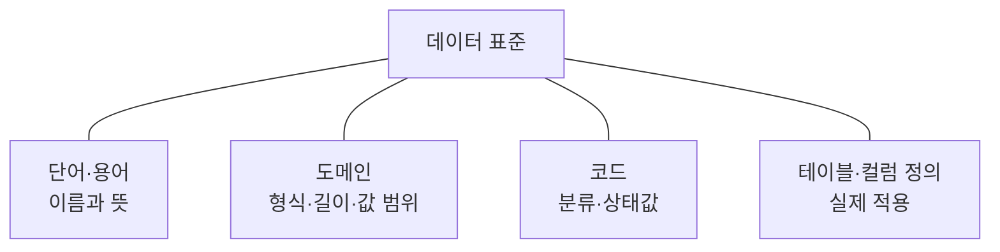
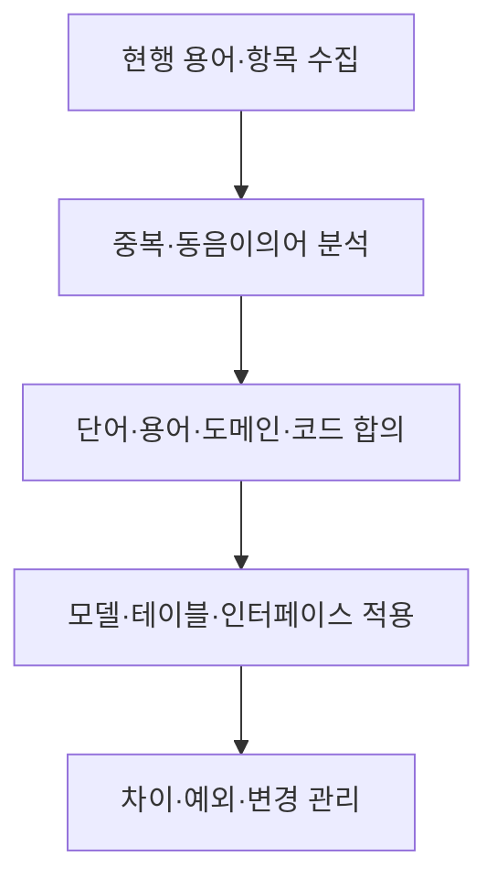

## 지식 로드맵 내 현재 위치

지식 위치: 자료처리·데이터 → 데이터 관리 → **데이터 표준화**

## 30초 인출

- 본질: **데이터 표준화**는 데이터의 이름·뜻·형식·값을 공통 기준으로 정해 시스템 간 같은 의미로 쓰게 하는 활동
- 메커니즘: 용어·도메인·코드 기준 수립 → 데이터 항목·테이블에 적용 → 변경·예외 검토 → 준수 점검

핵심 용어

- **데이터 표준화** : 데이터 항목의 명칭·의미·형식·허용값을 공통 규칙으로 정의·관리하는 활동
- **표준 단어** : 데이터 이름을 구성하는 기본 단위와 약어
- **표준 용어** : 업무 개념을 일관되게 표현하는 명칭·정의
- **도메인** : 같은 성격의 데이터가 공유하는 형식·길이·값 범위 등의 규칙
- **표준 코드** : 업무 상태·분류 등을 공통 값으로 나타내는 코드 체계
- **테이블 정의서** : 테이블·컬럼의 이름·뜻·형식·키·관계를 기록한 메타데이터 문서
- **메타데이터** : 데이터의 뜻·구조·출처·책임·이용 조건을 설명하는 정보

---

## 1교시 예상문제 (10점)

> 데이터 표준화에 관하여 설명하시오. (예상·10점)

---

## 1교시 10점 답안

### Ⅰ. 데이터 표준화의 개요

| 구분 | 핵심 |
|---|---|
| 정의 | **데이터 표준화**는 데이터의 이름·뜻·형식·값을 공통 기준으로 정해 시스템 간 같은 의미로 쓰게 하는 활동 |
| 목적 | 데이터 해석 차이와 연계 오류 감소, 일관된 활용 |

### Ⅱ. 표준의 구성

### Ⅲ. 적용과 관리

| 단계 | 활동 |
|---|---|
| 정의 | 업무 개념·값·형식 합의 |
| 적용 | 데이터 모델·연계 항목에 반영 |
| 유지 | 변경·예외 승인과 준수 점검 |

- 제언: 이름만 통일하지 말고 업무 의미와 허용값까지 맞추어 관리.

---

## 2~4교시 예상문제 (25점)

> 데이터 표준화의 개념과 구성요소, 수립·적용 절차 및 관리 방안을 설명하시오. (예상·25점)

---

## 2~4교시 25점 답안

## Ⅰ. 데이터 표준화의 개요

| 구분 | 핵심 |
|---|---|
| 정의 | **데이터 표준화**는 데이터의 이름·뜻·형식·값을 공통 기준으로 정해 시스템 간 같은 의미로 쓰게 하는 활동 |
| 목적 | 데이터 해석 차이와 연계 오류 감소, 일관된 활용 |

## Ⅱ. 표준 구성요소

| 요소 | 정하는 것 | 적용 예 |
|---|---|---|
| 표준 단어 | 기본 단어·약어 | 고객, 번호 |
| 표준 용어 | 업무 개념·이름·정의 | 고객번호의 뜻 |
| 도메인 | 데이터 형식·길이·값 규칙 | 식별번호 형식 |
| 표준 코드 | 공통 분류·상태값 | 주문 상태 코드 |
| 테이블 정의 | 테이블·컬럼·키·관계 | 실제 저장 구조 |

표준 단어는 이름의 재료, 표준 용어는 업무 의미, 도메인·코드는 값의 규칙, 테이블 정의는 실제 적용 위치.

## Ⅲ. 수립·적용 흐름

| 확인 지점 | 핵심 질문 |
|---|---|
| 정의 | 같은 이름이 서로 다른 뜻을 갖는가? |
| 모델 | 컬럼 이름·타입·값 규칙이 표준과 맞는가? |
| 연계 | 보내는 쪽과 받는 쪽의 의미·코드가 같은가? |

## Ⅳ. 데이터 거버넌스와의 관계

| 역할 | 데이터 표준화의 연결 |
|---|---|
| 데이터 책임자 | 정의·변경·예외의 승인 |
| 실무 담당자 | 표준 사전 유지와 적용 점검 |
| 개발·운영 조직 | 모델·DB·API에 표준 반영 |

공공 DB의 세부 표준화 지침은 적용 기관·사업의 현행 기준을 별도로 확인. 기본 개념 학습에서는 표준의 구성과 적용 원리를 우선 이해.

## Ⅴ. 한계와 대응

| 한계 | 대응 방안 |
|---|---|
| 명칭만 같고 뜻·코드가 다름 | 정의·도메인·코드 매핑까지 검토 |
| 표준 사전과 실제 DB가 다름 | 모델·컬럼·인터페이스의 준수 점검 |
| 업무 변화가 표준에 늦게 반영 | 변경 요청·영향 분석·승인 이력 관리 |

## Ⅵ. 기술사적 제언

| 적용 순서 | 실행 내용 | 확인 기준 |
|---|---|---|
| 우선 범위 선정 | 시스템 간 공유되는 핵심 데이터와 교환 항목 선정 | 업무 의미·코드·형식의 불일치 영향 |
| 차이 관리 | 표준 사전과 실제 테이블·API의 매핑 및 차이를 변경 항목으로 등록 | 변경 영향과 호환성 검토 |
| 신규 적용 | 승인된 표준을 데이터 모델·API 설계에 반영 | 인터페이스 시험과 표준 준수 결과 |

## 검증 출처

- [NIA, 공공데이터베이스 표준화 관리 매뉴얼](https://library.nia.or.kr/egentouch-asset/10110/contents/7058697).

## 연결 토픽

- 연관 토픽: [데이터 거버넌스](./006_data_governance.md), [데이터 품질관리](./003_data_quality_management.md)
