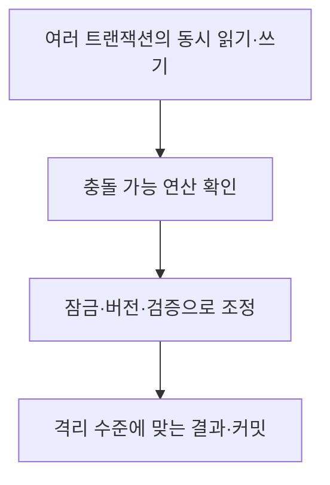
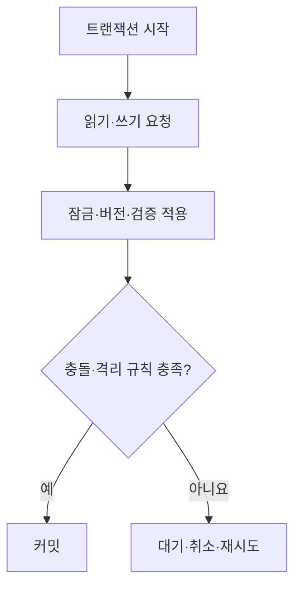

## 지식 로드맵 내 현재 위치

지식 위치: 자료처리·데이터 → 데이터베이스 트랜잭션 → **동시성 제어**

## 30초 인출

- 본질: **동시성 제어**는 여러 트랜잭션이 같은 데이터를 함께 읽고 쓸 때 서로의 결과를 부적절하게 방해하지 않도록 실행을 조정하는 기술
- 메커니즘: 충돌 가능한 연산 식별 → 잠금·버전·검증 등으로 읽기·쓰기 조정 → 충돌·재시도·커밋 처리

핵심 용어

- **동시성 제어(Concurrency Control)** : 여러 트랜잭션의 읽기·쓰기를 조정해 격리 수준에 맞는 결과를 얻는 기술
- **트랜잭션(Transaction)** : 데이터베이스에서 하나의 작업 단위로 수행·확정하거나 취소하는 연산 묶음
- **직렬가능성(Serializability)** : 동시 실행 결과가 어떤 직렬 실행과 동등한 성질
- **잠금(Lock)** : 충돌하는 데이터 접근을 대기시키거나 제한하는 제어 수단
- **2PL(Two-Phase Locking, 2단계 잠금)** : 잠금 획득 단계와 해제 단계를 구분하는 잠금 규약
- **MVCC(Multi-Version Concurrency Control, 다중 버전 동시성 제어)** : 데이터의 여러 버전으로 읽기·쓰기 충돌을 줄이는 방식
- **OCC(Optimistic Concurrency Control, 낙관적 동시성 제어)** : 작업을 먼저 수행하고 확정 시 충돌을 검증하는 방식
- **교착상태(Deadlock)** : 트랜잭션들이 서로의 잠금 해제를 기다려 진행하지 못하는 상태

---

## 1교시 예상문제 (10점)

> 동시성 제어에 관하여 설명하시오. (예상·10점)

---

## 1교시 10점 답안

### Ⅰ. 동시성 제어의 개요

| 구분 | 핵심 |
|---|---|
| 정의 | **동시성 제어**는 여러 트랜잭션이 같은 데이터를 함께 읽고 쓸 때 실행을 조정하는 기술 |
| 목적 | 데이터 이상현상을 줄이면서 필요한 동시 처리 성능 확보 |

### Ⅱ. 충돌과 제어 방식

| 방식 | 핵심 |
|---|---|
| 잠금 | 충돌 접근을 대기·제한 |
| **MVCC** | 읽기에 적합한 버전 제공 |
| **OCC** | 확정 시 충돌 검증 |

### Ⅲ. 설계 기준

요구 격리 수준, 충돌 빈도, 대기·재시도 비용을 함께 고려. **MVCC**만으로 모든 격리 이상이 자동으로 사라지지는 않음.

---

## 2~4교시 예상문제 (25점)

> 동시성 제어의 개념과 주요 이상현상, 제어 기법 및 적용 시 고려사항을 설명하시오. (예상·25점)

---

## 2~4교시 25점 답안

## Ⅰ. 동시성 제어의 개요

| 구분 | 핵심 |
|---|---|
| 정의 | **동시성 제어**는 여러 트랜잭션이 같은 데이터를 함께 읽고 쓸 때 실행을 조정하는 기술 |
| 목적 | 데이터 이상현상을 줄이면서 필요한 동시 처리 성능 확보 |

## Ⅱ. 동시 실행의 주요 이상현상

| 이상현상 | 발생 모습 | 확인할 위험 |
|---|---|---|
| 갱신 손실 | 두 작업의 갱신 중 하나가 덮임 | 최종 데이터 누락 |
| 더티 읽기 | 확정되지 않은 값을 읽음 | 취소될 값에 의존 |
| 반복 불가능 읽기 | 같은 행을 다시 읽을 때 값이 달라짐 | 한 거래 안의 판단 불일치 |
| 팬텀 읽기 | 같은 조건의 재조회에서 행 집합이 달라짐 | 범위 기반 판단 변화 |

문제가 되는 이상현상과 허용 범위는 업무의 격리 요구에 따라 다름.

## Ⅲ. 대표 제어 기법

| 기법 | 작동 방식 | 주의할 점 |
|---|---|---|
| 잠금·**2PL** | 충돌 연산을 잠금으로 조정 | 대기·교착상태 |
| 타임스탬프 순서 | 시간 순서에 맞지 않는 충돌 연산 처리 | 충돌 시 취소·재시도 |
| **OCC** | 읽고 계산한 뒤 확정 전 충돌 검증 | 충돌이 잦으면 재시도 증가 |
| **MVCC** | 시점에 맞는 데이터 버전 읽기 | 버전 관리·격리 수준별 이상현상 |

기법 이름만으로 직렬가능성이 보장되는 것은 아님. 제품의 격리 수준과 구체적 구현을 확인.

## Ⅳ. 동시성 제어 흐름

| 선택 기준 | 검토 사항 |
|---|---|
| 정합성 | 업무가 허용할 수 없는 이상현상 |
| 부하 | 읽기·쓰기 비율과 충돌 빈도 |
| 운영 | 대기 시간, 교착상태, 재시도 처리 |

## Ⅴ. 격리 수준과 관계

| 구분 | 의미 |
|---|---|
| 제어 기법 | 잠금·버전·검증 등 구현 수단 |
| 격리 수준 | 애플리케이션에 허용·차단할 이상현상의 계약 |
| 애플리케이션 | 충돌·취소 발생 시 재시도와 사용자 응답 처리 |

같은 MVCC라도 제품·격리 수준에 따라 관찰 가능한 결과가 다를 수 있음.

## Ⅵ. 한계와 대응

| 한계 | 대응 방안 |
|---|---|
| 잠금 대기로 처리량 저하 | 트랜잭션 범위·잠금 대상 축소 |
| 충돌 시 재시도 처리 누락 | 실패·중복 실행을 고려한 재시도 설계 |
| 격리 수준을 이름만 보고 선택 | 실제 동시 갱신 시나리오로 이상현상 검증 |

## Ⅶ. 기술사적 제언

| 설계 단계 | 선택 내용 | 검증 방법 |
|---|---|---|
| 충돌 시나리오 정의 | 금전·재고 등 동시 갱신 결과가 중요한 업무를 식별 | 중복 차감·갱신 유실 등 업무 불변조건 |
| 제어 방식 선택 | 불변조건을 만족하는 격리 수준과 잠금·버전 방식을 결정 | 대기·충돌·교착 상황의 처리 |
| 운영 검증 | 재시도와 오류 처리를 포함해 대표 부하 시험 | 정합성 유지와 처리량·응답시간 |

## 연결 토픽

- 연관 토픽: [트랜잭션 격리 수준](./020_isolation_level.md), [무결성 제약조건](./013_integrity_constraint.md)
