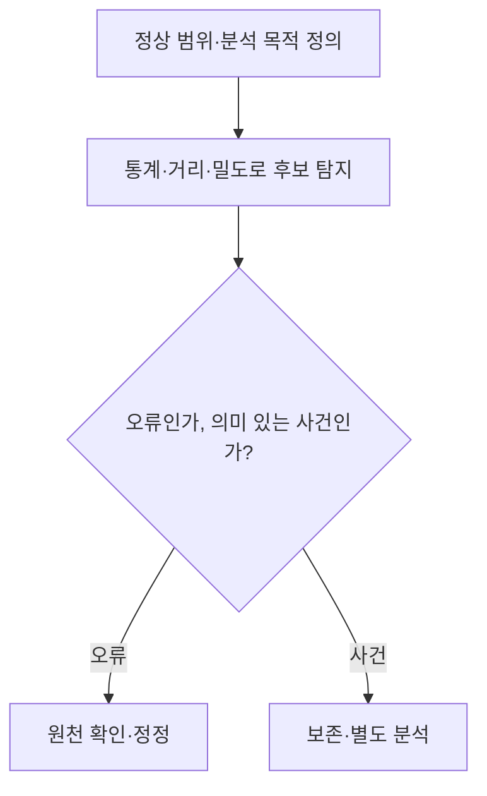
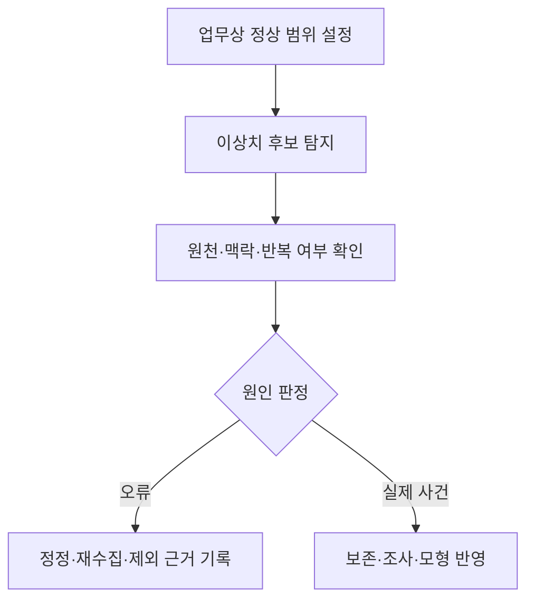

## 지식 로드맵 내 현재 위치

지식 위치: 자료처리·데이터 → 데이터 분석·전처리 → **이상치**

## 30초 인출

- 본질: **이상치**는 데이터의 일반적인 값·관계·시간 패턴에서 크게 벗어난 관측치
- 메커니즘: 분석 목적·정상 기준 정의 → 통계·거리·밀도 등으로 후보 탐지 → 오류인지 중요한 사건인지 확인 → 보정·유지·별도 분석

핵심 용어

- **이상치(Outlier)** : 데이터의 일반적인 분포나 패턴에서 크게 벗어난 관측치
- **노이즈(Noise)** : 측정·입력·전송 과정의 오류 등으로 생긴 불필요한 변동
- **IQR(Interquartile Range, 사분위범위)** : 제3사분위수에서 제1사분위수를 뺀 값으로, 분포 기반 이상치 후보 탐지에 사용
- **Z-score(표준점수)** : 값이 평균에서 표준편차 단위로 얼마나 떨어져 있는지 나타내는 값
- **LOF(Local Outlier Factor)** : 주변 점의 밀도와 비교해 국소적으로 드문 점을 찾는 방법
- **Isolation Forest** : 무작위 분할로 관측치가 빨리 고립되는 정도를 이용한 이상 탐지 방법
- **맥락적 이상치** : 값 자체보다 시간·상황·집단을 함께 볼 때 비정상인 관측치

---

## 1교시 예상문제 (10점)

> 이상치에 관하여 설명하시오. (예상·10점)

---

## 1교시 10점 답안

### Ⅰ. 이상치의 개요

| 구분 | 핵심 |
|---|---|
| 정의 | **이상치**는 데이터의 일반적인 값·관계·시간 패턴에서 크게 벗어난 관측치 |
| 목적 | 오류에 따른 분석 왜곡을 줄이고 중요한 예외 사건을 발견 |

### Ⅱ. 탐지와 판단

| 탐지 관점 | 예 |
|---|---|
| 분포 | IQR·Z-score |
| 주변 관계 | 거리·LOF |
| 맥락 | 시간·집단별 비교 |

### Ⅲ. 핵심 유의점

이상치는 모두 삭제할 값이 아님. 장애·부정거래처럼 탐지 목적 자체인 신호일 수 있으므로 원인과 활용 목적을 확인.

---

## 2~4교시 예상문제 (25점)

> 이상치의 개념과 유형·탐지 방법을 설명하고, 분석 목적에 따른 처리 방안을 제시하시오. (예상·25점)

---

## 2~4교시 25점 답안

## Ⅰ. 이상치의 개요

| 구분 | 핵심 |
|---|---|
| 정의 | **이상치**는 데이터의 일반적인 값·관계·시간 패턴에서 크게 벗어난 관측치 |
| 목적 | 오류에 따른 분석 왜곡을 줄이고 중요한 예외 사건을 발견 |

## Ⅱ. 유형과 발생 원인

| 유형 | 판단 기준 | 예 |
|---|---|---|
| 전역 이상 | 전체 분포에서 드문 값 | 일반 범위를 벗어난 거래액 |
| 국소 이상 | 주변 집단과 비교해 드문 값 | 같은 고객군의 특이 거래 |
| 맥락 이상 | 시간·장소·조건을 고려할 때 드문 값 | 특정 시간대의 비정상 접속 |

측정·입력 오류는 정정 대상이 될 수 있고, 실제 드문 사건은 보존·조사 대상일 수 있음.

## Ⅲ. 탐지 방법

| 방법 | 기준 | 적용 시 확인 |
|---|---|---|
| **IQR** | 사분위 범위 밖의 값 | 분포·집단별 차이 |
| **Z-score** | 평균에서 떨어진 정도 | 평균·표준편차의 적합성 |
| 거리·**LOF** | 주변 관측치와의 거리·밀도 | 변수 척도·차원 |
| **Isolation Forest** | 무작위 분할에서 고립되는 정도 | 입력 변수·점수 기준 |

한 방법의 점수만으로 오류 여부가 확정되지 않음. 탐지 기준과 데이터 특성을 함께 검토.

## Ⅳ. 확인·처리 흐름

| 처리 | 적용 조건 |
|---|---|
| 정정·재수집 | 원천의 잘못된 기록을 확인한 경우 |
| 제외·완화 | 분석 목적상 영향이 과도하고 근거가 있는 경우 |
| 유지·별도 분석 | 실제 중요 사건이거나 탐지 대상인 경우 |

## Ⅴ. 분석 결과에 미치는 영향

| 분석 | 이상치 영향 | 검증 |
|---|---|---|
| 평균·회귀 | 추정값과 계수의 큰 변동 | 포함·제외 결과 비교 |
| 군집 | 중심·거리·밀도 변화 | 방법·척도 민감도 확인 |
| 이상 탐지 | 희귀 사건 자체가 목표 | 실제 사건 확인·오탐 평가 |

## Ⅵ. 한계와 대응

| 한계 | 대응 방안 |
|---|---|
| 높은 값이면 무조건 삭제 | 오류·실제 사건 여부를 원천과 업무 맥락에서 확인 |
| 전체 분포 한 가지 기준만 적용 | 집단·시간·상황별 기준 검토 |
| 처리 과정이 기록되지 않음 | 탐지 기준·판정·수정 이력 보존 |

## Ⅶ. 기술사적 제언

| 판단 단계 | 조치 | 남길 근거 |
|---|---|---|
| 원천 확인 | 입력 오류·측정 오류와 실제 희귀 사건을 구분 | 원천값·수집 조건·업무 맥락 |
| 처리 선택 | 목적에 따라 유지·수정·제외·강건한 분석 방법을 선택 | 선택 이유와 적용 범위 |
| 영향 검토 | 처리 전후 분석 결과를 비교하고 결론 변화를 확인 | 민감도 비교와 최종 판단 |

## 연결 토픽

- 연관 토픽: [군집분석](./005_cluster_analysis.md), [표본추출](./032_sampling.md)
