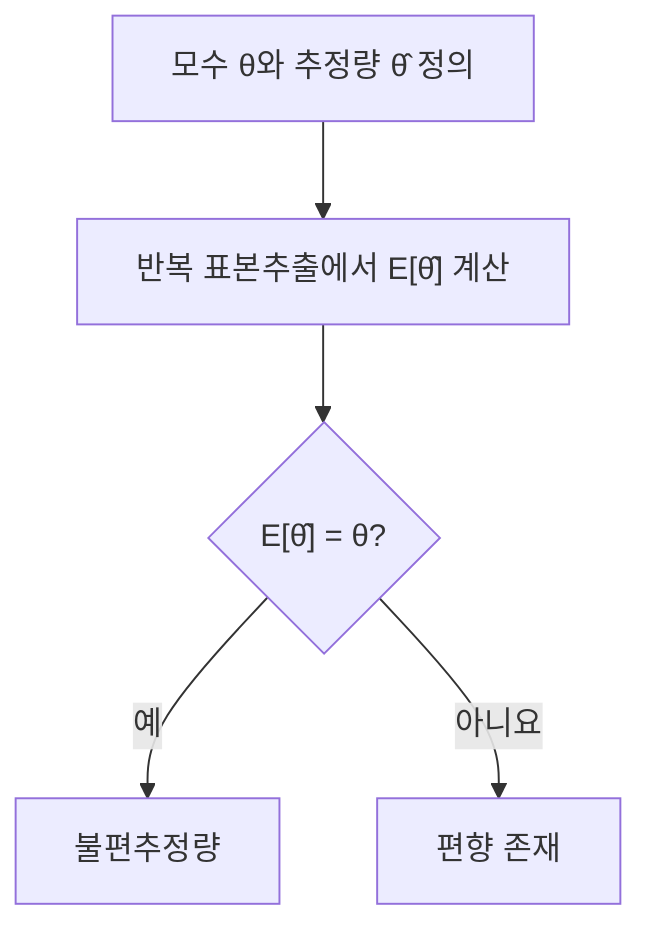
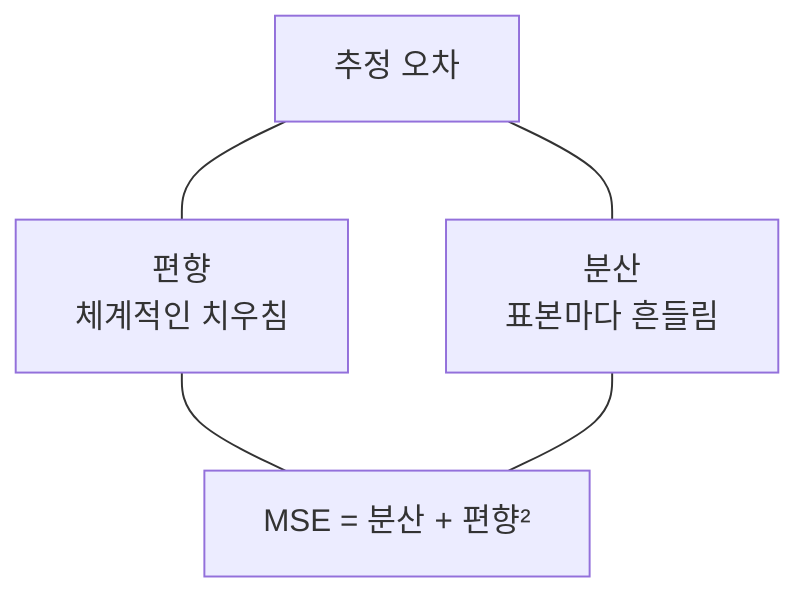

## 지식 로드맵 내 현재 위치

지식 위치: 자료처리·데이터 → 통계 추정 → **불편추정량**

## 30초 인출

- 본질: **불편추정량**은 같은 조건의 표본추출을 반복할 때 추정값의 평균이 추정 대상 모수와 일치하는 추정량
- 메커니즘: 추정 대상과 표본추출 가정 정의 → 추정량의 기댓값 계산 → 모수와 비교 → 분산·평균제곱오차도 함께 평가

핵심 용어

- **모수(Parameter)** : 모집단의 평균·분산 등 추정하려는 특성
- **추정량(Estimator)** : 표본에서 모수를 계산하는 규칙
- **불편성(Unbiasedness)** : 추정량의 기댓값이 모수와 같은 성질, E[θ̂] = θ
- **편향(Bias)** : 추정량의 기댓값과 모수의 차이, E[θ̂] − θ
- **표본평균** : 표본값의 평균으로, 독립·동일분포 표본 등 일반적인 가정에서 모평균의 불편추정량
- **표본분산** : 독립·동일분포 표본의 편차 제곱합을 n−1로 나누면 모분산의 불편추정량
- **분산(Variance)** : 반복 표본추출에서 추정값이 흩어지는 정도
- **MSE(Mean Squared Error, 평균제곱오차)** : 모수와 추정값 차이의 제곱 평균으로, 분산과 편향 제곱의 합

---

## 1교시 예상문제 (10점)

> 불편추정량에 관하여 설명하시오. (예상·10점)

---

## 1교시 10점 답안

### Ⅰ. 불편추정량의 개요

| 구분 | 핵심 |
|---|---|
| 정의 | **불편추정량**은 반복 표본추출에서 추정값의 평균이 추정 대상 모수와 일치하는 추정량, E[θ̂] = θ |
| 목적 | 추정이 특정 방향으로 체계적으로 치우치는지 판단 |

### Ⅱ. 불편성의 판단

| 예 | 결과 |
|---|---|
| 표본평균 | 모평균의 불편추정량 |
| n−1로 나눈 표본분산 | 일반적인 독립·동일분포 가정에서 모분산의 불편추정량 |

### Ⅲ. 유의점

불편성은 반복 평균의 성질이며 한 번의 추정이 실제 값에 가깝다는 보장은 아님. 추정량의 분산도 함께 평가.

---

## 2~4교시 예상문제 (25점)

> 불편추정량의 개념과 판단 방법을 설명하고, 분산·평균제곱오차와의 관계를 비교하시오. (예상·25점)

---

## 2~4교시 25점 답안

## Ⅰ. 불편추정량의 개요

| 구분 | 핵심 |
|---|---|
| 정의 | **불편추정량**은 반복 표본추출에서 추정값의 평균이 추정 대상 모수와 일치하는 추정량, E[θ̂] = θ |
| 목적 | 추정이 특정 방향으로 체계적으로 치우치는지 판단 |

## Ⅱ. 추정량과 편향

| 개념 | 수식·의미 |
|---|---|
| 모수 θ | 모집단에서 알고 싶은 값 |
| 추정량 θ̂ | 표본으로 θ를 계산하는 규칙 |
| 편향 | E[θ̂] − θ |
| 불편성 | E[θ̂] = θ |

불편성은 표본을 같은 방식으로 반복 뽑는다는 가정에서 정의되는 성질.

## Ⅲ. 대표 예

| 모수 | 추정량 | 불편성이 성립하는 조건 |
|---|---|---|
| 모평균 | 표본평균 | 표본값의 기대값이 모평균과 같음 |
| 모분산 | 편차 제곱합 / (n−1) | 독립·동일분포 등 표본 가정 |

분산에서 n−1을 쓰는 이유는 같은 표본으로 평균을 추정하면서 편차 제곱합이 작아지는 효과를 보정하기 위한 것.

## Ⅳ. 불편성과 정확도의 관계

| 추정량 | 편향 | 분산 | 판단 |
|---|---|---|---|
| 불편·고분산 | 0 | 큼 | 반복 평균은 맞지만 개별 추정값이 흔들림 |
| 약간 편향·저분산 | 존재 | 작음 | 전체 MSE가 더 작을 수도 있음 |

불편이라는 이유만으로 모든 분석 목적에서 가장 좋은 추정량이 되는 것은 아님.

## Ⅴ. 추정량 평가의 범위

| 기준 | 묻는 질문 |
|---|---|
| 불편성 | 반복 평균이 모수와 일치하는가? |
| 분산·MSE | 개별 추정의 오차가 얼마나 큰가? |
| 일치성 | 표본 크기가 커질 때 모수에 가까워지는가? |

## Ⅵ. 한계와 대응

| 한계 | 대응 방안 |
|---|---|
| 표본추출 편향을 무시하고 수식만 적용 | 표본 선정·누락·비응답 조건 확인 |
| 불편성을 단일 성능 기준으로 사용 | 분산·MSE·분석 목적 함께 비교 |
| 작은 표본의 추정 불확실성 간과 | 표준오차·신뢰구간 확인 |

## Ⅶ. 기술사적 제언

| 검토 항목 | 확인 내용 | 의사결정에 쓰는 이유 |
|---|---|---|
| 추정 대상 | 모수·표본추출 방식·추정량을 명시 | 어떤 값의 추정인지 고정 |
| 불편성 | 반복 표집에서 추정량의 기댓값과 모수 비교 | 체계적 편향 여부 확인 |
| 정밀도·대표성 | 분산·MSE와 표본 대표성 함께 검토 | 추정값의 불확실성과 적용 범위 판단 |

## 검증 출처

- [NIST 통계 핸드북, 표본분산과 불편추정](https://itl.nist.gov/div898/handbook/pmc/section3/pmc32.htm) — 불편성은 추정량의 기대값과 모수의 일치 여부로 판단.

## 연결 토픽

- 연관 토픽: [중심극한정리](./014_central_limit_theorem.md), [표본추출](./032_sampling.md)
