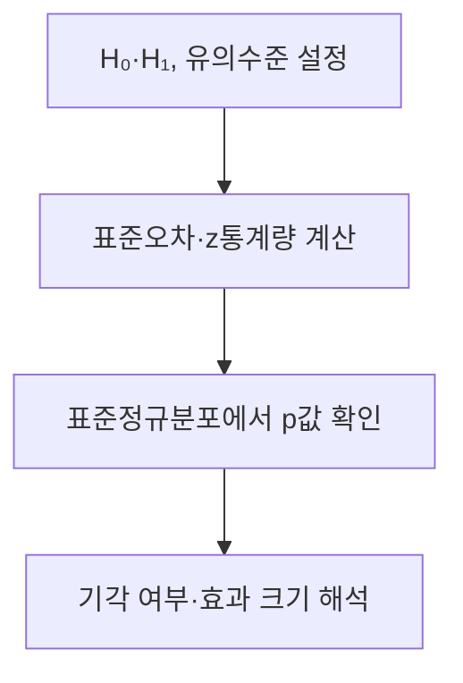
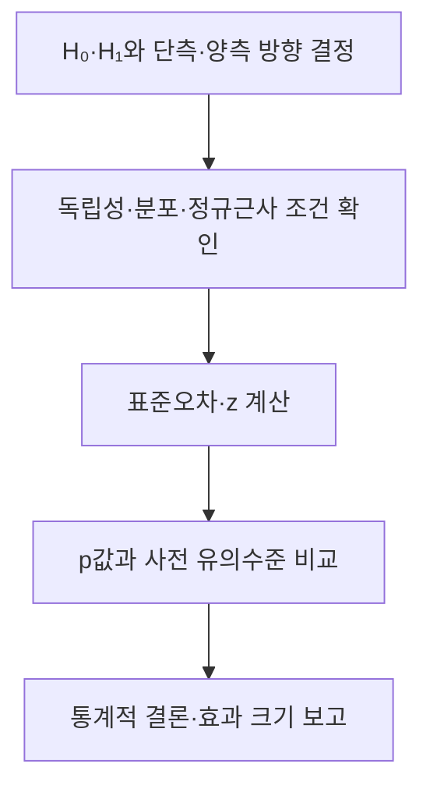

## 지식 로드맵 내 현재 위치

지식 위치: 자료처리·데이터 → 통계적 가설검정 → **z-검정**

## 30초 인출

- 본질: **z-검정**은 귀무가설 아래 표준화한 통계량을 표준정규분포와 비교해 평균·비율 등에 관한 가설을 평가하는 방법
- 메커니즘: 가설·검정 방향 설정 → 표준오차와 z통계량 계산 → p값 또는 임계값 비교 → 효과 크기와 함께 해석

핵심 용어

- **z-검정(z-test)** : 귀무가설 아래 정규분포를 따르거나 정규근사가 가능한 표준화 통계량으로 가설을 평가하는 검정
- **귀무가설(H₀)** : 검정의 기준으로 두는 주장
- **대립가설(H₁)** : 자료로 뒷받침하려는 다른 주장
- **표준오차(Standard Error)** : 표본 통계량이 표본추출에 따라 변동하는 정도
- **z통계량** : 귀무가설의 값과 표본 통계량의 차이를 표준오차로 나눈 값
- **p값(p-value)** : 귀무가설이 참일 때 관측 결과만큼 또는 더 극단적인 결과가 나올 확률
- **유의수준(α)** : 귀무가설이 참인데 기각하는 오류를 허용할 사전 기준
- **t-검정** : 평균 검정에서 모집단 분산을 모를 때 표본으로 분산을 추정하며 t분포를 사용하는 방법

---

## 1교시 예상문제 (10점)

> z-검정에 관하여 설명하시오. (예상·10점)

---

## 1교시 10점 답안

### Ⅰ. z-검정의 개요

| 구분 | 핵심 |
|---|---|
| 정의 | **z-검정**은 귀무가설 아래 표준화한 통계량을 표준정규분포와 비교해 평균·비율 등의 가설을 평가하는 방법 |
| 목적 | 관측한 차이가 귀무가설 아래의 표본 변동으로 설명되는지 판단 |

### Ⅱ. 검정 흐름

| 적용 예 | 확인할 조건 |
|---|---|
| 평균 검정 | 모집단 표준편차를 아는 경우의 정규성·표본 조건 |
| 비율 검정 | 정규근사가 가능한 표본 조건 |

### Ⅲ. 유의점

p값은 귀무가설이 참일 확률이 아님. 표본 크기만으로 검정 방법을 기계적으로 결정하지 않음.

---

## 2~4교시 예상문제 (25점)

> z-검정의 개념과 절차, 적용 조건 및 결과 해석의 유의점을 설명하시오. (예상·25점)

---

## 2~4교시 25점 답안

## Ⅰ. z-검정의 개요

| 구분 | 핵심 |
|---|---|
| 정의 | **z-검정**은 귀무가설 아래 표준화한 통계량을 표준정규분포와 비교해 평균·비율 등의 가설을 평가하는 방법 |
| 목적 | 관측한 차이가 귀무가설 아래의 표본 변동으로 설명되는지 판단 |

## Ⅱ. 적용 원리

| 구성 | 의미 |
|---|---|
| 관측한 차이 | 표본 통계량 − 귀무가설의 값 |
| 표준오차 | 귀무가설 아래 기대하는 표본 변동 |
| z통계량 | 관측한 차이 / 표준오차 |
| 기준 분포 | 귀무가설 아래의 표준정규분포 |

모평균을 검정하고 모집단 표준편차 σ를 아는 경우의 예: **z = (표본평균 − 가정 평균) / (σ / √n)**.

## Ⅲ. 검정 절차

| 단계 | 판단 |
|---|---|
| 검정 설계 | 보고 싶은 차이와 검정 방향을 자료 확인 전에 결정 |
| 계산 | 적용 조건에 맞는 표준오차 사용 |
| 해석 | p값·신뢰구간·실제 차이의 크기를 함께 제시 |

## Ⅳ. z-검정과 t-검정

| 구분 | z-검정 | t-검정 |
|---|---|---|
| 평균 검정의 전형적 조건 | 모집단 표준편차를 아는 경우 | 모집단 표준편차를 모르고 표본으로 추정 |
| 기준 분포 | 표준정규분포 | 자유도에 따른 t분포 |
| 선택 기준 | 통계량의 표본분포와 분산 정보 | 같은 조건 검토 |

큰 표본에서는 정규근사를 사용할 수 있는 상황이 있지만, **n이 특정 수 이상이면 언제나 z-검정**이라는 규칙은 없음.

## Ⅴ. 결과 해석

| 결과 | 말할 수 있는 것 | 말할 수 없는 것 |
|---|---|---|
| 작은 p값 | 귀무가설 아래 관측 결과가 드묾 | 귀무가설이 참일 확률 |
| 기각 | 설정한 유의수준에서 귀무가설에 반하는 증거 | 효과가 실무적으로 충분히 큼 |
| 기각하지 못함 | 자료만으로 기각할 근거 부족 | 두 집단이 완전히 같음 |

## Ⅵ. 한계와 대응

| 한계 | 대응 방안 |
|---|---|
| 독립성·정규근사 조건을 확인하지 않음 | 수집 방식과 통계량의 분포 조건 점검 |
| 표본 크기만 보고 검정 선택 | 분산 정보와 모형 가정을 함께 검토 |
| 유의성만으로 의사결정 | 차이의 크기·신뢰구간·업무 기준 제시 |

## Ⅶ. 기술사적 제언

실험·서비스 지표의 가설과 판단 기준을 분석 전에 정하고, 독립성·표준오차 계산 근거를 기록. 결과 보고에는 p값과 함께 관측 차이·신뢰구간을 제시.

## 연결 토픽

- 연관 토픽: [t-검정](./086_t_test.md), [중심극한정리](./014_central_limit_theorem.md)
