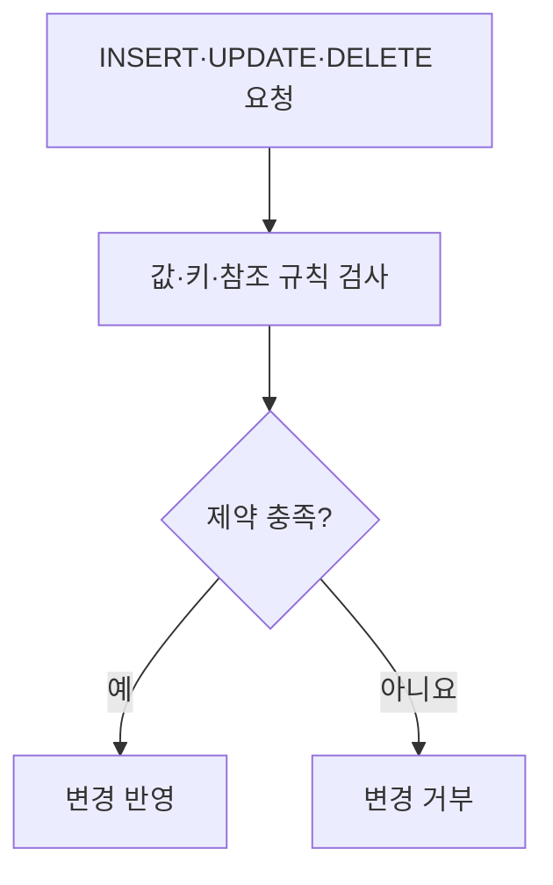
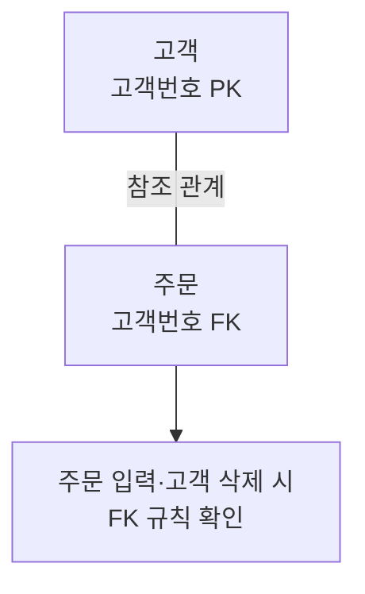

## 지식 로드맵 내 현재 위치

지식 위치: 자료처리·데이터 → 관계형 데이터베이스 → **무결성 제약**

## 30초 인출

- 본질: **무결성 제약**은 데이터베이스에 저장되는 값과 관계가 정해진 규칙을 지키도록 제한하는 조건
- 메커니즘: 값의 범위·행의 식별·테이블 간 참조 규칙 정의 → 입력·변경·삭제 시 검사 → 규칙 위반 거부 또는 지정한 참조 동작 수행

핵심 용어

- **무결성 제약(Integrity Constraint)** : 데이터 값과 관계가 허용된 규칙을 지키게 하는 데이터베이스 조건
- **도메인 무결성** : 컬럼 값이 형식·범위·허용값 규칙을 따르는 성질
- **개체 무결성** : 기본키가 각 행을 식별하며 NULL이 될 수 없는 성질
- **참조 무결성** : 외래키가 허용된 부모 행을 참조하거나 규칙에 따라 NULL이 되는 성질
- **PRIMARY KEY(기본키)** : 행을 유일하게 식별하는 키
- **FOREIGN KEY(외래키)** : 다른 테이블의 키를 참조하는 컬럼·컬럼 조합
- **CHECK 제약** : 컬럼·행이 지정한 조건을 만족하도록 검사하는 제약
- **ON DELETE CASCADE** : 참조 중인 부모 행 삭제 시 연결된 자식 행도 삭제하는 참조 동작

---

## 1교시 예상문제 (10점)

> 무결성 제약에 관하여 설명하시오. (예상·10점)

---

## 1교시 10점 답안

### Ⅰ. 무결성 제약의 개요

| 구분 | 핵심 |
|---|---|
| 정의 | **무결성 제약**은 데이터베이스에 저장되는 값과 관계가 정해진 규칙을 지키도록 제한하는 조건 |
| 목적 | 잘못된 값·중복 식별자·잘못된 참조의 저장 방지 |

### Ⅱ. 주요 유형

| 유형 | 지키는 규칙 | 구현 예 |
|---|---|---|
| 도메인 | 값의 형식·범위 | 타입·CHECK |
| 개체 | 행의 유일한 식별 | PRIMARY KEY |
| 참조 | 유효한 행 관계 | FOREIGN KEY |

### Ⅲ. 적용 구조

- 제언: 애플리케이션 검증과 별개로 DB에 반드시 지켜야 할 규칙을 명시.

---

## 2~4교시 예상문제 (25점)

> 무결성 제약의 개념과 유형을 설명하고, 데이터 변경 시 적용 및 관리 방안을 제시하시오. (예상·25점)

---

## 2~4교시 25점 답안

## Ⅰ. 무결성 제약의 개요

| 구분 | 핵심 |
|---|---|
| 정의 | **무결성 제약**은 데이터베이스에 저장되는 값과 관계가 정해진 규칙을 지키도록 제한하는 조건 |
| 목적 | 잘못된 값·중복 식별자·잘못된 참조의 저장 방지 |

## Ⅱ. 제약의 유형

| 유형 | 규칙 | 대표 DB 제약 | 예 |
|---|---|---|---|
| 도메인 | 값의 형식·범위·허용값 | 타입·NOT NULL·CHECK | 수량 ≥ 0 |
| 개체 | 행 식별자의 유일성·비NULL | PRIMARY KEY | 주문번호 |
| 참조 | 자식 행의 유효한 부모 참조 | FOREIGN KEY | 주문의 고객번호 |
| 업무 규칙 | 특정 업무 조건 | CHECK·애플리케이션·트랜잭션 | 상태별 변경 가능 조건 |

모든 업무 규칙을 단일 컬럼 제약으로 표현할 수 없으므로 규칙의 적용 위치와 책임을 구분.

## Ⅲ. 관계와 참조 동작

| 부모 행 변경·삭제 시 선택 | 의미 | 유의점 |
|---|---|---|
| 제한·거부 | 참조 중이면 변경 방지 | 삭제 전 처리 필요 |
| SET NULL | 참조를 비움 | FK가 NULL을 허용해야 함 |
| CASCADE | 관련 자식 행까지 변경·삭제 | 의도치 않은 연쇄 영향 검토 |

## Ⅳ. 제약 적용 흐름

| 단계 | 확인할 내용 |
|---|---|
| 모델링 | 필수값·기본키·외래키·업무 규칙 정의 |
| DB 구현 | 타입·키·CHECK·참조 동작 설정 |
| 변경·이관 | 기존 데이터 위반 여부와 정리 순서 확인 |
| 운영 | 제약 위반 원인·애플리케이션 메시지·성능 영향 검토 |

## Ⅴ. 애플리케이션 검증과 관계

| 위치 | 역할 |
|---|---|
| 애플리케이션 | 사용자에게 빠른 오류 안내와 업무 흐름 검증 |
| 데이터베이스 | 여러 경로로 들어오는 변경에 공통 불변 규칙 적용 |

애플리케이션만 검사하면 다른 입력 경로에서 규칙이 빠질 수 있음. DB 제약만으로 복잡한 업무 승인 절차가 모두 해결되지는 않음.

## Ⅵ. 한계와 대응

| 한계 | 대응 방안 |
|---|---|
| FK 없이 관계를 설명서에만 기록 | 핵심 참조 규칙의 DB 적용 여부 검토 |
| CASCADE의 영향 범위 미확인 | 삭제 시 자식 데이터와 복구 방안 확인 |
| 기존 데이터 위반을 방치하고 제약 추가 | 정제·검증·적용 순서 수립 |

## Ⅶ. 기술사적 제언

데이터 모델에서 필수값·식별자·참조 관계를 먼저 확정하고 핵심 규칙을 DB 제약으로 구현. 변경·이관 전 기존 데이터의 위반 건수와 참조 동작을 시험해 운영 사고를 줄임.

## 연결 토픽

- 연관 토픽: [ERD](./028_erd.md), [동시성 제어](./009_concurrency_control.md)
