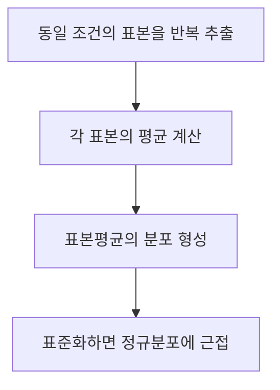
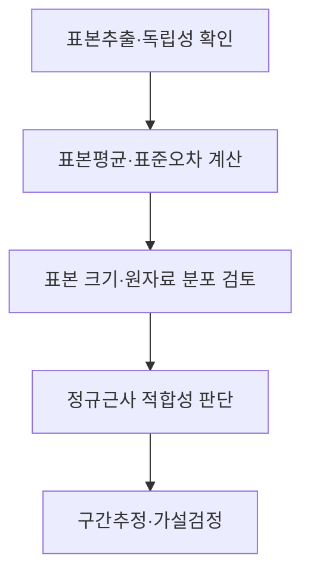

## 지식 로드맵 내 현재 위치

지식 위치: 자료처리·데이터 → 표본분포·통계추론 → **중심극한정리**

## 30초 인출

- 본질: **중심극한정리**는 일정한 조건에서 표본 크기가 커질수록 표준화한 표본평균의 분포가 정규분포에 가까워진다는 정리
- 메커니즘: 독립 표본의 평균 계산 → 반복 표본추출의 평균 분포 형성 → 표준오차로 표준화 → 정규근사

핵심 용어

- **중심극한정리(Central Limit Theorem, CLT)** : 일정한 조건에서 표준화한 표본합·평균의 분포가 표본 크기 증가에 따라 정규분포에 수렴한다는 정리
- **모평균 μ** : 모집단 값의 기대값
- **모분산 σ²** : 모집단 값이 모평균 주변에 흩어지는 정도
- **표본평균** : n개 표본값의 평균
- **표본분포** : 같은 방식으로 표본을 반복 추출할 때 통계량이 나타내는 분포
- **표준오차** : 표본평균의 표본 간 변동 크기; 독립·동일분포에서 σ/√n
- **정규근사** : 표본분포를 정규분포로 근사하여 확률·구간을 계산하는 방식
- **대수의 법칙(Law of Large Numbers)** : 표본평균이 표본 크기 증가에 따라 모평균에 가까워진다는 성질로, 분포 모양을 다루는 중심극한정리와 구분

---

## 1교시 예상문제 (10점)

> 중심극한정리에 관하여 설명하시오. (예상·10점)

---

## 1교시 10점 답안

### Ⅰ. 중심극한정리의 개요

| 구분 | 핵심 |
|---|---|
| 정의 | **중심극한정리**는 일정한 조건에서 표본 크기가 커질수록 표준화한 표본평균의 분포가 정규분포에 가까워진다는 정리 |
| 목적 | 표본평균의 분포를 근사해 신뢰구간·가설검정에 활용 |

### Ⅱ. 작동 구조

| 조건·결과 | 핵심 |
|---|---|
| 대표 조건 | 독립·동일분포, 유한한 평균·분산 |
| 표준오차 | σ/√n |

### Ⅲ. 유의점

원자료 자체가 정규분포로 바뀐다는 뜻이 아님. 정규근사에 필요한 표본 크기는 원자료 분포에 따라 달라짐.

---

## 2~4교시 예상문제 (25점)

> 중심극한정리의 개념과 성립 조건, 표본분포 및 통계추론에서의 활용을 설명하시오. (예상·25점)

---

## 2~4교시 25점 답안

## Ⅰ. 중심극한정리의 개요

| 구분 | 핵심 |
|---|---|
| 정의 | **중심극한정리**는 일정한 조건에서 표본 크기가 커질수록 표준화한 표본평균의 분포가 정규분포에 가까워진다는 정리 |
| 목적 | 표본평균의 분포를 근사해 신뢰구간·가설검정에 활용 |

## Ⅱ. 표본평균의 분포

| 항목 | 독립·동일분포 표본에서의 값 |
|---|---|
| 모집단 | 평균 μ, 분산 σ² |
| 표본평균의 평균 | μ |
| 표본평균의 분산 | σ²/n |
| 표준오차 | σ/√n |
| 표준화 통계량 | (표본평균 − μ) / (σ/√n) |

표본 크기가 커지면 표준화 통계량의 **분포**가 표준정규분포에 가까워짐. 표본평균의 평균·분산 식과 정규근사 조건을 구분.

## Ⅲ. 적용 흐름

| 확인할 조건 | 이유 |
|---|---|
| 독립성·표본추출 방식 | 의존 자료에서 표준오차가 달라질 수 있음 |
| 유한한 분산 | 대표적인 독립·동일분포 중심극한정리의 전제 |
| 왜도·두꺼운 꼬리 | 근사에 필요한 표본 크기에 영향 |

## Ⅳ. 활용과 범위

| 활용 | 중심극한정리의 역할 |
|---|---|
| 신뢰구간 | 표본평균의 변동을 정규분포로 근사 |
| 가설검정 | 귀무가설 아래 표본평균의 분포 근사 |
| 표본 설계 | 표준오차가 표본 크기의 제곱근에 반비례함을 파악 |

모집단 표준편차를 모를 때의 분산 추정, 복잡한 표본 설계, 작은 표본 문제는 별도로 검토.

## Ⅴ. 대수의 법칙과 구분

| 구분 | 중심극한정리 | 대수의 법칙 |
|---|---|---|
| 핵심 질문 | 표본평균의 분포 모양은? | 표본평균이 어디로 가는가? |
| 결과 | 적절히 표준화한 분포의 정규근사 | 모평균으로의 수렴 |

## Ⅵ. 한계와 대응

| 한계 | 대응 방안 |
|---|---|
| “n≥30이면 항상 정규”로 단정 | 왜도·꼬리·독립성·표본 크기 함께 확인 |
| 원자료가 정규가 된다고 오해 | 원자료와 표본평균의 분포를 구분 |
| 표본추출 편향을 근사로 해결하려 함 | 표본 대표성과 수집 절차 별도 검토 |

## Ⅶ. 기술사적 제언

| 적용 단계 | 검토 내용 | 판단 근거 |
|---|---|---|
| 표본 설계 확인 | 추출 방식·독립성·모집단 구조 확인 | 평균의 표집분포에 영향을 주는 조건 |
| 근사 판단 | 표준오차와 원자료 분포·왜도·꼬리 확인 | 정규근사 적용의 적절성 |
| 결과 해석 | 표본 크기만으로 결론을 고정하지 않고 조건·불확실성 병기 | 표본 설계와 근사 한계 |

## 검증 출처

- [Penn State 통계학과, 중심극한정리](https://online.stat.psu.edu/stat414/Lesson27) — 유한한 평균·분산과 표본 크기 조건.

## 연결 토픽

- 연관 토픽: [불편추정량](./011_unbiased_estimator.md), [z-검정](./012_z_test.md)
