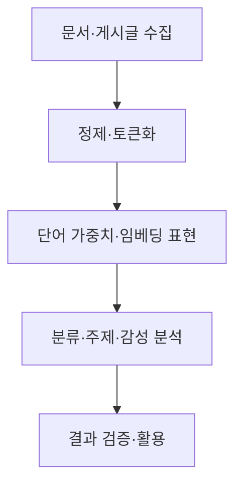
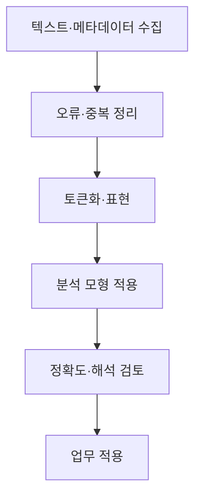

## 지식 로드맵 내 현재 위치

지식 위치: 자료처리·데이터 → 비정형 데이터 분석 → **텍스트 마이닝**

## 30초 인출

- 본질: **텍스트 마이닝**은 문서·문장에 담긴 패턴과 의미 있는 정보를 추출·분석하는 과정
- 메커니즘: 텍스트 수집 → 정제·단위화 → 특징 표현 → 분류·주제·관계 분석 → 결과 검증·활용

핵심 용어

- **텍스트 마이닝(Text Mining)** : 텍스트 자료에서 패턴·주제·관계 등 유용한 정보를 추출·분석하는 과정
- **NLP(Natural Language Processing, 자연어 처리)** : 컴퓨터가 인간 언어를 분석·생성하도록 하는 기술 분야
- **토큰화(Tokenization)** : 텍스트를 단어·형태소·문장 등 분석 단위로 나누는 처리
- **TF-IDF(Term Frequency–Inverse Document Frequency)** : 문서 안의 빈도와 문서 집합에서의 희소성을 반영하는 단어 가중치
- **임베딩(Embedding)** : 단어·문장 등을 유사성을 계산할 수 있는 숫자 벡터로 표현한 것
- **문서 분류** : 문서를 미리 정한 범주로 나누는 분석
- **토픽 모델링** : 문서 집합에서 함께 나타나는 단어 패턴을 통해 주제를 탐색하는 분석
- **감성 분석** : 텍스트에 나타난 의견·정서의 방향 등을 분석하는 작업

---

## 1교시 예상문제 (10점)

> 텍스트 마이닝에 관하여 설명하시오. (예상·10점)

---

## 1교시 10점 답안

### Ⅰ. 텍스트 마이닝의 개요

| 구분 | 핵심 |
|---|---|
| 정의 | **텍스트 마이닝**은 문서·문장에 담긴 패턴과 의미 있는 정보를 추출·분석하는 과정 |
| 목적 | 대량 텍스트의 주제·의견·관계를 파악해 검색·분류·의사결정에 활용 |

### Ⅱ. 기본 흐름

### Ⅲ. 대표 분석

| 작업 | 얻는 정보 |
|---|---|
| 문서 분류 | 문서의 범주 |
| 토픽 분석 | 자주 함께 나타나는 주제 |
| 감성 분석 | 의견·정서의 방향 |

- 제언: 텍스트의 맥락·도메인 용어와 분석 결과의 오류를 함께 확인.

---

## 2~4교시 예상문제 (25점)

> 텍스트 마이닝의 개념과 처리 절차, 주요 분석 기법 및 적용 시 한계를 설명하시오. (예상·25점)

---

## 2~4교시 25점 답안

## Ⅰ. 텍스트 마이닝의 개요

| 구분 | 핵심 |
|---|---|
| 정의 | **텍스트 마이닝**은 문서·문장에 담긴 패턴과 의미 있는 정보를 추출·분석하는 과정 |
| 목적 | 대량 텍스트의 주제·의견·관계를 파악해 검색·분류·의사결정에 활용 |

## Ⅱ. 처리 흐름

| 단계 | 주요 판단 |
|---|---|
| 수집 | 문서 출처·기간·이용 권한 |
| 전처리 | 인코딩·언어·도메인 용어 |
| 표현 | 빈도 기반·벡터 기반 방법 |
| 검증 | 실제 문서와 결과의 일치 여부 |

## Ⅲ. 텍스트 표현 방법

| 방법 | 표현 | 장점·한계 |
|---|---|---|
| 단어 빈도·**TF-IDF** | 문서별 단어 가중치 | 해석 쉬움, 문맥 반영 제한 |
| **임베딩** | 단어·문장의 벡터 | 의미 유사성 표현, 근거 해석 점검 필요 |

표현 방식은 분류·검색·주제 분석의 목표와 이용 가능한 자료량에 따라 선택.

## Ⅳ. 주요 분석 과제

| 과제 | 질문 | 적용 예 |
|---|---|---|
| 분류 | 어느 범주에 속하는가? | 민원 유형 분류 |
| 토픽 탐색 | 무슨 주제가 나타나는가? | 문서 집합의 이슈 파악 |
| 감성 분석 | 의견의 방향은 어떤가? | 고객 의견 요약 |
| 개체·관계 추출 | 어떤 이름·연결이 나타나는가? | 문서 내 기관·사건 관계 |

## Ⅴ. 결과 평가

| 평가 관점 | 확인할 내용 |
|---|---|
| 품질 | 정답 표본과 예측·추출 결과 비교 |
| 대표성 | 수집 문서가 분석 대상 전체를 반영하는지 |
| 해석 | 부정 표현·중의어·도메인 용어의 오해 여부 |

## Ⅵ. 한계와 대응

| 한계 | 대응 방안 |
|---|---|
| 오탈자·약어·도메인 용어로 분석 오류 | 사전·표본 검토와 도메인별 전처리 |
| 문맥·부정 표현을 놓침 | 실제 문장 단위 오류 분석·모형 비교 |
| 개인정보·권리 제약 | 수집·보관·이용 범위 확인 |

## Ⅶ. 기술사적 제언

| 적용 단계 | 수행 내용 | 품질 확인 |
|---|---|---|
| 과제 정의 | 분류·검색 등 업무 질문과 성공 기준 설정 | 결과가 지원할 업무 결정 |
| 데이터 준비 | 문서 출처·권리·전처리·라벨 기준 기록 | 표본의 대표성과 전처리 오류 |
| 결과 적용 | 대표 문서로 분석 결과를 검토하고 오류 유형별 보완 | 분류·검색 오류와 현업 수용성 |

## 검증 출처

- [scikit-learn 공식 문서, 텍스트 특징 추출](https://scikit-learn.org/stable/modules/feature_extraction.html#text-feature-extraction) — 토큰화·빈도·가중치 처리의 구현 사례.

## 연결 토픽

- 연관 토픽: [데이터 시각화](./016_data_visualization.md), [데이터 품질관리](./003_data_quality_management.md)
