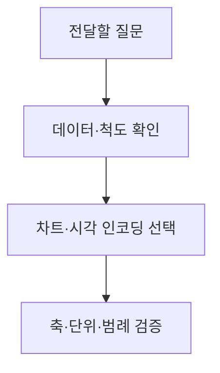
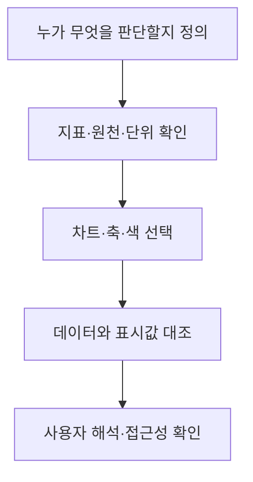

## 지식 로드맵 내 현재 위치

지식 위치: 자료처리·데이터 → 데이터 분석·전달 → **데이터 시각화**

## 30초 인출

- 본질: **데이터 시각화**는 데이터의 비교·추세·분포·관계를 위치·길이·색 등의 시각 요소로 표현해 이해와 판단을 돕는 방법
- 메커니즘: 전달할 질문 정의 → 데이터·척도 확인 → 관계에 맞는 차트 선택 → 축·범례·색 검증 → 사용자 해석 확인

핵심 용어

- **데이터 시각화(Data Visualization)** : 데이터의 수치·관계를 그래픽 요소로 표현해 패턴과 차이를 이해하게 하는 방법
- **시각 인코딩(Visual Encoding)** : 위치·길이·면적·색 등으로 데이터 값을 표현하는 방식
- **막대그래프** : 범주별 크기 비교에 적합한 차트
- **선그래프** : 시간에 따른 값의 변화를 연결해 보는 차트
- **산점도** : 두 수치형 변수의 관계·분포를 점으로 표현한 차트
- **히스토그램** : 수치형 값의 구간별 빈도로 분포를 보는 차트
- **대시보드(Dashboard)** : 목적에 맞는 여러 지표·차트를 한 화면에서 확인하도록 구성한 화면
- **접근성(Accessibility)** : 색 구분이 어려운 사람 등 다양한 사용자가 정보에 접근할 수 있게 하는 성질

---

## 1교시 예상문제 (10점)

> 데이터 시각화에 관하여 설명하시오. (예상·10점)

---

## 1교시 10점 답안

### Ⅰ. 데이터 시각화의 개요

| 구분 | 핵심 |
|---|---|
| 정의 | **데이터 시각화**는 데이터의 비교·추세·분포·관계를 시각 요소로 표현해 이해와 판단을 돕는 방법 |
| 목적 | 중요한 패턴·차이·이상현상의 빠른 파악과 근거 전달 |

### Ⅱ. 분석 질문과 차트

| 질문 | 차트 예 |
|---|---|
| 범주를 비교하는가? | 막대그래프 |
| 시간에 따라 변하는가? | 선그래프 |
| 값이 어떻게 퍼지는가? | 히스토그램 |
| 두 값이 함께 움직이는가? | 산점도 |

### Ⅲ. 제작 흐름

- 제언: 보기 좋은 장식보다 값의 차이와 관계를 정확히 읽을 수 있는 표현 우선.

---

## 2~4교시 예상문제 (25점)

> 데이터 시각화의 개념과 시각적 표현 방법, 차트 선정 및 왜곡 방지 방안을 설명하시오. (예상·25점)

---

## 2~4교시 25점 답안

## Ⅰ. 데이터 시각화의 개요

| 구분 | 핵심 |
|---|---|
| 정의 | **데이터 시각화**는 데이터의 비교·추세·분포·관계를 시각 요소로 표현해 이해와 판단을 돕는 방법 |
| 목적 | 중요한 패턴·차이·이상현상의 빠른 파악과 근거 전달 |

## Ⅱ. 시각 인코딩과 읽기

| 인코딩 | 나타내는 것 | 유의점 |
|---|---|---|
| 위치·길이 | 값의 크기·순서 | 기준축·단위 확인 |
| 색 | 범주·강도 | 색만으로 뜻을 구별하지 않도록 표시 |
| 면적 | 규모 | 면적 차이의 과장·오해 주의 |
| 연결·배치 | 흐름·관계 | 실제 관계와 방향에 맞게 사용 |

## Ⅲ. 질문별 차트 선택

| 분석 질문 | 차트 | 확인할 것 |
|---|---|---|
| 범주 비교 | 막대그래프 | 같은 기준·단위 |
| 시간 추세 | 선그래프 | 시간 간격·누락 |
| 값의 분포 | 히스토그램·상자그림 | 구간 폭·이상치 |
| 변수 관계 | 산점도 | 축 범위·상관과 인과 구분 |
| 부분과 전체 | 누적 막대·비율 차트 | 합계·범주 수 |

## Ⅳ. 제작·검증 절차

| 검증 대상 | 확인할 내용 |
|---|---|
| 데이터 | 집계 기준·기간·결측·이상치 |
| 표현 | 축 시작·범위·정렬·범례·단위 |
| 해석 | 차이가 과장되거나 인과처럼 보이지 않는지 |

## Ⅴ. 대시보드 구성

| 화면 요소 | 목적 |
|---|---|
| 핵심 지표 | 현재 상태와 목표 비교 |
| 추세·구성 차트 | 변화와 원인 후보 탐색 |
| 필터·상세 보기 | 부서·기간·대상별 차이 확인 |

한 화면에 모든 지표를 넣기보다 사용자의 결정에 필요한 지표를 먼저 배치.

## Ⅵ. 한계와 대응

| 한계 | 대응 방안 |
|---|---|
| 축 절단·면적 효과로 차이 과장 | 축·단위·기준값을 명확히 표시 |
| 색에만 의미를 의존 | 라벨·패턴·명도 차이 함께 제공 |
| 자료의 기준일·출처가 없음 | 원천·갱신 시점·집계 조건 표시 |

## Ⅶ. 기술사적 제언

| 설계 단계 | 적용 내용 | 검증 질문 |
|---|---|---|
| 질문·지표 선정 | 보여 줄 지표를 사용자의 의사결정 질문과 연결 | 이 지표가 어떤 비교·추세 판단을 돕는가? |
| 표현 선택 | 목적에 맞는 차트와 축·단위·집계 기준 적용 | 축 왜곡이나 집계로 오해를 만들지 않는가? |
| 사용자 검토 | 원자료와 차트 값을 대조하고 사용자가 핵심을 찾는지 확인 | 필요한 판단이 장식 없이 바로 읽히는가? |

## 검증 출처

- [NIST 통계 핸드북, 탐색적 데이터 분석](https://www.itl.nist.gov/div898/handbook/eda/eda.htm) — 그래프를 통한 데이터 구조·분포 탐색.

## 연결 토픽

- 연관 토픽: [텍스트 마이닝](./015_text_mining.md), [데이터 품질관리](./003_data_quality_management.md)
