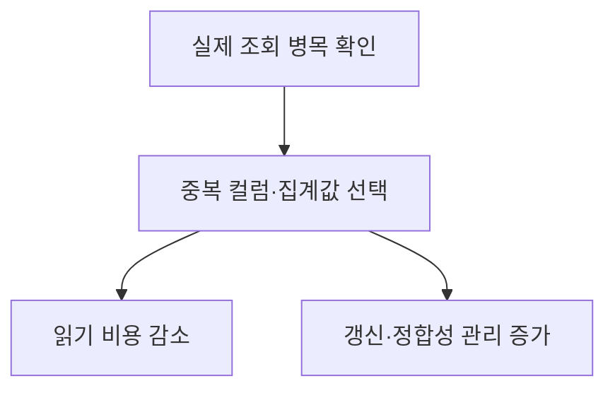
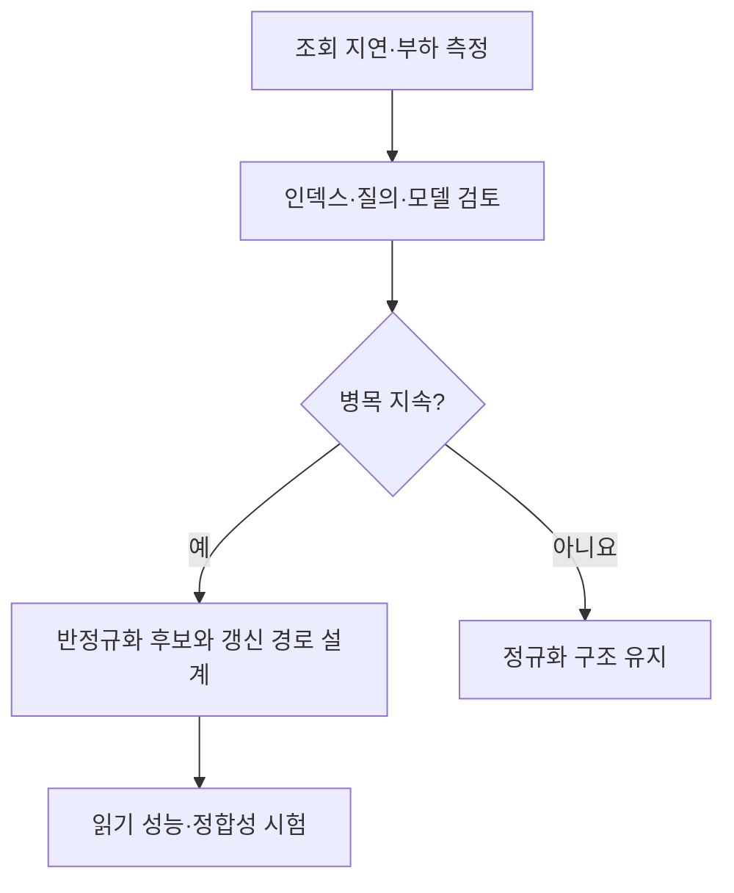

## 지식 로드맵 내 현재 위치

지식 위치: 자료처리·데이터 → 관계형 데이터 모델링 → **반정규화**

## 30초 인출

- 본질: **반정규화**는 조회 성능이나 처리 편의를 위해 정규화된 구조에 중복·미리 계산한 값을 의도적으로 추가하는 설계
- 메커니즘: 실제 조회 병목 확인 → 중복·집계 저장 방식 선택 → 갱신 경로·정합성 통제 → 성능과 유지비용 재측정

핵심 용어

- **반정규화(Denormalization)** : 조회 성능 등을 위해 데이터 중복이나 사전 계산을 의도적으로 허용하는 데이터 모델 설계
- **정규화(Normalization)** : 중복과 갱신 이상을 줄이도록 관계형 데이터를 분해하는 설계
- **중복 컬럼** : 조회를 위해 다른 테이블의 값을 함께 저장한 컬럼
- **파생·집계값** : 원본 데이터를 계산해 미리 저장한 값
- **갱신 이상(Update Anomaly)** : 중복된 값의 일부만 바뀌어 서로 다른 값이 남는 문제
- **조인(JOIN)** : 여러 테이블의 관련 행을 결합해 조회하는 연산
- **정합성** : 여러 위치에 표현된 같은 사실이 서로 일치하는 성질

---

## 1교시 예상문제 (10점)

> 반정규화에 관하여 설명하시오. (예상·10점)

---

## 1교시 10점 답안

### Ⅰ. 반정규화의 개요

| 구분 | 핵심 |
|---|---|
| 정의 | **반정규화**는 조회 성능이나 처리 편의를 위해 정규화된 구조에 중복·미리 계산한 값을 의도적으로 추가하는 설계 |
| 목적 | 빈번한 조회의 조인·집계 비용을 줄여 요구 성능 확보 |

### Ⅱ. 적용과 대가

| 방식 | 예 | 주의 |
|---|---|---|
| 중복 컬럼 | 주문에 고객 표시명 보관 | 고객명 변경 시 동기화 |
| 집계값 | 월별 합계 사전 저장 | 원본 변경 시 재계산 |

### Ⅲ. 적용 기준

정규화 모델을 기본으로 두고 인덱스·질의 개선 후에도 남는 병목에 적용. 읽기 이익과 갱신·정합성 비용을 함께 비교.

---

## 2~4교시 예상문제 (25점)

> 반정규화의 개념과 적용 유형, 성능·무결성의 절충 및 관리 방안을 설명하시오. (예상·25점)

---

## 2~4교시 25점 답안

## Ⅰ. 반정규화의 개요

| 구분 | 핵심 |
|---|---|
| 정의 | **반정규화**는 조회 성능이나 처리 편의를 위해 정규화된 구조에 중복·미리 계산한 값을 의도적으로 추가하는 설계 |
| 목적 | 빈번한 조회의 조인·집계 비용을 줄여 요구 성능 확보 |

## Ⅱ. 정규화와 반정규화의 관계

| 구분 | 정규화 | 반정규화 |
|---|---|---|
| 중심 | 중복·갱신 이상 감소 | 특정 조회 비용 감소 |
| 데이터 배치 | 사실을 적절한 테이블에 분리 | 읽기에 필요한 값 일부 중복 |
| 주요 관리 | 조인·조회 성능 | 중복값 갱신·정합성 |

반정규화는 정규화의 오류가 아니라 측정된 조회 요구를 위한 의도적 절충.

## Ⅲ. 적용 유형

| 유형 | 구조 | 읽기 이익 | 갱신 책임 |
|---|---|---|---|
| 테이블 통합 | 자주 함께 쓰는 데이터를 가까이 배치 | 일부 조인 감소 | 중복·범위 확대 점검 |
| 중복 컬럼 | 조회값 복사 저장 | 조회 경로 단축 | 원본 변경과 동기화 |
| 파생·집계값 | 계산 결과 미리 저장 | 반복 계산 감소 | 재계산·대사 |

테이블 분할·파티셔닝은 성능 설계 수단일 수 있으나 중복을 만드는 반정규화와 항상 같은 개념은 아님.

## Ⅳ. 적용 판단 흐름

| 판단 축 | 확인할 내용 |
|---|---|
| 조회 | 빈도·지연·조인·집계 비용 |
| 갱신 | 원본 변경 빈도·동기화 방식 |
| 일관성 | 실시간 일치 필요 여부·허용 지연 |

## Ⅴ. 정합성 통제

| 위험 | 통제 |
|---|---|
| 일부 중복값만 갱신 | 한 트랜잭션에서 함께 갱신하거나 동기화 절차 정의 |
| 비동기 반영 지연 | 허용 지연·재처리·대사 기준 설정 |
| 집계값과 원본 불일치 | 정기 재계산·차이 탐지 |

## Ⅵ. 한계와 대응

| 한계 | 대응 방안 |
|---|---|
| 근거 없는 선제 반정규화 | 실제 조회·갱신 부하부터 측정 |
| 읽기 성능만 평가 | 쓰기 비용·저장량·정합성도 시험 |
| 원본 데이터의 주체 불명확 | 원본·파생값 소유와 갱신 경로 명시 |

## Ⅶ. 기술사적 제언

| 검토 단계 | 실행 내용 | 운영 통제 |
|---|---|---|
| 대상 선정 | 느린 대표 조회와 병목을 확인하고 인덱스·쿼리 개선과 비교 | 측정 환경·기준선 기록 |
| 구조 변경 | 중복·집계 데이터와 원본 데이터의 관계·갱신 책임 지정 | 갱신 누락·경합 점검 |
| 효과 검증 | 실제 부하에서 조회 성능과 데이터 정합성 비교 | 효과가 없는 중복 구조의 재검토 |

## 검증 출처

- [IBM Db2 공식 문서, 정규화와 설계 선택](https://www.ibm.com/docs/en/i/7.4.0?topic=design-normalization) — 정규화 수준과 조회 성능의 균형.

## 연결 토픽

- 연관 토픽: [정규화](./019_normalization.md), [DB 파티셔닝·샤딩](./021_db_partitioning_sharding.md)
