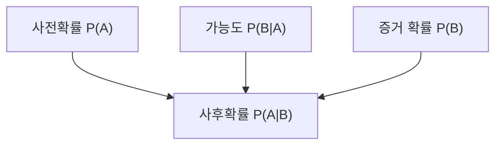
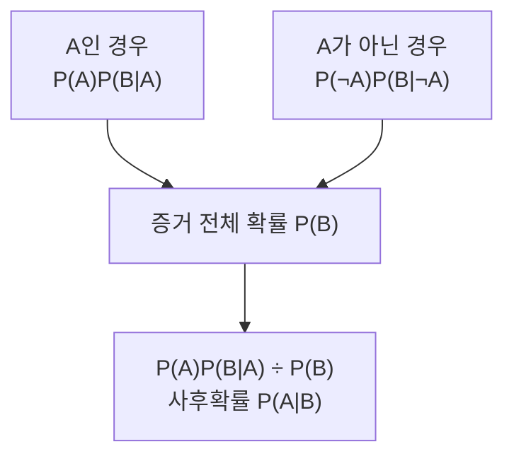

## 지식 로드맵 내 현재 위치

지식 위치: 자료처리·데이터 → 확률·통계 → **베이즈 정리**

## 30초 인출

- 본질: **베이즈 정리**는 사건의 사전확률과 관측 증거의 가능도를 결합해 증거를 본 뒤의 조건부확률을 구하는 공식
- 메커니즘: 사전확률 설정 → 증거가 각 경우에 나타날 확률 확인 → 증거 전체 확률로 정규화 → 사후확률 계산

핵심 용어

- **베이즈 정리(Bayes' Theorem)** : 조건부확률을 뒤집어 증거를 관측한 뒤의 사건 확률을 구하는 공식
- **사전확률(Prior Probability)** : 새로운 증거를 보기 전 사건의 확률
- **가능도(Likelihood)** : 사건이 참일 때 관측 증거가 나타날 확률
- **사후확률(Posterior Probability)** : 증거를 관측한 뒤 사건이 참일 조건부확률
- **증거 확률(Evidence Probability)** : 관측 증거가 나타날 전체 확률
- **조건부확률** : 한 사건이 일어났다는 조건 아래 다른 사건의 확률
- **기저율(Base Rate)** : 특정 사건이 전체에서 발생하는 기본 비율
- **나이브 베이즈(Naive Bayes)** : 주어진 분류에서 특징들의 조건부 독립을 가정해 베이즈 정리를 적용하는 분류 방법

---

## 1교시 예상문제 (10점)

> 베이즈 정리에 관하여 설명하시오. (예상·10점)

---

## 1교시 10점 답안

### Ⅰ. 베이즈 정리의 개요

| 구분 | 핵심 |
|---|---|
| 정의 | **베이즈 정리**는 사전확률과 증거의 가능도로 증거를 본 뒤의 조건부확률을 구하는 공식 |
| 목적 | 새로운 증거를 반영해 사건의 확률을 갱신 |

### Ⅱ. 구성과 공식

**P(A|B) = P(B|A) × P(A) / P(B)**, 단 P(B) > 0.

### Ⅲ. 해석

| 요소 | 뜻 |
|---|---|
| A | 알고 싶은 사건 |
| B | 관측한 증거 |
| P(A|B) | B를 본 뒤 A가 참일 확률 |

기저율 P(A)을 빼고 검사·탐지의 정확도만으로 사후확률을 판단하지 않음.

---

## 2~4교시 예상문제 (25점)

> 베이즈 정리의 개념과 계산 원리, 조건부확률 갱신 및 적용 시 유의점을 설명하시오. (예상·25점)

---

## 2~4교시 25점 답안

## Ⅰ. 베이즈 정리의 개요

| 구분 | 핵심 |
|---|---|
| 정의 | **베이즈 정리**는 사전확률과 증거의 가능도로 증거를 본 뒤의 조건부확률을 구하는 공식 |
| 목적 | 새로운 증거를 반영해 사건의 확률을 갱신 |

## Ⅱ. 공식과 구성

| 항목 | 의미 |
|---|---|
| P(A) | 증거 전 A의 확률, 사전확률 |
| P(B|A) | A가 참일 때 B를 볼 가능도 |
| P(B) | B를 볼 전체 확률 |
| P(A|B) | B를 본 뒤 A의 사후확률 |

**P(A|B) = P(B|A)P(A)/P(B)**. B가 A 또는 A가 아닌 경우에서 나타난다면 **P(B) = P(B|A)P(A) + P(B|¬A)P(¬A)**.

## Ⅲ. 확률 갱신 흐름

| 판단 질문 | 확인할 것 |
|---|---|
| 사건은 얼마나 흔한가? | P(A) |
| A일 때 증거가 얼마나 자주 나오는가? | P(B|A) |
| A가 아닐 때도 증거가 나오는가? | P(B|¬A) |

## Ⅳ. 기저율의 영향

| 상황 | 사후확률에 미치는 영향 |
|---|---|
| A가 드묾 | 양성 증거가 있어도 A가 아닐 가능성이 클 수 있음 |
| 거짓 양성이 많음 | P(B)의 A 이외 부분이 커짐 |
| 사전확률이 달라짐 | 같은 증거에서도 사후확률이 달라짐 |

검사의 민감도인 P(B|A)와 양성일 때 실제 사건일 확률 P(A|B)는 다른 값.

## Ⅴ. 정보관리 분야 활용

| 활용 | 베이즈 정리의 역할 |
|---|---|
| 스팸 분류 | 단어·특징을 본 뒤 스팸 확률 갱신 |
| 이상 탐지 | 경고·패턴을 본 뒤 실제 사건 가능성 평가 |
| 의사결정 | 새 증거에 따라 기존 가정을 수정 |

나이브 베이즈의 특징 독립 가정은 분류 계산을 단순하게 하는 추가 가정이며 베이즈 정리 자체의 조건은 아님.

## Ⅵ. 한계와 대응

| 한계 | 대응 방안 |
|---|---|
| 사전확률을 무시 | 관측 대상의 기저율 확인 |
| 가능도 값을 다른 집단에서 가져옴 | 적용 집단·수집 조건 비교 |
| P(B|A)를 P(A|B)로 혼동 | 사전확률과 증거 전체 확률까지 계산 |

## Ⅶ. 기술사적 제언

| 운영 판단 | 적용 내용 | 재검토 조건 |
|---|---|---|
| 확률 산정 | 기저율·민감도·거짓 양성률로 사후확률 계산 | 입력 확률의 출처와 산정 집단 |
| 경고 기준 설정 | 사후확률과 오탐·미탐 비용을 함께 고려 | 업무 비용과 대응 역량 |
| 기준 갱신 | 실제 운영 빈도와 판정 결과를 반영해 확률 재산정 | 집단·환경 변화와 오탐·미탐 추이 |

## 연결 토픽

- 연관 토픽: [z-검정](./012_z_test.md), [이상치](./010_outlier.md)
