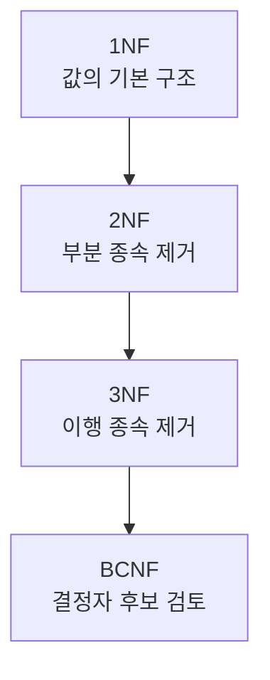
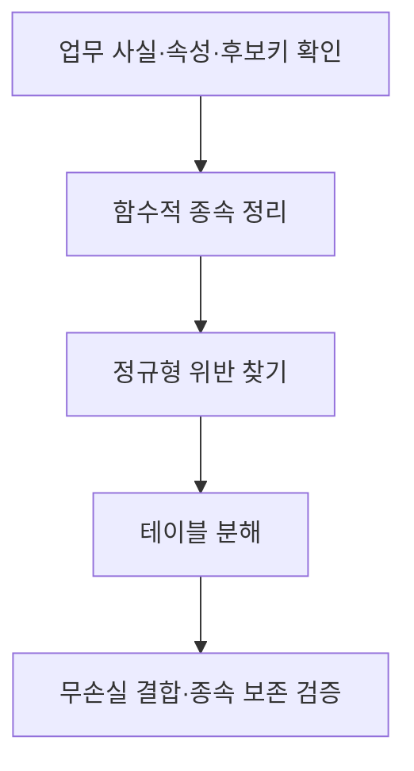

## 지식 로드맵 내 현재 위치

지식 위치: 자료처리·데이터 → 관계형 데이터 모델링 → **정규화**

## 30초 인출

- 본질: **정규화**는 데이터의 함수적 종속관계를 분석해 테이블을 분해함으로써 중복과 삽입·수정·삭제 이상을 줄이는 설계 방법
- 메커니즘: 키·종속관계 파악 → 정규형 위반 확인 → 관계 분해 → 무손실 결합·필요한 종속관계 보존 검토

핵심 용어

- **정규화(Normalization)** : 관계형 테이블의 종속관계에 따라 구조를 분해해 중복·갱신 이상을 줄이는 설계
- **함수적 종속(Functional Dependency)** : X 값이 같으면 Y 값도 같다는 관계, X → Y
- **후보키(Candidate Key)** : 행을 유일하게 식별하는 최소 속성 집합
- **삽입·수정·삭제 이상** : 중복·혼합된 사실 때문에 데이터 변경 시 불일치·정보 손실이 생기는 현상
- **1NF(제1정규형)** : 각 속성값을 관계형 모델에서 하나의 값으로 다루는 형태
- **2NF(제2정규형)** : 1NF에서 비주요 속성의 후보키 일부에 대한 부분 종속을 없앤 형태
- **3NF(제3정규형)** : 2NF에서 비주요 속성의 키에 대한 이행 종속을 제거한 형태
- **BCNF(Boyce–Codd Normal Form)** : 모든 비자명한 함수적 종속의 결정자가 슈퍼키인 정규형
- **무손실 분해** : 분해한 관계들을 다시 조인했을 때 원래의 관계를 복원할 수 있는 성질

---

## 1교시 예상문제 (10점)

> 정규화에 관하여 설명하시오. (예상·10점)

---

## 1교시 10점 답안

### Ⅰ. 정규화의 개요

| 구분 | 핵심 |
|---|---|
| 정의 | **정규화**는 함수적 종속관계에 따라 테이블을 분해해 중복과 삽입·수정·삭제 이상을 줄이는 설계 방법 |
| 목적 | 데이터의 일관성과 변경 용이성 확보 |

### Ⅱ. 주요 정규형

### Ⅲ. 분해 확인

| 기준 | 질문 |
|---|---|
| 무손실 결합 | 분해한 테이블을 조인하면 원래 정보를 복원하는가? |
| 종속관계 보존 | 필요한 업무 규칙을 분해 후에도 검사할 수 있는가? |

- 제언: 정규형 이름만 맞추지 말고 실제 중복·갱신 이상과 조인 결과를 확인.

---

## 2~4교시 예상문제 (25점)

> 정규화의 개념과 정규형별 기준, 관계 분해의 효과 및 설계 시 고려사항을 설명하시오. (예상·25점)

---

## 2~4교시 25점 답안

## Ⅰ. 정규화의 개요

| 구분 | 핵심 |
|---|---|
| 정의 | **정규화**는 함수적 종속관계에 따라 테이블을 분해해 중복과 삽입·수정·삭제 이상을 줄이는 설계 방법 |
| 목적 | 데이터의 일관성과 변경 용이성 확보 |

## Ⅱ. 중복과 이상현상

| 이상현상 | 발생 모습 |
|---|---|
| 삽입 | 한 사실을 기록하려면 관계없는 다른 사실도 필요 |
| 수정 | 같은 사실이 여러 행에 있어 일부만 바뀜 |
| 삭제 | 한 사실을 지우다 다른 필요한 사실도 사라짐 |

이상현상의 원인은 관련 없는 사실이 같은 테이블에 반복 저장되는 구조.

## Ⅲ. 정규형과 분해 기준

| 정규형 | 확인할 종속 | 설계 방향 |
|---|---|---|
| **1NF** | 속성값의 기본 단위 | 반복 항목·다중값 분리 |
| **2NF** | 복합 후보키의 일부 → 비주요 속성 | 부분 종속 분리 |
| **3NF** | 키 → 중간 속성 → 비주요 속성 | 이행 종속 분리 |
| **BCNF** | 비자명한 X → Y에서 X가 슈퍼키인가? | 위반 결정자 분리 |

3NF·BCNF의 정확한 판정은 후보키·주요 속성과 함수적 종속을 모두 확인해야 함.

## Ⅳ. 정규화 절차

| 검증 | 이유 |
|---|---|
| 무손실 결합 | 조인 시 잘못된 행이 생기거나 원래 정보가 사라지는지 확인 |
| 종속 보존 | 분해 후에도 중요한 업무 규칙을 검사할 수 있는지 확인 |
| 실제 질의 | 변경 일관성과 조회 비용의 절충 검토 |

## Ⅴ. 반정규화와 관계

| 설계 | 주된 목표 | 고려할 대가 |
|---|---|---|
| 정규화 | 중복·갱신 이상 감소 | 일부 조회에서 조인 증가 |
| 반정규화 | 측정된 조회 병목 완화 | 중복값 갱신·정합성 관리 |

정규화를 기본 구조로 설계하고 성능 문제가 확인된 경우 반정규화의 필요성을 검토.

## Ⅵ. 한계와 대응

| 한계 | 대응 방안 |
|---|---|
| 함수적 종속을 업무 확인 없이 추정 | 업무 규칙·키·실제 데이터로 검증 |
| 분해 후 조인으로 원본 복원 불가 | 무손실 결합 조건 확인 |
| 정규형만 보고 성능 무시 | 주요 질의·갱신 부하 시험 |

## Ⅶ. 기술사적 제언

| 설계 단계 | 검토·조치 | 통과 기준 |
|---|---|---|
| 종속성 분석 | 사실과 후보키·함수 종속 관계를 명시 | 중복·갱신 이상을 만드는 종속성 식별 |
| 릴레이션 분해 | 정규형에 맞춰 분해하고 업무 규칙 반영 | 무손실 결합과 필요한 종속성 보존 |
| 운영 확인 | 대표 조회·갱신 성능 측정 후 필요한 곳에만 반정규화 검토 | 정합성과 성능의 균형 |

## 검증 출처

- [IBM Db2 공식 문서, 데이터베이스 정규화](https://www.ibm.com/docs/en/db2-for-zos/12.0.0?topic=modeling-normalization-in-database-design).

## 연결 토픽

- 연관 토픽: [반정규화](./017_denormalization.md), [4NF·5NF](./033_4nf_5nf.md)
