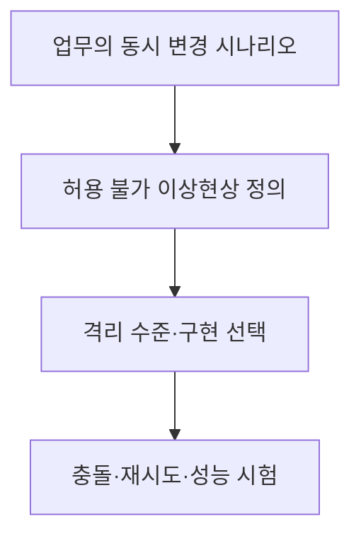
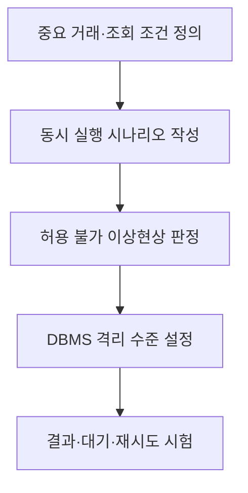

## 지식 로드맵 내 현재 위치

지식 위치: 자료처리·데이터 → 트랜잭션 동시성 → **트랜잭션 격리 수준**

## 30초 인출

- 본질: **트랜잭션 격리 수준**은 동시에 실행되는 트랜잭션이 서로의 변경을 어느 정도 관찰할 수 있는지 정하는 기준
- 메커니즘: 업무가 허용하지 않는 읽기·쓰기 이상현상 정의 → 격리 수준 선택 → DBMS의 실제 구현·재시도·성능 검증

핵심 용어

- **트랜잭션 격리 수준(Isolation Level)** : 동시 실행 시 트랜잭션 사이에 보이는 변경과 허용되는 이상현상의 범위
- **Dirty Read(더티 읽기)** : 다른 트랜잭션의 미확정 변경을 읽는 현상
- **Nonrepeatable Read(반복 불가능 읽기)** : 같은 행을 다시 읽었을 때 다른 트랜잭션의 확정 변경으로 값이 달라지는 현상
- **Phantom Read(팬텀 읽기)** : 같은 조건으로 다시 조회할 때 해당 행 집합이 달라지는 현상
- **Serialization Anomaly(직렬화 이상)** : 동시 실행 결과가 어떤 직렬 실행 결과와도 같지 않은 현상
- **Read Committed** : 확정된 값만 읽도록 하는 기본적인 격리 수준
- **Repeatable Read** : 한 트랜잭션에서 이미 읽은 행의 반복 읽기를 보호하는 격리 수준
- **Serializable** : 확정된 동시 실행 결과가 어떤 직렬 실행과 동등하도록 하는 격리 수준
- **Snapshot Isolation** : 트랜잭션이 일정 시점의 데이터 버전을 읽는 격리 방식으로, 직렬가능성과는 구분

---

## 1교시 예상문제 (10점)

> 트랜잭션 격리 수준에 관하여 설명하시오. (예상·10점)

---

## 1교시 10점 답안

### Ⅰ. 트랜잭션 격리 수준의 개요

| 구분 | 핵심 |
|---|---|
| 정의 | **트랜잭션 격리 수준**은 동시 실행 중 다른 트랜잭션의 변경을 어느 정도 관찰할 수 있는지 정하는 기준 |
| 목적 | 업무가 허용하지 않는 이상현상을 막으면서 필요한 동시 처리 성능 확보 |

### Ⅱ. 표준 격리 수준

| 수준 | 주로 막는 현상 |
|---|---|
| Read Uncommitted | 미확정 읽기 허용 가능 |
| Read Committed | Dirty Read 방지 |
| Repeatable Read | Dirty·Nonrepeatable Read 방지 |
| Serializable | 직렬 실행과 동등한 결과 |

### Ⅲ. 선택 흐름

- 제언: 수준 이름만 믿지 말고 사용 DBMS에서 실제 동시 실행 결과를 확인.

---

## 2~4교시 예상문제 (25점)

> 트랜잭션 격리 수준의 개념과 표준 수준별 이상현상을 비교하고, DBMS 적용 시 고려사항을 설명하시오. (예상·25점)

---

## 2~4교시 25점 답안

## Ⅰ. 트랜잭션 격리 수준의 개요

| 구분 | 핵심 |
|---|---|
| 정의 | **트랜잭션 격리 수준**은 동시 실행 중 다른 트랜잭션의 변경을 어느 정도 관찰할 수 있는지 정하는 기준 |
| 목적 | 업무가 허용하지 않는 이상현상을 막으면서 필요한 동시 처리 성능 확보 |

## Ⅱ. 동시 실행 이상현상

| 현상 | 발생 모습 |
|---|---|
| Dirty Read | 취소될 수 있는 미확정 값을 읽음 |
| Nonrepeatable Read | 같은 행을 두 번 읽을 때 값이 달라짐 |
| Phantom Read | 같은 조건의 재조회에서 행 집합이 달라짐 |
| Serialization Anomaly | 동시 실행 결과가 어떤 직렬 순서와도 맞지 않음 |

## Ⅲ. 표준 격리 수준별 최소 보호

| 수준 | Dirty | Nonrepeatable | Phantom | 직렬화 이상 |
|---|---|---|---|---|
| Read Uncommitted | 허용 | 허용 | 허용 | 가능 |
| Read Committed | 차단 | 허용 | 허용 | 가능 |
| Repeatable Read | 차단 | 차단 | 표준상 허용 | 가능 |
| Serializable | 차단 | 차단 | 차단 | 차단 |

표준 표는 **최소 보호 수준**. 제품은 더 강한 보장을 제공하거나 특정 수준을 다른 방식으로 구현할 수 있음.

## Ⅳ. 격리 수준 선택 절차

| 판단 축 | 확인할 내용 |
|---|---|
| 정합성 | 금전·재고·중복 신청 등 허용할 수 없는 결과 |
| 동시성 | 잠금 대기·충돌·재시도 부담 |
| 구현 | 제품의 기본값·MVCC·잠금·예외 처리 |

## Ⅴ. DBMS 구현 차이

| 예 | 의미 |
|---|---|
| PostgreSQL의 Read Uncommitted | 실제로 Read Committed처럼 동작 |
| PostgreSQL의 Repeatable Read | 표준 최소 수준보다 강하게 팬텀 읽기도 방지 |
| Snapshot Isolation | 일관된 스냅샷을 읽어도 직렬화 이상이 가능할 수 있음 |

격리 수준과 **동시성 제어 기법**은 서로 다른 개념. 같은 수준도 잠금·MVCC 구현과 충돌 처리 방식이 다를 수 있음.

## Ⅵ. 한계와 대응

| 한계 | 대응 방안 |
|---|---|
| 표준 표를 모든 제품의 실제 동작으로 간주 | 사용하는 DBMS 문서와 동시 실행 시험 확인 |
| 높은 수준만 설정하고 실패 재시도 누락 | 직렬화 실패·교착상태의 재시도 설계 |
| 읽기 이상만 확인하고 업무 규칙 위반 방치 | 복수 행·범위 갱신 시나리오 검증 |

## Ⅶ. 기술사적 제언

| 적용 단계 | 설계·시험 | 확인 기준 |
|---|---|---|
| 업무 기준 | 허용할 수 없는 동시 실행 결과를 구체 사례로 정의 | 업무 불변조건과 허용 가능한 대기 |
| 격리 선택 | DBMS의 기본 격리 수준과 잠금·버전 처리 확인 | 선택 수준에서 발생 가능한 읽기·쓰기 이상 |
| 부하 검증 | 재시도·오류 처리를 포함한 동시 부하 시험 | 정합성, 교착, 처리량과 응답시간 |

## 검증 출처

- [PostgreSQL 공식 문서: Transaction Isolation](https://www.postgresql.org/docs/current/transaction-iso.html)
- [Microsoft Learn: Transaction Isolation Levels](https://learn.microsoft.com/en-us/sql/t-sql/language-elements/transaction-isolation-levels)

## 연결 토픽

- 연관 토픽: [동시성 제어](./009_concurrency_control.md), [무결성 제약](./013_integrity_constraint.md)
