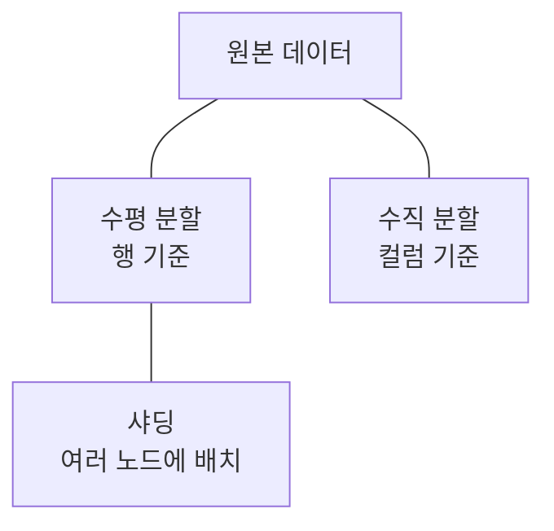
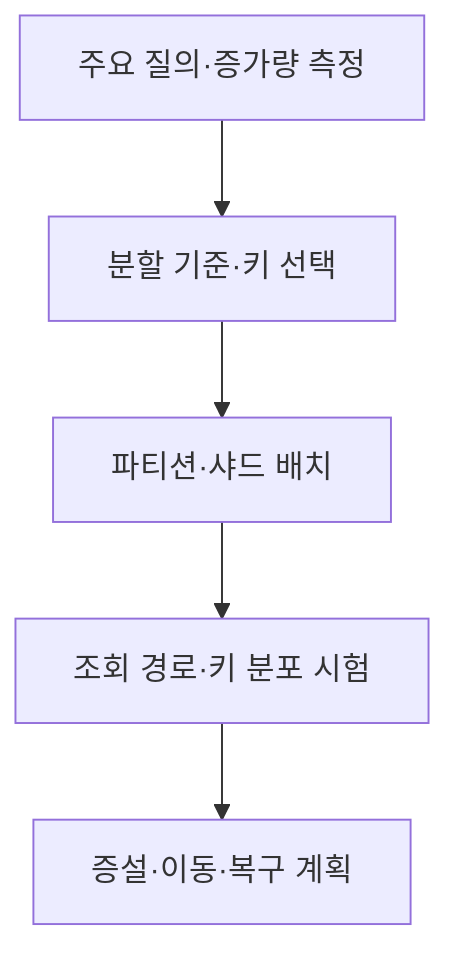

## 지식 로드맵 내 현재 위치

지식 위치: 자료처리·데이터 → 데이터베이스 저장 구조 → **파티셔닝·샤딩**

## 30초 인출

- 본질: **파티셔닝**은 데이터를 기준에 따라 부분으로 나누는 설계이고, **샤딩**은 보통 나눈 데이터를 여러 노드에 분산하는 방식
- 메커니즘: 조회·데이터 증가 패턴 확인 → 분할 기준·키 결정 → 데이터 배치·라우팅 → 쏠림·쿼리·재분배 검증

핵심 용어

- **파티셔닝(Partitioning)** : 테이블이나 데이터 집합을 관리·처리 단위로 나누는 방식
- **수평 분할** : 행을 범위·해시·목록 등의 기준으로 나누는 방식
- **수직 분할** : 자주 함께 쓰는 컬럼 등의 특성에 따라 컬럼을 나누는 방식
- **샤딩(Sharding)** : 수평 분할한 데이터를 여러 데이터베이스 노드에 분산 배치하는 방식
- **파티션 키** : 행을 어느 파티션에 둘지 결정하는 값
- **파티션 프루닝(Partition Pruning)** : 질의 조건에 맞지 않는 파티션을 읽기 대상에서 제외하는 최적화
- **핫 파티션** : 특정 파티션에 읽기·쓰기 부하가 지나치게 집중된 상태
- **리밸런싱(Rebalancing)** : 노드·부하 변화에 따라 데이터 분산을 다시 조정하는 작업

---

## 1교시 예상문제 (10점)

> 데이터베이스 파티셔닝과 샤딩에 관하여 설명하시오. (예상·10점)

---

## 1교시 10점 답안

### Ⅰ. 파티셔닝·샤딩의 개요

| 구분 | 핵심 |
|---|---|
| 정의 | **파티셔닝**은 데이터를 부분으로 나누는 설계이며, **샤딩**은 수평 분할한 데이터를 여러 노드에 분산 배치하는 방식 |
| 목적 | 데이터량·접근 패턴에 맞춘 조회·운영·확장성 관리 |

### Ⅱ. 분할 형태

| 설계 | 기준 |
|---|---|
| 수평 | 날짜·고객·해시 등 행 구분 |
| 수직 | 컬럼 접근·보안·크기 |
| 샤딩 | 분할 키와 노드별 배치 |

### Ⅲ. 유의점

키 쏠림·노드 간 조인·재분배 비용을 확인. **복제**는 데이터를 여러 곳에 중복 보관하는 것으로 분할·샤딩과 목적이 다름.

---

## 2~4교시 예상문제 (25점)

> 데이터베이스 파티셔닝과 샤딩의 개념·유형·설계 절차 및 운영상 고려사항을 설명하시오. (예상·25점)

---

## 2~4교시 25점 답안

## Ⅰ. 파티셔닝·샤딩의 개요

| 구분 | 핵심 |
|---|---|
| 정의 | **파티셔닝**은 데이터를 부분으로 나누는 설계이며, **샤딩**은 수평 분할한 데이터를 여러 노드에 분산 배치하는 방식 |
| 목적 | 데이터량·접근 패턴에 맞춘 조회·운영·확장성 관리 |

## Ⅱ. 분할 유형

| 유형 | 나누는 기준 | 주된 효과 | 검토할 한계 |
|---|---|---|---|
| 수평 분할 | 행·범위·해시 | 일부 파티션만 조회·관리 | 키 분포·범위 변경 |
| 수직 분할 | 컬럼·접근 패턴 | 큰 컬럼·접근 권한 분리 | 다시 결합할 때 비용 |
| 샤딩 | 수평 분할 + 노드 분산 | 저장·처리 부하 분산 | 라우팅·노드 간 연산 |

단일 DBMS 내부 파티션과 여러 노드에 나눈 샤드는 구별.

## Ⅲ. 파티션 키·배치 설계

| 기준 | 확인할 내용 |
|---|---|
| 질의 | WHERE 조건이 분할 키를 이용하는가? |
| 분포 | 특정 값·시점에 쓰기가 몰리는가? |
| 증가 | 오래된 데이터·새 데이터의 크기가 어떻게 변하는가? |
| 운영 | 노드·파티션을 늘릴 때 데이터를 어떻게 옮기는가? |

## Ⅳ. 조회·운영 흐름

| 작업 | 파티셔닝·샤딩의 영향 |
|---|---|
| 단일 파티션 조회 | 조건이 맞으면 읽는 범위 축소 가능 |
| 여러 파티션 집계 | 결과 병합·네트워크 비용 발생 |
| 노드 장애 | 복제·복구 구성에 따라 가용성 결정 |
| 재분배 | 이동 중 쓰기·조회 일관성 관리 필요 |

분할만으로 장애 대비가 완성되지 않으며 복제·백업은 별도로 설계.

## Ⅴ. 분할과 복제 비교

| 구분 | 분할·샤딩 | 복제 |
|---|---|---|
| 데이터 배치 | 서로 다른 데이터를 나눠 둠 | 같은 데이터를 여러 곳에 둠 |
| 주된 목적 | 용량·부하 분산 | 장애 대응·읽기 확장 |
| 핵심 한계 | 쏠림·분산 질의 | 동기화 지연·충돌 |

## Ⅵ. 한계와 대응

| 한계 | 대응 방안 |
|---|---|
| 핫 파티션 | 키 분포·시간대 부하 측정 후 분할 기준 조정 |
| 키 없는 질의가 모든 샤드를 조회 | 주요 질의의 라우팅 조건 검토 |
| 노드 증설 때 데이터 이동 계획 부재 | 리밸런싱·중단·롤백 시험 |

## Ⅶ. 기술사적 제언

| 설계 단계 | 평가 내용 | 운영 준비 |
|---|---|---|
| 키 후보 선정 | 실제 질의 조건·쓰기 분포에 맞춰 후보 키 비교 | 파티션 프루닝과 키 쏠림 |
| 분할 시험 | 대표 조회·갱신으로 노드 간 요청과 핫스폿 측정 | 부하·지연·확장 여유 |
| 운영 계획 | 데이터 재분배와 장애 복구 절차 정의 | 재배치 중 가용성과 복구 검증 |

## 연결 토픽

- 연관 토픽: [NoSQL](./001_nosql.md), [데이터 복제](./126_data_replication.md)
