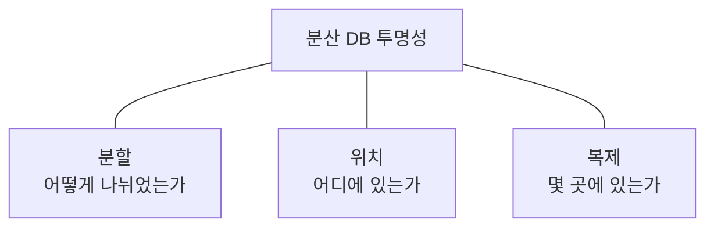
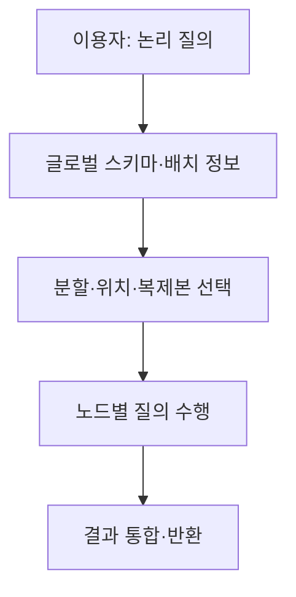

## 지식 로드맵 내 현재 위치

지식 위치: 자료처리·데이터 → 분산 데이터베이스 → **분산 데이터베이스 투명성**

## 30초 인출

- 본질: **분산 DB 투명성**은 데이터가 여러 노드에 나뉘거나 복제되어 있어도 이용자가 분산 구조의 세부 위치·배치를 매번 알지 않고 접근할 수 있게 하는 성질
- 메커니즘: 논리 데이터 요청 → 분할·위치·복제 메타데이터로 실제 대상 결정 → 노드 간 조회·결과 통합

핵심 용어

- **분산 데이터베이스(Distributed Database)** : 여러 노드에 배치된 데이터를 논리적으로 함께 관리하는 데이터베이스
- **분산 투명성(Distribution Transparency)** : 이용자가 데이터의 분산 배치 세부 사항을 의식하지 않고 논리적으로 접근할 수 있는 성질
- **분할 투명성(Fragmentation Transparency)** : 데이터가 어떻게 조각났는지 몰라도 전체를 조회할 수 있는 성질
- **위치 투명성(Location Transparency)** : 어느 노드에 데이터가 있는지 몰라도 접근할 수 있는 성질
- **복제 투명성(Replication Transparency)** : 복제본의 존재·선택을 이용자가 직접 관리하지 않아도 되는 성질
- **글로벌 스키마(Global Schema)** : 분산 데이터의 논리적 전체 구조를 표현한 스키마
- **분산 질의 처리** : 여러 노드에 필요한 작업을 보내고 결과를 합쳐 질의에 응답하는 처리

---

## 1교시 예상문제 (10점)

> 분산 데이터베이스 투명성에 관하여 설명하시오. (예상·10점)

---

## 1교시 10점 답안

### Ⅰ. 분산 DB 투명성의 개요

| 구분 | 핵심 |
|---|---|
| 정의 | **분산 DB 투명성**은 여러 노드에 나뉘거나 복제된 데이터를 분산 구조의 세부 배치를 의식하지 않고 접근할 수 있게 하는 성질 |
| 목적 | 논리적 데이터 접근의 일관성과 분산 구조 변경의 영향 감소 |

### Ⅱ. 주요 종류

### Ⅲ. 작동

| 이용자 | DBMS 내부 |
|---|---|
| 논리적 테이블·질의 사용 | 분할·위치·복제 정보 확인 후 노드에 작업 전달 |

- 제언: 투명성의 편리함과 분산 질의·복제 동기화 비용을 함께 평가.

---

## 2~4교시 예상문제 (25점)

> 분산 데이터베이스 투명성의 개념과 유형, 구현 구조 및 운영상 한계를 설명하시오. (예상·25점)

---

## 2~4교시 25점 답안

## Ⅰ. 분산 DB 투명성의 개요

| 구분 | 핵심 |
|---|---|
| 정의 | **분산 DB 투명성**은 여러 노드에 나뉘거나 복제된 데이터를 분산 구조의 세부 배치를 의식하지 않고 접근할 수 있게 하는 성질 |
| 목적 | 논리적 데이터 접근의 일관성과 분산 구조 변경의 영향 감소 |

## Ⅱ. 유형

| 유형 | 숨기는 배치 정보 | 내부에서 필요한 처리 |
|---|---|---|
| 분할 투명성 | 데이터의 조각 구분 | 질의 대상 조각 식별·결과 합침 |
| 위치 투명성 | 조각이 있는 노드 | 노드 라우팅 |
| 복제 투명성 | 복제본의 존재·선택 | 읽기 대상·갱신 전파 |

분할·위치·복제는 서로 다른 관점이며 제품·구성에 따라 제공 범위가 다름.

## Ⅲ. 논리 질의와 물리 배치

| 계층 | 역할 |
|---|---|
| 논리 | 테이블·속성·질의의 공통 관점 |
| 배치 메타데이터 | 분할 키·노드·복제본 정보 |
| 실행 | 노드별 연산·결과 병합 |

## Ⅳ. 구현·운영 고려사항

| 대상 | 확인할 것 |
|---|---|
| 질의 계획 | 필요한 노드만 읽는지, 노드 간 데이터 이동은 얼마나 되는지 |
| 복제 | 읽기 최신성·갱신 전파·충돌 처리 |
| 구조 변경 | 분할·노드 이동 시 배치 정보 갱신 |
| 장애 | 일부 노드 실패 때 결과의 완전성·오류 처리 |

투명성은 분산 비용이나 장애를 없애는 보장이 아님.

## Ⅴ. 투명성의 효과와 절충

| 효과 | 절충 |
|---|---|
| 이용자가 물리 노드에 덜 의존 | 내부 라우팅·메타데이터 관리 필요 |
| 분산 배치 변경 영향 감소 | 노드 간 통신·질의 최적화 비용 |
| 복제본 선택 단순화 | 최신성·정합성 정책 확인 필요 |

## Ⅵ. 한계와 대응

| 한계 | 대응 방안 |
|---|---|
| 투명성 때문에 느린 분산 질의가 숨겨짐 | 실제 노드별 실행 계획·통신량 확인 |
| 복제본이 늘면 최신성도 자동 보장된다고 가정 | 읽기·쓰기 일관성 수준 검증 |
| 노드 장애 시 전체 결과를 당연히 기대 | 부분 실패·재시도·오류 정책 시험 |

## Ⅶ. 기술사적 제언

| 대상 | 적용 내용 | 확인 기준 |
|---|---|---|
| 이용자 화면 | 위치·분할 구조를 감춘 논리 스키마와 일관된 질의 인터페이스 제공 | 위치 변경 후에도 응용 질의의 수정 범위 |
| 운영 관측 | 질의별 접근 노드·통신량·복제 지연 기록 | 분산 실행 비용과 데이터 최신성 |
| 장애·변경 시험 | 노드 장애와 데이터 재배치 시나리오 실행 | 서비스 연속성과 투명성의 예외·경계 |

## 연결 토픽

- 연관 토픽: [DB 파티셔닝·샤딩](./021_db_partitioning_sharding.md), [데이터 복제](./126_data_replication.md)
