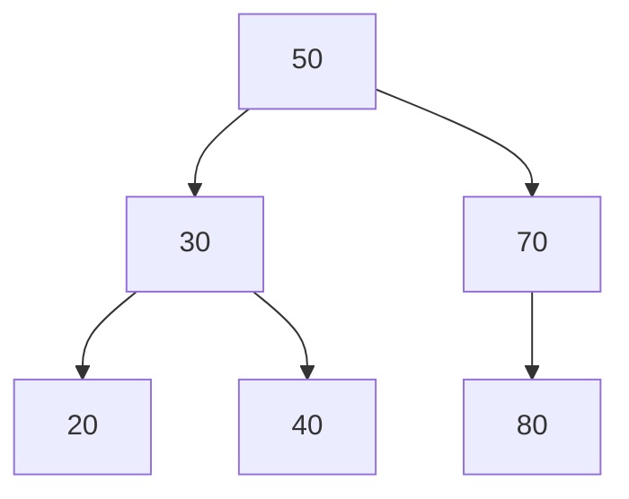

## 지식 로드맵 내 현재 위치

지식 위치: 자료처리·데이터 → 자료구조 → **이진 탐색 트리(BST)**

## 30초 인출

- 본질: **BST(Binary Search Tree)**는 왼쪽 서브트리 키가 작고 오른쪽 서브트리 키가 큰 순서를 유지하는 이진 트리
- 메커니즘: 키 비교 → 좌·우 중 한 서브트리로 이동 → 원하는 키 또는 삽입 위치 확인, **중위 순회(In-order Traversal)** 시 오름차순 출력
- 효과: 동적 키 탐색·갱신에 활용, 높이 제한이 필요하면 **자가 균형 트리(AVL·Red-Black Tree)** 검토

핵심 용어

- **BST(Binary Search Tree)**: 왼쪽 자식 < 부모 < 오른쪽 자식 순서 관계를 유지하는 이진트리
- **In-order Traversal(중위 순회)**: `Left → Root → Right` 순으로 노드를 방문하여 오름차순 키를 추출하는 기법
- **Skewed Tree(편향 트리)**: 정렬된 데이터 연속 삽입으로 트리가 선형 리스트화되어 높이가 N이 된 상태
- **AVL Tree**: 좌우 서브트리의 높이 차(Balance Factor)를 1 이하로 엄격히 제한하는 자가 균형 트리
- **Red-Black Tree**: 노드 색상과 5가지 규칙으로 완화된 균형을 유지하며 O(log N)을 보장하는 트리

---

## 1교시 예상문제 (10점)

> 이진 탐색 트리(BST)에 관하여 설명하시오. (예상·10점)

---

## 1교시 10점 답안

### Ⅰ. BST의 개요

| 구분 | 핵심 |
|---|---|
| 정의 | **BST(Binary Search Tree)** 는 왼쪽 서브트리의 키보다 크고 오른쪽 서브트리의 키보다 작은 부모 키를 갖는 이진 트리 |
| 목적 | 키의 순서 관계를 이용한 탐색·삽입·삭제 |

### Ⅱ. 핵심 구조와 순회

- 중위 순회는 `Left → Root → Right`로 방문하여 키를 오름차순으로 출력한다.

### Ⅲ. 연산·균형 통제

- **편향 방지**: 정렬 키 연속 유입 시 AVL 또는 **Red-Black Tree**의 균형 조정으로 높이를 제한
- 삭제 무결성: 자식 2개 노드 삭제 시 **In-order Successor** 승계로 불변식 보존
- 한 줄 제언: 입력 순서에 따라 높이가 커질 수 있는 운영 인덱스에는 자가 균형 트리를 적용해 최악 탐색시간을 제한
---

## 2~4교시 예상문제 (25점)

> 이진 탐색 트리(BST)의 순서 불변식과 탐색·삽입·삭제 메커니즘을 설명하고, 입력 순서가 트리 높이와 연산 성능에 미치는 영향을 제시하시오. (25점, 예상)

---

## 2~4교시 25점 답안

## Ⅰ. 정렬 불변식 기반의 탐색, BST의 개요

> BST의 연산 시간은 트리 높이에 비례하며, 균형 시 평균 O(log n), 편향 시 O(n)까지 저하됨.

| 구분 | 핵심 |
|---|---|
| 정의 | **BST(Binary Search Tree)** 는 왼쪽 서브트리의 키보다 크고 오른쪽 서브트리의 키보다 작은 부모 키를 갖는 이진 트리 |
| 목적 | 키의 순서 관계를 이용한 탐색·삽입·삭제 |

## Ⅱ. BST 구조 및 주요 연산 메커니즘

> 삽입·삭제 후에도 `Left < Node < Right` 규칙이 보존되어야 하며, 자식 2개 노드 삭제 시의 대체자 선정이 무결성의 핵심이다.

- 중위 순회 시 `20 → 30 → 40 → 50 → 70 → 80` 오름차순 출력

| 연산 | 평균 복잡도 | 최악 복잡도 | 핵심 통제 요소 |
|---|---|---|---|
| **Search** | O(log N) | O(N) | 키 비교 연산 일관성 유지 |
| **Insert** | O(log N) | O(N) | 중복 키 정책(불허/카운팅/덮어쓰기) |
| **Delete** | O(log N) | O(N) | **In-order Successor**(우측 서브트리 최솟값) 대체 무결성 |

## Ⅲ. BST, AVL Tree, Red-Black Tree의 비교

> 기본 BST는 입력 순서에 따라 편향될 수 있으므로, 최악 탐색시간 제한이 필요한 경우 자가 균형 트리 등 높이 제어 구조를 검토한다.

| 비교 항목 | 기본 BST | AVL Tree | Red-Black Tree |
|---|---|---|---|
| **균형 조건** | 균형 보장 메커니즘 없음 | `|Left Height - Right Height| ≤ 1` | 루트/리프 Black, Red 연속 불가 등 5규칙 |
| **최악 탐색 비용** | O(N) (선형 퇴보) | **O(log N)** (엄격한 균형) | **O(log N)** (완화된 균형) |
| **삽입/삭제 회전** | 회전 없음 | 빈번한 회전 (최대 O(log N) 회전) | 최대 2회 회전(삽입), 최대 3회 회전(삭제) |
| **주요 적합 영역** | 키 입력이 무작위인 기초 실습 | 탐색 연산 비중이 압도적인 읽기 중심 뷰 | 삽입·삭제·탐색이 균등한 프로덕션 컨테이너(C++ map) |

## Ⅳ. 편향 트리의 한계·대응책

> 시계열 ID나 정렬 로그가 연속 인입되면 트리가 단일 연결 리스트화되므로, 데이터 유입 특성에 맞춘 구조적 방어가 요구된다.

| 위험 | 대책 | 효과 |
|---|---|---|
| **Skewed Tree (편향 트리)** | **Red-Black Tree** 적용 또는 대량 적재 시 중간값 분할 빌드 | 최악 시간복잡도 O(log N) 보장 |
| **메모리 단편화** | 노드 풀링(Node Pooling) 기법 또는 블록 단위 B-Tree 전환 | 포인터 오버헤드 감소 및 캐시 지역성 향상 |
| **동시성 충돌** | 노드 단위 세밀한 잠금(Fine-grained Lock) 또는 Lock-free 적용 | 멀티스레드 환경 트리 포인터 오염 방지 |

## Ⅴ. 기술사적 제언 — 균형 통제

| 한계 | 해결 방안 |
|---|---|
| 입력 순서와 탐색·갱신 비율을 고려하지 않고 트리 구현을 일괄 선택함 | 입력 순서가 예측 가능하거나 최악 탐색시간 제한이 필요한 인덱스에는 자가 균형 트리 우선 검토, 소규모 정적 데이터에는 기본 BST와 비용 비교 |

## 연결 토픽

- 연관 토픽: [데이터베이스 파티셔닝·샤딩](./021_db_partitioning_sharding.md), [B 트리](./111_b_tree.md)
