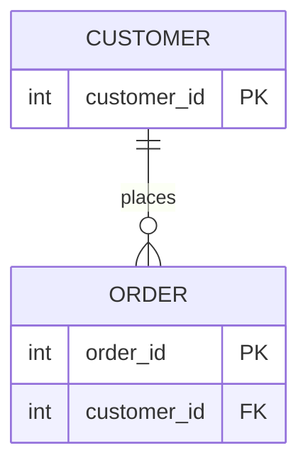
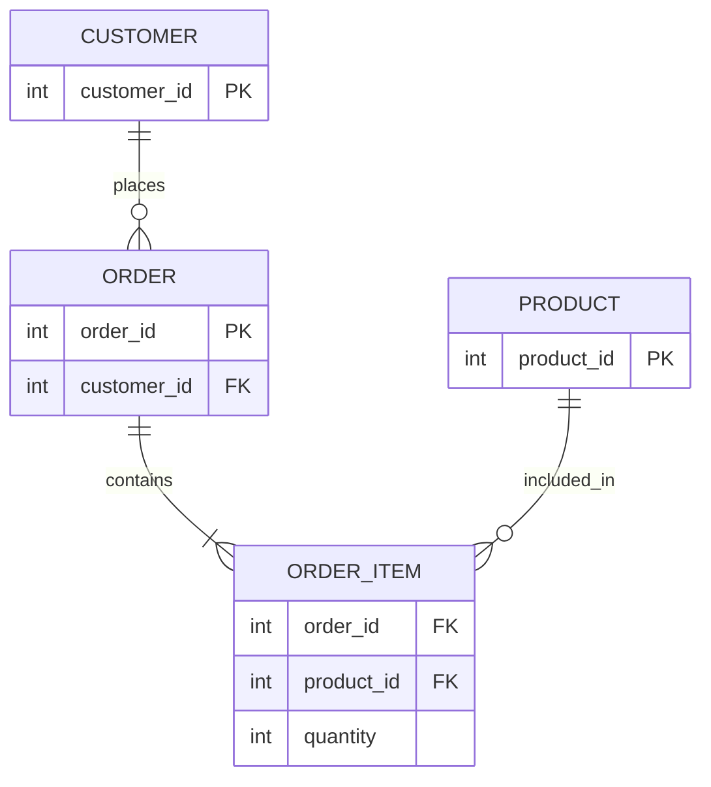
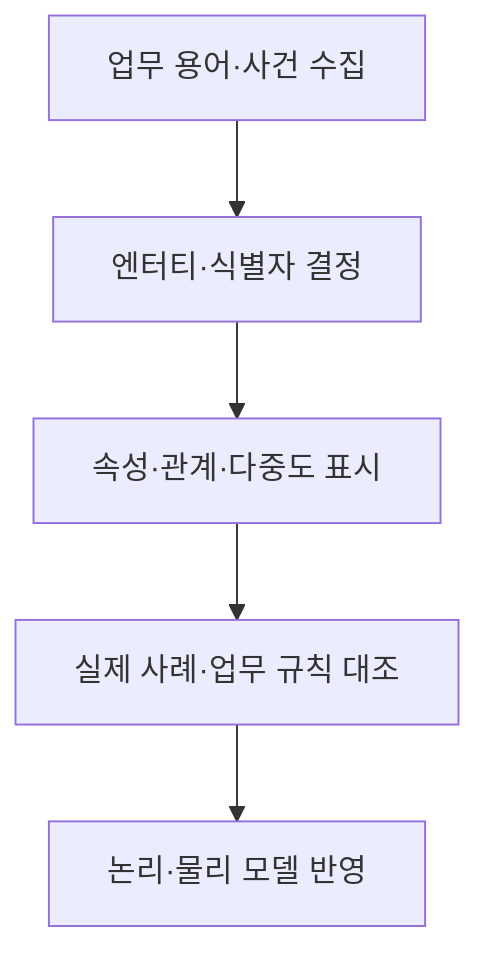

## 지식 로드맵 내 현재 위치

지식 위치: 자료처리·데이터 → 데이터 모델링 → **ERD**

## 30초 인출

- 본질: **ERD**는 업무에서 관리할 엔터티와 각 엔터티의 속성·관계를 그림으로 표현한 데이터 모델
- 메커니즘: 업무 대상 식별 → 속성·식별자 정의 → 엔터티 간 관계·선택성·다중도 표시 → 업무 사례로 검증

핵심 용어

- **ERD(Entity-Relationship Diagram, 개체 관계도)** : 엔터티·속성·관계를 시각적으로 표현한 데이터 모델
- **엔터티(Entity)** : 업무에서 관리할 수 있는 사람·사물·사건 등의 개체 유형
- **속성(Attribute)** : 엔터티의 특성을 기록하는 항목
- **식별자(Identifier)** : 엔터티의 각 인스턴스를 구별하는 속성·속성 조합
- **관계(Relationship)** : 엔터티 인스턴스 사이의 업무상 연결
- **다중도(Cardinality)** : 관계에서 한 인스턴스에 연결될 수 있는 다른 인스턴스의 수
- **선택성(Optionality)** : 관계가 반드시 있어야 하는지의 여부
- **외래키(Foreign Key)** : 다른 테이블의 식별자를 참조하는 속성
- **교차 엔터티(Associative Entity)** : 다대다 관계를 별도 엔터티로 표현한 구조

---

## 1교시 예상문제 (10점)

> ERD에 관하여 설명하시오. (예상·10점)

---

## 1교시 10점 답안

### Ⅰ. ERD의 개요

| 구분 | 핵심 |
|---|---|
| 정의 | **ERD**는 업무에서 관리할 엔터티와 각 엔터티의 속성·관계를 그림으로 표현한 데이터 모델 |
| 목적 | 업무 데이터의 구조·규칙을 이해관계자와 공유하고 DB 설계의 근거 마련 |

### Ⅱ. 핵심 구성

| 요소 | 그림에서 나타내는 것 |
|---|---|
| 엔터티·속성 | 고객·주문과 각각의 식별자 |
| 관계·다중도 | 고객 한 명과 주문 여러 건의 연결 |

### Ⅲ. 검증

업무 사례로 필수·선택 관계, 식별자, 실제 다중도를 확인. 표기법의 기호 의미도 함께 명시.

---

## 2~4교시 예상문제 (25점)

> ERD의 개념과 구성요소, 작성 절차 및 논리 데이터 모델 검증 방안을 설명하시오. (예상·25점)

---

## 2~4교시 25점 답안

## Ⅰ. ERD의 개요

| 구분 | 핵심 |
|---|---|
| 정의 | **ERD**는 업무에서 관리할 엔터티와 각 엔터티의 속성·관계를 그림으로 표현한 데이터 모델 |
| 목적 | 업무 데이터의 구조·규칙을 이해관계자와 공유하고 DB 설계의 근거 마련 |

## Ⅱ. 구성요소

| 요소 | 표현 내용 | 점검 질문 |
|---|---|---|
| 엔터티 | 관리할 대상·사건 | 독립적으로 식별·관리하는가? |
| 속성 | 대상의 특성 | 뜻·형식·필수 여부가 분명한가? |
| 식별자 | 개별 인스턴스 구분 | 중복·NULL 가능성을 검토했는가? |
| 관계 | 엔터티 사이의 업무 규칙 | 연결의 의미와 방향이 맞는가? |
| 다중도·선택성 | 1:1, 1:N, 필수·선택 | 실제 업무 사례와 일치하는가? |

## Ⅲ. 관계 표현 예

| 관계 | 의미 |
|---|---|
| 고객–주문 | 고객 한 명은 주문이 없거나 여러 건일 수 있음 |
| 주문–주문항목 | 주문 한 건은 한 개 이상의 주문항목으로 구성 |
| 상품–주문항목 | 상품 하나가 여러 주문항목에 등장할 수 있음 |

주문과 상품의 다대다 관계는 주문항목 같은 교차 엔터티로 표현.

## Ⅳ. 작성·검증 흐름

| 검증 대상 | 확인할 내용 |
|---|---|
| 업무 규칙 | 필수 관계·예외·생명주기 |
| 무결성 | 키·외래키·참조 동작 |
| 정규화 | 중복·종속관계·갱신 이상 |

## Ⅴ. ERD와 물리 DB 설계

| 논리 ERD | 물리 구현 |
|---|---|
| 엔터티·속성·관계의 업무 의미 | 테이블·컬럼·키·인덱스 |
| 다중도·필수성 | 외래키·NULL·제약조건 |

ERD는 업무 구조를 설명하는 모델이며 그림만으로 모든 물리 제약과 성능 설계가 완료되지는 않음.

## Ⅵ. 한계와 대응

| 한계 | 대응 방안 |
|---|---|
| 관계선만 있고 업무 규칙 설명이 없음 | 관계 이름·선택성·다중도와 사례 기록 |
| 식별자·참조 관계가 실제 DB와 다름 | 논리·물리 모델과 제약조건 대조 |
| 다대다 관계를 그대로 물리 테이블화 | 교차 엔터티와 연결 속성 검토 |

## Ⅶ. 기술사적 제언

| 설계 검증 | 실행 내용 | 산출·확인 |
|---|---|---|
| 사례 대입 | 화면·보고서의 실제 거래 사례를 엔터티·관계에 대입 | 관계와 다중도의 누락·과잉 여부 |
| 규칙 구현 | 확정한 키·참조 규칙을 DB 제약과 연결 | ERD와 물리 스키마의 일치 |
| 변경 관리 | 업무·스키마 변경 때 ERD와 제약을 함께 갱신 | 문서·구현 간 차이 |

## 검증 출처

- Peter P. Chen, [The Entity-Relationship Model: Toward a Unified View of Data](https://doi.org/10.1145/320434.320440), *ACM TODS*, 1976.

## 연결 토픽

- 연관 토픽: [무결성 제약](./013_integrity_constraint.md), [정규화](./019_normalization.md)
