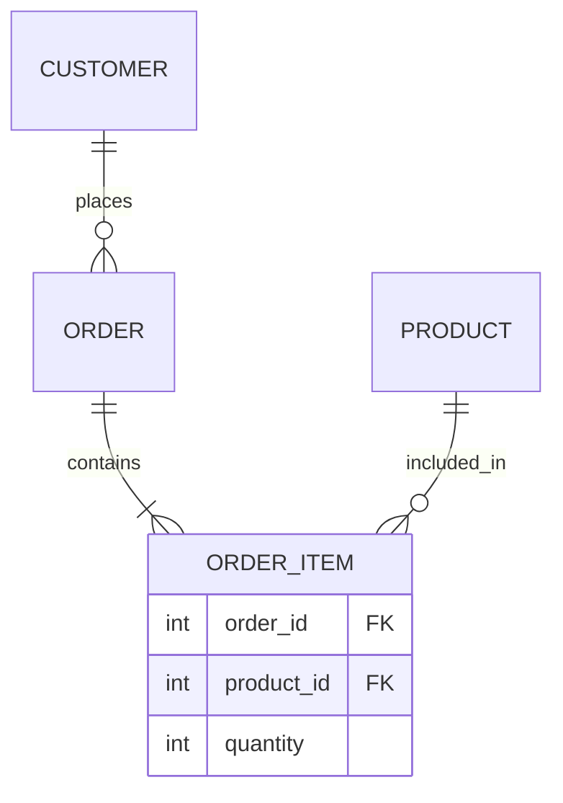

## 지식 로드맵 내 현재 위치

자료처리·데이터 → 데이터 모델링 → **개체-관계 다이어그램(ERD)**

## 30초 인출

- 본질: ERD는 업무에서 관리할 엔터티와 속성·관계를 그림으로 표현해 데이터 구조와 규칙을 나타내는 데이터 모델
- 메커니즘: 업무 용어에서 엔터티와 식별자를 도출하고 속성·관계·다중도를 정한 뒤, 업무 사례로 검증해 논리 모델을 확정하고 물리 제약(키·외래키)으로 옮김
- 통찰: 관계선만 그리면 업무 규칙이 전달되지 않으므로 관계 이름·다중도·선택성을 사례로 검증하고, 다대다 관계는 교차 엔터티로 풀어 물리 설계와 어긋나지 않게 함

<details>
<summary>핵심 용어</summary>

- **ERD(Entity Relationship Diagram)** : 엔터티·속성·관계로 데이터 구조를 표현한 다이어그램
- **엔터티(Entity)** : 업무에서 관리할 대상·사건
- **속성(Attribute)** : 엔터티가 가진 특성
- **식별자(Identifier)** : 엔터티의 개별 인스턴스를 구분하는 속성
- **다중도(Cardinality)** : 관계에서 연결될 수 있는 인스턴스 수(1:1, 1:N, M:N)
- **선택성(Optionality)** : 관계 참여가 필수인지 선택인지의 구분
- **교차 엔터티** : 다대다 관계를 두 개의 일대다 관계로 풀기 위해 두는 엔터티

</details>

---

## 2~4교시 예상문제 (25점)

> ERD(Entity Relationship Diagram)의 구성요소와 작성 절차를 설명하시오. (예상)

---

## 2~4교시 25점 답안

## Ⅰ. ERD의 개요

| 구분 | 핵심 |
|---|---|
| 정의 | **ERD** 는 업무에서 관리할 엔터티와 속성·관계를 그림으로 표현한 데이터 모델 |
| 목적 | 업무 데이터의 구조와 규칙을 이해관계자와 공유하고 DB 설계의 근거 마련 |

## Ⅱ. 특징

| 특징 | 의미 |
|---|---|
| 업무 구조 표현 | 관리 대상·속성·관계를 시각적으로 연결 |
| 관계 규칙 명시 | 다중도·선택성으로 허용 인스턴스 수 표현 |
| 물리 설계 근거 | 식별자·관계를 키·참조 제약과 대조 |

## Ⅲ. 작성 절차

```text
업무 용어·사건 → 엔터티·식별자 → 속성·관계·다중도
        ↓
업무 사례·예외와 대조 → 논리 모델 확정 → 물리 제약 반영
```

### 다대다 관계의 교차 엔터티 전개

```text
주문 N : M 상품
   ↓ 주문항목을 교차 엔터티로 분리
주문 1 : N 주문항목 N : 1 상품
```

## Ⅳ. 구성요소와 관계 표현

| 요소 | 표현 내용 | 검증 기준 |
|---|---|---|
| 엔터티 | 관리할 대상·사건 | 독립적으로 식별·관리 가능 |
| 속성 | 대상의 특성 | 뜻·형식·필수 여부 명시 |
| 식별자 | 인스턴스 구분 | 중복·NULL 가능성 검토 |
| 관계 | 엔터티 사이의 업무 규칙 | 의미와 방향 일치 |
| 다중도·선택성 | 1:1, 1:N, 필수·선택 | 실제 업무 사례와 일치 |


```mermaid
erDiagram
    CUSTOMER ||--o{ ORDER : places
    ORDER ||--|{ ORDER_ITEM : contains
    PRODUCT ||--o{ ORDER_ITEM : included_in
    ORDER_ITEM {
        int order_id FK
        int product_id FK
        int quantity
    }
```

| 논리 ERD | 물리 구현 |
|---|---|
| 엔터티·속성·관계 | 테이블·컬럼·키 |
| 다중도·필수성 | 외래키·NULL·제약조건 |

## Ⅴ. 한계와 방안

| 한계 | 방안 |
|---|---|
| 관계선만 있고 업무 규칙 설명 없음 | 관계 이름·선택성·다중도와 사례 기록 |
| 식별자·참조 관계가 실제 DB와 다름 | 논리·물리 모델과 제약조건 대조 |
| 다대다 관계를 그대로 물리 테이블화 | 교차 엔터티와 연결 속성 검토 |

## Ⅵ. 제언

개념·논리·물리 단계로 나누어 업무 의미를 먼저 확정하고, 물리 모델은 논리 모델과 형상 관리로 연결

```text
개념 ERD(핵심 엔터티·관계) → 논리 ERD(정규화·M:N 해소) → 물리 ERD(타입·인덱스) → 스키마와 동기화
```

| 구분 | 물리 중심 직접 모델링 | 제언: 단계적 모델링 |
|---|---|---|
| 업무 반영 | 테이블 단위로 맥락 유실 | 업무 의미 보존 |
| 정합성 | ERD와 실제 스키마 불일치 | 형상 관리로 동기화 |

## 출제 이력과 검증 출처

- Q-net 기출 원문에서 직접 묻는 문항 없음
- Chen, The Entity-Relationship Model (1976)

## 연결 토픽

- 연관 토픽: [데이터 모델링](./042_data_modeling.md), [정규화](./019_normalization.md), [반정규화](./017_denormalization.md)
