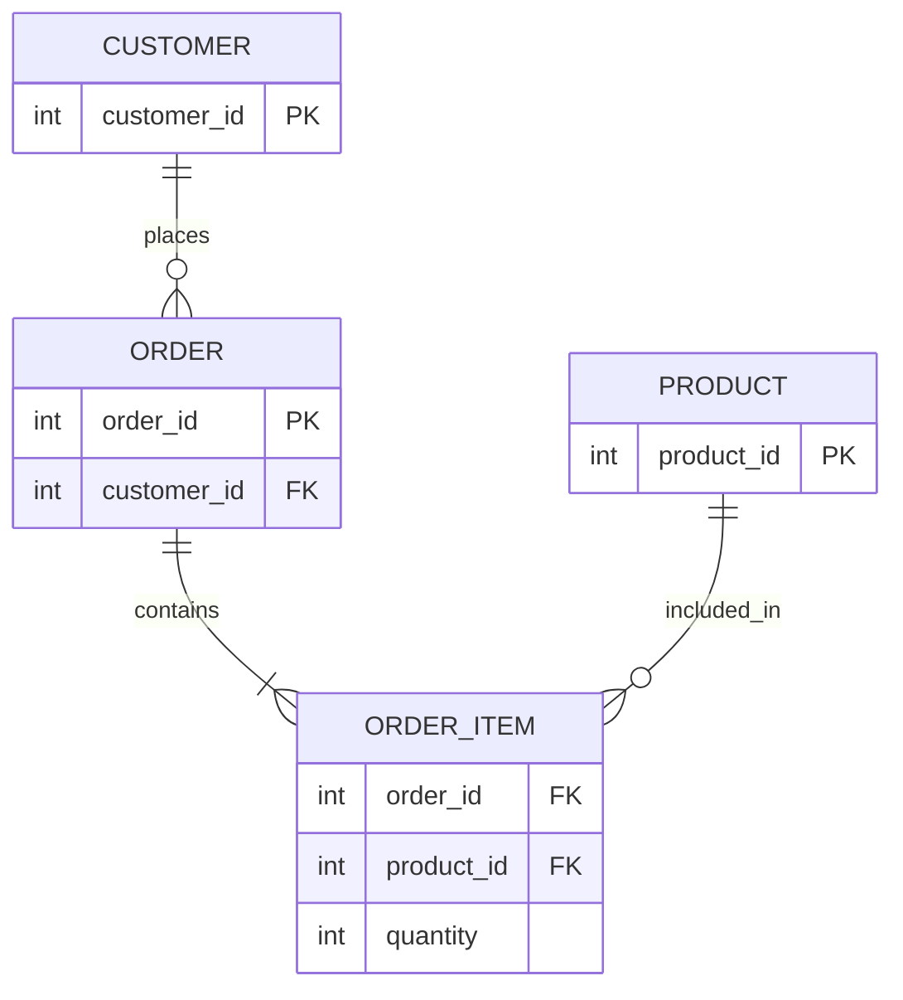

## 지식 로드맵 내 현재 위치

지식 위치: 자료처리·데이터 → 데이터 모델링 → **ERD**

## 30초 인출

- 본질: **ERD는** 업무에서 관리할 엔터티와 각 엔터티의 속성·관계를 그림으로 표현한 데이터 모델
- 메커니즘: 업무 대상 식별 → 속성·식별자 정의 → 엔터티 간 관계·선택성·다중도 표시 → 업무 사례로 검증
- 통찰: 한계: 관계의 다중도·선택성을 실제 업무 사례와 대조하지 않으면 정상 거래 차단·잘못된 연결 허용 → 방안: 사례를 ERD에 대입하고 키·참조 규칙을 DB 제약과 연결

<details>
<summary>핵심 용어</summary>

- **ERD(Entity-Relationship Diagram, 개체 관계도)** : 엔터티·속성·관계를 시각적으로 표현한 데이터 모델
- **엔터티(Entity)** : 업무에서 관리할 수 있는 사람·사물·사건 등의 개체 유형
- **속성(Attribute)** : 엔터티의 특성을 기록하는 항목
- **식별자(Identifier)** : 엔터티의 각 인스턴스를 구별하는 속성·속성 조합
- **관계(Relationship)** : 엔터티 인스턴스 사이의 업무상 연결
- **다중도(Cardinality)** : 관계에서 한 인스턴스에 연결될 수 있는 다른 인스턴스의 수
- **선택성(Optionality)** : 관계가 반드시 있어야 하는지의 여부
- **외래키(Foreign Key)** : 다른 테이블의 식별자를 참조하는 속성
- **교차 엔터티(Associative Entity)** : 다대다 관계를 별도 엔터티로 표현한 구조

</details>

---

## 2~4교시 예상문제 (25점)

> ERD의 개념과 구성요소, 작성 절차 및 논리 데이터 모델 검증 방안을 설명하시오. (예상·25점)

---

## 2~4교시 25점 답안

## Ⅰ. ERD의 개요

| 구분 | 핵심 |
|---|---|
| 정의 | **ERD는** 업무에서 관리할 엔터티와 각 엔터티의 속성·관계를 그림으로 표현한 데이터 모델 |
| 목적 | 업무 데이터의 구조·규칙을 이해관계자와 공유하고 DB 설계의 근거 마련 |

## Ⅱ. ERD의 특징과 구성요소

| 특징 | 의미 |
|---|---|
| 업무 구조 표현 | 관리 대상·속성·관계를 시각적으로 연결 |
| 관계 규칙 명시 | 다중도·선택성으로 허용 인스턴스 수 표현 |
| 물리 설계 근거 | 식별자·관계를 키·참조 제약과 대조 |

## Ⅲ. ERD 작성·검증 체계

```text
업무 용어·사건 → 엔터티·식별자 → 속성·관계·다중도
                                      ↓
실제 업무 사례·예외와 대조 → 논리 모델 확정 → 물리 제약 반영
```

### 다대다 관계의 교차 엔터티 전개

```text
주문 N : M 상품
    ↓ 주문항목을 교차 엔터티로 분리
주문 1 : N 주문항목 N : 1 상품
    ↓ 주문항목에 주문ID·상품ID·수량 기록
키·외래키·필수 관계를 업무 사례로 검증
```

## Ⅳ. 구성요소와 관계 표현·물리 설계

| 요소 | 표현 내용 | 모델 검증 기준 |
|---|---|---|
| 엔터티 | 관리할 대상·사건 | 독립적 식별·관리 가능 |
| 속성 | 대상의 특성 | 뜻·형식·필수 여부 명시 |
| 식별자 | 개별 인스턴스 구분 | 중복·NULL 가능성 검토 |
| 관계 | 엔터티 사이의 업무 규칙 | 연결의 의미와 방향 일치 |
| 다중도·선택성 | 1:1, 1:N, 필수·선택 | 실제 업무 사례와 일치 |

**작성·검증 흐름**

| 검증 대상 | 확인할 내용 |
|---|---|
| 업무 규칙 | 필수 관계·예외·생명주기 |
| 무결성 | 키·외래키·참조 동작 |
| 정규화 | 중복·종속관계·갱신 이상 |

### 관계 표현 예와 물리 설계


```mermaid
erDiagram
    CUSTOMER ||--o{ ORDER : places
    ORDER ||--|{ ORDER_ITEM : contains
    PRODUCT ||--o{ ORDER_ITEM : included_in
    CUSTOMER {
        int customer_id PK
    }
    ORDER {
        int order_id PK
        int customer_id FK
    }
    ORDER_ITEM {
        int order_id FK
        int product_id FK
        int quantity
    }
    PRODUCT {
        int product_id PK
    }
```

| 관계 | 의미 |
|---|---|
| 고객–주문 | 고객 한 명은 주문이 없거나 여러 건일 수 있음 |
| 주문–주문항목 | 주문 한 건은 한 개 이상의 주문항목으로 구성 |
| 상품–주문항목 | 상품 하나가 여러 주문항목에 등장할 수 있음 |

주문과 상품의 다대다 관계는 주문항목 같은 교차 엔터티로 표현.

**ERD와 물리 DB 설계**

| 논리 ERD | 물리 구현 |
|---|---|
| 엔터티·속성·관계의 업무 의미 | 테이블·컬럼·키·인덱스 |
| 다중도·필수성 | 외래키·NULL·제약조건 |

ERD는 업무 구조를 설명하는 모델이며 그림만으로 모든 물리 제약과 성능 설계가 완료되지는 않음.

## Ⅴ. 한계와 방안

| 한계 | 방안 |
|---|---|
| 관계선만 있고 업무 규칙 설명이 없음 | 관계 이름·선택성·다중도와 사례 기록 |
| 식별자·참조 관계가 실제 DB와 다름 | 논리·물리 모델과 제약조건 대조 |
| 다대다 관계를 그대로 물리 테이블화 | 교차 엔터티와 연결 속성 검토 |

## Ⅵ. 제언

실제 거래 사례를 ERD에 먼저 대입해 다중도·선택성을 확정하고 키·참조 규칙을 물리 DB 제약과 대조.

## 출제 이력과 검증 출처

- Peter P. Chen, [The Entity-Relationship Model: Toward a Unified View of Data](https://doi.org/10.1145/320434.320440), *ACM TODS*, 1976.

## 연결 토픽

- 연관 토픽: [무결성 제약](./013_integrity_constraint.md), [정규화](./019_normalization.md)
