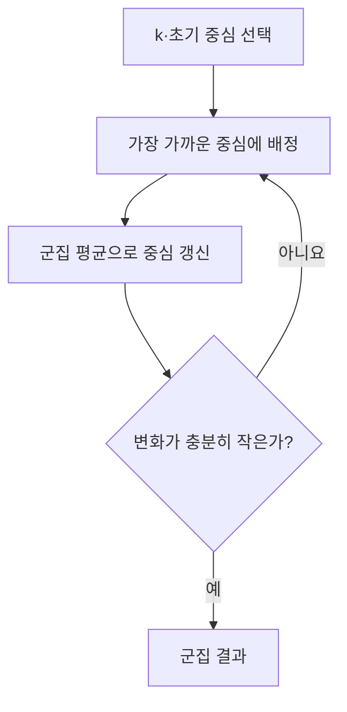
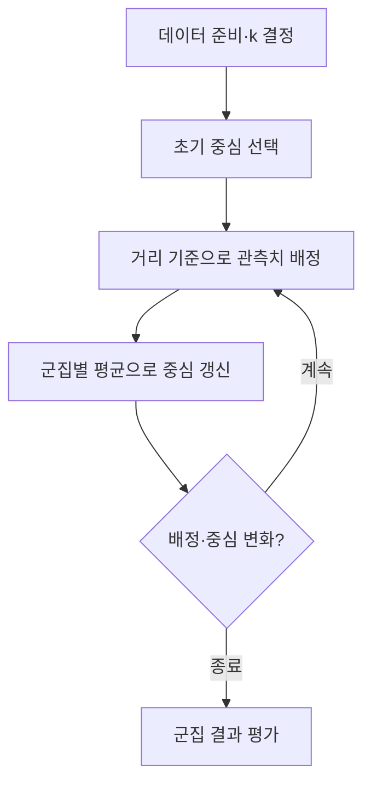

## 지식 로드맵 내 현재 위치

지식 위치: 자료처리·데이터 → 비지도학습·군집분석 → **K-Means 군집화**

## 30초 인출

- 본질: **K-Means**는 미리 정한 k개 중심에 가까운 데이터를 배정하고 중심을 반복 갱신해 군집을 찾는 방법
- 메커니즘: k·초기 중심 선택 → 가까운 중심에 배정 → 군집 평균으로 중심 갱신 → 배정·중심 변화가 작아질 때까지 반복

핵심 용어

- **K-Means 군집화** : k개 중심과의 거리를 기준으로 관측치를 반복 배정하는 분할형 군집 방법
- **k** : 만들 군집의 수
- **중심(Centroid)** : 군집에 속한 관측치의 변수별 평균
- **배정 단계** : 각 관측치를 가장 가까운 중심의 군집에 넣는 단계
- **갱신 단계** : 군집별 관측치 평균으로 중심을 다시 계산하는 단계
- **군집 내 제곱합(WCSS)** : 관측치와 소속 중심 사이 거리 제곱의 합
- **엘보우 방법(Elbow Method)** : k 증가에 따른 군집 내 제곱합 감소를 보며 후보를 찾는 방법
- **실루엣 계수** : 군집 안의 가까움과 다른 군집과의 분리를 함께 보는 지표
- **K-Means++** : 초기 중심을 선택할 때 서로 떨어진 점이 선택되도록 돕는 초기화 방법

---

## 1교시 예상문제 (10점)

> K-Means 군집화에 관하여 설명하시오. (예상·10점)

---

## 1교시 10점 답안

### Ⅰ. K-Means의 개요

| 구분 | 핵심 |
|---|---|
| 정의 | **K-Means**는 정한 k개 중심에 가까운 데이터를 배정하고 중심을 반복 갱신해 군집을 찾는 방법 |
| 목적 | 비슷한 관측치를 묶어 데이터의 집단 구조 파악 |

### Ⅱ. 핵심 반복

| 확인할 것 | 이유 |
|---|---|
| 변수 척도 | 큰 단위의 변수가 거리를 지배할 수 있음 |
| k·초기 중심 | 결과와 안정성에 영향 |

### Ⅲ. 한계

이상치·비구형 군집·서로 다른 밀도에 약할 수 있음. 결과의 내부 점수뿐 아니라 군집의 업무적 의미를 확인.

---

## 2~4교시 예상문제 (25점)

> K-Means 군집화의 개념과 반복 절차, k 선택 및 결과 평가·한계를 설명하시오. (예상·25점)

---

## 2~4교시 25점 답안

## Ⅰ. K-Means의 개요

| 구분 | 핵심 |
|---|---|
| 정의 | **K-Means**는 정한 k개 중심에 가까운 데이터를 배정하고 중심을 반복 갱신해 군집을 찾는 방법 |
| 목적 | 비슷한 관측치를 묶어 데이터의 집단 구조 파악 |

## Ⅱ. 반복 원리

| 단계 | 계산·판단 |
|---|---|
| 배정 | 관측치와 중심 사이 거리 비교 |
| 갱신 | 소속 관측치의 평균으로 중심 계산 |
| 종료 | 중심·배정 변화 또는 반복 횟수 기준 |

K-Means는 군집 내 거리 제곱합을 줄이지만 초기값에 따라 다른 국소해에 머물 수 있음.

## Ⅲ. k와 초기값 선택

| 방법 | 확인할 내용 | 한계 |
|---|---|---|
| 엘보우 | k 증가에 따른 WCSS 감소 변화 | 꺾임이 뚜렷하지 않을 수 있음 |
| 실루엣 | 군집 내부 응집·군집 간 분리 | 거리와 자료형에 의존 |
| 반복 실행·K-Means++ | 초기값에 따른 결과 변동 | 최적 군집 수를 자동 보장하지 않음 |

## Ⅳ. 데이터 준비·적합성

| 조건 | 이유 | 대응 |
|---|---|---|
| 변수 단위 차이 | 거리 계산 편향 | 필요한 표준화 |
| 극단적 이상치 | 평균 중심 이동 | 원인 확인·영향 비교 |
| 비구형·불균등 밀도 | 중심 기반 배정의 한계 | 밀도·계층 방법 비교 |
| 범주형 변수 | 평균·유클리드 거리의 의미 제한 | 적합한 거리·방법 검토 |

## Ⅴ. 군집 결과 평가

| 평가 | 확인할 것 |
|---|---|
| 내부 지표 | WCSS·실루엣·군집 크기 |
| 안정성 | 초기값·표본·기간 변화에 따른 결과 |
| 업무 해석 | 군집별 특성이 실제 활용 목적과 연결되는지 |

## Ⅵ. 한계와 대응

| 한계 | 대응 방안 |
|---|---|
| k를 임의로 고정 | 여러 k의 지표·해석·안정성 비교 |
| 초기 중심에 결과 의존 | 여러 초기값으로 재실행 |
| 낮은 내부 비용만으로 성공 판단 | 실제 집단 특성·활용 가능성 검토 |

## Ⅶ. 기술사적 제언

| 검토 단계 | 실행 내용 | 선택 근거 |
|---|---|---|
| 입력 설계 | 군집 활용 목적·변수를 정하고 척도와 이상치 영향 검토 | 거리 계산의 적합성과 변수 의미 |
| 모형 비교 | k와 초기값을 바꿔 군집 결과·안정성 비교 | 군집 내 응집도와 군집 간 분리도 |
| 활용 판단 | 군집별 특성을 업무 적용 사례와 대조 | 해석 가능성과 실제 활용성 |

## 연결 토픽

- 연관 토픽: [군집분석](./005_cluster_analysis.md), [이상치](./010_outlier.md)
