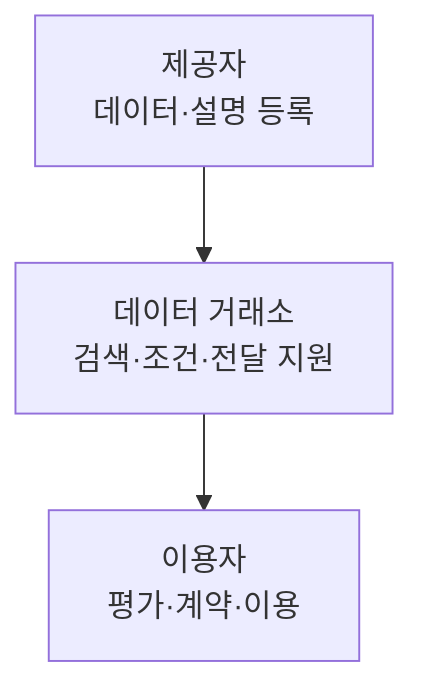
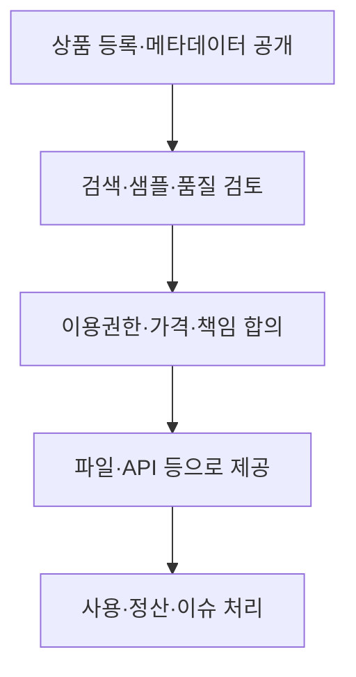

## 지식 로드맵 내 현재 위치

지식 위치: 자료처리·데이터 → 데이터 유통 → **데이터 거래소**

## 30초 인출

- 본질: **데이터 거래소**는 데이터 제공자와 이용자가 데이터 상품을 찾고 이용 조건을 합의·거래하도록 연결하는 유통 플랫폼
- 메커니즘: 상품 등록·설명 → 탐색·품질·권리 확인 → 이용 조건·대가 합의 → 전달·접근 → 이용·정산·사후관리

핵심 용어

- **데이터 거래소(Data Exchange)** : 데이터 제공·이용 당사자가 상품을 검색하고 이용 조건을 정해 거래하도록 지원하는 플랫폼
- **데이터 상품(Data Product)** : 제공 대상 데이터와 설명·품질·갱신·이용 조건을 묶어 제공하는 단위
- **메타데이터** : 데이터의 내용·형식·기간·출처·갱신 주기 등을 설명하는 정보
- **이용권한** : 데이터에 접근·복제·가공·재제공할 수 있는 범위
- **품질 정보** : 데이터의 완전성·정확성·갱신성 등 이용 적합성을 판단할 자료
- **API(Application Programming Interface)** : 프로그램이 정해진 규칙으로 데이터·기능에 접근하는 인터페이스
- **정산** : 합의한 가격·사용량·계약 조건에 따라 거래 대가를 계산·처리하는 활동

---

## 1교시 예상문제 (10점)

> 데이터 거래소에 관하여 설명하시오. (예상·10점)

---

## 1교시 10점 답안

### Ⅰ. 데이터 거래소의 개요

| 구분 | 핵심 |
|---|---|
| 정의 | **데이터 거래소**는 제공자와 이용자가 데이터 상품을 찾고 이용 조건을 합의·거래하도록 연결하는 유통 플랫폼 |
| 목적 | 필요한 데이터의 발견·이용 촉진과 거래 조건의 명확화 |

### Ⅱ. 기본 구조

| 거래 전 | 거래 후 |
|---|---|
| 내용·품질·권리·가격 확인 | 접근·이용·정산·이력 관리 |

### Ⅲ. 유의점

데이터 파일을 건네는 것만으로 거래가 끝나지 않음. 이용 범위와 갱신·품질·재제공 조건을 명확히 확인.

---

## 2~4교시 예상문제 (25점)

> 데이터 거래소의 개념과 구성·거래 절차, 데이터 상품의 품질·권리 관리 방안을 설명하시오. (예상·25점)

---

## 2~4교시 25점 답안

## Ⅰ. 데이터 거래소의 개요

| 구분 | 핵심 |
|---|---|
| 정의 | **데이터 거래소**는 제공자와 이용자가 데이터 상품을 찾고 이용 조건을 합의·거래하도록 연결하는 유통 플랫폼 |
| 목적 | 필요한 데이터의 발견·이용 촉진과 거래 조건의 명확화 |

## Ⅱ. 참여자와 역할

| 참여자 | 주요 역할 |
|---|---|
| 제공자 | 데이터 상품·출처·품질·이용 조건 제시 |
| 거래소 운영자 | 검색·계약·접근·정산 지원과 거래 이력 관리 |
| 이용자 | 이용 목적·권리 범위 확인과 계약 준수 |

운영자는 거래 절차를 지원하되 모든 제공 데이터의 권리·품질을 자동 보증하는 것은 아님.

## Ⅲ. 거래 흐름

| 단계 | 확인할 기준 |
|---|---|
| 발견 | 내용·범위·기간·갱신 주기 |
| 합의 | 이용·가공·재제공 가능 범위 |
| 제공 | 접근 통제·전달 방법·변경 통지 |
| 사후 | 품질 이슈·정산·계약 종료 처리 |

## Ⅳ. 데이터 상품의 구성

| 구성 | 이용자에게 필요한 이유 |
|---|---|
| 데이터 본체·형식 | 실제 분석·연계 가능성 판단 |
| 메타데이터·샘플 | 내용·범위·결측·갱신 상태 파악 |
| 품질·출처 | 신뢰성·재현성 확인 |
| 권리·계약 | 허용된 이용과 책임 범위 확인 |
| 제공 방식 | 파일·API 등 이용 환경 적합성 |

## Ⅴ. 정보시스템의 지원

| 기능 | 통제 |
|---|---|
| 카탈로그·검색 | 상품·버전·갱신 이력 관리 |
| 계약·권한 | 이용자별 허용 범위·기간 적용 |
| 전달·API | 사용량·오류·접근 기록 |
| 정산·문의 | 대가·분쟁·품질 요청 이력 |

## Ⅵ. 한계와 대응

| 한계 | 대응 방안 |
|---|---|
| 상품 설명만으로 실제 활용성 판단 어려움 | 샘플·품질·갱신 이력 제공 |
| 권리 범위가 모호함 | 제공·가공·재제공 조건을 계약에 명시 |
| 거래 이후 변경·품질 이슈 누락 | 버전·변경 통지·이슈 처리 경로 운영 |

## Ⅶ. 기술사적 제언

| 교환 단계 | 실행 내용 | 확인 근거 |
|---|---|---|
| 상품 등록 | 내용·품질·이용 권리·갱신 주기와 제공 형식 명시 | 이용자가 조건과 목적 적합성을 판단할 설명 |
| 거래 전 검토 | 샘플과 메타데이터로 활용 가능성 확인 | 데이터 범위·품질·갱신 조건 |
| 제공·추적 | 승인된 권한을 API·파일 제공에 적용하고 이용 이력 기록 | 실제 제공 범위와 계약 조건의 일치 |

## 검증 출처

- [데이터 산업진흥 및 이용촉진에 관한 기본법 제2조, 국가법령정보센터](https://law.go.kr/LSW/lsLinkCommonInfo.do?chrClsCd=010202&lsJoLnkSeq=1025179377) — 데이터거래사업자의 법적 정의.

## 연결 토픽

- 연관 토픽: [데이터 가치평가](./002_data_valuation.md), [데이터 거버넌스](./006_data_governance.md)
