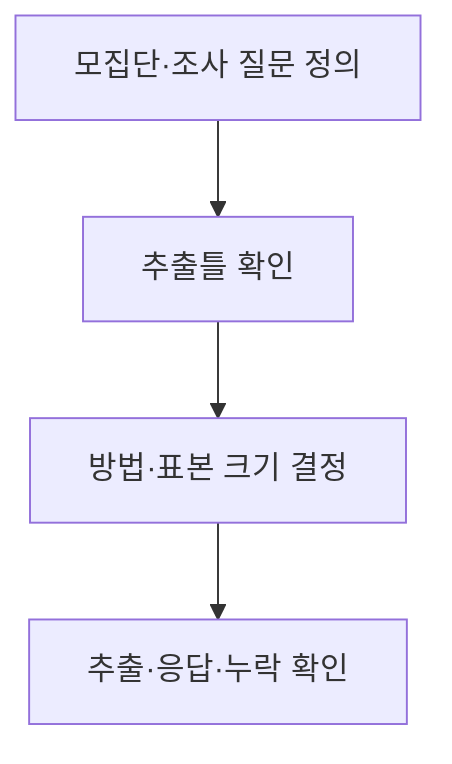
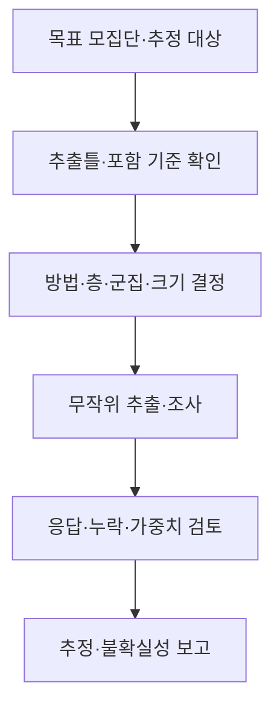

## 지식 로드맵 내 현재 위치

지식 위치: 자료처리·데이터 → 통계조사·추론 → **표본추출**

## 30초 인출

- 본질: **표본추출**은 모집단 전체 대신 일부 대상을 정해 관찰·분석할 자료를 얻는 과정
- 메커니즘: 모집단·조사 목표 정의 → 추출틀 확인 → 확률·비확률 방법 선택 → 표본 추출 → 대표성·오차·누락 검토

핵심 용어

- **표본추출(Sampling)** : 모집단에서 조사·분석할 일부 대상을 선택하는 과정
- **모집단(Population)** : 알고 싶은 특성을 가진 전체 대상 집합
- **표본(Sample)** : 모집단에서 관찰할 대상으로 선택된 일부
- **추출틀(Sampling Frame)** : 표본을 뽑는 데 사용하는 모집단 대상 목록·범위
- **확률표본추출** : 각 대상의 선택 확률을 알 수 있도록 무작위 절차로 뽑는 방식
- **비확률표본추출** : 편의·판단·할당 등 선택 확률을 알기 어려운 방식
- **층화추출(Stratified Sampling)** : 모집단을 특성별 층으로 나눈 뒤 각 층에서 표본을 뽑는 방식
- **군집추출(Cluster Sampling)** : 모집단을 군집으로 나누고 선택한 군집에서 대상을 조사하는 방식
- **표본오차** : 같은 방식으로 표본을 다시 뽑을 때 추정값이 달라지는 변동
- **선택 편향** : 조사에 포함될 가능성이 대상 특성과 관련되어 결과가 체계적으로 치우치는 현상

---

## 1교시 예상문제 (10점)

> 표본추출에 관하여 설명하시오. (예상·10점)

---

## 1교시 10점 답안

### Ⅰ. 표본추출의 개요

| 구분 | 핵심 |
|---|---|
| 정의 | **표본추출**은 모집단 전체 대신 일부 대상을 정해 관찰·분석할 자료를 얻는 과정 |
| 목적 | 제한된 시간·비용으로 모집단의 특성을 추정하거나 분석 |

### Ⅱ. 주요 방식

| 구분 | 방법 예 | 추론 시 특징 |
|---|---|---|
| **확률추출** | 단순무작위·층화·군집·계통 | 선택 확률을 바탕으로 표본오차 평가 가능 |
| **비확률추출** | 편의·할당·판단 | 모집단 일반화에 별도 주의 필요 |

### Ⅲ. 설계 흐름

- 제언: 표본 수만 늘리기보다 추출틀의 누락·비응답·선택 편향을 먼저 확인.

---

## 2~4교시 예상문제 (25점)

> 표본추출의 개념과 주요 방법을 비교하고, 표본 설계·대표성 검증 방안을 설명하시오. (예상·25점)

---

## 2~4교시 25점 답안

## Ⅰ. 표본추출의 개요

| 구분 | 핵심 |
|---|---|
| 정의 | **표본추출**은 모집단 전체 대신 일부 대상을 정해 관찰·분석할 자료를 얻는 과정 |
| 목적 | 제한된 시간·비용으로 모집단의 특성을 추정하거나 분석 |

## Ⅱ. 확률표본추출

| 방법 | 추출 원리 | 적합한 상황 |
|---|---|---|
| 단순무작위 | 추출틀에서 무작위로 선택 | 대상 목록을 확보한 경우 |
| 층화 | 중요한 특성별 층에서 각각 추출 | 소수 집단까지 대표할 필요 |
| 군집 | 지역·기관 같은 집단을 선택 | 대상이 넓게 분산되어 조사 비용이 클 때 |
| 계통 | 무작위 시작점부터 일정 간격으로 선택 | 목록 순서에 주기성이 없는 경우 |

군집추출은 층화추출과 목적·추출 단위가 다르므로 이름만 보고 같은 방법으로 취급하지 않음.

## Ⅲ. 비확률표본추출

| 방법 | 선택 방식 | 한계 |
|---|---|---|
| 편의 | 접근하기 쉬운 대상 | 전체 모집단과 차이 가능 |
| 판단 | 조사자의 기준으로 대상 선정 | 선택 기준에 따른 치우침 |
| 할당 | 정한 집단별 수를 채움 | 집단 안의 무작위성 보장 안 됨 |

비확률표본의 결과를 모집단 전체의 확률적 추정처럼 해석하지 않음.

## Ⅳ. 표본 설계 절차

| 설계 요소 | 확인할 질문 |
|---|---|
| 추출틀 | 빠진 대상·중복 대상은 없는가? |
| 표본 크기 | 필요한 정밀도와 비용에 맞는가? |
| 응답 | 집단별 비응답이 결과를 바꾸는가? |

## Ⅴ. 오차와 대표성

| 구분 | 뜻 | 대응 |
|---|---|---|
| 표본오차 | 표본추출 반복에 따른 변동 | 설계에 맞는 표준오차·구간 제시 |
| 추출틀 누락 | 일부 대상이 뽑힐 수 없음 | 모집단·목록 대조 |
| 비응답 편향 | 응답 여부가 결과와 관련 | 응답률·집단 차이 확인 |
| 측정 오류 | 질문·기록이 사실과 다름 | 조사 도구·입력 검증 |

표본을 크게 뽑아도 추출틀 누락이나 비응답 편향이 자동으로 사라지지는 않음.

## Ⅵ. 한계와 대응

| 한계 | 대응 방안 |
|---|---|
| 조사 가능한 대상만 모집단으로 간주 | 목표 모집단과 추출틀의 차이 명시 |
| 설계 효과를 무시하고 단순무작위 공식 적용 | 층·군집·가중치를 반영한 표준오차 계산 |
| 합성 증강 자료를 실제 표본으로 혼동 | 관측 표본과 학습용 증강 자료 구분 |

## Ⅶ. 기술사적 제언

조사·모형 개발 전에 모집단과 추출틀을 먼저 고정하고 누락·중복·비응답을 점검. 결과 보고에는 추출 방법과 표본 수뿐 아니라 어떤 집단에 일반화할 수 있는지 함께 명시.

## 연결 토픽

- 연관 토픽: [중심극한정리](./014_central_limit_theorem.md), [불편추정량](./011_unbiased_estimator.md)
