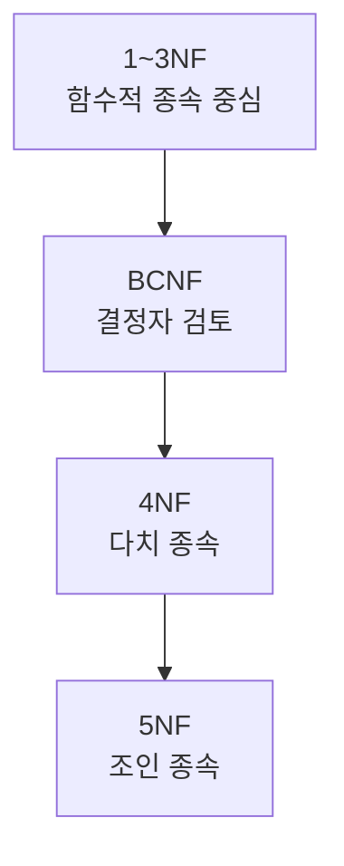
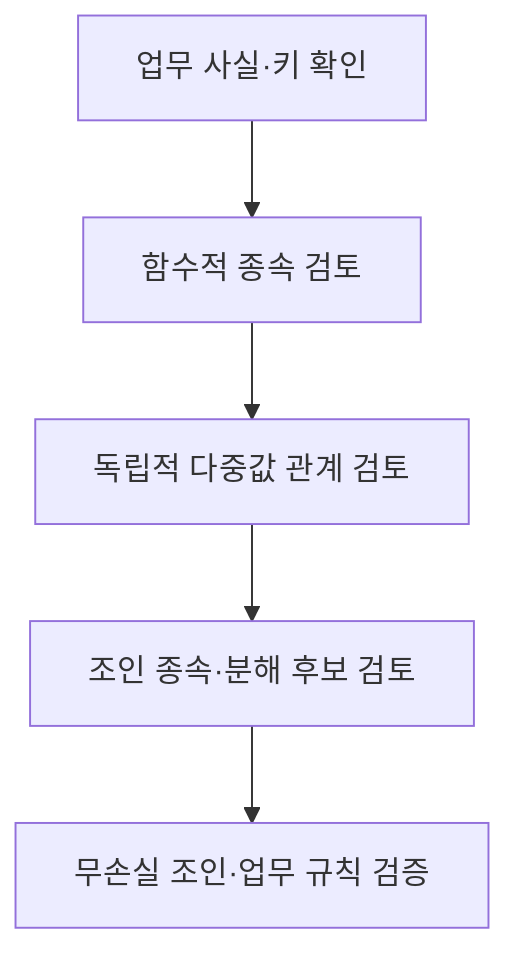

## 지식 로드맵 내 현재 위치

지식 위치: 자료처리·데이터 → 관계형 정규화 → **4NF·5NF**

## 30초 인출

- 본질: **4NF·5NF**는 3NF·BCNF 이후에도 남을 수 있는 다치 종속과 조인 종속에 따른 중복을 다루는 고급 정규형
- 메커니즘: 독립적인 다중값 관계·분해 후 조인 관계 확인 → 무손실 분해 가능성 검증 → 필요한 관계로 분리

핵심 용어

- **4NF(Fourth Normal Form, 제4정규형)** : 비자명한 다치 종속 X ↠ Y의 결정자 X가 슈퍼키여야 하는 정규형
- **5NF(Fifth Normal Form, 제5정규형)** : 모든 비자명한 조인 종속이 후보키에 의해 함의되는 정규형
- **다치 종속(Multivalued Dependency, MVD)** : X가 정해졌을 때 Y의 가능한 값 집합이 다른 속성 집합과 독립적으로 결정되는 관계
- **조인 종속(Join Dependency, JD)** : 하나의 관계를 여러 부분으로 분해했다가 조인하면 원래 관계로 복원되는 제약
- **슈퍼키(Superkey)** : 행을 유일하게 식별할 수 있는 속성 집합
- **무손실 분해** : 분해한 관계를 조인했을 때 원래의 정보가 정확히 복원되는 성질
- **BCNF(Boyce–Codd Normal Form)** : 모든 비자명한 함수적 종속의 결정자가 슈퍼키인 정규형

---

## 1교시 예상문제 (10점)

> 4NF와 5NF에 관하여 설명하시오. (예상·10점)

---

## 1교시 10점 답안

### Ⅰ. 4NF·5NF의 개요

| 구분 | 핵심 |
|---|---|
| 정의 | **4NF·5NF**는 함수적 종속 이외의 다치·조인 종속으로 생기는 중복을 줄이기 위한 고급 정규형 |
| 목적 | 독립적인 다중값 사실과 불필요한 관계 조합의 중복 감소 |

### Ⅱ. 다루는 종속

| 정규형 | 확인할 종속 | 핵심 판단 |
|---|---|---|
| **4NF** | 다치 종속 | 독립적인 다중값 관계가 한 테이블에 섞였는가? |
| **5NF** | 조인 종속 | 더 작은 관계로 무손실 분해할 수 있는가? |

### Ⅲ. 정규화의 위치

- 제언: 고급 정규형 적용 전 실제 업무 규칙과 분해 후 무손실 복원을 확인.

---

## 2~4교시 예상문제 (25점)

> 4NF와 5NF의 개념, 다치 종속·조인 종속 및 적용 시 고려사항을 비교하여 설명하시오. (예상·25점)

---

## 2~4교시 25점 답안

## Ⅰ. 4NF·5NF의 개요

| 구분 | 핵심 |
|---|---|
| 정의 | **4NF·5NF**는 함수적 종속 이외의 다치·조인 종속으로 생기는 중복을 줄이기 위한 고급 정규형 |
| 목적 | 독립적인 다중값 사실과 불필요한 관계 조합의 중복 감소 |

## Ⅱ. 4NF와 다치 종속

| 개념 | 의미 |
|---|---|
| 다치 종속 X ↠ Y | X마다 Y 값 집합이 다른 속성의 값 집합과 독립 |
| 4NF 조건 | 비자명한 다치 종속의 결정자 X가 슈퍼키 |
| 위반 시 | 독립적인 다중값 사실의 조합이 반복 저장 |

예: 한 직원의 언어 목록과 자격증 목록이 서로 독립인데 한 테이블에 모든 언어·자격증 조합을 저장하면 중복이 증가. 직원–언어, 직원–자격증 관계로 분리하고 실제 업무에서 두 목록이 독립인지 확인.

## Ⅲ. 5NF와 조인 종속

| 개념 | 의미 |
|---|---|
| 조인 종속 | 관계를 여러 부분으로 나눈 뒤 조인하여 원래 관계를 복원한다는 제약 |
| 5NF 조건 | 비자명한 조인 종속이 후보키에 의해 함의 |
| 위반 시 | 여러 관계의 결합 사실을 한 테이블에 중복 기록할 가능성 |

5NF는 다치 종속보다 더 일반적인 조인 관계를 다룸. 분해 후 조인에서 없던 행이 생기면 무손실 분해가 아니므로 업무 규칙 검증이 중요.

## Ⅳ. 정규형의 비교

| 정규형 | 주된 종속 | 줄이려는 중복 |
|---|---|---|
| 3NF·BCNF | 함수적 종속 | 키와 속성 간 부적절한 종속 |
| 4NF | 다치 종속 | 독립적인 다중값 집합의 조합 |
| 5NF | 조인 종속 | 더 작은 관계로 분리 가능한 결합 사실 |

## Ⅴ. 적용 판단

| 확인 대상 | 질문 |
|---|---|
| 업무 규칙 | 다중값 집합이 정말 독립적인가? |
| 데이터 중복 | 같은 사실이 조합마다 반복되는가? |
| 무손실성 | 분해·재조인 시 원래 사실만 복원되는가? |
| 운영 비용 | 분해 후 필요한 질의·제약을 관리할 수 있는가? |

## Ⅵ. 한계와 대응

| 한계 | 대응 방안 |
|---|---|
| 예시의 독립성을 실제 업무에도 그대로 가정 | 도메인 전문가와 관계의 의미 확인 |
| 조인 종속을 추정만 하고 분해 | 실제 데이터·업무 규칙으로 무손실 검증 |
| 고급 정규형을 모든 테이블에 기계적으로 적용 | 중복·갱신 이상이 있는 관계부터 검토 |

## Ⅶ. 기술사적 제언

| 검토 순서 | 적용 조건·조치 | 검증 기준 |
|---|---|---|
| 기초 종속성 정리 | 키와 함수적 종속 및 1~3NF 상태 확인 | 분해의 전제 관계가 명확한지 |
| 상위 정규형 검토 | 독립 다중값 종속이면 4NF, 조인 종속에 따른 중복이면 5NF 검토 | 해당 종속성이 실제 업무 데이터에 존재하는지 |
| 분해 결과 검증 | 분해 테이블을 조인해 업무 사례와 대조 | 원래 정보의 복원과 불필요한 조합의 방지 |

## 연결 토픽

- 연관 토픽: [정규화](./019_normalization.md), [반정규화](./017_denormalization.md)
