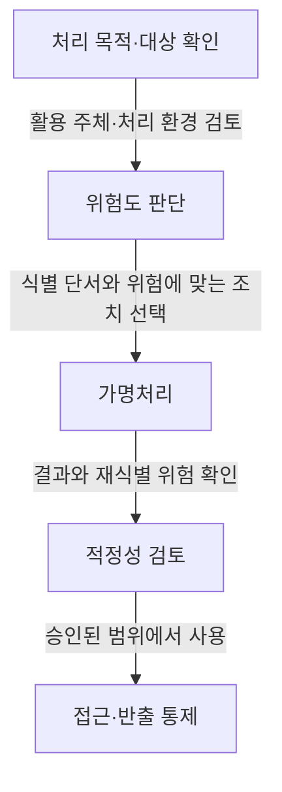
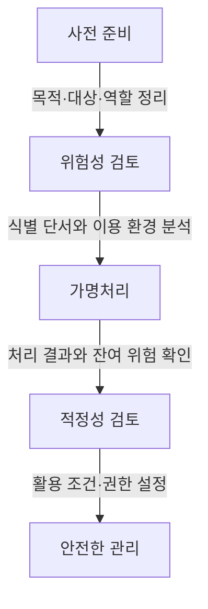

---
author: "Codex"
category: "03-data"
date: "2026-09-24T00:00:00+09:00"
extra:
  keyword_grade: "기초"
  model: "GPT-6"
  question_no: "034"
sidebar:
  badge:
    text: "기초"
    variant: "note"
  label: "034. 가명정보 처리 가이드라인(비정형)"
  order: 34
tags:
  - "notes-data"
title: "가명정보 처리 가이드라인 개정 (비정형 데이터·위험도 기반 체계)"
weight: 34
---

## 지식 로드맵 내 현재 위치

데이터 거버넌스·보호 → 개인정보보호 → 가명정보 처리 가이드라인의 비정형 데이터 적용

## 30초 인출

- 본질: **비정형 데이터 가명처리**는 식별 위험을 낮춘 개인정보를 연구·통계 등에 안전하게 활용하도록 처리하는 방법.
- 메커니즘: 처리 목적·이용자·환경의 위험 검토 → 식별 단서 변환 → 적정성 확인 → 접근·반출 통제.
- 회상 단서: 개인정보보호위원회는 2026년 가이드라인을 위험도 기반으로 개정하고, 대규모 비정형 데이터에는 표본 검수 등 다양한 검수 방식을 안내.

핵심 용어

- **가명정보**: 추가정보를 사용하지 않고는 특정 개인을 알아볼 수 없도록 처리한 개인정보.
- **가명처리**: 개인정보의 일부를 삭제하거나 대체하는 등 추가정보 없이는 개인을 알아볼 수 없게 하는 처리.
- **비정형 데이터**: 정해진 행·열 구조 없이 이미지·영상·음성·문장 등으로 표현되는 데이터.
- **위험도 기반 판단**: 활용 주체와 처리 환경을 기준으로 위험을 분류하고 검토·서류 수준을 조정하는 방식.
- **적정성 검토**: 가명처리 결과와 재식별 위험을 확인해 활용 가능성을 판단하는 검토.
- **추가정보**: 가명정보를 원래 상태로 복원하는 데 사용할 수 있는 정보.
- **표본 검수**: 전체 자료 대신 일부를 추출해 가명처리 결과를 확인하는 검수 방식.

---

## 1교시 예상문제 (10점)

> 가명정보 처리 가이드라인의 비정형 데이터 가명처리 원칙과 절차를 설명하시오. (예상·10점)

---

## 1교시 10점 답안

### Ⅰ. 개요

| 구분 | 핵심 |
|---|---|
| 정의 | **가명정보 처리 가이드라인**은 개인정보를 안전하게 가명처리·활용하기 위한 절차와 보호조치를 안내하는 기준 |
| 목적 | 연구·통계 등 허용 목적의 데이터 활용과 개인 재식별 위험 통제 |

### Ⅱ. 비정형 데이터의 처리 관점

| 유형 | 식별 단서 예 | 처리 예 |
|---|---|---|
| 텍스트 | 이름·연락처·문맥 속 개인 정보 | 삭제·가명 대체·일반화 |
| 이미지·영상 | 얼굴·번호판·배경의 식별 단서 | 흐림 처리·가림·대체 등 목적에 맞는 변환 |
| 음성 | 발화 내용·화자 식별 특성 | 내용 내 식별정보 처리·음성 특성 변환 |

처리 기법은 데이터와 이용 목적에 맞춰 선택하며 특정 알고리즘을 일률적으로 요구하는 방식이 아님.

### Ⅲ. 위험 검토와 처리 흐름

**제언:** 비정형 데이터의 재식별 위험과 처리 목적을 함께 검토해 필요한 변환·접근 통제를 선택.

---

## 2~4교시 예상문제 (25점)

> 가명정보 처리 가이드라인의 비정형 데이터 가명처리 원칙, 위험도 판단, 처리 절차와 안전한 활용 방안을 설명하시오. (예상·25점)

---

## 2~4교시 25점 답안

## Ⅰ. 개요

| 구분 | 핵심 |
|---|---|
| 정의 | **가명정보 처리 가이드라인**은 개인정보를 안전하게 가명처리·활용하기 위한 절차와 보호조치를 안내하는 기준 |
| 목적 | 연구·통계 등 허용 목적의 데이터 활용과 개인 재식별 위험 통제 |

## Ⅱ. 비정형 데이터에서 위험을 보는 기준

개인식별 단서는 필드에 고정되지 않고 콘텐츠와 맥락에 나타날 수 있으므로, 데이터 유형과 누가 어떤 환경에서 이용하는지를 함께 검토.

| 검토축 | 확인 내용 | 판단에 미치는 영향 |
|---|---|---|
| 데이터 | 식별 단서의 종류·노출 정도·다른 정보와 결합 가능성 | 변환 범위와 검수 항목 선정 |
| 이용자 | 내부 이용인지 외부 제공인지, 이용자의 역할과 권한 | 위험도와 검토 수준 설정 |
| 처리 환경 | 접근권한·저장·반출 통제와 관리 책임 | 필요한 보호조치 결정 |

## Ⅲ. 위험도별 검토 방식

개인정보보호위원회의 2026년 안내는 활용 주체와 처리 환경을 기준으로 위험도를 분류하고, 개별 사정에 따라 판단을 조정할 수 있도록 함.

| 위험 판단 예 | 기본 검토 방향 |
|---|---|
| 내부 활용 | 외부 제공 위험이 없는지 확인하고, 위험에 맞는 담당자 검토와 필요한 기록 적용 |
| 제3자 제공·통제 환경 | 제공 이후 접근·저장·반출 통제 가능성을 검토하고 적정성 확인 수준 결정 |
| 제3자 제공·통제 곤란 환경 | 노출·연계 위험을 엄격히 검토하고 처리 또는 제공 조건 재설계 |

위험 구분은 활용 주체·처리 환경을 기준으로 한 가이드라인의 기본 틀이며, 사안의 특수성과 내부 기준에 따라 조정 가능.

## Ⅳ. 가명처리 절차와 통제

| 단계 | 핵심 확인사항 |
|---|---|
| 사전 준비 | 처리 목적·대상 정보·이용 범위의 확인 |
| 위험성 검토 | 재식별 가능성과 이용자·환경의 통제 수준 검토 |
| 가명처리 | 목적에 필요한 식별 단서의 삭제·대체·일반화 등 |
| 적정성 검토 | 변환 결과와 남은 위험, 활용 조건의 확인 |
| 안전한 관리 | 접근 제한, 추가정보 분리, 기록·반출 통제 |

## Ⅴ. 매체별 처리와 품질 확인

| 데이터 | 식별 단서 예 | 처리·검수 방향 |
|---|---|---|
| 텍스트 | 직접 식별자, 희귀한 사건·장소의 조합 | 패턴 탐지와 문맥 검토를 병행하고 의미 손실 확인 |
| 이미지 | 얼굴, 문신, 표지판, 화면 속 정보 | 식별 단서의 변환 후 잔존 부분을 검토 |
| 영상 | 프레임마다 반복되거나 이동하는 식별 단서 | 여러 프레임의 연속성과 누락 구간을 확인 |
| 음성 | 발화 내용, 화자 특성 | 내용과 음향 단서를 나눠 검토하고 변환 후 유용성 확인 |

특정 탐지 모델·마스킹 기법은 가능한 선택지이며, 가이드라인의 고정 필수기술로 오해하지 않도록 데이터와 처리 목적에 맞춰 결정.

## Ⅵ. 활용 제언

| 한계 | 해결 방안 |
|---|---|
| 대규모 비정형 데이터의 전수 확인에 드는 시간·비용 | 데이터 위험과 처리 일관성을 고려해 표본 검수 등 적절한 검수 방법을 정하고, 발견된 오류를 추가 점검에 반영 |
| 가명처리 뒤에도 문맥·배경 단서가 남을 가능성 | 활용 전 표본과 고위험 사례를 함께 확인하고, 필요하면 변환 범위·이용 환경을 조정 |

## 출제 이력과 검증 출처

- [개인정보보호위원회, 「가명정보 처리 가이드라인」 전면 개정 안내(2026.03.31)](https://pipc.go.kr/np/cop/bbs/selectBoardArticle.do?bbsId=BS074&mCode=C020010000&nttId=11928)
- [개인정보보호법 제28조의2, 제28조의4](https://www.law.go.kr/LSW/lsLinkCommonInfo.do?chrClsCd=010202&lsJoLnkSeq=1029334921)
- [개인정보보호법 시행령 제29조의5](https://www.law.go.kr/LSW/lsSideInfoP.do?docCls=jo&joBrNo=05&joNo=0029&lsiSeq=283503&urlMode=lsScJoRltInfoR)

## 연결 토픽

- 연관 토픽: [데이터 비식별화](./021_deidentification.md) · [개인정보보호](./004_personal_information_protection.md)
