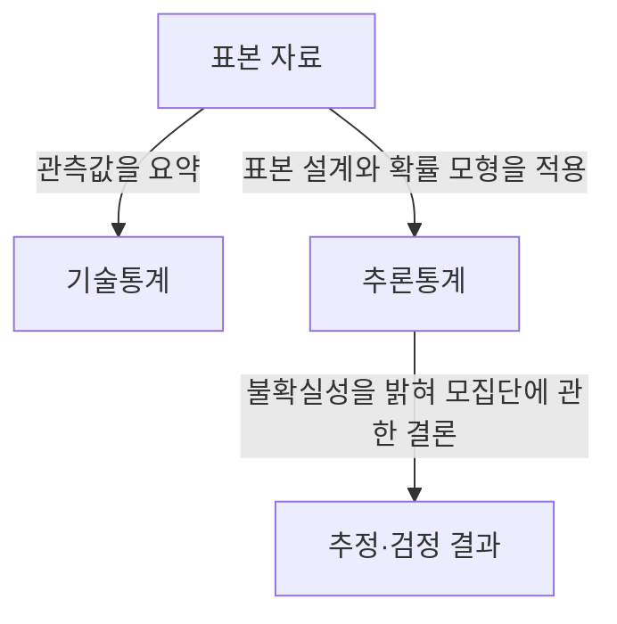
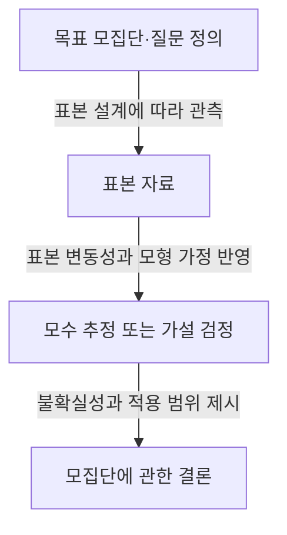

---
author: "Codex"
category: "03-data"
date: "2026-09-24T00:00:00+09:00"
extra:
  keyword_grade: "기초"
  model: "GPT-6"
  question_no: "036"
sidebar:
  badge:
    text: "기초"
    variant: "note"
  label: "036. 기술통계 vs 추론통계"
  order: 36
tags:
  - "notes-data"
title: "기술통계 vs 추론통계 (Descriptive vs Inferential Statistics)"
weight: 36
---

## 지식 로드맵 내 현재 위치

데이터 분석·통계 → 기초 통계 → 기술통계와 추론통계

## 30초 인출

- 본질: **기술통계**는 관측한 데이터의 특징을 요약하고, **추론통계**는 표본에서 얻은 근거로 모집단에 관한 불확실성을 추정하는 방법.
- 메커니즘: 관측값 요약 → 표본 설계와 변동성 검토 → 필요한 경우 모집단 모수 추정·가설 검정.

핵심 용어

- **기술통계(Descriptive Statistics)**: 관측한 자료를 표와 요약 통계량으로 정리해 그 자료의 특성을 나타내는 방법.
- **추론통계(Inferential Statistics)**: 표본 자료와 확률 모형을 이용해 모집단 모수나 가설에 관한 결론을 내리는 방법.
- **모집단(Population)**: 관심 있는 결론을 적용하려는 전체 대상.
- **표본(Sample)**: 모집단의 특성을 조사하기 위해 관측한 일부 대상.
- **모수(Parameter)**: 모집단의 평균·분산처럼 모집단 특성을 나타내는 값.
- **표본오차(Sampling Error)**: 표본의 우연한 차이로 인해 표본 통계량과 모집단 모수가 달라지는 정도.

---

## 1교시 예상문제 (10점)

> 기술통계와 추론통계의 개념과 차이를 설명하시오. (예상·10점)

---

## 1교시 10점 답안

### Ⅰ. 개요

| 구분 | 핵심 |
|---|---|
| 정의 | **기술통계와 추론통계**는 관측 자료의 요약과 표본에 근거한 모집단 결론을 다루는 통계 분석 방법 |
| 목적 | 관측 자료의 특징 파악과 모집단에 관한 불확실성 있는 판단 지원 |

### Ⅱ. 두 통계 방법의 차이

| 구분 | 기술통계 | 추론통계 |
|---|---|---|
| 대상 | 실제 관측 자료 | 표본을 통해 판단하려는 모집단 |
| 질문 | 관측 자료가 어떤 특징인가 | 모집단의 특성이나 가설에 대해 어떤 결론을 낼 수 있는가 |
| 대표 방법 | 평균·중앙값·산포·분포표·그래프 | 모수 추정·신뢰구간·가설 검정 |
| 불확실성 | 표본 범위 안의 자료 요약 | 표본오차와 모형 가정을 고려한 결론 |

### Ⅲ. 분석에서의 관계

**제언:** 추론 결과를 해석할 때 표본 설계와 적용 대상 모집단을 함께 확인.

---

## 2~4교시 예상문제 (25점)

> 기술통계와 추론통계의 목적·주요 방법·차이를 설명하고, 데이터 분석에서 두 방법을 해석할 때의 유의점을 제시하시오. (예상·25점)

---

## 2~4교시 25점 답안

## Ⅰ. 개요

| 구분 | 핵심 |
|---|---|
| 정의 | **기술통계와 추론통계**는 관측 자료의 요약과 표본에 근거한 모집단 결론을 다루는 통계 분석 방법 |
| 목적 | 관측 자료의 특징 파악과 모집단에 관한 불확실성 있는 판단 지원 |

## Ⅱ. 분석 목적과 대표 산출물

| 구분 | 기술통계 | 추론통계 |
|---|---|---|
| 핵심 목적 | 관측한 데이터의 중심·산포·분포를 요약 | 표본 근거로 모집단 모수나 가설에 관한 결론 도출 |
| 대표 방법 | 평균·중앙값·분위수·분산·빈도표·그래프 | 점·구간 추정, 가설 검정, 모형 계수 추정 |
| 결과의 범위 | 관측 자료의 범위 안에서 해석 | 표본 설계·가정이 타당한 범위에서 모집단으로 해석 |

## Ⅲ. 기술통계의 요약 선택

| 자료 특성 | 적절한 요약 예 | 해석상 주의 |
|---|---|---|
| 범주별 빈도 | 개수·비율·최빈 범주 | 범주 간 순서나 거리를 임의로 가정하지 않음 |
| 치우친 분포·극단값 | 중앙값·사분위범위 | 평균만으로 분포 차이를 판단하지 않음 |
| 대칭에 가까운 수치 자료 | 평균·표준편차 | 분포 모양과 관측 단위도 함께 확인 |

## Ⅳ. 추론통계의 기본 흐름

표본이 대표성을 갖지 않거나 모형 가정이 어긋나면 계산이 정확해도 모집단 결론은 편향될 수 있음.

## Ⅴ. 해석의 한계

| 한계 | 해석 원칙 |
|---|---|
| 표본 추출 편향 | 모집단·표집 방법·누락된 대상의 차이 확인 |
| 표본오차 | 점추정치만 제시하지 말고 신뢰구간 등 불확실성 확인 |
| 통계적 유의성과 실질적 중요성의 차이 | 효과 크기·업무 맥락을 함께 검토 |
| 관찰 자료의 연관성 | 연구 설계와 교란 요인 검토 없이 인과관계로 해석하지 않음 |

## Ⅵ. 기술사적 제언

| 한계 | 해결 방안 |
|---|---|
| 요약 수치 하나만으로 데이터 분포와 모집단 적용 가능성을 오판할 위험 | 분포 시각화·강건한 요약량을 먼저 확인하고, 모집단 결론에는 표본 설계·불확실성·효과 크기를 함께 기록 |

## 출제 이력과 검증 출처

- [OpenIntro Statistics](https://www.openintro.org/book/os/) — 기술통계, 표본분포, 추정·검정의 기초 개념
- [American Statistical Association, Statement on Statistical Significance and P-Values](https://www.amstat.org/asa/files/pdfs/p-valuestatement.pdf)

## 연결 토픽

- 연관 토픽: [표본추출](./032_sampling.md) · [가설검정](./041_hypothesis_testing.md) · [불편추정량](./011_unbiased_estimator.md)
