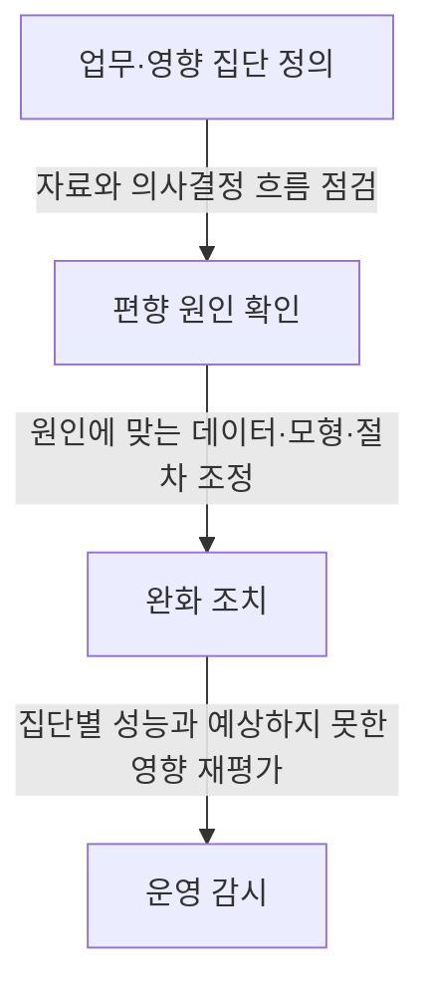
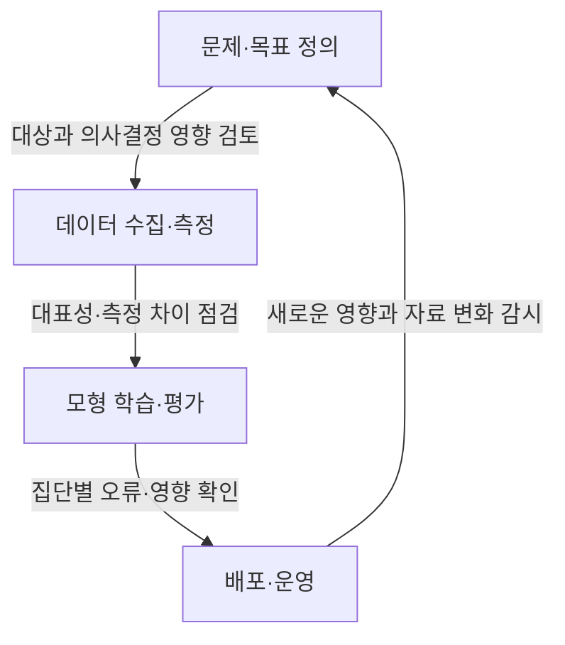

---
author: "Codex"
category: "03-data"
date: "2026-09-24T00:00:00+09:00"
extra:
  keyword_grade: "기초"
  model: "GPT-6"
  question_no: "038"
sidebar:
  badge:
    text: "기초"
    variant: "note"
  label: "038. 편향"
  order: 38
tags:
  - "notes-data"
title: "편향 (Bias)"
weight: 38
---

## 지식 로드맵 내 현재 위치

데이터 분석·머신러닝 → 데이터 품질·AI 신뢰성 → 편향

## 30초 인출

- 본질: **편향(Bias)**은 데이터·모형·의사결정 과정에서 결과가 특정 방향으로 체계적으로 치우치는 현상.
- 메커니즘: 수집·측정·설계·운영의 원인 식별 → 영향을 받는 집단과 업무 판단 확인 → 원인에 맞는 완화·감시.
- 회상 단서: 편향은 데이터 불균형만의 문제가 아니며, 조직·사회적 요인과 사람의 판단도 원인이 될 수 있음.

핵심 용어

- **편향(Bias)**: 데이터나 판단 결과가 특정 방향으로 지속적으로 치우치는 체계적 왜곡.
- **표집 편향(Sampling Bias)**: 표본이 목표 모집단을 제대로 대표하지 못해 생기는 왜곡.
- **측정 편향(Measurement Bias)**: 측정 도구·절차가 일부 값이나 집단을 일관되게 다르게 기록해 생기는 왜곡.
- **역사적 편향(Historical Bias)**: 과거의 사회적·제도적 불평등이 관측 자료나 목표값에 반영된 상태.
- **모형 편향(Model Bias)**: 모형의 가정·목적함수·학습 절차가 특정 오차 방향을 만드는 현상.
- **이상치(Outlier)**: 다른 관측값과 크게 떨어진 개별 관측치로, 그 자체가 편향을 뜻하지는 않음.
- **공정성 평가(Fairness Assessment)**: 시스템의 영향과 오류가 집단·사용 맥락에 따라 어떻게 다른지 검토하는 활동.

---

## 1교시 예상문제 (10점)

> 편향의 개념, 주요 발생 원인과 완화 방향을 설명하시오. (예상·10점)

---

## 1교시 10점 답안

### Ⅰ. 개요

| 구분 | 핵심 |
|---|---|
| 정의 | **편향**은 데이터·모형·의사결정 과정에서 결과가 특정 방향으로 체계적으로 치우치는 현상 |
| 목적 | 편향의 원인과 영향을 찾아 분석·예측 결과의 왜곡 및 부당한 영향을 줄이는 것 |

### Ⅱ. 발생 원인과 영향

| 발생 위치 | 원인 예 | 가능한 영향 |
|---|---|---|
| 데이터 수집 | 비대표 표본·누락 집단 | 모집단에 대한 추정·예측의 왜곡 |
| 측정·라벨링 | 집단별 기록 차이·주관적 기준 | 학습 목표와 실제 현상의 불일치 |
| 모형·운영 | 대리 변수·부적절한 평가 기준 | 특정 집단 또는 상황에서 오류 집중 |

### Ⅲ. 완화 흐름

**제언:** 모델 정확도와 함께 집단별 오류·서비스 영향을 검토할 기준을 마련.

---

## 2~4교시 예상문제 (25점)

> 편향의 개념과 데이터·모형·운영 과정에서의 주요 발생 원인을 설명하고, 영향 평가와 완화 방안을 제시하시오. (예상·25점)

---

## 2~4교시 25점 답안

## Ⅰ. 개요

| 구분 | 핵심 |
|---|---|
| 정의 | **편향**은 데이터·모형·의사결정 과정에서 결과가 특정 방향으로 체계적으로 치우치는 현상 |
| 목적 | 편향의 원인과 영향을 찾아 분석·예측 결과의 왜곡 및 부당한 영향을 줄이는 것 |

## Ⅱ. 원인과 발생 단계

| 단계 | 대표 원인 | 확인할 근거 |
|---|---|---|
| 문제 정의 | 과거 관행을 목표값으로 고정하거나 잘못된 대리 목표 설정 | 의사결정 목적·업무 규칙·대상 집단 |
| 데이터 구성 | 표집·선택·생존 편향, 대표성 부족 | 모집단과 표본의 차이·누락 집단 |
| 측정·라벨링 | 집단별 측정오차·주관적 라벨 | 측정 절차·라벨 기준·오류율 |
| 모형·배포 | 특징 선택·손실함수·사용 맥락의 부적합 | 집단별 오류와 실제 업무 영향 |

NIST AI RMF는 편향을 통계·계산상의 원인뿐 아니라 제도·사회와 사람의 인지 요인까지 포함해 다루며, 편향은 차별 의도가 없어도 생길 수 있음.

## Ⅲ. 편향과 인접 개념 구분

| 개념 | 의미 | 구별점 |
|---|---|---|
| 편향 | 결과가 특정 방향으로 체계적으로 치우침 | 반복·구조적 원인에 초점 |
| 분산(Variance) | 표본이나 학습 데이터가 달라질 때 결과가 변동 | 불안정성·민감도에 초점 |
| 이상치(Outlier) | 개별 관측값이 주변 자료와 크게 떨어짐 | 하나의 이상치가 편향의 충분조건은 아님 |
| 추정량 편향(Estimator Bias) | 추정량의 기대값과 추정 대상 모수의 차이 | 통계적 추정량의 성질을 가리키는 별도 의미 |

## Ⅳ. 원인별 완화 지점

| 완화 위치 | 가능한 조치 | 주의점 |
|---|---|---|
| 사전 처리 | 표집·측정 절차 개선, 누락 자료 보완 | 표본 수 증대만으로 대표성이 해결되지는 않음 |
| 학습 과정 | 목적함수·특징·학습 가중치 조정 | 공정성 지표 간 상충과 업무 맥락 검토 |
| 사후 처리·운영 | 결과 검토, 사용 조건·업무 절차 수정, 지속 감시 | 임계값 조정이 모든 맥락에 공정한 해결책은 아님 |

## Ⅴ. 영향 평가의 한계

| 한계 | 적용 시 고려 |
|---|---|
| 공정성 정의의 차이 | 보호 대상·의사결정 맥락·오류 비용에 따라 기준을 명시 |
| 지표 간 상충 | 한 지표의 개선이 다른 오류나 집단의 불이익을 키우는지 확인 |
| 편향의 사회기술적 원인 | 모델 성능 지표뿐 아니라 업무 규칙·사용자·이의 제기 경로도 검토 |
| 데이터·환경 변화 | 재학습·업무 변경 후에도 평가를 반복 |

## Ⅵ. 기술사적 제언

| 한계 | 해결 방안 |
|---|---|
| 평균 성능만 보는 배포 승인으로 특정 집단의 오류와 업무상 피해를 놓칠 위험 | 배포 전 영향 집단·업무 결과를 정하고 집단별 오류와 현장 이의 제기를 함께 검토하는 승인 절차 적용 |

## 출제 이력과 검증 출처

- 참고 문항: 제139회 정보관리기술사 관련 문항으로 기존 정리되어 있으나 공식 문제지 원문은 미확보, 직접 기출로 단정하지 않음
- [NIST AI Risk Management Framework 1.0](https://nvlpubs.nist.gov/nistpubs/ai/nist.ai.100-1.pdf) — AI 편향의 체계·통계·계산·인간 인지 요인과 위험관리
- [IBM AI Fairness 360](https://aif360.res.ibm.com/) — 편향 측정·완화 도구의 예

## 연결 토픽

- 연관 토픽: [이상치](./010_outlier.md) · [표본추출](./032_sampling.md) · [가설검정](./041_hypothesis_testing.md)
