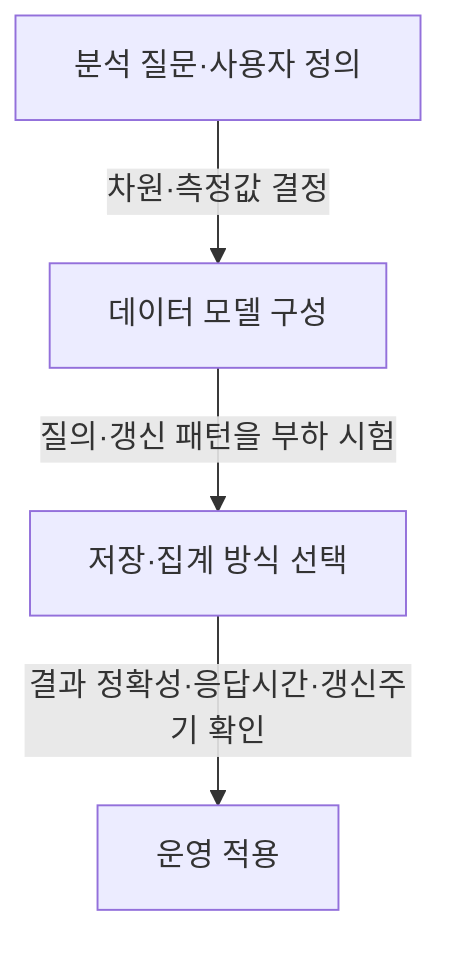

---
author: "Codex"
category: "03-data"
date: "2026-09-24T00:00:00+09:00"
extra:
  keyword_grade: "기초"
  model: "GPT-6"
  question_no: "039"
sidebar:
  badge:
    text: "기초"
    variant: "note"
  label: "039. OLAP"
  order: 39
tags:
  - "notes-data"
title: "OLAP (Online Analytical Processing) 및 MOLAP·ROLAP·HOLAP"
weight: 39
---

## 지식 로드맵 내 현재 위치

데이터 활용·분석 → 데이터 웨어하우스·비즈니스 인텔리전스 → OLAP

## 30초 인출

- 본질: **OLAP(Online Analytical Processing)**는 축적된 데이터를 여러 업무 차원으로 탐색·집계해 분석하는 처리 방식.
- 메커니즘: 분석 질의 → 차원·측정값 기준 집계와 탐색 → 표·보고서·시각화 결과.
- 회상 단서: ROLAP는 관계형 데이터에, MOLAP는 다차원 구조에, HOLAP는 두 방식을 함께 사용.

핵심 용어

- **OLAP(Online Analytical Processing)**: 데이터의 차원별 분석과 집계를 대화형으로 수행하는 처리 방식.
- **차원(Dimension)**: 시간·지역·제품처럼 측정값을 나누어 분석하는 관점.
- **측정값(Measure)**: 매출액·수량처럼 집계하거나 비교하는 수치.
- **롤업(Roll-up)**: 상세 수준의 값을 상위 차원 수준으로 요약하는 연산.
- **드릴다운(Drill-down)**: 요약된 값을 하위 차원 수준으로 세분하는 연산.
- **ROLAP(Relational OLAP)**: 관계형 데이터베이스의 테이블을 이용해 다차원 분석을 수행하는 방식.
- **MOLAP(Multidimensional OLAP)**: 다차원 데이터 구조와 집계를 활용하는 분석 방식.
- **HOLAP(Hybrid OLAP)**: 관계형 저장과 다차원 집계 구조를 함께 사용하는 방식.

---

## 1교시 예상문제 (10점)

> OLAP의 개념과 다차원 분석 연산 및 구현 방식을 설명하시오. (예상·10점)

---

## 1교시 10점 답안

### Ⅰ. 개요

| 구분 | 핵심 |
|---|---|
| 정의 | **OLAP**는 축적된 데이터를 여러 차원으로 탐색·집계해 분석하는 처리 방식 |
| 목적 | 업무 현황·추세·구성의 다각도 분석과 의사결정 지원 |

### Ⅱ. 다차원 분석 연산

| 연산 | 분석 동작 | 예 |
|---|---|---|
| Roll-up / Drill-down | 시간·조직 차원의 요약·세분 | 연도별 합계 ↔ 월별 내역 |
| Slice / Dice | 차원 값 고정 또는 여러 조건으로 부분 집합 선택 | 특정 연도 매출, 지역·제품 조합 |
| Pivot | 행·열 차원의 배치를 바꿔 다른 관점으로 조회 | 지역을 행에서 열로 전환 |

### Ⅲ. 구현 방식

| 방식 | 데이터·집계 처리 |
|---|---|
| ROLAP | 관계형 테이블 중심 질의 |
| MOLAP | 다차원 구조에 데이터·집계 저장 |
| HOLAP | 관계형 상세 데이터와 다차원 집계를 혼합 |

**제언:** 질의 유형·데이터 규모·갱신 요구를 측정해 저장 방식과 집계 수준을 선택.

---

## 2~4교시 예상문제 (25점)

> OLAP의 다차원 분석 구조와 주요 연산을 설명하고, ROLAP·MOLAP·HOLAP의 차이와 도입 시 고려사항을 제시하시오. (예상·25점)

---

## 2~4교시 25점 답안

## Ⅰ. 개요

| 구분 | 핵심 |
|---|---|
| 정의 | **OLAP**는 축적된 데이터를 여러 차원으로 탐색·집계해 분석하는 처리 방식 |
| 목적 | 업무 현황·추세·구성의 다각도 분석과 의사결정 지원 |

## Ⅱ. 다차원 데이터 구조

| 구성요소 | 역할 | 예 |
|---|---|---|
| 차원 | 측정값을 나누어 볼 분석 관점 | 시간·지역·제품 |
| 측정값 | 합계·평균 등으로 분석할 수치 | 매출액·판매수량 |
| 집계 | 차원 수준·조건에 따른 요약 결과 | 월별·지역별 합계 |

## Ⅲ. OLAP 연산

| 연산 | 데이터 관점의 변화 |
|---|---|
| Roll-up | 상세 차원 계층을 상위로 묶어 요약 |
| Drill-down | 요약 결과를 하위 차원으로 펼침 |
| Slice | 한 차원의 값을 고정해 부분 분석 |
| Dice | 여러 차원 조건을 적용해 부분 집합 분석 |
| Pivot | 분석 축을 바꾸어 행·열 배치 전환 |

## Ⅳ. 구현 구조 비교

| 구분 | ROLAP | MOLAP | HOLAP |
|---|---|---|---|
| 저장 기반 | 관계형 테이블 | 다차원 데이터 구조 | 관계형 상세와 다차원 집계 병용 |
| 집계 활용 | 질의 시 관계형 연산 중심 | 미리 계산한 집계를 활용할 수 있음 | 요약은 다차원, 상세는 관계형으로 나눌 수 있음 |
| 고려사항 | 질의·조인 성능과 관계형 저장 규모 | 사전 처리·저장공간·갱신 비용 | 두 구조의 동기화·운영 복잡도 |

제품과 구성에 따라 집계·갱신 동작과 성능은 달라지므로, 단일 방식이 항상 더 빠르거나 확장성이 높다고 일반화하지 않음.

## Ⅴ. 도입 시 점검

## Ⅵ. 기술사적 제언

| 한계 | 해결 방안 |
|---|---|
| 특정 질의의 빠른 응답만 보고 사전 집계를 늘리면 저장·갱신 비용이 커질 수 있음 | 실제 사용 질의와 갱신주기를 기준으로 자주 쓰는 집계만 선별하고, 상세 조회·데이터 변경 시의 비용도 함께 부하 시험 |

## 출제 이력과 검증 출처

- 참고 문항: 제122회 관련 문항으로 기존 정리되어 있으나 공식 문제지 원문은 미확보, 직접 기출로 단정하지 않음
- [IBM, What is OLAP?](https://www.ibm.com/think/topics/olap)
- [Microsoft Learn, Partition storage modes and processing](https://learn.microsoft.com/en-us/analysis-services/multidimensional-models-olap-logical-cube-objects/partitions-partition-storage-modes-and-processing?view=sql-analysis-services-2025)
- [Kimball Group, The Data Warehouse Toolkit](https://www.kimballgroup.com/data-warehouse-business-intelligence-resources/books/data-warehouse-toolkit/)

## 연결 토픽

- 연관 토픽: [스타 스키마](./137_star_schema.md) · [데이터 레이크](./007_data_lake.md) · [BI](./154_bi.md)
