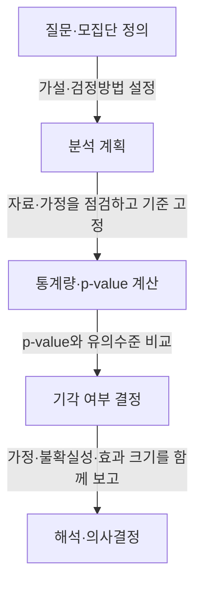

---
author: "Codex"
category: "03-data"
date: "2026-09-24T00:00:00+09:00"
extra:
  keyword_grade: "기초"
  model: "GPT-6"
  question_no: "041"
sidebar:
  badge:
    text: "기초"
    variant: "note"
  label: "041. 가설검정"
  order: 41
tags:
  - "notes-data"
title: "가설검정 (Hypothesis Testing)"
weight: 41
---

## 지식 로드맵 내 현재 위치

데이터 분석·통계 → 추론통계 → 가설검정

## 30초 인출

- 본질: **가설검정(Hypothesis Testing)**은 표본 자료가 가설과 얼마나 양립하는지 평가해 모집단에 관한 판단을 돕는 통계 절차.
- 메커니즘: 가설·검정방법·유의수준 설정 → 표본 통계량과 p-value 계산 → 사전 기준에 따라 귀무가설 기각 여부 판단.
- 회상 단서: 귀무가설을 기각하지 못했다고 해서 귀무가설이 참이라고 입증한 것은 아님.

핵심 용어

- **가설검정(Hypothesis Testing)**: 표본 근거와 확률 모형을 사용해 가설에 관한 결론을 내리는 추론 절차.
- **귀무가설(Null Hypothesis, H₀)**: 검정에서 기준으로 놓고 자료와의 양립성을 평가하는 가설.
- **대립가설(Alternative Hypothesis, H₁)**: 자료가 지지할 수 있는 귀무가설 외의 주장.
- **유의수준(Significance Level, α)**: 귀무가설이 참일 때 이를 기각할 제1종 오류 확률의 사전 허용 상한.
- **p-value**: 귀무가설과 검정 가정이 참일 때 관측 결과 또는 그보다 극단적인 결과가 나올 확률.
- **제1종 오류(Type I Error)**: 참인 귀무가설을 기각하는 오류.
- **제2종 오류(Type II Error)**: 거짓인 귀무가설을 기각하지 못하는 오류.
- **검정력(Statistical Power)**: 대립가설이 참일 때 귀무가설을 기각할 확률, 보통 `1−β`로 표시.

---

## 1교시 예상문제 (10점)

> 가설검정의 개념과 기본 절차, 검정 결과의 해석상 유의점을 설명하시오. (예상·10점)

---

## 1교시 10점 답안

### Ⅰ. 개요

| 구분 | 핵심 |
|---|---|
| 정의 | **가설검정**은 표본 근거와 확률 모형을 사용해 가설에 관한 결론을 내리는 추론 절차 |
| 목적 | 자료의 우연한 변동성을 고려한 모집단 의사결정 지원 |

### Ⅱ. 기본 절차와 판단

| 단계 | 주요 내용 |
|---|---|
| 가설·방법 설정 | 연구 질문에 맞는 귀무·대립가설과 검정방법 결정 |
| 기준 설정 | 자료 분석 전에 유의수준과 필요한 검정 조건 지정 |
| 통계적 판단 | 표본 통계량과 p-value 산출 후 p-value와 유의수준 비교 |
| 결론 | 기준에 따라 귀무가설 기각 또는 기각하지 못함으로 보고 |

### Ⅲ. 오류와 해석

| 구분 | 의미 | 기호 |
|---|---|---|
| 제1종 오류 | 참인 귀무가설의 기각 | α |
| 제2종 오류 | 거짓인 귀무가설을 기각하지 못함 | β |
| 검정력 | 대립가설이 참일 때 귀무가설을 기각할 확률 | 1−β |

**제언:** 통계적 유의성뿐 아니라 효과 크기와 업무상 중요성도 함께 검토.

---

## 2~4교시 예상문제 (25점)

> 가설검정의 개념과 수행 절차를 설명하고, 유의수준·p-value·제1종 및 제2종 오류와 검정력의 관계, 결과 해석 시 유의점을 논하시오. (예상·25점)

---

## 2~4교시 25점 답안

## Ⅰ. 개요

| 구분 | 핵심 |
|---|---|
| 정의 | **가설검정**은 표본 근거와 확률 모형을 사용해 가설에 관한 결론을 내리는 추론 절차 |
| 목적 | 자료의 우연한 변동성을 고려한 모집단 의사결정 지원 |

## Ⅱ. 가설 설정과 검정 기준

| 항목 | 내용 | 예 |
|---|---|---|
| 귀무가설 | 기준으로 놓고 자료와의 양립성을 평가하는 주장 | 두 집단의 평균 차이가 없음 |
| 대립가설 | 검정하려는 차이·효과가 있다는 주장 | 두 집단의 평균이 다름 |
| 유의수준 | 제1종 오류의 사전 허용 상한 | 분석 전에 α를 정함 |
| 검정 방향 | 질문에 따라 양측 또는 한쪽 방향을 사전에 지정 | 사후 결과에 맞춰 방향 변경 금지 |

## Ⅲ. 수행 절차

## Ⅳ. 오류와 검정력

| 실제 상태 / 판단 | 귀무가설 기각 | 귀무가설 기각하지 못함 |
|---|---|---|
| 귀무가설 참 | 제1종 오류(α) | 올바른 비기각 판단 |
| 대립가설 참 | 검정력(1−β) | 제2종 오류(β) |

표본 크기·효과 크기·변동성·유의수준에 따라 검정력이 달라짐. 다른 조건이 같을 때 표본 크기 증가는 검정력 향상에 기여할 수 있으나, 설계 결함·편향을 해결하지는 않음.

## Ⅴ. 결과 해석의 유의점

| 오해 | 올바른 해석 |
|---|---|
| p-value가 귀무가설이 참일 확률 | 귀무가설과 검정 가정 아래 관측 자료가 얼마나 극단적인지 나타내는 값 |
| p-value가 작으면 효과가 크거나 중요함 | 통계적 유의성과 효과 크기·업무상 중요성은 별도 판단 |
| 귀무가설 비기각은 차이가 없다는 증명 | 자료만으로 차이를 확인하지 못했다는 결론이며, 검정력·구간추정도 확인 |
| 유의수준 0.05는 모든 상황의 합격 기준 | 오류 비용·연구 설계·다중검정 등을 고려해 사전에 기준 설정 |
| 유의한 연관성은 인과관계의 증명 | 인과 해석은 실험 설계와 교란 요인 통제가 뒷받침할 때만 가능 |

## Ⅵ. 기술사적 제언

| 한계 | 해결 방안 |
|---|---|
| p-value 하나로 서비스 변경을 결정하면 통계적 차이와 실제 사용자 효과가 혼동될 위험 | 분석 전에 최소 실무 효과와 주요 지표를 정하고, 배포 검토에서 효과 크기·신뢰구간·검정 가정을 함께 확인 |

## 출제 이력과 검증 출처

- 참고 문항: 기존 노트에 제125회 공식 문제로 기재되어 있으나 공식 문제지 원문 링크 미확인
- [American Statistical Association, Statement on Statistical Significance and P-Values](https://www.amstat.org/asa/files/pdfs/p-valuestatement.pdf)
- [OpenIntro Statistics](https://www.openintro.org/book/os/) — 가설검정과 추론통계 기초

## 연결 토픽

- 연관 토픽: [기술통계와 추론통계](./036_descriptive_statistics.md) · [표본추출](./032_sampling.md) · [t-검정](./086_t_test.md)
