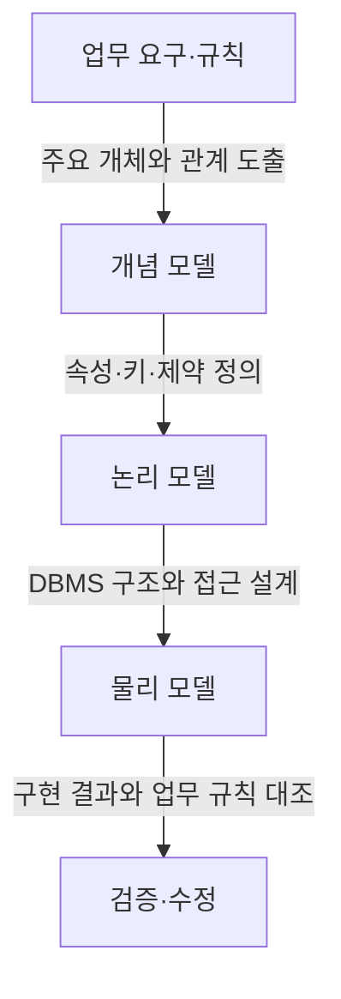

---
author: "Codex"
category: "03-data"
date: "2026-09-24T00:00:00+09:00"
extra:
  keyword_grade: "기초"
  model: "GPT-6"
  question_no: "042"
sidebar:
  badge:
    text: "기초"
    variant: "note"
  label: "042. 데이터 모델링"
  order: 42
tags:
  - "notes-data"
title: "데이터 모델링 (Data Modeling) 및 식별·비식별 관계"
weight: 42
---

## 지식 로드맵 내 현재 위치

데이터 설계 → 데이터베이스 아키텍처·모델링 → 데이터 모델링

## 30초 인출

- 본질: **데이터 모델링(Data Modeling)**은 업무에서 다루는 정보와 규칙을 데이터 구조와 관계로 표현하는 설계 활동.
- 메커니즘: 업무 요구 파악 → 개념·논리 구조 정의 → DBMS에 맞게 물리 설계.
- 회상 단서: 식별 관계는 부모 키가 자식 기본키의 일부이며, 비식별 관계에서는 자식 기본키와 외래키가 분리.

핵심 용어

- **데이터 모델링(Data Modeling)**: 업무 정보·규칙을 데이터 구조와 관계로 표현하는 설계 활동.
- **개념 모델(Conceptual Model)**: 주요 업무 개체와 관계를 높은 수준에서 표현한 모델.
- **논리 모델(Logical Model)**: 속성·키·관계·제약을 DBMS에 독립적으로 구체화한 모델.
- **물리 모델(Physical Model)**: 선택한 DBMS의 테이블·자료형·인덱스 등 구현 구조를 정한 모델.
- **식별 관계(Identifying Relationship)**: 부모 엔터티의 키가 자식 엔터티 기본키의 일부가 되는 관계.
- **비식별 관계(Non-identifying Relationship)**: 부모 키가 자식의 외래키이지만 기본키에는 포함되지 않는 관계.
- **기본키(Primary Key, PK)**: 행을 유일하게 식별하는 속성 또는 속성 조합.
- **외래키(Foreign Key, FK)**: 다른 테이블의 키를 참조하도록 선언한 속성 또는 속성 조합.

---

## 1교시 예상문제 (10점)

> 데이터 모델링의 3단계와 식별·비식별 관계의 차이를 설명하시오. (예상·10점)

---

## 1교시 10점 답안

### Ⅰ. 개요

| 구분 | 핵심 |
|---|---|
| 정의 | **데이터 모델링**은 업무 정보·규칙을 데이터 구조와 관계로 표현하는 설계 활동 |
| 목적 | 업무 규칙의 명확화와 일관된 데이터베이스 구현 기준 제공 |

### Ⅱ. 개념·논리·물리 모델

| 단계 | 설계 내용 | 주요 표현 |
|---|---|---|
| 개념 | 업무의 주요 대상과 관계 | 엔터티·관계 개요 |
| 논리 | 속성·키·관계·무결성 규칙 | 논리 데이터 모델·ERD |
| 물리 | DBMS에 맞춘 저장·접근 구조 | 테이블·자료형·인덱스 |

### Ⅲ. 식별·비식별 관계

| 구분 | 식별 관계 | 비식별 관계 |
|---|---|---|
| 부모 키의 위치 | 자식 기본키에 포함 | 자식 외래키에 포함, 기본키와 별도 |
| 모델링 의미 | 부모 키가 자식 식별의 일부 | 자식이 자체 키로 식별되고 부모를 참조 |

**제언:** 식별 관계는 업무상 종속성과 키 구성의 필요성을 확인한 뒤 선택.

---

## 2~4교시 예상문제 (25점)

> 데이터 모델링의 목적과 개념·논리·물리 설계 절차를 설명하고, 식별 관계와 비식별 관계의 차이 및 선택 기준을 제시하시오. (예상·25점)

---

## 2~4교시 25점 답안

## Ⅰ. 개요

| 구분 | 핵심 |
|---|---|
| 정의 | **데이터 모델링**은 업무 정보·규칙을 데이터 구조와 관계로 표현하는 설계 활동 |
| 목적 | 업무 규칙의 명확화와 일관된 데이터베이스 구현 기준 제공 |

## Ⅱ. 세 수준의 모델과 산출물

| 수준 | 핵심 질문 | 주요 내용 |
|---|---|---|
| 개념 모델 | 업무에서 무엇을 관리하는가 | 주요 개체와 업무 관계 |
| 논리 모델 | 개체를 어떤 규칙으로 식별·연결하는가 | 속성·기본키·외래키·제약·정규화 |
| 물리 모델 | 선택한 DBMS에서 어떻게 구현하는가 | 테이블·자료형·인덱스·파티션 등 |

## Ⅲ. 모델 구체화 흐름

## Ⅳ. 식별 관계와 비식별 관계

| 비교 기준 | 식별 관계 | 비식별 관계 |
|---|---|---|
| 키 구조 | 부모 키가 자식 기본키의 일부 | 부모 키는 외래키이며 자식 기본키와 분리 |
| 식별 방식 | 부모 키와 자식 자체 속성의 조합 등으로 식별 | 자식의 자체 기본키로 식별 |
| 선택 검토 | 자식의 식별 자체가 부모 식별에 의존하는 업무 규칙 | 자식이 독립 식별자를 가지며 부모 참조가 별도인 업무 규칙 |
| 제약 주의 | 기본키에 포함된 FK는 NULL이 될 수 없음 | FK의 NULL 허용 여부는 선택한 제약과 업무 규칙에 따름 |

두 관계의 표기 관례는 모델링 도구·표기법에 따라 확인하며, 관계 유형만으로 참조 무결성이나 성능 특성을 단정하지 않음.

## Ⅴ. 모델 검증 기준

| 검증 관점 | 확인 내용 |
|---|---|
| 업무 적합성 | 엔터티·속성·관계가 요구사항과 업무 규칙을 반영하는지 확인 |
| 식별성 | 후보키와 기본키가 행을 유일하게 식별하는지 확인 |
| 무결성 | 필수값·도메인·참조 관계 제약이 업무 규칙과 맞는지 확인 |
| 구현 가능성 | 물리 설계가 DBMS 기능·예상 부하·운영 제약에 맞는지 검토 |

## Ⅵ. 기술사적 제언

| 한계 | 해결 방안 |
|---|---|
| 논리 모델의 업무 규칙과 실제 DB 제약이 달라지면 중복·불일치가 누적될 위험 | 요구사항·논리 모델·DDL 제약의 추적표를 유지하고, 변경 시 모델과 구현을 함께 검토 |

## 출제 이력과 검증 출처

- 참고 문항: 제133회·제128회 관련 문항으로 기존 정리되어 있으나 공식 문제지 원문 링크 미확인
- [Oracle Database Concepts, Introduction to Oracle Database](https://docs.oracle.com/en/database/oracle/oracle-database/19/cncpt/introduction-to-oracle-database.html)
- [Data Modeling Essentials, Graeme Simsion and Graham Witt](https://www.sciencedirect.com/book/9780126445510/data-modeling-essentials)

## 연결 토픽

- 연관 토픽: [ERD](./028_erd.md) · [정규화](./019_normalization.md) · [참조 무결성](./070_referential_integrity.md)
