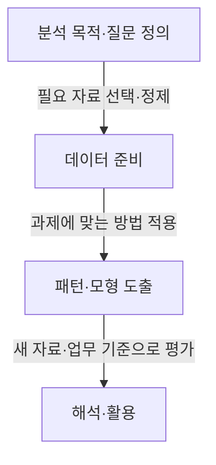
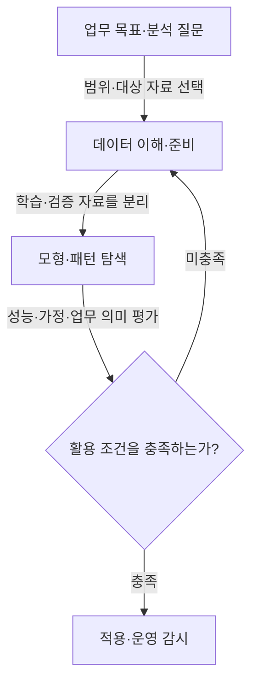

---
sidebar:
  order: 43
  label: "043. 데이터마이닝 (Data Mining)"
  badge:
    text: "기초"
    variant: note
title: "데이터마이닝 (Data Mining)"
author: "Codex"
date: "2026-09-24T00:00:00+09:00"
tags:
  - "notes-data"
weight: 43
extra:
  model: "GPT-6"
  keyword_grade: "기초"
  question_no: "043"
---

## 지식 로드맵 내 현재 위치

데이터 분석·활용 → 지식 발견·데이터마이닝 → 데이터마이닝

## 30초 인출

- 본질: **데이터마이닝(Data Mining)**은 데이터에서 분석 목적에 유용한 패턴·관계를 찾는 분석 활동.
- 메커니즘: 분석 목표 설정 → 데이터 준비 → 분석 기법 적용 → 결과 평가·활용.
- 회상 단서: 분류·회귀는 정답이 있는 자료의 예측, 군집·연관분석은 정답 라벨 없이 구조를 찾는 대표 과제.

핵심 용어

- **데이터마이닝(Data Mining)**: 데이터에서 분석 목적에 유용한 패턴·관계를 찾는 분석 활동.
- **KDD(Knowledge Discovery in Databases)**: 데이터 선택·변환·마이닝·해석을 거쳐 지식을 도출하는 과정.
- **분류(Classification)**: 입력 특징으로 사전 정의된 범주를 예측하는 분석 과제.
- **회귀(Regression)**: 입력 특징으로 연속형 수치를 추정하는 분석 과제.
- **군집화(Clustering)**: 정답 라벨 없이 유사한 관측값을 묶는 분석 과제.
- **연관규칙(Association Rule)**: 항목들이 함께 나타나는 경향을 규칙 형태로 표현한 결과.
- **과적합(Overfitting)**: 학습 자료의 우연한 특성까지 학습해 새 자료에서 성능이 떨어지는 현상.

---

## 1교시 예상문제 (10점)

> 데이터마이닝의 개념과 주요 분석 과제, 기본 수행 흐름을 설명하시오. (예상·10점)

---

## 1교시 10점 답안

### Ⅰ. 개요

| 구분 | 핵심 |
|---|---|
| 정의 | **데이터마이닝**은 데이터에서 분석 목적에 유용한 패턴·관계를 찾는 분석 활동 |
| 목적 | 데이터에 포함된 구조를 찾아 설명·예측·의사결정에 활용 |

### Ⅱ. 주요 분석 과제

| 과제 | 목표 | 예 |
|---|---|---|
| 분류 | 정해진 범주 예측 | 이탈 여부 분류 |
| 회귀 | 연속형 값 추정 | 수요량 추정 |
| 군집화 | 유사 자료의 그룹 탐색 | 이용 유형 구분 |
| 연관분석 | 함께 나타나는 항목 관계 탐색 | 구매 항목 조합 |

### Ⅲ. 수행 흐름

**제언:** 분석 결과를 도입하기 전에 데이터 범위와 실제 업무 판단에 미치는 영향을 검토.

---

## 2~4교시 예상문제 (25점)

> 데이터마이닝의 개념과 KDD 과정, 주요 분석 과제와 결과 평가 시 유의점을 설명하시오. (예상·25점)

---

## 2~4교시 25점 답안

## Ⅰ. 개요

| 구분 | 핵심 |
|---|---|
| 정의 | **데이터마이닝**은 데이터에서 분석 목적에 유용한 패턴·관계를 찾는 분석 활동 |
| 목적 | 데이터에 포함된 구조를 찾아 설명·예측·의사결정에 활용 |

## Ⅱ. KDD 과정에서의 위치

| KDD 활동 | 주요 내용 |
|---|---|
| 데이터 선택·이해 | 분석 질문에 맞는 자료와 범위 선정 |
| 전처리·변환 | 오류·결측·형식 차이를 정리하고 분석 표현으로 변환 |
| 데이터마이닝 | 분석 과제에 맞는 알고리즘으로 패턴·모형 도출 |
| 해석·평가 | 결과의 유효성·업무 의미·활용 가능성 검토 |

데이터마이닝은 지식 발견 과정의 분석 단계이며, 분석 목표와 결과 해석을 대신하지 않음.

## Ⅲ. 분석 과제와 출력

| 분석 과제 | 학습 자료 | 출력 | 평가 관점 예 |
|---|---|---|---|
| 분류 | 정답 범주가 있는 사례 | 범주·확률 | 혼동행렬·정밀도·재현율 등 |
| 회귀 | 정답 수치가 있는 사례 | 연속형 추정값 | 잔차·오차 크기 |
| 군집화 | 정답 라벨이 없는 관측값 | 그룹·군집 배정 | 군집 분리도와 업무 해석 |
| 연관분석 | 항목 집합·거래 기록 | 항목 간 규칙 | 지지도·신뢰도·향상도와 유용성 |

## Ⅳ. 분석 흐름과 검증

## Ⅴ. 적용 시 유의점

| 위험 | 확인·대응 |
|---|---|
| 대표성 부족·측정 오류 | 모집단·수집 과정·결측과 라벨 품질 확인 |
| 과적합·데이터 누출 | 독립 검증 자료와 적절한 분할 사용 |
| 성능지표와 업무목표 불일치 | 오류 비용·임계값·현장 기준에 맞는 지표 선택 |
| 패턴의 과잉 해석 | 상관을 인과로 단정하지 않고 업무 맥락과 재현성 검토 |

## Ⅵ. 기술사적 제언

| 한계 | 해결 방안 |
|---|---|
| 검증 자료에서 좋은 성능을 보여도 운영 데이터·업무 조건이 달라지면 결과가 흔들릴 위험 | 배포 전 실제 사용 조건에 맞는 검증 자료와 업무 수용 기준을 정하고, 운영 중 입력·성능 변화를 점검하는 절차를 마련 |

## 출제 이력과 검증 출처

- 참고 문항: 제129회 관련 문항으로 기존 정리되어 있으나 공식 문제지 원문 링크 미확인
- [Han, Kamber and Pei, Data Mining: Concepts and Techniques](https://www.sciencedirect.com/book/9780123814791/data-mining-concepts-and-techniques)
- [CRISP-DM 1.0: Step-by-step data mining guide](https://www.the-modeling-agency.com/crisp-dm.pdf)

## 연결 토픽

- 연관 토픽: [군집분석](./029_k_means.md) · [텍스트 마이닝](./015_text_mining.md) · [연관규칙분석](./072_association_rule_mining.md) · [차원 축소](./069_dimensionality_reduction_pca_mds.md)
