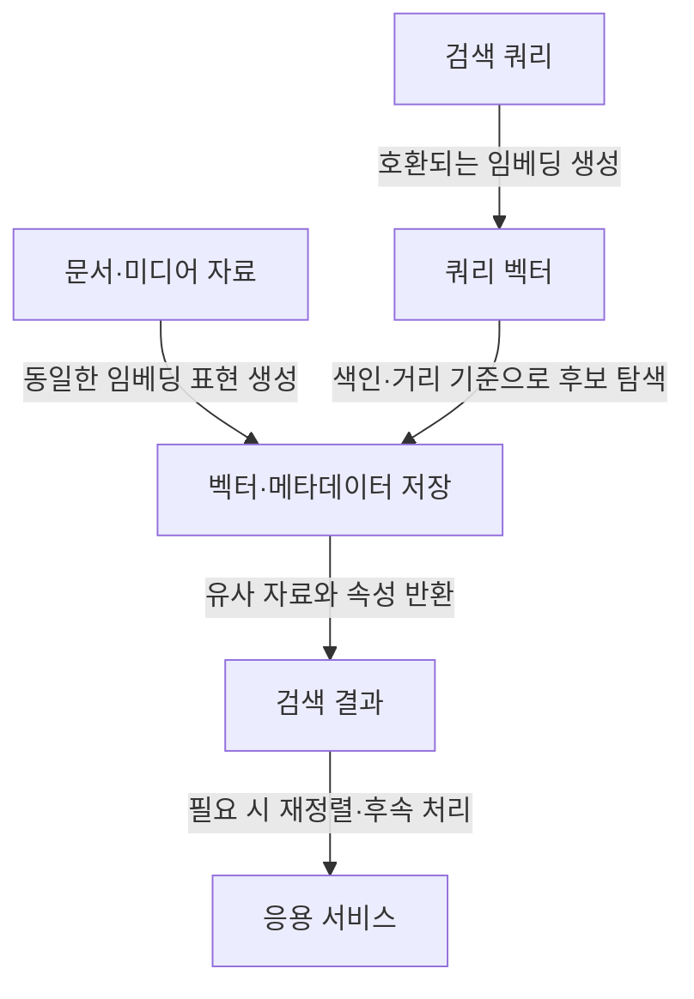

---
sidebar:
  order: 44
  label: "044. 벡터 데이터베이스 (Vector Database)"
  badge:
    text: "기초"
    variant: note
title: "벡터 데이터베이스 (Vector Database) 및 HNSW·IVF"
author: "Codex"
date: "2026-09-24T00:00:00+09:00"
tags:
  - "notes-data"
weight: 44
extra:
  model: "GPT-6"
  keyword_grade: "기초"
  question_no: "044"
---

## 지식 로드맵 내 현재 위치

데이터 저장·처리 → 검색·색인 → 벡터 데이터베이스

## 30초 인출

- 본질: **벡터 데이터베이스(Vector Database)**는 벡터와 관련 데이터를 저장하고 벡터 유사도 검색을 지원하는 데이터 저장·검색 시스템.
- 메커니즘: 임베딩 벡터 저장 → 거리·유사도 기준으로 이웃 검색 → 메타데이터와 함께 결과 반환.
- 회상 단서: ANN 색인은 검색 속도와 재현율 사이의 절충이며, HNSW와 IVF는 서로 다른 자료구조로 그 절충을 구현.

핵심 용어

- **벡터 데이터베이스(Vector Database)**: 벡터와 관련 메타데이터를 저장하고 유사도 검색을 지원하는 데이터 시스템.
- **임베딩(Embedding)**: 모델이 입력 자료의 특징을 수치 벡터로 표현한 결과.
- **최근접 이웃 검색(Nearest Neighbor Search)**: 쿼리 벡터와 거리가 가까운 벡터를 찾는 검색.
- **근사 최근접 이웃(Approximate Nearest Neighbor, ANN)**: 정확한 최근접 결과 일부를 놓칠 수 있는 대신 검색 비용을 줄이는 탐색 방식.
- **HNSW(Hierarchical Navigable Small World)**: 계층형 그래프를 따라 후보 벡터를 탐색하는 ANN 색인.
- **IVF(Inverted File Index)**: 벡터를 여러 중심점의 리스트로 나누고 쿼리와 가까운 일부 리스트를 검색하는 색인 방식.
- **재현율(Recall)**: 검색되어야 할 실제 관련 항목 중 검색 결과에 포함된 비율.
- **메타데이터 필터링(Metadata Filtering)**: 벡터 유사도 검색에 속성 조건을 함께 적용하는 검색 방식.

---

## 1교시 예상문제 (10점)

> 벡터 데이터베이스의 개념과 ANN 검색, HNSW·IVF의 차이를 설명하시오. (예상·10점)

---

## 1교시 10점 답안

### Ⅰ. 개요

| 구분 | 핵심 |
|---|---|
| 정의 | **벡터 데이터베이스**는 벡터와 관련 데이터를 저장하고 유사도 검색을 지원하는 데이터 시스템 |
| 목적 | 대규모 벡터 집합에서 의미상 가까운 자료를 찾아 분석·검색 서비스에 제공 |

### Ⅱ. 벡터 검색 구조

| 요소 | 역할 |
|---|---|
| 임베딩 벡터 | 검색 대상과 쿼리의 특징을 같은 공간의 수치로 표현 |
| 거리·유사도 함수 | 벡터 간 근접성을 계산하는 기준 |
| ANN 색인 | 일부 후보를 빠르게 찾아 정확 탐색보다 검색 비용을 줄임 |
| 메타데이터 | 유형·권한·날짜 등 조건에 따른 필터링 지원 |

### Ⅲ. HNSW와 IVF

| 색인 | 탐색 구조 | 고려할 절충 |
|---|---|---|
| HNSW | 계층형 근접 그래프 탐색 | 검색 품질·지연과 메모리·구축 시간의 균형 |
| IVF | 중심점별 리스트에서 가까운 일부를 탐색 | 리스트·탐색 범위와 속도·재현율의 균형 |

**제언:** 실제 데이터와 검색 조건에서 정확 검색 대비 지연·재현율·자원 사용량을 측정해 색인을 선택.

---

## 2~4교시 예상문제 (25점)

> 벡터 데이터베이스의 구성과 검색 흐름을 설명하고, 정확 최근접 검색과 ANN 검색 및 HNSW와 IVF의 구조·선택 기준을 비교하시오. (예상·25점)

---

## 2~4교시 25점 답안

## Ⅰ. 개요

| 구분 | 핵심 |
|---|---|
| 정의 | **벡터 데이터베이스**는 벡터와 관련 데이터를 저장하고 유사도 검색을 지원하는 데이터 시스템 |
| 목적 | 대규모 벡터 집합에서 의미상 가까운 자료를 찾아 분석·검색 서비스에 제공 |

## Ⅱ. 구성요소와 검색 조건

| 구성요소 | 핵심 역할 | 설계상 확인사항 |
|---|---|---|
| 벡터 생성 | 입력 자료의 특징을 벡터화 | 쿼리와 저장 자료의 모델·차원·전처리 호환성 |
| 벡터 저장 | 벡터·식별자·관련 자료 관리 | 자료 갱신과 원천 데이터의 연결 |
| 거리 기준 | 근접도 계산 | 임베딩 모델에 맞는 거리·유사도 함수 |
| 색인 | 후보 탐색 가속 | 재현율·지연·메모리·구축 비용 |
| 필터 조건 | 메타데이터 기반 범위 제한 | 필터 적용 순서와 색인의 상호작용 |

## Ⅲ. 정확 검색과 ANN 검색

| 구분 | 정확 최근접 검색 | ANN 검색 |
|---|---|---|
| 후보 처리 | 전체 대상의 거리 비교 | 색인이 고른 일부 후보 중심으로 탐색 |
| 결과 | 기준에 따른 정확한 최근접 결과 | 설정에 따라 일부 최근접 항목 누락 가능 |
| 고려요소 | 데이터 규모에 따른 검색 비용 | 속도·재현율·자원 요구 간 절충 |

## Ⅳ. HNSW와 IVF 작동 비교

| 기준 | HNSW | IVF |
|---|---|---|
| 색인 구조 | 다층 근접 그래프 | 중심점별 벡터 리스트 |
| 쿼리 탐색 | 상위 계층에서 후보를 좁히고 아래 계층으로 탐색 | 쿼리와 가까운 일부 리스트를 골라 탐색 |
| 구축·검색 특성 | 구축 시간·메모리와 검색 품질·속도의 절충 | 데이터 분할·탐색 리스트 수와 속도·재현율의 절충 |
| 데이터 반영 | 구현에 따라 추가·갱신 특성 확인 | 색인 구축 시 데이터 분포를 반영하므로 갱신·재구축 방식 확인 |

## Ⅴ. 검색 서비스 적용 흐름

## Ⅵ. 기술사적 제언

| 한계 | 해결 방안 |
|---|---|
| ANN 설정이나 메타데이터 필터가 달라지면 검색 품질·자원 비용이 달라질 수 있음 | 대표 질의와 권한·속성 필터를 포함한 평가셋으로 정확 검색을 기준 비교하고, 재현율·지연·자원 사용량을 함께 고려해 색인·탐색 범위를 조정 |

## 출제 이력과 검증 출처

- 제137회 정보관리기술사 4교시 2번: 벡터 데이터베이스 검색을 위한 HNSW·IVF 동작 원리(공식 Q-Net 문제지 대조)
- [pgvector 공식 문서](https://github.com/pgvector/pgvector) — 정확·근사 검색, HNSW·IVFFlat의 구조와 성능 절충
- [Malkov and Yashunin, Efficient and robust approximate nearest neighbor search using Hierarchical Navigable Small World graphs](https://arxiv.org/abs/1603.09320)
- [Jégou et al., Product Quantization for Nearest Neighbor Search](https://inria.hal.science/inria-00514462/document)

## 연결 토픽

- 연관 토픽: [차원 축소](./069_dimensionality_reduction_pca_mds.md) · [데이터베이스 인덱스](./047_index.md) · [다차원 색인구조](./052_multidimensional_index_structure.md)
