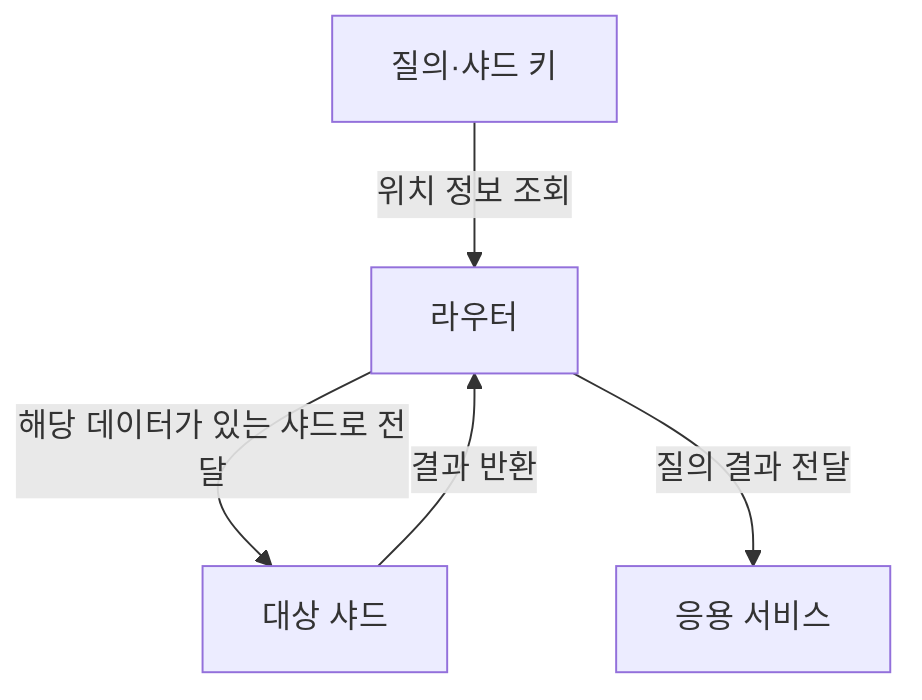
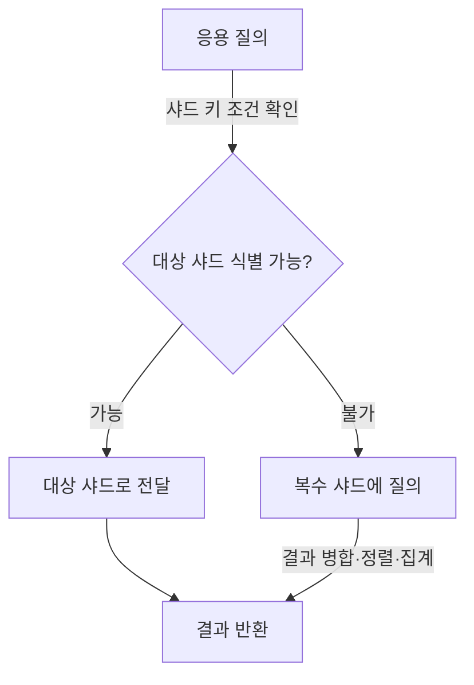

---
sidebar:
  order: 45
  label: "045. 데이터베이스 샤딩"
  badge:
    text: "기초"
    variant: note
title: "데이터베이스 샤딩 (Database Sharding)"
author: "Codex"
date: "2026-09-24T00:00:00+09:00"
tags:
  - "notes-data"
weight: 45
extra:
  model: "GPT-6"
  keyword_grade: "기초"
  question_no: "045"
---

## 지식 로드맵 내 현재 위치

데이터 저장·처리 → 분산 데이터베이스·확장성 → 데이터베이스 샤딩

## 30초 인출

- 본질: **데이터베이스 샤딩(Database Sharding)**은 한 데이터 집합을 여러 노드에 나누어 저장·처리하는 수평 확장 방식.
- 메커니즘: 샤드 키 결정 → 키 값으로 데이터 위치 지정 → 라우터가 질의를 해당 샤드 또는 여러 샤드로 전달.
- 회상 단서: 키 분포가 불균형하거나 질의에 샤드 키가 없으면 핫스팟·여러 샤드 조회가 생길 수 있음.

핵심 용어

- **샤딩(Sharding)**: 데이터 집합을 여러 노드에 분할해 저장하는 수평 분산 방식.
- **샤드(Shard)**: 분할된 데이터의 일부를 저장·처리하는 노드 또는 노드 그룹.
- **샤드 키(Shard Key)**: 각 데이터 항목을 어느 샤드에 둘지 결정하는 키.
- **범위 샤딩(Range Sharding)**: 키 값의 범위에 따라 데이터를 나누는 방식.
- **해시 샤딩(Hash Sharding)**: 키의 해시값을 기준으로 데이터를 분산하는 방식.
- **핫스팟(Hotspot)**: 일부 샤드에 요청이나 데이터가 집중되는 상태.
- **샤드 라우팅(Shard Routing)**: 질의 조건에 따라 요청을 대상 샤드로 전달하는 기능.

---

## 1교시 예상문제 (10점)

> 데이터베이스 샤딩의 개념과 분할·라우팅 구조, 주요 설계 유의점을 설명하시오. (예상·10점)

---

## 1교시 10점 답안

### Ⅰ. 개요

| 구분 | 핵심 |
|---|---|
| 정의 | **데이터베이스 샤딩**은 한 데이터 집합을 여러 노드에 나누어 저장·처리하는 수평 확장 방식 |
| 목적 | 단일 노드의 저장·처리 용량 한계를 분산해 시스템 용량을 확장 |

### Ⅱ. 분할과 질의 처리

| 구성요소 | 역할 |
|---|---|
| 샤드 키 | 각 데이터의 분할 위치를 결정 |
| 샤드 | 할당된 데이터의 일부를 저장·처리 |
| 라우터·카탈로그 | 키 범위·매핑 정보를 보고 요청을 대상 샤드로 전달 |

### Ⅲ. 설계상 유의점

| 선택·상황 | 고려사항 |
|---|---|
| 범위·해시 키 선택 | 질의 패턴, 키 분포, 증가성 검토 |
| 키가 포함된 질의 | 해당 샤드로 좁힐 수 있는지 확인 |
| 키가 없는 질의 | 여러 샤드 조회와 결과 통합 비용 고려 |
| 데이터 증가·편중 | 재분배·재샤딩 절차와 핫스팟 감시 |

**제언:** 주요 질의 패턴과 예상 데이터 분포를 함께 기준으로 삼아 샤드 키를 선정.

---

## 2~4교시 예상문제 (25점)

> 데이터베이스 샤딩의 구조와 분할 방식을 설명하고, 샤드 키·질의 라우팅·데이터 재분배의 설계 고려사항을 제시하시오. (예상·25점)

---

## 2~4교시 25점 답안

## Ⅰ. 개요

| 구분 | 핵심 |
|---|---|
| 정의 | **데이터베이스 샤딩**은 한 데이터 집합을 여러 노드에 나누어 저장·처리하는 수평 확장 방식 |
| 목적 | 단일 노드의 저장·처리 용량 한계를 분산해 시스템 용량을 확장 |

## Ⅱ. 구성과 책임

| 구성요소 | 책임 |
|---|---|
| 샤드 키 | 데이터의 분할·배치 기준 |
| 샤드 | 데이터 일부의 저장·질의 처리 |
| 라우터 | 샤드 키·위치 정보를 바탕으로 질의 전달 |
| 메타데이터·카탈로그 | 키 범위나 샤드 배치 정보를 관리 |
| 복제본(선택) | 가용성·읽기 처리 등을 지원하는 별도 복제 구성 |

샤딩은 데이터를 나누는 방식이며, 복제는 동일 데이터의 복사본을 두는 방식. 실제 시스템은 두 구조를 함께 사용할 수 있음.

## Ⅲ. 분할 방식 비교

| 방식 | 배치 원리 | 장점 | 주의점 |
|---|---|---|---|
| 범위 | 키 값의 연속 범위로 분할 | 범위 검색과 순서 질의에 유리할 수 있음 | 단조 증가 키나 불균등 범위에서 핫스팟 가능 |
| 해시 | 키의 해시 결과로 분할 | 특정 키 값의 편중 완화에 유리할 수 있음 | 범위 검색이 여러 샤드로 퍼질 수 있음 |

## Ⅳ. 질의 라우팅과 결과 통합

## Ⅴ. 주요 설계 위험

| 한계 | 설계 대응 |
|---|---|
| 키 분포 불균형·단조 증가로 인한 핫스팟 | 키 빈도·증가성 분석, 분할 기준·배치 전략 검토 |
| 키 조건 없는 질의의 팬아웃 | 주요 질의에 샤드 키를 포함하고 복수 샤드 결과 통합 비용 측정 |
| 데이터 성장에 따른 재분배 | 이동량·운영 영향·복구 절차를 포함한 재샤딩 계획 |
| 샤드 간 트랜잭션·조인 | 업무 경계와 트랜잭션 범위를 고려해 데이터 배치 설계 |

## Ⅵ. 기술사적 제언

| 한계 | 해결 방안 |
|---|---|
| 처리량 분산만으로 키 편중·전체 샤드 질의 문제가 해결되지 않는 구조 | 서비스의 주요 읽기·쓰기 질의와 키 분포를 함께 평가해 키를 정하고, 용량 증가 시 재분배를 시험할 운영 절차를 마련 |

## 출제 이력과 검증 출처

- [MongoDB Manual, Sharding](https://www.mongodb.com/docs/manual/sharding/)
- [MongoDB Manual, Choose a Shard Key](https://www.mongodb.com/docs/manual/core/sharding-choose-a-shard-key/)

## 연결 토픽

- 연관 토픽: [데이터베이스 인덱스](./047_index.md) · [확장성 해싱](./050_extendible_hashing.md) · [고가용성 아키텍처](./051_ha_architecture.md)
