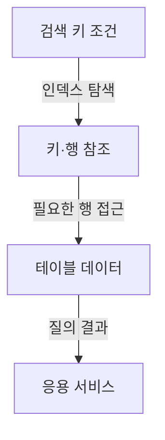

---
sidebar:
  order: 47
  label: "047. 데이터베이스 인덱스"
  badge:
    text: "기초"
    variant: note
title: "데이터베이스 인덱스 (Index) 및 클러스터드·논클러스터드 인덱스"
author: "Codex"
date: "2026-09-24T00:00:00+09:00"
tags:
  - "notes-data"
weight: 47
extra:
  model: "GPT-6"
  keyword_grade: "기초"
  question_no: "047"
---

## 지식 로드맵 내 현재 위치

데이터베이스 → 물리적 데이터베이스 설계·튜닝 → 인덱스

## 30초 인출

- 본질: **데이터베이스 인덱스(Database Index)**는 검색 조건에 맞는 행을 더 적은 탐색으로 찾도록 돕는 보조 자료구조.
- 메커니즘: 검색 키를 인덱스에서 탐색 → 행 위치 또는 기본키 참조 → 테이블 자료 접근.
- 회상 단서: 인덱스는 조회 비용을 줄일 수 있지만 저장공간과 쓰기·유지 비용을 추가.

핵심 용어

- **데이터베이스 인덱스(Database Index)**: 검색 키와 행 위치·참조를 관리해 자료 탐색을 돕는 보조 구조.
- **B-tree 인덱스(B-tree Index)**: 정렬된 키 구조로 동등·범위 검색을 지원하는 대표 인덱스.
- **클러스터드 인덱스(Clustered Index)**: 일부 DBMS에서 인덱스 키에 따라 테이블 행을 저장·구성하는 인덱스.
- **논클러스터드 인덱스(Nonclustered Index)**: 테이블 행과 별도 구조로 키와 행 참조를 관리하는 인덱스.
- **복합 인덱스(Composite Index)**: 둘 이상의 열을 키 순서로 구성한 인덱스.
- **커버링 인덱스(Covering Index)**: 질의에 필요한 값을 인덱스만으로 제공할 수 있는 인덱스 구성.
- **실행 계획(Execution Plan)**: DBMS가 질의를 처리하기 위해 선택한 접근·연산 절차.

---

## 1교시 예상문제 (10점)

> 데이터베이스 인덱스의 목적과 동작을 설명하고, 클러스터드·논클러스터드 인덱스를 비교하시오. (예상·10점)

---

## 1교시 10점 답안

### Ⅰ. 개요

| 구분 | 핵심 |
|---|---|
| 정의 | **데이터베이스 인덱스**는 검색 조건에 맞는 행을 더 적은 탐색으로 찾도록 돕는 보조 자료구조 |
| 목적 | 데이터 검색의 접근 비용을 줄이고 질의 응답을 지원 |

### Ⅱ. 검색 동작

### Ⅲ. 클러스터드·논클러스터드 비교

| 구분 | 클러스터드 | 논클러스터드 |
|---|---|---|
| 자료 위치 | 해당 DBMS에서 키 순서에 따라 행을 저장·구성 | 테이블과 별도 구조에 키·행 참조 저장 |
| 조회 특성 | 키 순서의 범위 접근에 유리할 수 있음 | 여러 검색 조건을 별도 색인으로 지원 가능 |
| 비용 | 저장 순서와 갱신 구조 고려 | 추가 공간·쓰기 및 참조 접근 비용 고려 |

**제언:** 자주 실행되는 질의의 실행 계획과 데이터 변경량을 함께 확인해 인덱스를 선택.

---

## 2~4교시 예상문제 (25점)

> 데이터베이스 인덱스의 구조와 검색 동작을 설명하고, 클러스터드·논클러스터드 및 복합 인덱스의 선택 기준과 운영상 유의점을 제시하시오. (예상·25점)

---

## 2~4교시 25점 답안

## Ⅰ. 개요

| 구분 | 핵심 |
|---|---|
| 정의 | **데이터베이스 인덱스**는 검색 조건에 맞는 행을 더 적은 탐색으로 찾도록 돕는 보조 자료구조 |
| 목적 | 데이터 검색의 접근 비용을 줄이고 질의 응답을 지원 |

## Ⅱ. 인덱스의 기본 구조와 접근

| 구성요소 | 역할 |
|---|---|
| 검색 키 | 인덱스가 정렬·탐색하는 열 또는 열 조합 |
| 탐색 구조 | 키를 비교해 해당 키나 범위의 위치를 찾음 |
| 행 참조 | 테이블 행 또는 기본키를 통해 실제 자료에 접근 |

## Ⅲ. 클러스터드·논클러스터드 구조

| 항목 | 클러스터드 | 논클러스터드 |
|---|---|---|
| 저장 관계 | DBMS에 따라 인덱스 키가 테이블 행 저장 순서를 결정 | 테이블 행과 별도 인덱스 구조 |
| 행 참조 | 행이 인덱스 리프에 저장되는 구현 가능 | 행 위치 또는 클러스터링 키 등을 참조하는 구현 |
| 고려사항 | 테이블당 개수·갱신 방식은 DBMS에 따라 다름 | 여러 보조 인덱스는 공간과 쓰기 비용 증가 |

## Ⅳ. 인덱스 선택과 질의 처리

| 질의 특성 | 검토할 인덱스 구성 | 확인 방법 |
|---|---|---|
| 동등·범위 검색 | 검색 열의 B-tree 계열 인덱스 | 조건 선택도·정렬·실행 계획 |
| 여러 열 조건 | 조건 순서와 선두 열을 고려한 복합 인덱스 | 실제 필터·정렬 조합의 계획 비교 |
| 인덱스만으로 응답 가능 | 질의 열을 포함한 커버링 구성 | 추가 테이블 접근과 저장 비용 비교 |

## Ⅴ. 인덱스의 운영상 절충

| 이점 | 비용·위험 |
|---|---|
| 조건 검색·정렬·범위 접근 지원 | 디스크 공간과 백업 대상 증가 |
| 적절한 선택도로 테이블 탐색 감소 | 삽입·수정·삭제 시 인덱스 갱신 비용 |
| 복합·포함 열로 질의 접근 경로 조정 | 불필요한 인덱스·낮은 선택도의 인덱스는 성능 저하 가능 |

인덱스 종류·클러스터드 의미·최적화기 선택은 DBMS와 질의·데이터 분포에 따라 달라지므로 실제 실행 계획과 부하 측정으로 판단.

## Ⅵ. 기술사적 제언

| 한계 | 해결 방안 |
|---|---|
| 읽기 질의 하나만 보고 인덱스를 추가하면 쓰기·저장·다른 질의 비용이 커질 위험 | 대표 읽기·쓰기 질의를 묶어 실행 계획과 부하를 측정하고, 이득이 확인된 인덱스만 유지·점검 |

## 출제 이력과 검증 출처

- [Microsoft Learn, Clustered and Nonclustered Indexes](https://learn.microsoft.com/sql/relational-databases/indexes/clustered-and-nonclustered-indexes-described?view=azuresqldb-current)
- [PostgreSQL Documentation, Indexes](https://www.postgresql.org/docs/current/indexes.html)
- [PostgreSQL Documentation, CLUSTER](https://www.postgresql.org/docs/18/sql-cluster.html)

## 연결 토픽

- 연관 토픽: [데이터베이스 샤딩](./045_sharding.md) · [참조 무결성](./070_referential_integrity.md) · [다차원 색인구조](./052_multidimensional_index_structure.md)
