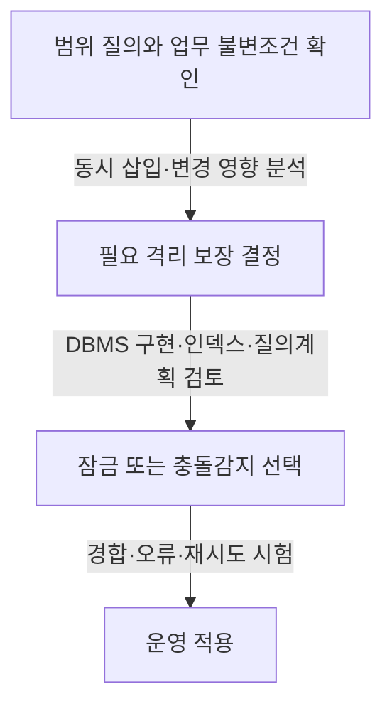

---
sidebar:
  order: 49
  label: "049. 팬텀 현상과 충돌"
  badge:
    text: "기초"
    variant: note
title: "팬텀 충돌 (Phantom Conflict) 및 방지 기법 (Next-Key Lock, Predicate Lock)"
author: "Codex"
date: "2026-09-24T00:00:00+09:00"
tags:
  - "notes-data"
weight: 49
extra:
  model: "GPT-6"
  keyword_grade: "기초"
  question_no: "049"
---

## 지식 로드맵 내 현재 위치

데이터베이스 → 트랜잭션·동시성 제어 → 팬텀 현상

## 30초 인출

- 본질: **팬텀 읽기(Phantom Read)**는 같은 트랜잭션에서 같은 조건으로 다시 조회했을 때 다른 트랜잭션의 커밋으로 결과 행 집합이 달라지는 현상.
- 메커니즘: 검색 조건이 정의하는 범위 안에 다른 트랜잭션이 행을 삽입·변경·삭제 → 같은 조건 재조회 시 집합 차이.
- 회상 단서: InnoDB의 넥스트키 잠금은 인덱스 레코드와 간격 잠금을 결합하고, PostgreSQL Serializable의 predicate lock은 비직렬화 충돌을 감지해 재시도를 요구할 수 있음.

핵심 용어

- **팬텀 읽기(Phantom Read)**: 같은 검색 조건의 반복 조회에서 결과 집합이 다른 트랜잭션의 커밋 때문에 달라지는 현상.
- **범위 검색(Predicate Query)**: 조건식으로 여러 행의 집합을 검색하는 질의.
- **넥스트키 잠금(Next-Key Lock)**: InnoDB가 인덱스 레코드 잠금과 그 앞 간격의 갭 잠금을 결합한 잠금 방식.
- **갭 잠금(Gap Lock)**: 인덱스 키 사이의 간격에 삽입되는 것을 제한하는 잠금.
- **술어 잠금(Predicate Lock)**: 검색 조건과 충돌하는 동시 쓰기를 추적해 직렬화 이상을 감지하는 잠금 개념.
- **직렬화 실패(Serialization Failure)**: 동시 실행이 직렬 실행과 동등한 결과를 보장할 수 없어 트랜잭션을 취소하는 오류.
- **격리 수준(Isolation Level)**: 동시 트랜잭션 간 읽기·쓰기 상호작용을 제한하는 보장 수준.
- **MVCC (Multi-Version Concurrency Control)**: 트랜잭션이 데이터 버전을 이용해 동시 읽기·쓰기를 조정하는 방식.
- **DBMS (Database Management System)**: 데이터베이스를 정의·저장·조회·관리하는 소프트웨어.

---

## 1교시 예상문제 (10점)

> 팬텀 읽기의 개념과 발생 조건, 넥스트키 잠금 및 술어 잠금의 차이를 설명하시오. (예상·10점)

---

## 1교시 10점 답안

### Ⅰ. 개요

| 구분 | 핵심 |
|---|---|
| 정의 | **팬텀 읽기**는 같은 검색 조건의 반복 조회에서 결과 집합이 다른 트랜잭션의 커밋 때문에 달라지는 현상 |
| 목적 | 범위 조회와 동시 쓰기 사이의 일관성 요구를 식별하고 적절한 격리·충돌 처리를 선택 |

### Ⅱ. 발생 상황과 대책

| 상황 | 설명 |
|---|---|
| 반복 범위 조회 | 트랜잭션 A가 조건 조회 후 다시 조회하기 전에 트랜잭션 B가 조건을 만족하는 행을 커밋 |
| 결과 | A의 두 번째 결과에 새 행이 포함되어 집합이 달라질 수 있음 |
| 대책 | 격리 수준·DBMS 동작에 맞춰 범위 잠금 또는 직렬화 충돌 감지 사용 |

### Ⅲ. 잠금 개념 비교

| 기법 | 개념 |
|---|---|
| 넥스트키 잠금 | InnoDB의 인덱스 레코드·간격 잠금 결합으로 특정 삽입을 막는 방식 |
| 술어 잠금 | 검색 조건과 충돌하는 쓰기를 추적해 직렬화 실패를 감지하는 방식; 구현에 따라 비차단적일 수 있음 |

**제언:** 잠금 전략을 선택할 때 목표 격리수준과 DBMS별 구현을 함께 확인.

---

## 2~4교시 예상문제 (25점)

> 팬텀 읽기의 발생 원리를 설명하고, 넥스트키 잠금과 술어 잠금 등 동시성 제어 방식의 차이와 적용 시 유의점을 논하시오. (예상·25점)

---

## 2~4교시 25점 답안

## Ⅰ. 개요

| 구분 | 핵심 |
|---|---|
| 정의 | **팬텀 읽기**는 같은 검색 조건의 반복 조회에서 결과 집합이 다른 트랜잭션의 커밋 때문에 달라지는 현상 |
| 목적 | 범위 조회와 동시 쓰기 사이의 일관성 요구를 식별하고 적절한 격리·충돌 처리를 선택 |

## Ⅱ. 팬텀 발생 흐름

| 시점 | 트랜잭션 A | 트랜잭션 B |
|---|---|---|
| 1 | 조건 `id > 100` 조회, 결과 행 확인 | |
| 2 | | `id = 101`인 행 삽입 후 커밋 |
| 3 | 같은 조건으로 재조회 | |
| 결과 | 새 행이 포함되면 두 결과 집합이 달라짐 | |

## Ⅲ. DBMS별 보호 방식

| 기법 | 예시 구현 | 동작과 제한 |
|---|---|---|
| 넥스트키 잠금 | MySQL InnoDB | 인덱스 레코드와 앞 간격을 잠가 관련 삽입을 제한; 인덱스·격리·질의 형태에 좌우 |
| 술어 충돌 감지 | PostgreSQL Serializable Snapshot Isolation | 읽은 조건과 충돌할 쓰기를 추적하고 직렬화 이상이면 트랜잭션 취소·재시도; predicate lock 자체는 일반 차단 잠금과 다름 |
| 스냅샷 기반 반복 읽기 | MVCC 기반 DBMS별 격리수준 | 트랜잭션 스냅샷을 유지해 재조회 결과를 안정화할 수 있으나 직렬화 가능성과는 별도 보장 |

## Ⅳ. 동시성 제어의 절충

| 접근 | 일관성 확보 방식 | 운영 고려사항 |
|---|---|---|
| 범위·갭 잠금 | 조건에 해당할 삽입을 차단 | 대기·교착 가능성, 인덱스와 실행계획 영향 |
| 직렬화 충돌 감지 | 위험한 실행을 취소하고 재시도 | 재시도 로직과 반복 실패 모니터링 |
| 스냅샷 격리 | 트랜잭션이 같은 버전의 자료를 읽음 | 비반복 읽기·팬텀과 직렬화 이상 보장 여부가 DBMS별로 다름 |

## Ⅴ. 선택·검증 흐름

## Ⅵ. 기술사적 제언

| 한계 | 해결 방안 |
|---|---|
| 범위 잠금이 모든 팬텀을 같은 방식으로 막는다고 가정하면 DBMS·질의계획 차이를 놓칠 위험 | 업무 불변조건을 재현하는 동시 트랜잭션 시험을 만들고, 선택한 격리수준에서 결과·차단·재시도를 함께 검증 |

## 출제 이력과 검증 출처

- [MySQL 8.4 Reference Manual, Phantom Rows](https://dev.mysql.com/doc/refman/8.4/en/innodb-next-key-locking.html)
- [PostgreSQL 18 Documentation, Transaction Isolation](https://www.postgresql.org/docs/current/transaction-iso.html)

## 연결 토픽

- 연관 토픽: [트랜잭션](./078_transaction.md) · [데이터베이스 인덱스](./047_index.md)
