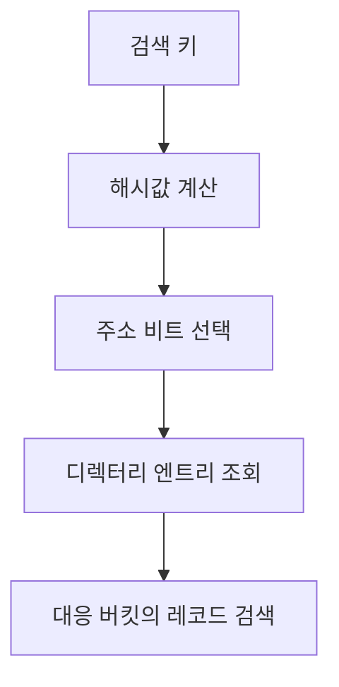

---
sidebar:
  order: 50
  label: "050. 확장 해싱"
  badge:
    text: "기초"
    variant: note
title: "확장 해싱 (Extendible Hashing)"
author: "Codex"
date: "2026-09-24T00:00:00+09:00"
tags:
  - "notes-data"
weight: 50
extra:
  model: "GPT-6"
  keyword_grade: "기초"
  question_no: "050"
---

## 지식 로드맵 내 현재 위치

데이터베이스 → 물리적 데이터베이스 설계·튜닝 → 확장 해싱

## 30초 인출

- 본질: **확장 해싱**은 디렉터리와 버킷을 이용해 삽입이 집중된 버킷만 나누는 동적 해시 파일 구조
- 메커니즘: 해시 비트로 디렉터리를 찾고, 버킷 오버플로우 때 로컬 깊이에 따라 버킷 또는 디렉터리를 확장

핵심 용어

- **확장 해싱(Extendible Hashing)**: 해시 파일에서 오버플로우 버킷을 국소 분할하고 필요할 때 디렉터리를 확장하는 방식
- **글로벌 깊이(Global Depth)**: 디렉터리 주소에 사용하는 해시 비트 수
- **로컬 깊이(Local Depth)**: 특정 버킷을 구분하는 데 사용되는 해시 비트 수
- **버킷(Bucket)**: 해시 키에 대응하는 레코드를 저장하는 페이지 단위 공간

---

## 1교시 예상문제 (10점)

> 확장 해싱의 정의와 목적, 글로벌 깊이와 로컬 깊이에 따른 버킷 분할 원리를 설명하시오. (예상)

---

## 1교시 10점 답안

### Ⅰ. 확장 해싱의 개요

| 구분 | 핵심 |
|---|---|
| 정의 | 해시 비트로 디렉터리의 버킷 주소를 찾고 오버플로우 버킷을 국소 분할하는 동적 해시 파일 구조 |
| 목적 | 전체 파일 재구성 부담을 줄이며 데이터 증가에 대응 |

### Ⅱ. 디렉터리와 버킷의 관계

- 디렉터리 엔트리 수는 글로벌 깊이 d에 따라 2^d개이며, 각 엔트리는 버킷을 가리키는 구조
- 로컬 깊이 d'가 글로벌 깊이보다 작으면 여러 엔트리가 한 버킷을 공유하는 구조

| 오버플로우 조건 | 처리 |
|---|---|
| d' < d | 버킷 분할 후 관련 디렉터리 포인터 재배정 |
| d' = d | 디렉터리 두 배 확장 후 버킷 분할 |

제언: 해시 분포와 디렉터리 크기를 함께 관찰해 편향에 따른 분할 집중을 조기에 확인

---

## 2~4교시 예상문제 (25점)

> 확장 해싱의 구조와 검색·삽입 절차를 설명하고, 오버플로우 발생 시 글로벌 깊이와 로컬 깊이의 관계에 따른 분할 방식 및 선형 해싱과의 차이를 비교하시오. (예상)

---

## 2~4교시 25점 답안

## Ⅰ. 확장 해싱의 개요

| 구분 | 핵심 |
|---|---|
| 정의 | 해시 비트로 디렉터리의 버킷 주소를 찾고 오버플로우 버킷을 국소 분할하는 동적 해시 파일 구조 |
| 목적 | 전체 파일 재구성 부담을 줄이며 데이터 증가에 대응 |

## Ⅱ. 디렉터리 탐색 구조

- 해시 주소 비트는 디렉터리 엔트리 선택에 사용되며, 엔트리는 실제 레코드가 있는 버킷을 가리키는 구조
- 글로벌 깊이 d는 디렉터리 주소 비트 수, 로컬 깊이 d'는 해당 버킷을 구분하는 데 사용된 비트 수

| 구분 | 글로벌 깊이 | 로컬 깊이 |
|---|---|---|
| 적용 범위 | 디렉터리 전체 | 개별 버킷 |
| 의미 | 디렉터리 엔트리 수를 결정하는 비트 수 | 버킷 분할 상태를 나타내는 비트 수 |

## Ⅲ. 오버플로우 분할 메커니즘

```mermaid
flowchart TD
    O[버킷 오버플로우] --> C{로컬 깊이 d'와 글로벌 깊이 d 비교}
    C -->|d' < d| S[버킷 분할]
    S --> P[해당 포인터 재배정]
    C -->|d' = d| E[디렉터리 두 배 확장]
    E --> S
```

- 분할은 추가 해시 비트로 기존 레코드를 새 버킷과 나누는 방식
- d' < d이면 디렉터리 크기는 유지하고 해당 버킷을 가리키는 포인터만 조정
- d' = d이면 디렉터리에 비트 한 개를 더 사용한 뒤 분할
- 같은 해시값의 키가 한 버킷에 계속 모이면 반복 분할만으로 충돌을 해소하지 못할 수 있는 한계

## Ⅳ. 확장 해싱과 선형 해싱 비교

| 비교축 | 확장 해싱 | 선형 해싱 |
|---|---|---|
| 버킷 분할 기준 | 오버플로우가 발생한 버킷 | 분할 포인터가 지시하는 버킷 |
| 주소 관리 | 디렉터리와 깊이 사용 | 분할 단계와 해시 함수 사용, 별도 디렉터리 불필요 |
| 확장 양상 | 글로벌 깊이 증가 때 디렉터리 엔트리 두 배 | 정해진 순서로 버킷을 단계적으로 추가 |
| 주요 고려 | 디렉터리 공간과 분할 편향 | 분할 지연 중 오버플로우 체인 관리 |

## Ⅴ. 기술사적 제언

| 한계 | 해결 방안 |
|---|---|
| 편향된 해시값으로 특정 버킷의 분할이 반복될 가능성 | 키 분포에 맞는 해시 함수와 실제 버킷·디렉터리 사용량을 함께 점검하는 운영 기준 수립 |

---

## 출제 이력과 검증 출처

- [Fagin 등, Extendible Hashing 원 논문](https://research.ibm.com/publications/extendible-hashinga-fast-access-method-for-dynamic-files): 디렉터리·버킷의 동적 확장과 탐색 구조

- Ronald Fagin et al., “Extendible Hashing—A Fast Access Method for Dynamic Files,” *ACM Transactions on Database Systems*, 1979.
- Abraham Silberschatz et al., *Database System Concepts*, 7th ed., Chapter 14.

## 연결 토픽

- [인덱스](./047_index/) · [샤딩](./045_sharding/)
