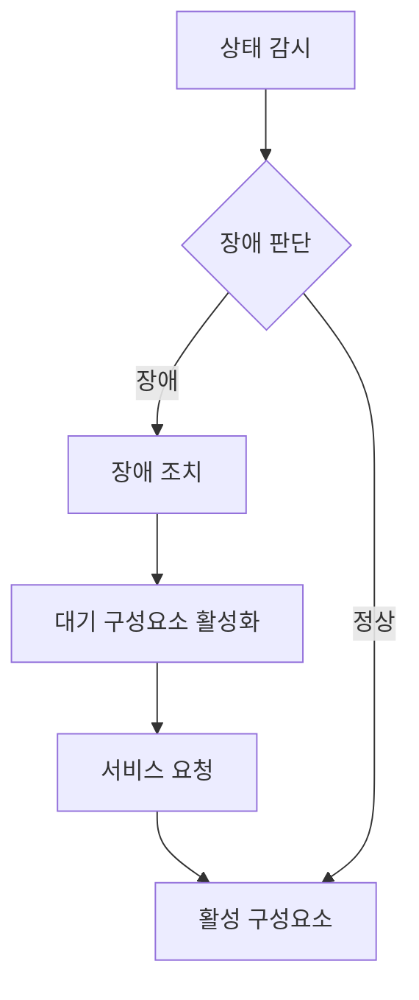
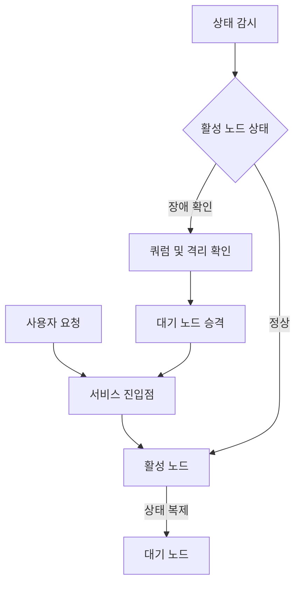
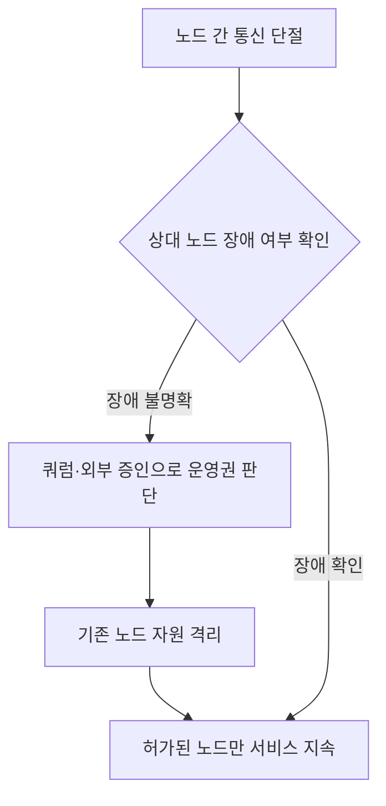

---
sidebar:
  order: 51
  label: "051. 고가용성 아키텍처"
  badge:
    text: "기초"
    variant: note
title: "고가용성(HA) 아키텍처"
author: "Codex"
date: "2026-09-24T00:00:00+09:00"
tags:
  - "notes-data"
weight: 51
extra:
  model: "GPT-6"
  keyword_grade: "기초"
  question_no: "051"
---

## 지식 로드맵 내 현재 위치

데이터베이스 → 분산 데이터베이스·고가용성 → 고가용성 아키텍처

## 30초 인출

- 본질: **고가용성(High Availability)**은 장애가 나도 서비스를 계속 제공하거나 정한 시간 안에 복구하도록 구성하는 능력
- 메커니즘: 구성요소를 중복 배치하고 상태를 감시하며, 장애 판단 뒤 정상 구성요소로 서비스를 전환

핵심 용어

- **고가용성(High Availability, HA)**: 장애 중에도 서비스 제공을 유지하거나 목표 시간 안에 복구하는 시스템 능력
- **장애 조치(Failover)**: 주 구성요소 장애 시 대기 또는 다른 구성요소로 서비스를 전환하는 절차
- **복구 시간 목표(Recovery Time Objective, RTO)**: 장애 발생 후 복구까지 허용하는 목표 시간
- **복구 시점 목표(Recovery Point Objective, RPO)**: 복구 데이터에서 허용하는 시점 차이 또는 데이터 손실 범위
- **쿼럼(Quorum)**: 클러스터가 자원을 운영할 권한을 판단할 때 요구하는 투표 기준
- **펜싱(Fencing)**: 장애 노드를 자원 접근에서 격리해 중복 쓰기나 데이터 손상을 막는 조치

---

## 1교시 예상문제 (10점)

> 고가용성 아키텍처의 정의와 목적, 주요 구성 및 장애 조치 원리를 설명하시오. (예상)

---

## 1교시 10점 답안

### Ⅰ. 고가용성 아키텍처의 개요

| 구분 | 핵심 |
|---|---|
| 정의 | 장애 중에도 서비스 제공을 유지하거나 목표 시간 안에 복구하도록 구성한 시스템 능력 |
| 목적 | 단일 구성요소 장애에 따른 서비스 중단과 데이터 손실의 최소화 |

### Ⅱ. 구성과 전환 흐름

- 중복 구성은 장애 대체 자원을 제공하며, 상태 감시는 전환 여부를 판단하는 자료 제공
- 장애 조치에는 서비스 경로 변경, 대기 노드 승격, 데이터 복구가 포함될 수 있는 구성

### Ⅲ. 가용성 지표와 제언

| 항목 | 의미 |
|---|---|
| 가용도 | 일정 기간 중 서비스를 이용할 수 있었던 시간의 비율 |
| RTO | 서비스 복구까지 허용하는 시간 |
| RPO | 데이터 복구 시 허용하는 시점 차이 |

제언: 장애 시나리오별 전환과 데이터 복구를 실제 절차로 시험해 목표 충족 여부를 확인

---

## 2~4교시 예상문제 (25점)

> 고가용성 아키텍처의 구성 원리와 활성-대기 구성을 설명하고, 장애 감지·전환 과정에서 발생할 수 있는 스플릿 브레인의 원인과 방지 방안을 제시하시오. (예상)

---

## 2~4교시 25점 답안

## Ⅰ. 고가용성 아키텍처의 개요

| 구분 | 핵심 |
|---|---|
| 정의 | 장애 중에도 서비스 제공을 유지하거나 목표 시간 안에 복구하도록 구성한 시스템 능력 |
| 목적 | 단일 구성요소 장애에 따른 서비스 중단과 데이터 손실의 최소화 |

## Ⅱ. 중복 구성과 장애 조치

| 구성 | 역할 | 설계 고려 |
|---|---|---|
| 서비스 진입점 | 요청을 활성 노드로 전달 | 전환 시 클라이언트 연결·이름 해석·경로 갱신 |
| 상태 감시 | 노드와 서비스 상태 확인 | 네트워크 지연과 실제 장애 구분 |
| 데이터 복제 | 대기 노드에 변경 내용을 전달 | 동기화 방식에 따른 지연과 데이터 손실 가능성 |
| 자원 격리 | 이전 노드의 중복 자원 접근 방지 | 전원·스토리지·네트워크 등 환경에 맞는 펜싱 |

## Ⅲ. 장애 감지와 스플릿 브레인 방지

- 스플릿 브레인은 통신이 끊긴 양쪽 노드가 각자 자신을 활성 상태로 판단하는 상황
- 양쪽에서 같은 데이터에 쓰기 작업을 하면 충돌이나 데이터 손상 가능성
- 쿼럼은 운영 권한을 가진 파티션을 정하는 기준이며, 펜싱은 이전 노드의 공유 자원 접근을 차단하는 조치
- 홀수 노드나 외부 쿼럼 장치 등 구성은 클러스터 환경에 따라 선택하며, 특정 노드 수만으로 모든 구성을 일반화하지 않는 원칙

## Ⅳ. 구성 방식과 복구 지표

| 구분 | 활성-대기 | 활성-활성 |
|---|---|---|
| 정상 운영 | 한 노드가 주 서비스, 다른 노드는 대기 또는 제한된 읽기 | 여러 노드가 동시에 요청 처리 |
| 장애 대응 | 대기 노드 승격과 서비스 경로 전환 | 남은 노드로 부하 재분산 |
| 주요 고려 | 대기 자원 비용, 복제 지연, 승격 절차 | 쓰기 충돌, 데이터 일관성, 부하 재분산 |
| 적합성 판단 | 단순한 쓰기 경로와 예측 가능한 전환이 필요한 경우 | 애플리케이션이 분산 쓰기와 충돌 처리를 지원하는 경우 |

| 지표 | 의미 |
|---|---|
| 가용도 | 관측 기간 중 서비스 이용 가능 시간의 비율 |
| 복구 시간 목표(Recovery Time Objective, RTO) | 장애 후 서비스를 복구하기까지 허용하는 목표 시간 |
| 복구 시점 목표(Recovery Point Objective, RPO) | 복구 데이터의 허용 손실 또는 시점 차이 |

가용도 산정은 측정 기간과 서비스 범위, 계획 중단 포함 여부를 먼저 정해야 하는 평가 기준

## Ⅴ. 한계와 대응

| 한계 | 대응 |
|---|---|
| 감시망 단절을 서버 장애로 오판할 가능성 | 복수 상태 신호와 쿼럼 기준을 사용하고 전환 조건을 시험 |
| 비동기 복제 지연에 따른 최근 데이터 손실 가능성 | 업무별 허용 RPO를 정하고 복제 방식과 복구 절차를 맞춤 |
| 자동 전환 과정의 설정 오류·미검증 가능성 | 실제 장애 시나리오로 정기 전환 훈련 및 데이터 정합성 확인 |

## Ⅵ. 기술사적 제언

| 문제 | 해결 방안 |
|---|---|
| 시스템별 RTO·RPO 목표가 실제 업무 영향과 분리될 가능성 | 핵심 업무의 복구 우선순위를 기준으로 서비스·데이터 계층별 목표를 정하고 장애 훈련 순서에 반영 |

---

## 출제 이력과 검증 출처

- Red Hat Enterprise Linux 10, *Configuring and managing high availability clusters*, “Configuring cluster quorum”: https://docs.redhat.com/en/documentation/red_hat_enterprise_linux/10/html/configuring_and_managing_high_availability_clusters/configuring-cluster-quorum
- Red Hat Enterprise Linux 10, *Creating a Red Hat High-Availability cluster with Pacemaker*: https://docs.redhat.com/en/documentation/red_hat_enterprise_linux/10/html/configuring_and_managing_high_availability_clusters/creating-high-availability-cluster

## 연결 토픽

- [샤딩](./045_sharding/) · [팬텀 충돌](./049_phantom_conflict/) · [오픈소스 DBMS 전환](./063_opensource_dbms_migration/)
