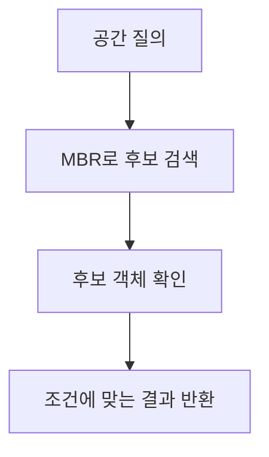
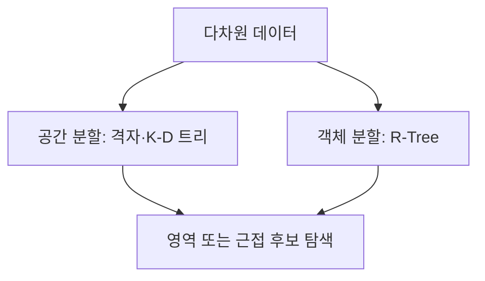
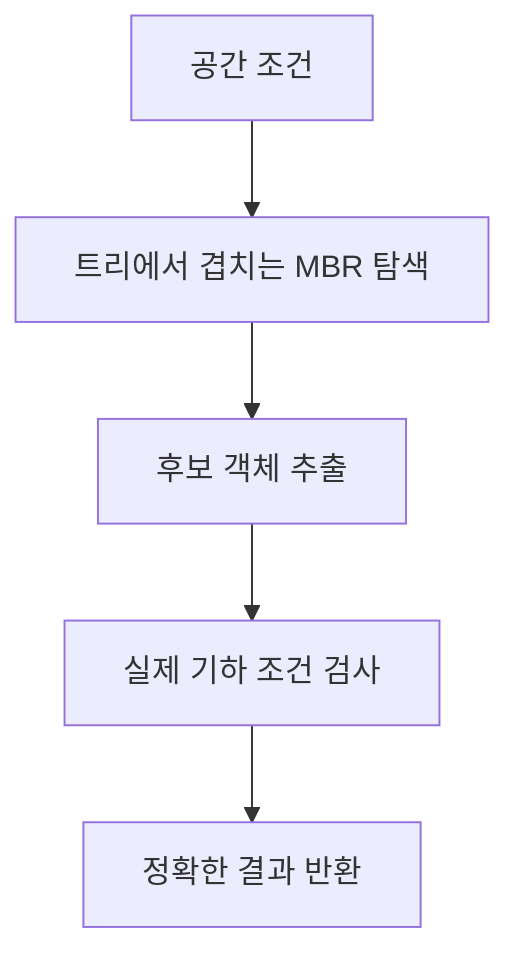

---
sidebar:
  order: 52
  label: "052. 다차원 색인구조"
  badge:
    text: "기초"
    variant: note
title: "다차원 색인구조 (Multidimensional Index Structure)"
author: "Codex"
date: "2026-09-24T00:00:00+09:00"
tags:
  - "notes-data"
weight: 52
extra:
  model: "GPT-6"
  keyword_grade: "기초"
  question_no: "052"
---

## 지식 로드맵 내 현재 위치

데이터베이스 → 물리적 데이터베이스 설계·튜닝 → 다차원 색인구조

## 30초 인출

- 본질: **다차원 색인**은 여러 속성이나 좌표의 공간 관계를 이용해 범위·근접 질의 후보를 빠르게 찾는 구조
- 메커니즘: 공간을 나누거나 객체의 경계영역을 계층화해 검색 범위를 줄이고, 필요한 경우 실제 객체로 후보를 확인

핵심 용어

- **다차원 색인(Multidimensional Index)**: 여러 차원 값의 범위나 공간적 근접성을 기준으로 검색 후보를 좁히는 색인
- **공간 분할(Space Partitioning)**: 데이터가 놓인 공간 자체를 영역으로 나누는 방식
- **R-Tree**: 객체의 최소 경계 사각형을 트리 노드에 저장해 공간 질의를 지원하는 색인
- **최소 경계 사각형(Minimum Bounding Rectangle, MBR)**: 공간 객체를 포함하는 축 정렬 최소 경계 영역
- **필터-정제(Filter-Refine)**: 경계영역으로 후보를 찾은 뒤 실제 객체로 질의를 확인하는 처리 방식

---

## 1교시 예상문제 (10점)

> 다차원 색인구조의 정의와 목적, 대표적인 구조와 공간 질의 처리 방식을 설명하시오. (예상)

---

## 1교시 10점 답안

### Ⅰ. 다차원 색인구조의 개요

| 구분 | 핵심 |
|---|---|
| 정의 | 여러 속성이나 좌표의 공간 관계를 이용해 범위·근접 질의 후보를 좁히는 색인 구조 |
| 목적 | 다차원 조건 검색에서 불필요한 레코드 탐색 감소 |

### Ⅱ. 대표 구조와 질의 처리

| 구조 | 공간 구성 방식 | 대표 검색 관점 |
|---|---|---|
| 격자·K-D 트리 | 공간을 셀 또는 분할면으로 구분 | 점의 영역·근접 탐색 |
| R-Tree | 객체의 MBR을 계층 노드에 저장 | 공간 객체의 포함·교차 탐색 |

- MBR 검색은 후보 선별 단계이며, 실제 객체의 기하 관계와 다른 결과가 나올 수 있어 정밀 확인이 필요한 구조

제언: 데이터 유형과 질의 형태를 기준으로 색인 구조를 선택하고 실제 실행계획으로 후보 검색 범위를 확인

---

## 2~4교시 예상문제 (25점)

> 다차원 색인구조의 정의와 필요성을 설명하고, 공간 분할 구조와 R-Tree 계열의 원리 및 공간 질의 처리 절차를 비교하시오. (예상)

---

## 2~4교시 25점 답안

## Ⅰ. 다차원 색인구조의 개요

| 구분 | 핵심 |
|---|---|
| 정의 | 여러 속성이나 좌표의 공간 관계를 이용해 범위·근접 질의 후보를 좁히는 색인 구조 |
| 목적 | 다차원 조건 검색에서 불필요한 레코드 탐색 감소 |

## Ⅱ. 구조 유형과 공간 분할

| 유형 | 핵심 구조 | 특징 |
|---|---|---|
| 공간 분할 | 격자, K-D 트리 등으로 공간을 구획 | 점 데이터의 위치 관계를 이용한 탐색에 적합 |
| 객체 분할 | R-Tree의 노드에 객체 MBR 저장 | 공간 객체 범위를 계층적으로 좁히는 구조 |

- 공간 분할은 영역 경계와 질의 범위가 만나는 셀을 찾아 후보를 줄이는 접근
- R-Tree는 하위 객체의 MBR을 포함하는 상위 MBR로 검색 범위를 계층화하는 방식

## Ⅲ. R-Tree 탐색과 필터-정제

- MBR은 실제 객체를 포함하는 경계이므로 MBR 겹침만으로 객체 간 실제 교차를 확정할 수 없는 구조
- 필터 단계는 후보 탐색, 정제 단계는 실제 기하 조건의 검사

| 질의 | 색인 활용 |
|---|---|
| 영역 질의 | 질의 영역과 교차하는 셀 또는 MBR을 후보로 선택 |
| 근접 질의 | 거리 기준에 따라 후보 영역을 탐색한 뒤 실제 거리 확인 |

## Ⅳ. 구조 선택 시 한계와 고려사항

| 한계 | 고려사항 |
|---|---|
| 겹치는 MBR이 많으면 R-Tree 탐색 경로가 늘어날 가능성 | 데이터 분포와 질의 유형을 기준으로 노드 구성 및 실행계획 확인 |
| 고차원에서 거리·영역 구분력이 약해질 가능성 | 차원, 데이터 분포, 정확도 요구에 맞춰 전용 근사 최근접 색인과 실측 비교 |
| 갱신이 잦으면 색인 유지 비용 증가 | 검색 지연과 삽입·갱신 비용을 함께 측정 |

## Ⅴ. 기술사적 제언

| 한계 | 해결 방안 |
|---|---|
| 데이터 분포와 질의 유형을 고려하지 않은 색인 선택으로 후보가 과다해질 가능성 | 대표 질의와 실제 데이터 표본으로 후보 수·갱신 비용을 비교한 뒤 구조를 선택하는 검증 절차 수립 |

---

## 출제 이력과 검증 출처

- Antonin Guttman, “R-Trees: A Dynamic Index Structure for Spatial Searching,” *ACM SIGMOD*, 1984.
- Norbert Beckmann et al., “The R*-tree: An Efficient and Robust Access Method for Points and Rectangles,” *ACM SIGMOD*, 1990.

## 연결 토픽

- [인덱스](./047_index/) · [벡터 데이터베이스](./044_vector_database/) · [차원 축소](./069_dimensionality_reduction_pca_mds/)
