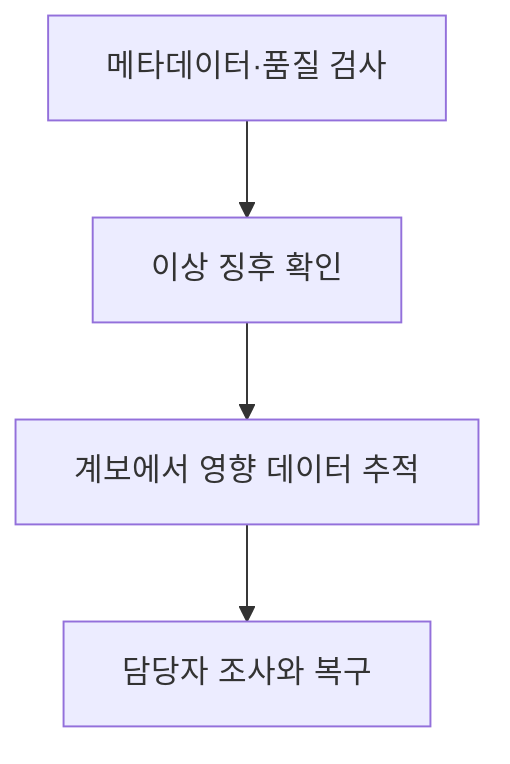
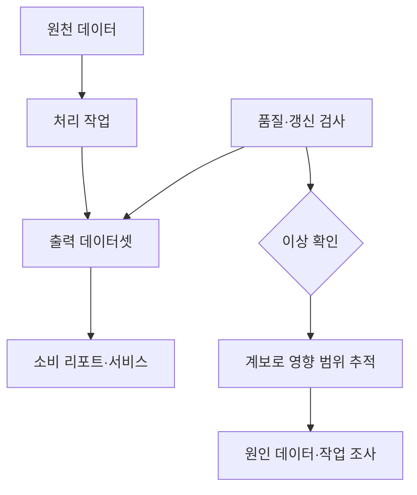

---
sidebar:
  order: 54
  label: "054. 데이터 관측가능성"
  badge:
    text: "기초"
    variant: note
title: "데이터 관측가능성 (Data Observability)"
author: "Codex"
date: "2026-09-24T00:00:00+09:00"
tags:
  - "notes-data"
weight: 54
extra:
  model: "GPT-6"
  keyword_grade: "기초"
  question_no: "054"
---

## 지식 로드맵 내 현재 위치

데이터베이스 → 데이터 거버넌스·품질관리 → 데이터 관측가능성

## 30초 인출

- 본질: **데이터 관측가능성(Data Observability)**은 데이터 상태와 파이프라인 정보를 관찰해 품질 이상과 원인을 파악하는 능력
- 메커니즘: 갱신 시점·건수·구조·값 분포·계보를 확인해 이상을 찾고 영향받는 데이터를 추적

핵심 용어

- **데이터 관측가능성(Data Observability)**: 메타데이터와 데이터 검사를 이용해 데이터 상태 및 이상 원인을 파악하는 운영 능력
- **데이터 계보(Data Lineage)**: 데이터의 출처, 변환, 소비 관계를 기록한 정보
- **신선도(Freshness)**: 데이터가 기대한 시점에 도착하거나 갱신됐는지를 나타내는 특성
- **스키마 변화(Schema Change)**: 데이터 구조나 타입의 변경
- **OpenLineage**: 작업·실행·데이터셋 관계를 기록하기 위한 오픈 계보 메타데이터 표준

---

## 1교시 예상문제 (10점)

> 데이터 관측가능성의 정의와 목적, 주요 관측 항목 및 운영 원리를 설명하시오. (예상)

---

## 1교시 10점 답안

### Ⅰ. 데이터 관측가능성의 개요

| 구분 | 핵심 |
|---|---|
| 정의 | 메타데이터와 데이터 검사를 이용해 데이터 상태 및 이상 원인을 파악하는 운영 능력 |
| 목적 | 데이터 품질 이상과 하위 소비자 영향을 조기에 발견 |

### Ⅱ. 관측 항목과 운영 흐름

| 관측 항목 | 확인 내용 |
|---|---|
| 신선도 | 데이터 갱신 시점과 지연 |
| 볼륨 | 레코드 수나 적재량의 변화 |
| 스키마 | 필드·자료형 등 데이터 구조의 변화 |
| 분포 | 값의 범위·결측·분포 변화 |
| 계보 | 원천·변환 작업·소비 데이터의 관계 |

- 위 항목은 널리 쓰이는 다섯 가지 관측 관점이며, 제품이나 조직에 따라 구성 차이가 있는 분류

제언: 핵심 데이터셋별 정상 갱신 주기와 품질 규칙을 정하고 이상 알림의 책임자를 지정

---

## 2~4교시 예상문제 (25점)

> 데이터 관측가능성의 정의와 목적을 설명하고, 주요 관측 차원, 데이터 계보를 활용한 영향 분석 및 데이터 모니터링과의 관계를 서술하시오. (예상)

---

## 2~4교시 25점 답안

## Ⅰ. 데이터 관측가능성의 개요

| 구분 | 핵심 |
|---|---|
| 정의 | 메타데이터와 데이터 검사를 이용해 데이터 상태 및 이상 원인을 파악하는 운영 능력 |
| 목적 | 데이터 품질 이상과 하위 소비자 영향을 조기에 발견 |

## Ⅱ. 주요 관측 차원

| 관점 | 확인 정보 | 예시 |
|---|---|---|
| 신선도 | 도착·갱신 시점 | 배치 지연 |
| 볼륨 | 건수·크기 | 예상보다 적은 적재량 |
| 스키마 | 필드·자료형 | 필드명 변경 |
| 분포 | 값의 통계·결측 | 특정 코드값 급증 |
| 계보 | 입력·작업·출력 관계 | 영향받은 대시보드 추적 |

- 다섯 차원은 관측 항목을 정리하는 대표적 실무 분류이며, 모든 구현에 고정된 표준 구조라는 뜻은 아님

## Ⅲ. 이상 감지와 계보 기반 분석

- 품질 검사는 값·구조·갱신 상태의 이상을 확인하고, 계보는 데이터가 연결된 작업과 소비 대상을 파악하는 정보
- 데이터 관측가능성은 지표·검사·계보를 함께 활용하는 운영 접근이며 자동 탐지나 원인 규명이 항상 보장되는 것은 아님

## Ⅳ. 데이터 모니터링과의 관계 및 한계

| 구분 | 작업 모니터링 | 데이터 관측가능성 |
|---|---|---|
| 주된 관찰 대상 | 작업 실행·자원 상태 | 데이터 상태·품질 및 계보 |
| 질문 | 작업이 실행됐는가 | 결과 데이터가 기대한 상태인가, 영향 범위는 어디인가 |
| 한계 | 정상 종료만으로 데이터 정확성 확인 불가 | 규칙·기준선과 계보 정보가 불완전하면 이상 설명에 제약 |
| 보완 | 품질 검사를 추가 | 업무 규칙·책임자·영향 분석 절차 연계 |

## Ⅴ. 기술사적 제언

| 문제 | 해결 방안 |
|---|---|
| 각 데이터셋의 검사 결과와 소비 업무가 분리되어 장애 영향 파악이 늦어질 가능성 | 핵심 데이터 흐름부터 소유자·품질 규칙·계보를 연결하고 실제 장애 사례로 영향 추적 절차를 점검 |

---

## 출제 이력과 검증 출처

- OpenLineage, “About OpenLineage” 및 “Object Model”: https://openlineage.io/docs/next/ · https://openlineage.io/docs/spec/object-model/
- OpenLineage, “Lineage Job Facet”: https://openlineage.io/docs/spec/facets/job-facets/lineage/
- Barr Moses et al., *Data Quality Fundamentals*, O’Reilly, 2022.

## 연결 토픽

- [데이터 품질관리](./003_data_quality_management/) · [데이터 거버넌스](./006_data_governance/) · [데이터 패브릭](./074_data_fabric/)
