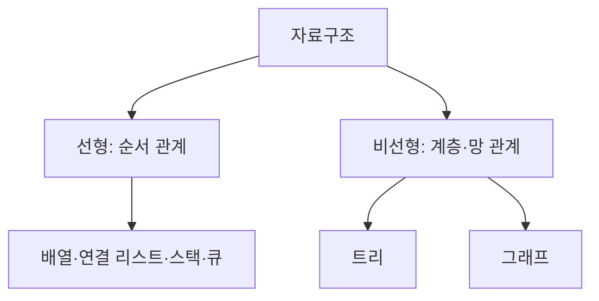
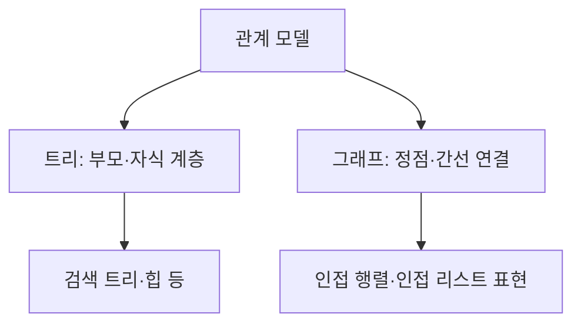

---
sidebar:
  order: 58
  label: "058. 선형·비선형 자료구조"
  badge:
    text: "기초"
    variant: note
title: "선형 자료구조와 비선형 자료구조 (Linear and Nonlinear Data Structures)"
author: "Codex"
date: "2026-09-24T00:00:00+09:00"
tags:
  - "notes-data"
weight: 58
extra:
  model: "GPT-6"
  keyword_grade: "기초"
  question_no: "058"
---

## 지식 로드맵 내 현재 위치

데이터베이스 → 자료구조·알고리즘 → 선형·비선형 자료구조

## 30초 인출

- 본질: **선형 자료구조**는 원소가 하나의 순서로 이어지고, **비선형 자료구조**는 원소가 계층이나 여러 연결 관계를 이루는 구조
- 메커니즘: 저장·탐색·삽입 방식이 달라지므로 자료의 관계와 필요한 연산을 기준으로 선택

핵심 용어

- **선형 자료구조(Linear Data Structure)**: 원소 간 선행·후행 순서가 하나의 연속된 논리적 순서를 이루는 구조
- **비선형 자료구조(Nonlinear Data Structure)**: 원소가 트리의 계층 관계나 그래프의 연결 관계를 이루는 구조
- **스택(Stack)**: 마지막에 넣은 원소를 먼저 꺼내는 후입선출 자료구조
- **큐(Queue)**: 먼저 넣은 원소를 먼저 꺼내는 선입선출 자료구조
- **그래프(Graph)**: 정점과 정점 사이의 간선으로 관계를 표현하는 자료구조

---

## 1교시 예상문제 (10점)

> 선형 자료구조와 비선형 자료구조의 정의, 유형 및 선택 관점을 설명하시오. (예상)

---

## 1교시 10점 답안

### Ⅰ. 자료구조 분류의 개요

| 구분 | 핵심 |
|---|---|
| 정의 | 선형 자료구조는 원소의 순서 관계가 하나로 이어지고, 비선형 자료구조는 계층 또는 복수 연결 관계를 이루는 자료구조 |
| 목적 | 자료의 관계와 연산 특성에 맞는 저장·탐색 구조 선택 |

### Ⅱ. 유형과 관계

| 선택 기준 | 대표 고려사항 |
|---|---|
| 자료 관계 | 순서, 계층, 다대다 연결 |
| 주요 연산 | 임의 접근, 순차 처리, 우선순위, 관계 탐색 |

제언: 자료 관계와 빈번한 연산을 먼저 정의한 뒤 자료구조를 선택

---

## 2~4교시 예상문제 (25점)

> 선형 자료구조와 비선형 자료구조의 정의와 주요 유형을 설명하고, 관계 표현 방식과 연산 복잡도를 비교하여 선택 기준을 제시하시오. (예상)

---

## 2~4교시 25점 답안

## Ⅰ. 자료구조 분류의 개요

| 구분 | 핵심 |
|---|---|
| 정의 | 선형 자료구조는 원소의 순서 관계가 하나로 이어지고, 비선형 자료구조는 계층 또는 복수 연결 관계를 이루는 자료구조 |
| 목적 | 자료의 관계와 연산 특성에 맞는 저장·탐색 구조 선택 |

## Ⅱ. 선형 자료구조의 구조와 연산

| 유형 | 관계·동작 | 주요 연산 특성 |
|---|---|---|
| 배열 | 인덱스로 순서화된 원소 접근 | 인덱스 접근은 일반적으로 O(1), 중간 삽입·삭제는 이동 비용 발생 |
| 연결 리스트 | 노드가 다음 노드 참조 | 위치를 알고 있을 때 연결 변경은 O(1), 위치 탐색은 O(n) |
| 스택 | 후입선출(Last In, First Out, LIFO) | 최상단에서 삽입·삭제 |
| 큐 | 선입선출(First In, First Out, FIFO) | 뒤에 삽입하고 앞에서 삭제 |

## Ⅲ. 비선형 자료구조의 구조와 연산

| 구조 | 핵심 관계 | 연산 관점 |
|---|---|---|
| 트리 | 루트와 부모·자식으로 이루어진 계층 | 균형 검색 트리는 탐색·갱신을 로그 시간으로 지원하는 구조 |
| 그래프 | 정점과 간선으로 관계 표현 | 인접 리스트 기반 순회는 보통 O(V+E) 시간 |

- 트리·그래프의 실제 연산 비용은 구조의 균형, 표현 방식, 연산에 따라 달라지는 특성

## Ⅳ. 구조 선택 기준

| 판단축 | 선형 구조가 맞는 경우 | 비선형 구조가 맞는 경우 |
|---|---|---|
| 데이터 관계 | 순서 또는 일렬 처리 | 계층·연결망 표현 |
| 탐색 | 순차 접근 또는 인덱스 접근 | 계층 검색·관계 경로 탐색 |
| 구현 고려 | 단순한 순회와 연속 자료 처리 | 분기, 연결, 균형, 순환 처리 |

- 자료구조는 추상 자료형과 메모리 구현을 구분해 선택하며, 선형이라는 분류가 물리 메모리의 연속 배치를 의미하지 않는 점

## Ⅴ. 한계와 대응

| 한계 | 대응 |
|---|---|
| 이론적 복잡도만으로 실제 성능을 예측하기 어려움 | 자료 크기, 접근 패턴, 메모리·저장장치 특성을 포함한 대표 부하 측정 |
| 특정 구조에 치우치면 필요한 연산에서 비용 증가 | 자주 수행하는 접근·삽입·삭제·관계 탐색을 기준으로 대안 비교 |

## Ⅵ. 기술사적 제언

| 한계 | 해결 방안 |
|---|---|
| 요구 연산이 확정되기 전에 자료구조를 선택해 불필요한 변환 비용이 생길 가능성 | 데이터 관계와 대표 연산을 먼저 명세하고, 소규모 구현 검증으로 복잡도와 실제 처리 비용을 비교 |

---

## 출제 이력과 검증 출처

- [Python 자료구조 공식 문서](https://docs.python.org/3/tutorial/datastructures.html): 선형 스택·큐의 삽입·삭제 순서
- [Python heapq 공식 문서](https://docs.python.org/3/library/heapq.html): 트리 기반 힙의 부모·자식 관계와 우선순위 처리

- Thomas H. Cormen et al., *Introduction to Algorithms*, 4th ed., Chapters 10–12.
- Ulrich Drepper, *What Every Programmer Should Know About Memory*, Red Hat.

## 연결 토픽

- [이진 탐색 트리](./027_binary_search_tree/) · [인덱스](./047_index/) · [다차원 색인구조](./052_multidimensional_index_structure/)
