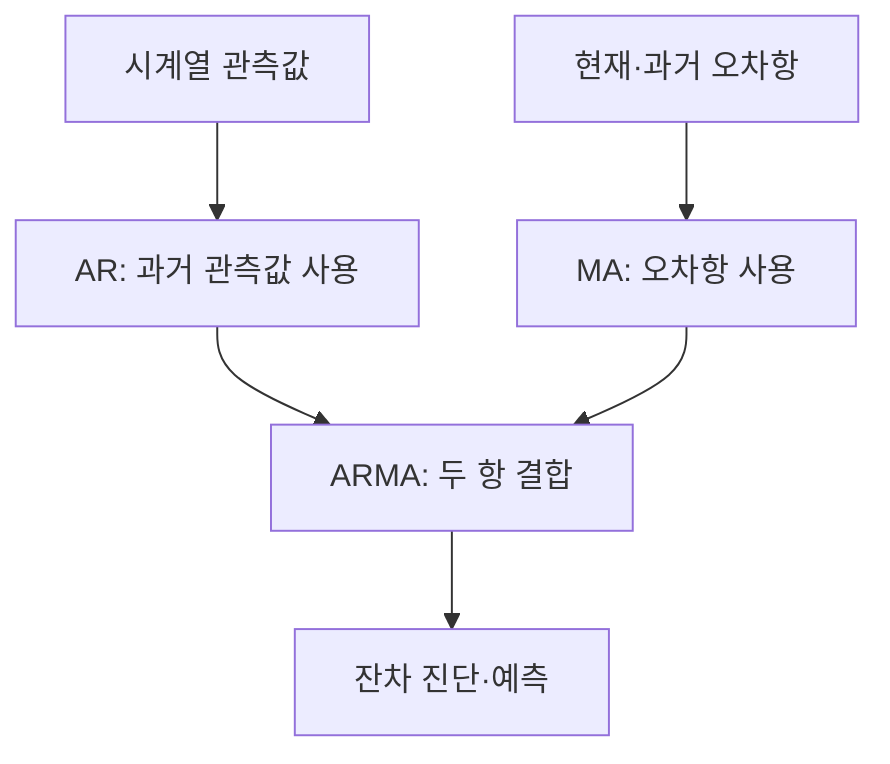
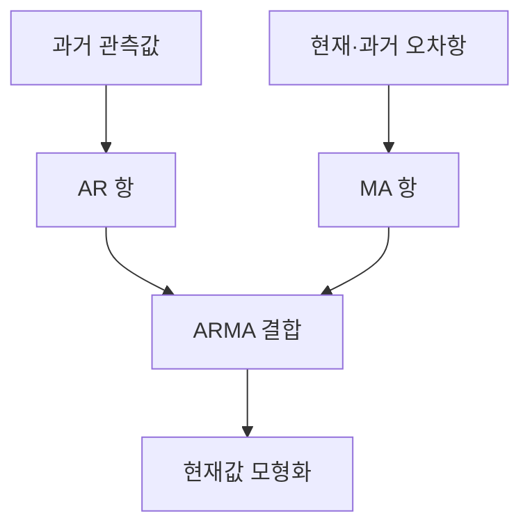
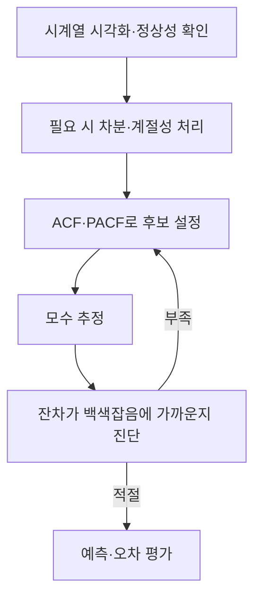

---
sidebar:
  order: 60
  label: "060. 시계열 AR·MA 모형"
  badge:
    text: "기초"
    variant: note
title: "시계열 AR·MA 모형 (자기회귀 및 이동평균 모형)"
author: "Codex"
date: "2026-09-24T00:00:00+09:00"
tags:
  - "notes-data"
weight: 60
extra:
  model: "GPT-6"
  keyword_grade: "기초"
  question_no: "060"
---

## 지식 로드맵 내 현재 위치

데이터베이스 → 통계·데이터 분석 → 시계열 AR·MA 모형

## 30초 인출

- 본질: **자기회귀(Autoregressive, AR)**는 과거 관측값, **이동평균(Moving Average, MA)**은 현재와 과거의 오차항으로 현재값을 설명하는 시계열 모형
- 메커니즘: 정상성을 살핀 뒤 자기상관함수와 편자기상관함수로 후보 차수를 찾고, 추정한 모형의 잔차를 진단

핵심 용어

- **자기회귀(Autoregressive, AR) 모형**: 과거 관측값의 선형결합으로 현재값을 설명하는 모형
- **이동평균(Moving Average, MA) 모형**: 현재와 과거의 무작위 오차항 선형결합으로 현재값을 설명하는 모형
- **자기상관함수(Autocorrelation Function, ACF)**: 시계열과 시차를 둔 자기 자신의 상관을 나타내는 함수
- **편자기상관함수(Partial Autocorrelation Function, PACF)**: 중간 시차의 선형 영향을 제거한 뒤 두 시점의 관계를 나타내는 함수
- **ARIMA(Autoregressive Integrated Moving Average)**: 차분으로 비정상성을 다루고 AR·MA 항을 결합한 모형

---

## 1교시 예상문제 (10점)

> 시계열 AR·MA 모형의 정의와 목적, 주요 구성 및 식별 관점을 설명하시오. (예상)

---

## 1교시 10점 답안

### Ⅰ. 시계열 AR·MA 모형의 개요

| 구분 | 핵심 |
|---|---|
| 정의 | 시계열의 과거 관측값(AR) 또는 현재·과거 오차항(MA)의 관계를 모형화하는 통계 모형 |
| 목적 | 시간 의존성을 설명하고 시계열 예측의 기준 모형 제공 |

### Ⅱ. 모형 관계와 식별

| 후보 모형 | 이론적 식별 단서 |
|---|---|
| AR(p) | ACF는 점진 감쇠, PACF는 p 이후 절단 양상 |
| MA(q) | ACF는 q 이후 절단, PACF는 점진 감쇠 양상 |

- 표본 자료에서는 신호와 표본 변동이 섞이므로 ACF·PACF는 후보 식별의 단서이며 단독 확정 기준은 아님

제언: 정상성·계절성을 확인한 뒤 ACF·PACF와 잔차 진단을 함께 사용해 모형을 선택

---

## 2~4교시 예상문제 (25점)

> 시계열 분석에서 AR·MA 모형의 개념과 차이를 설명하고, 정상성 및 ACF·PACF에 따른 모형 식별과 ARIMA 확장 절차를 서술하시오. (예상)

---

## 2~4교시 25점 답안

## Ⅰ. 시계열 AR·MA 모형의 개요

| 구분 | 핵심 |
|---|---|
| 정의 | 시계열의 과거 관측값(AR)과 과거 오차항(MA)의 관계를 모형화하는 통계 모형 |
| 목적 | 시간 의존성을 설명하고 시계열 예측의 기준 모형 제공 |

## Ⅱ. AR과 MA의 작동 차이

| 모형 | 현재값 설명 | 기본식 |
|---|---|---|
| AR(p) | 이전 p개 관측값과 현재 오차항 | $Y_t=c+\sum_{i=1}^{p}\phi_iY_{t-i}+\epsilon_t$ |
| MA(q) | 현재·이전 q개 오차항 | $Y_t=\mu+\epsilon_t+\sum_{j=1}^{q}\theta_j\epsilon_{t-j}$ |
| ARMA(p,q) | 과거 관측값과 오차항의 결합 | AR 항과 MA 항의 결합 |

- MA는 단순 이동 창의 산술평균이 아니라 무작위 오차항을 설명변수로 쓰는 모형

## Ⅲ. 정상성과 ACF·PACF 식별

| 개념 | 역할 | 기본 AR·MA 식별 단서 |
|---|---|---|
| 정상성 | 평균·분산과 시차별 공분산이 시간에 따라 일정한 확률 과정의 성질 | ARMA 적용의 기본 가정 중 하나 |
| ACF | 각 시차의 전체 자기상관 | 순수 MA(q)는 q 이후 0에 가까워지는 절단 양상 |
| PACF | 짧은 시차의 영향 제거 후 남는 시차별 관계 | 순수 AR(p)는 p 이후 절단 양상 |

- 혼합 ARMA, 짧은 표본, 계절성·구조변화에서는 이론 패턴이 뚜렷하지 않을 수 있는 한계
- 식별은 후보 모형 설정 단계이며, 정보기준과 잔차 진단을 포함한 비교가 필요한 절차

## Ⅳ. Box–Jenkins 식별·검증 흐름

| 단계 | 확인 사항 |
|---|---|
| 변환 | 추세·계절성 등 정상성 저해 요소의 처리 여부 |
| 식별·추정 | 차수 후보와 추정 모수의 적절성 |
| 진단 | 잔차에 설명되지 않은 자기상관이 남는지 여부 |
| 평가 | 시간 순서를 보존한 자료에서 예측 오차 확인 |

- 차분 차수 $d$를 적용한 ARIMA(p,d,q)는 차분 시계열에 AR·MA 구조를 적용하는 확장

## Ⅴ. 한계와 대응

| 한계 | 대응 |
|---|---|
| 시계열 구조 변화나 계절성을 놓치면 잔차에 패턴이 남을 가능성 | 시각화와 잔차 자기상관을 확인하고 계절 모형·다른 구조를 비교 |
| ACF·PACF 패턴만으로 차수 선택이 모호할 가능성 | 여러 후보의 정보기준과 홀드아웃 예측 오차를 함께 비교 |

## Ⅵ. 기술사적 제언

| 한계 | 해결 방안 |
|---|---|
| 단일 학습 구간의 적합도로 배포 후 예측 성능을 판단할 위험 | 시간 순서를 유지한 검증 구간과 재학습 조건을 정하고, 예측 오차와 잔차 진단을 함께 추적 |

---

## 출제 이력과 검증 출처

- NIST/SEMATECH e-Handbook of Statistical Methods, “Common Approaches to Univariate Time Series”: https://www.itl.nist.gov/div898/handbook/pmc/section4/pmc444.htm
- NIST/SEMATECH e-Handbook, “Box-Jenkins Models”: https://www.itl.nist.gov/div898/handbook/pmc/section4/pmc445.htm
- NIST/SEMATECH e-Handbook, “Box-Jenkins Model Identification”: https://www.itl.nist.gov/div898/handbook/pmc/section4/pmc446.htm

## 연결 토픽

- [시계열 실시간 이상치 탐지](./061_time_series_realtime_anomaly_detection/) · [기술통계](./036_descriptive_statistics/)
