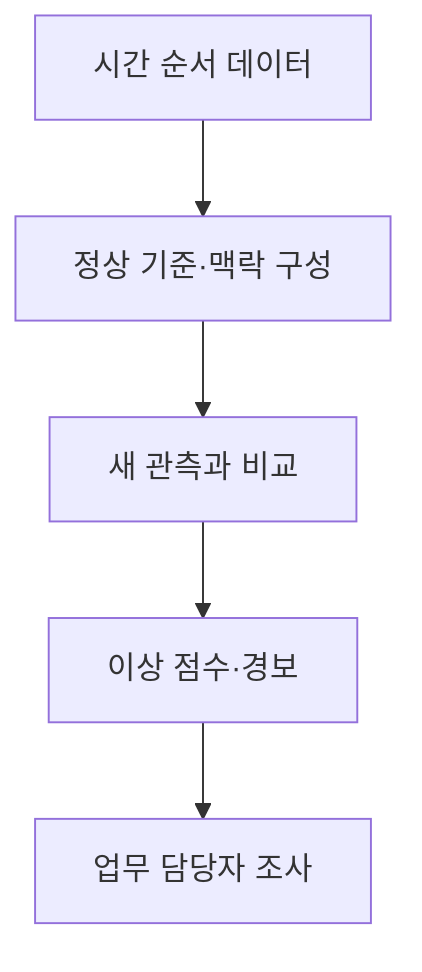
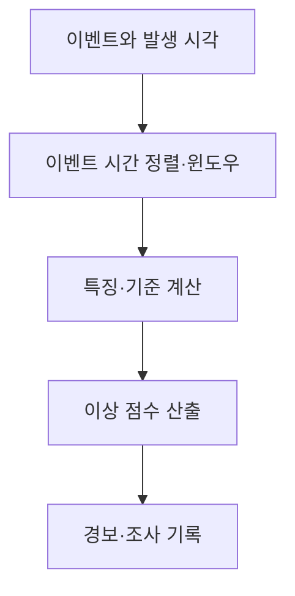

---
sidebar:
  order: 61
  label: "061. 시계열 실시간 이상 탐지"
  badge:
    text: "기초"
    variant: note
title: "시계열 실시간 이상 탐지 (Time Series Real-time Anomaly Detection)"
author: "Codex"
date: "2026-09-24T00:00:00+09:00"
tags:
  - "notes-data"
weight: 61
extra:
  model: "GPT-6"
  keyword_grade: "기초"
  question_no: "061"
---

## 지식 로드맵 내 현재 위치

데이터베이스 → 통계·데이터 분석 → 시계열 실시간 이상 탐지

## 30초 인출

- 본질: **시계열 이상 탐지**는 시간 순서와 맥락을 고려해 평소 패턴에서 벗어난 관측이나 구간을 찾는 분석
- 메커니즘: 시간·업무 특성에 맞는 정상 기준을 만들고 새 관측을 비교해 이상 점수나 경보를 산출

핵심 용어

- **시계열 이상 탐지(Time Series Anomaly Detection)**: 시간 순서가 있는 데이터에서 정상 패턴과 다른 관측·구간을 찾는 분석
- **포인트 이상(Point Anomaly)**: 개별 관측값이 주변 기준에서 벗어난 경우
- **맥락 이상(Contextual Anomaly)**: 시간·상황 맥락을 고려할 때 비정상인 관측
- **집단 이상(Collective Anomaly)**: 개별 값보다 관측값의 연속 패턴이 비정상인 구간
- **지수 가중 이동 평균(Exponentially Weighted Moving Average, EWMA)**: 최근 관측에 더 큰 가중치를 주어 수준 변화를 추적하는 통계량
- **워터마크(Watermark)**: 스트림 처리에서 이벤트 시간의 진행 정도를 나타내는 표시

---

## 1교시 예상문제 (10점)

> 시계열 실시간 이상 탐지의 정의와 목적, 이상 유형 및 기본 탐지 흐름을 설명하시오. (예상)

---

## 1교시 10점 답안

### Ⅰ. 시계열 이상 탐지의 개요

| 구분 | 핵심 |
|---|---|
| 정의 | 시간 순서가 있는 데이터에서 정상 패턴과 다른 관측·구간을 찾는 분석 |
| 목적 | 이상 징후를 적시에 찾아 조사·대응에 필요한 정보 제공 |

### Ⅱ. 이상 유형과 처리 흐름

| 유형 | 판별 관점 |
|---|---|
| 포인트 이상 | 특정 시점의 값이 기준에서 벗어남 |
| 맥락 이상 | 같은 값도 시간·상황에 따라 정상 여부가 달라짐 |
| 집단 이상 | 개별 값은 정상 범위여도 연속 패턴이 비정상 |

- 이상 점수는 조사 단서이며, 이상 판정이 곧 오류·사기·장애의 확정을 뜻하지 않는 점

제언: 업무별 정상 기준과 경보 후 확인 절차를 함께 정의

---

## 2~4교시 예상문제 (25점)

> 시계열 실시간 이상 탐지의 정의와 목적을 설명하고, 이상 유형과 탐지 방법, 스트리밍 처리 시 고려사항을 제시하시오. (예상)

---

## 2~4교시 25점 답안

## Ⅰ. 시계열 이상 탐지의 개요

| 구분 | 핵심 |
|---|---|
| 정의 | 시간 순서가 있는 데이터에서 정상 패턴과 다른 관측·구간을 찾는 분석 |
| 목적 | 이상 징후를 적시에 찾아 조사·대응에 필요한 정보 제공 |

## Ⅱ. 이상 유형과 탐지 관점

| 유형 | 핵심 차이 | 예시 |
|---|---|---|
| 포인트 이상 | 단일 값이 기준에서 이탈 | 단일 센서 측정치의 급변 |
| 맥락 이상 | 시간·상황 조건에 따라 같은 값의 의미가 달라짐 | 시간대별 이용량 변화 |
| 집단 이상 | 이어진 값의 조합이나 순서가 비정상 | 평탄하게 고정된 센서 시계열 |

- 정상 기준은 계절성·추세·업무 맥락과 함께 정의해야 오탐을 줄일 수 있는 원칙

## Ⅲ. 탐지 방법의 선택

| 접근 | 원리 | 고려사항 |
|---|---|---|
| 통계 기반 | 임계값, 이동 통계량, 관리도 등으로 편차 감지 | 단순하고 설명하기 쉽지만 기준 가정에 민감 |
| 기계학습 | 데이터 특징이나 정상 영역을 학습해 이상 점수 산출 | 학습 자료와 특징 설계, 모델 갱신 고려 |
| 시퀀스 모델 | 시간 순서의 패턴을 학습하거나 복원 오차 분석 | 자료·연산 요구, 결과 설명성 고려 |

- 특정 알고리즘이 모든 시계열에 우월하지 않으며 정확도·지연·운영비용을 자료와 업무 조건에 따라 비교

## Ⅳ. 실시간 처리 흐름과 이벤트 시간

| 처리 이슈 | 설명 |
|---|---|
| 이벤트 시간 | 데이터가 실제 발생한 시각 기준의 분석 |
| 처리 시간 | 처리 시스템이 이벤트를 읽고 계산한 시각 기준 |
| 늦은 도착 | 지연 이벤트를 처리할 허용 범위와 윈도우 정책 필요 |
| 경보 대응 | 심각도·담당자·재확인 절차 연결 필요 |

- 분산 스트림에서는 워터마크가 이벤트 시간 진행을 나타내며, 늦은 이벤트 처리와 결과 지연 간의 절충 요소

## Ⅴ. 한계와 대응

| 한계 | 대응 |
|---|---|
| 계절성·추세 변화로 고정 임계값의 오탐 또는 누락 가능성 | 시간대·업무 맥락을 반영한 기준과 주기적 점검 |
| 이상 점수가 곧 원인이나 오류를 뜻하지 않는 문제 | 원천 데이터·업무 맥락을 확인하는 사람의 조사 절차 연계 |
| 늦은 이벤트가 윈도우 결과에 반영되지 않을 가능성 | 허용 지연과 재계산·정정 정책을 업무 요구에 맞게 설정 |

## Ⅵ. 기술사적 제언

| 한계 | 해결 방안 |
|---|---|
| 모델 지표만으로 경보의 업무 우선순위를 정하기 어려운 점 | 업무 영향과 조치 가능성을 기준으로 경보 등급·담당자·확인 절차를 정하고 운영 이력으로 임계값을 조정 |

---

## 출제 이력과 검증 출처

- NIST/SEMATECH e-Handbook of Statistical Methods, “Detection of Outliers”: https://itl.nist.gov/div898/handbook/eda/section3/eda35h.htm
- NIST/SEMATECH e-Handbook, “EWMA Control Chart”: https://itl.nist.gov/div898/handbook/mpc/section2/mpc2211.htm
- Apache Flink Documentation, “Watermark”: https://nightlies.apache.org/flink/flink-docs-stable/docs/dev/datastream-v2/watermark/
- Charu C. Aggarwal, *Outlier Analysis*, 2nd ed., Springer.

## 연결 토픽

- [시계열 AR·MA 모형](./060_time_series_ar_ma_model/) · [데이터 관측가능성](./054_data_observability/) · [이상치](./010_outlier/)
