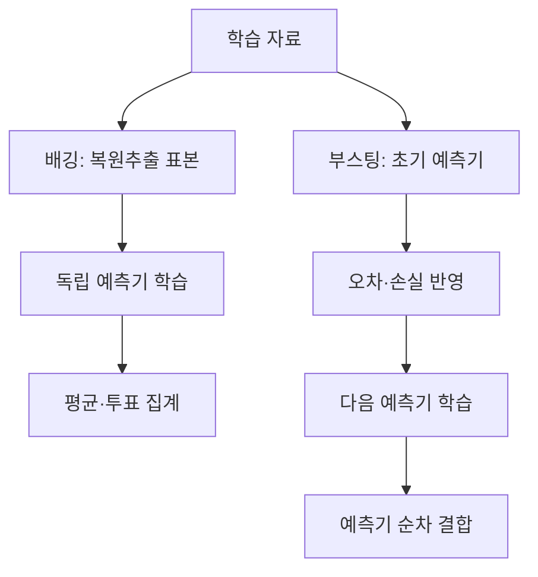
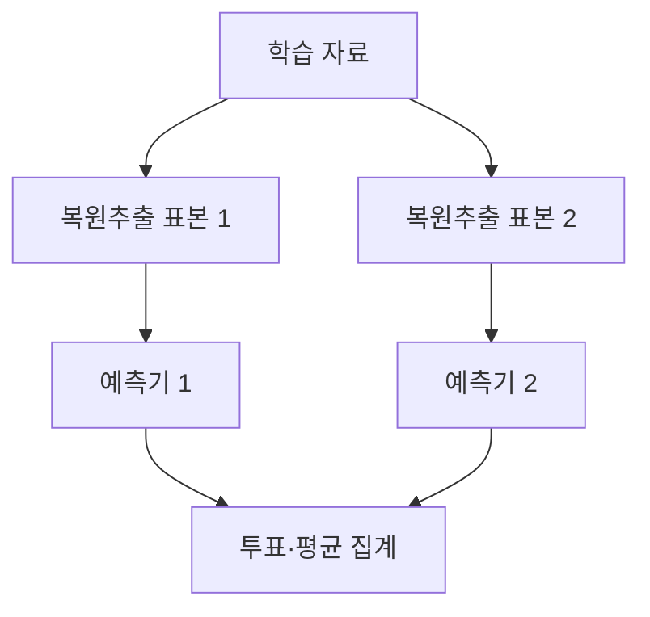
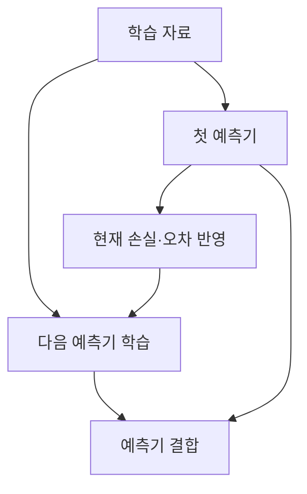

---
sidebar:
  order: 62
  label: "062. 앙상블 학습"
  badge:
    text: "기초"
    variant: note
title: "앙상블 학습 (Ensemble Learning): 배깅과 부스팅"
author: "Codex"
date: "2026-09-24T00:00:00+09:00"
tags:
  - "notes-data"
category: "03-data"
weight: 62
extra:
  model: "GPT-6"
  keyword_grade: "기초"
  question_no: "062"
---

## 지식 로드맵 내 현재 위치

데이터베이스 → 머신러닝·데이터마이닝 → 앙상블 학습

## 30초 인출

- 본질: **앙상블 학습(Ensemble Learning)**은 여러 예측기의 결과를 결합해 단일 예측기의 한계를 보완하는 학습 방법
- 메커니즘: 배깅은 표본 변동을 이용해 독립 모델을 집계하고, 부스팅은 이전 단계의 오차에 초점을 두고 모델을 순차 결합

핵심 용어

- **앙상블 학습(Ensemble Learning)**: 여러 예측기를 결합해 하나의 예측 결과를 만드는 학습 방법
- **배깅(Bootstrap Aggregating, Bagging)**: 복원추출 표본별 예측기를 학습하고 결과를 평균·투표로 결합하는 방식
- **부스팅(Boosting)**: 앞선 예측기의 성능을 보완하도록 약한 예측기를 순차 결합하는 방식
- **편향(Bias)**: 학습된 예측의 평균과 실제 관계 사이의 체계적 차이
- **분산(Variance)**: 학습 자료가 달라질 때 예측 결과가 변하는 정도
- **랜덤 포레스트(Random Forest)**: 배깅과 무작위 특성 선택을 이용해 결정 트리들을 결합하는 알고리즘

---

## 1교시 예상문제 (10점)

> 앙상블 학습의 정의와 목적을 설명하고, 배깅과 부스팅의 작동 방식 및 차이를 비교하시오. (예상)

---

## 1교시 10점 답안

### Ⅰ. 앙상블 학습의 개요

| 구분 | 핵심 |
|---|---|
| 정의 | 여러 예측기를 결합해 하나의 예측 결과를 만드는 학습 방법 |
| 목적 | 예측기의 오차와 변동 특성을 보완해 일반화 성능 개선 |

### Ⅱ. 배깅과 부스팅의 작동 비교

| 관점 | 배깅 | 부스팅 |
|---|---|---|
| 모델 학습 | 표본별 독립 학습 | 이전 모델 결과를 반영한 순차 학습 |
| 결합 | 분류 투표·회귀 평균 등 | 가중 합산 등 알고리즘별 결합 |
| 경향 | 불안정한 학습기의 분산을 낮출 수 있음 | 단계별 보정으로 편향을 낮출 수 있음 |

제언: 동일한 검증 자료와 지표로 기준 모델과 앙상블 후보를 비교한 뒤 적용 여부를 결정

---

## 2~4교시 예상문제 (25점)

> 앙상블 학습의 개념과 필요성을 설명하고, 배깅과 부스팅의 학습 원리 및 편향·분산 관점의 차이, 대표 알고리즘과 적용 시 고려사항을 서술하시오. (예상)

---

## 2~4교시 25점 답안

## Ⅰ. 앙상블 학습의 개요

| 구분 | 핵심 |
|---|---|
| 정의 | 여러 예측기를 결합해 하나의 예측 결과를 만드는 학습 방법 |
| 목적 | 예측기의 오차와 변동 특성을 보완해 일반화 성능 개선 |

## Ⅱ. 배깅의 표본 변동과 예측 집계

- 복원추출한 여러 학습 표본으로 예측기를 독립 학습하고, 분류는 투표, 회귀는 평균 등으로 집계하는 방식
- 예측기 간 상관이 낮고 기저 예측기가 자료 변동에 민감한 경우 분산 감소에 도움이 되는 경향
- 랜덤 포레스트는 배깅에 특성 무작위 선택을 더해 트리 간 상관을 낮추려는 알고리즘

## Ⅲ. 부스팅의 순차 보정

- 부스팅은 손실 함수와 알고리즘에 따라 가중치 또는 잔차·음의 그래디언트 등을 이용해 다음 예측기를 학습하는 방식
- 학습률·기저 모델 복잡도·반복 횟수 등이 성능과 과적합에 영향을 주는 조정 요소
- AdaBoost, 그래디언트 부스팅 계열 등은 세부 갱신 방식이 서로 다른 알고리즘

## Ⅳ. 편향·분산 관점의 비교와 선택

| 비교축 | 배깅 | 부스팅 |
|---|---|---|
| 결합 방식 | 표본별 독립 학습 후 집계 | 앞선 단계의 결과를 반영한 순차 결합 |
| 주된 개선 경향 | 불안정한 학습기의 분산 감소 | 단계적 보정을 통한 편향 감소 가능성 |
| 병렬성 | 예측기별 학습 병렬화에 유리 | 단계 간 의존성으로 순차 처리 성격 |
| 주의점 | 모델 간 예측 상관이 높으면 집계 효과 제한 | 이상치·노이즈와 설정에 따라 과적합 가능 |
| 예시 | 랜덤 포레스트 | AdaBoost, 그래디언트 부스팅 |

- 편향·분산의 변화는 기저 학습기와 자료에 따라 달라지는 경향이며, 모든 배깅·부스팅 모델에 대한 절대 법칙은 아님

## Ⅴ. 한계와 대응

| 한계 | 대응 |
|---|---|
| 모델 수 증가에 따른 추론 비용과 설명 복잡성 | 단일 모델 기준선과 성능·지연·운영 비용을 함께 비교 |
| 부스팅이 노이즈나 과도한 반복에 맞춰질 가능성 | 독립 검증자료, 조기 종료, 복잡도 제한을 사용해 일반화 성능 확인 |
| 검증 과정에서 자료 누수 가능성 | 전처리·특성 생성까지 학습 구간에 맞춰 분리하고 시간 자료는 시간 순서 보존 |

## Ⅵ. 기술사적 제언

| 한계 | 해결 방안 |
|---|---|
| 평가 지표 하나만으로 복잡한 앙상블 도입 효과를 판단할 위험 | 업무 손실에 맞는 평가 지표를 정하고 기준 모델과 후보 앙상블의 예측·운영 비용을 동일 검증 조건에서 비교 |

---

## 출제 이력과 검증 출처

- Leo Breiman, “Bagging Predictors,” *Machine Learning*, 24, 123–140, 1996: https://doi.org/10.1007/BF00058655
- scikit-learn User Guide, “Ensemble methods”: https://scikit-learn.org/stable/modules/ensemble.html
- scikit-learn, “Single estimator versus bagging: bias-variance decomposition”: https://scikit-learn.org/stable/auto_examples/ensemble/plot_bias_variance.html

## 연결 토픽

- [편향](./038_bias/) · [데이터마이닝](./043_data_mining/) · [잭나이프·부트스트랩](./068_jackknife_bootstrap/)
